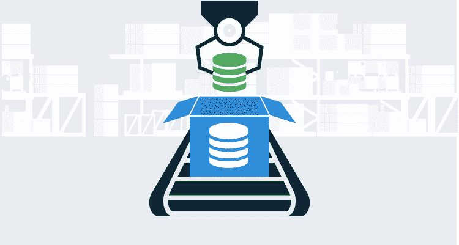

# 如何设计一个自动化的数据库部署过程——Octopus Deploy

> 原文：<https://octopus.com/blog/designing-db-deployment-process>

自动化数据库部署是 CI/CD 难题的最后一块，我需要将耗时 2 到 4 小时的部署缩短到 10 分钟左右。成功地自动化数据库部署需要许多尝试，失败不是因为工具，流程只是从根本上被破坏了，它必须完全重新设计。

在接下来的两篇文章中，我将带您设计一个自动化的数据库部署过程。在本文中，我主要关注核心概念。如果你想跳过，这里有其他文章的链接:

我们所有的数据库部署文章都可以在[这里](https://octopus.com/database-deployments)找到。

## 在这篇文章中

## 典型的手动数据库部署过程

我经常看到这样的手动数据库部署过程:

*   一个开发者在`development`做了一个改变。
*   开发人员将更改添加到 Word 文档、Excel 电子表格、Trello 板(插入您选择的板工具)或一张纸上。
*   那些变更被手工编译成一个增量脚本，以推送到`test`、`staging`或`production`。
*   增量脚本交给 DBA(或拥有正确权限的人)来运行。
*   DBA 运行脚本并将结果发送回请求者。

让我们后退一步，评估一下这个过程存在的原因:

*   没有跟踪历史的源代码控制，比如为什么要做一个变更，什么时候做的，谁做的。
*   没有源代码控制，实施审查过程是极其困难的。
*   如果/当评审发生时，它们发生在开发生命周期的很晚阶段，并且除非出现非常严重的问题，否则阻止部署通常为时已晚。
*   如果没有一致的审查过程，引入次优变更的可能性会大得多。
*   没有审查过程的历史记录详细说明是谁批准的或何时批准的。
*   大多数公司要求职责分离，因此做出改变的人不能是部署改变的人。

归根结底是信任和执行。除非该过程是自动执行的，否则它是不可信的，没有信任，自动化就不会发生。

## 尝试自动化数据库部署的经验教训

下面是我从自动化数据库部署中学到的一些惨痛教训:

*   不要一开始就包括所有人。创建一个由 2 到 4 个关键人员组成的小型工作组，包括 DBA 或数据库架构师。挑选一个试点团队来解决问题。试点团队应该向工作组派遣 1 到 2 个人(总人数在 4 到 6 人之间)。应该授权工作组作出决定。
*   不要将特定的群体排除在工作组之外。如果您有开发人员、QA、数据库开发人员和 DBA，那么每个组都应该有一名代表加入工作组。
*   不要花几周或几个月的时间去设计完美的流程。工作组应召开一次为期 1 或 2 天的启动会议，以创建理想流程的草案。之后，安排定期检查，看看试点团队做得怎么样。
*   不要在动员会上分散你的注意力。划出 1 到 2 天的时间，不允许打开笔记本电脑，除非是为了查找特定问题的答案。
*   不要专注于特定的工具。关注可用工具的核心概念。例如，现代版本控制软件支持分支和合并的审查过程，并且每个数据库部署工具都有从命令行运行的方法。
*   不要试图一开始就自动回滚。你可以在动员会上花整整两天时间，试图找出所有可能的情况。
*   如果你遇到困难，不要害怕寻求帮助。当我在以前的公司工作时，我们向 Redgate 寻求帮助，他们指导我们完成了这个过程。有一些咨询公司，比如 DLM 顾问公司，也可以提供帮助。
*   不要凭空做决定。工作组应该透明，在关键点上征求反馈，并定期向每个人提供更新。

根据您公司的规模，您可能只有 4 到 6 名开发人员和一名 DBA，或者可能只有 2 到 3 个人有解决问题的愿望/带宽。在这种情况下，*工作小组*实际上是指*任何想要加入*的人。

## 启动会议第 1 天

第一天将专注于部署流程。

现有的流程需要改变，在某些情况下，需要创建一个全新的流程。但是你必须从某个地方开始。写下现有的过程，这样每个人都在同一页上。包括从开发人员到生产人员的所有变更步骤。在记下流程的同时，重点回答以下问题:

1.  谁参与了这个过程？
2.  他们有什么权限？
3.  他们为什么会参与进来？
4.  哪些环境有不同的流程？
5.  为什么会不一样？
6.  脚本运行失败会发生什么？
7.  为什么脚本通常会失败？
8.  谁审查脚本，何时审查？
9.  谁需要参与每次部署？
10.  什么不起作用，什么需要改变？

有了这些答案，是时候开始草拟理想流程了。在设计流程时，不要使用特定的工具术语。说`all database changes will be reviewed by a database developer during the merge process`而不是`all database changes will be reviewed by a database developer via a pull request prior to merging into master`。乍一看，它们几乎一模一样，但是`pull request`和`master`是 Git 常用的术语。

希望在第一天结束的时候，你会有一个流程的工作草案。这是前 alpha 的草稿，如果有漏洞也没关系。

## 启动会议第 2 天

第二天的重点是工具和细化。

既然您对想要做的事情有了一个粗略的想法，那么是时候研究现有的工具了。在你做研究的时候完善你的过程。随着学习的深入，可以添加、删除或移动步骤。

说到数据库部署工具，有很多选择。例如，如何自动部署 sql server，有 [Redgate](https://www.red-gate.com/) 、 [DbUp](https://dbup.readthedocs.io/en/latest/) 、 [ApexSQL](https://www.apexsql.com/) 、[SQL Server Data Tools for Visual Studio(SSDT)](https://docs.microsoft.com/en-us/sql/ssdt/sql-server-data-tools?view=sql-server-ver15)、 [RoundhousE](https://github.com/chucknorris/roundhouse) 和 [Flyway](https://flywaydb.org/) 等等。这很容易导致分析瘫痪，尤其是在进行并排比较的时候。

使用理想的过程，确定两到三个工具必须具备的关键特性。不要列出每个工具都支持的特性，例如，任何工具都可以以某种方式保存到源代码管理中，所以没有必要包括这些特性。

以下是一些有助于梳理需求的问题:

1.  [基于状态的数据库开发(即模型驱动)](https://octopus.com/blog/database-deployment-automation-approaches#state-based-database-deployment-approach) vs [基于迁移的数据库开发(即变更驱动或迁移脚本)](https://octopus.com/blog/database-deployment-automation-approaches#database-migration-scripts-approach)？
2.  用于更改数据库的常用工具是什么？对于 SQL Server，通常是 SQL Server Management Studio (SSMS)或 Visual Studio？
3.  如何检测数据库更改并将其保存到源代码控制中？
4.  谁将做出最大的改变？DBAs？开发商？数据库开发人员？

在某些情况下，工具将满足 3 个关键要求中的 2 个。但是这个工具是免费的，很难与免费争论。同时，付费工具满足所有 3 个关键要求。在这种情况下，需要考虑一些问题。

1.  这种缺失的特性会减缓采用速度吗？
2.  我们可以做些什么来增加免费工具，以达到 3 个要求中的 2.5 个？
3.  该公司过去是否尝试过使用免费工具？如果有，为什么没有被采用？

我在 Redgate vs . SQL Server Data Tools for Visual Studio(SSDT)上也有过类似的**免费 vs .付费**辩论。100 多名开发人员购买 Redgate 的成本高达六位数。与此同时，SSDT 是免费的，但 SSDT 与 Visual Studio 整合，而不是 SSMS。过去有几个团队曾试图采用 SSDT，但最终都放弃了。太多人更喜欢在 SSMS 而不是 Visual Studio 中进行更改。那些在 SSMS 进行变更的人最终用一个手动的过程将变更带入 SSDT，并且有一半的时间变更没有被签入到源代码控制中。我并不是说 SSDT 是一个不好的工具，只是说它不适合我们的特定需求。

## 试点团队、迭代和早期采用者

在启动会议和工装研究之后，是时候让试点团队接手了。他们的目标是实现工具和过程。理想情况下，可以在所有环境中部署到生产环境中。在这个过程中，他们将向工作组提供有价值的反馈，并讨论需要进行哪些迭代。试点团队不应该羞于提供反馈。他们所面临的任何小烦恼，都会在普遍采用的过程中成倍增加。

一段时间后，根据公司规模，向早期采用者团队推广该流程。这有助于进一步优化流程。将会发现试验团队做出的假设或无意的捷径，并且将会发现额外的场景并将其包括在流程中。早期采用者可以有所帮助，但不是必须的。

## 普遍采用和建立信任

一般的采用阶段将会是*为很多人搬[很多奶酪](https://en.wikipedia.org/wiki/Who_Moved_My_Cheese%3F)。期望得到推后。数据库是大多数应用程序的关键组成部分，一个糟糕的脚本可能会导致几天或几周的损失。*

在你的过程中建立信任是很重要的。

我发现建立这种信任的两种最佳方式是手动验证和试点团队/应用程序。我们已经讨论了试点团队和应用程序。大多数情况下，建立信任需要在早期阶段将手动验证添加到流程中。在您的过程中，DBA 在进入生产之前审查 delta 脚本，当团队开始使用该过程时，为每个环境生成并审查 delta 脚本，以帮助建立信任。

当您不得不更多地迭代流程时，不要感到惊讶。每个团队和应用程序都是独一无二的，他们可能会实现一个您从未遇到过的数据库特性。

## TL；速度三角形定位法(dead reckoning)

总结一下:

*   创建一个小团队或工作组来定义流程。包括来自每个部署阶段的代表(开发人员、数据库管理员等。).工作组不应超过 4 至 6 人。
*   确定要包含在工作组中的试验团队或应用程序。
*   召开为期 1 至 2 天的会议，启动工作组。
    *   写下现有的流程，确定关键人员、难点和需要改变的内容。
    *   起草理想的部署流程。
    *   研究工具。
    *   在启动结束时，试点团队应该知道需要实施什么以及使用什么工具。
*   试点团队实施新流程。
    *   一直部署到生产。
    *   迭代流程。
    *   在这个过程成功一段时间后，看看是否有人愿意成为早期采用者。
    *   与早期采用者团队一起迭代流程。
*   普遍采用。
    *   专注于建立对流程的信任。
    *   推广到多个团队。
    *   找到痛点就迭代。

## 结论

本文涵盖了许多高层次的概念。在下一篇文章中，我将回顾我遵循类似过程的一段时间。它有望为这篇文章提供一些切实的东西。

下次再见，愉快的部署！

如果您喜欢这篇文章，好消息，我们有一个关于自动化数据库部署的完整系列。