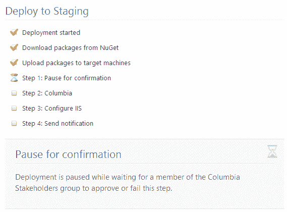

# 您是否已经为部署设计了您的应用程序？-章鱼部署

> 原文：<https://octopus.com/blog/designing-for-deployment>

通常，部署是事后才想到的。我们构建应用程序，并在 Visual Studio 中点击 F5 来测试它们是否工作。最终，必须有人想出如何将应用程序部署到不同的环境中。根据应用程序的不同，这可能是一项简单的工作，也可能是一项极其复杂的任务。

没有快速的解决方法，但是希望下面的一些策略可以帮助简化部署。

## 为部署而设计

在构建应用程序的过程中，我们在构建(或准备构建)功能时，会对框架、组件和应用程序架构做出决策。在这些时候，考虑这些决策如何影响部署也很重要。问这样的问题:

*   应用程序将安装在哪里？
*   我们如何根据所处的环境传递不同的配置选项？
*   它应该对运行它的机器做什么样的假设？有哪些约束？
*   应用程序需要哪些操作系统服务和第三方依赖？谁来安装它们？
*   组件需要按什么顺序部署？升级期间有哪些依赖关系？
*   我们将如何处理后续版本/部署？
*   这个绝妙的想法如何在生产中发挥作用？
*   运营团队将如何诊断此功能中的问题？

忽略这些问题是保证部署时痛苦的好方法。

## 尽可能自动化

并非部署的所有部分都可以自动化，但这并不意味着您应该放弃。如果您不能说服 DBA 让您在生产中自动执行 SQL 迁移脚本，这并不意味着您不应该尝试自动化您的 web 应用程序部署。大部分自动化的部署仍然比手工部署好。

为此，Octopus 包括一个[手动部署步骤](http://octopusdeploy.com/blog/1.3)。您可以运行一系列自动化步骤，等待人工执行操作，然后继续自动化步骤。

## 遵循既定惯例，或者创建自己的惯例

遵循约定，或者在没有约定的地方创建自己的约定，是减少自动化部署工作量的好方法。也就是说，练[干](http://en.wikipedia.org/wiki/Don't_repeat_yourself)。您可以尝试遵循以下约定:

*   将所有配置选项存储在同一个位置(如`appSettings`)，并以相同的方式访问它们
*   以相同的方式安装所有 Windows 服务
*   将应用程序安装到标准路径

## 让您的应用程序能够自我部署

与其依赖您选择的部署工具来执行大量的配置和部署工作，**不如考虑让您的应用程序能够感知部署**。例如:

*   让您的 Windows 服务项目能够自行安装/更新
*   让您的持久层能够确定模式是否是最新的，并应用更新模式所需的任何迁移

让您的应用程序“自部署”有很大的好处，并且将您从部署工具中分离出来。

在 Octopus 中，[我们在安装应用程序时调用一个`Deploy.ps1`脚本](http://octopusdeploy.com/documentation/features/powershell)。我们根据环境将配置变量传递给这个脚本。理想情况下，这个脚本可以简单到告诉您的应用程序使用任何必要的配置参数来部署自己。至少，这个脚本应该可以在 Octopus 之外工作。

## 不要假设应用程序是固定不变的

有时会出现如下问题:

> 我们有一个组件*[[做一些可能不是很好的想法]]* 。部署工具是否支持 *[[ [Rube Goldberg](http://en.wikipedia.org/wiki/Rube_Goldberg_machine) 特性，该特性适用于这种非常奇怪的用例，但对其他人来说不是很有用]]* ？

不要试图“绕过”问题，有时更好的解决方案是**重新考虑应用程序如何工作**。如果你面临一个问题，解决方案感觉过于复杂，不要排除通过改变应用程序来重新定义问题的可能性？

当然，这并不总是可能的，但有时它比你最初想象的更有可能。有时候只需要和合适的人谈谈。

## 以一个部署过程为目标

有时，根据正在部署的变更种类，提出许多不同的部署过程是很有诱惑力的。对于重大部署，不要废话。只是改了一些内容？机器复制这些文件。没换数据库？不要做 XYZ。

相反，尝试创建一个**单一部署流程，无论您做了什么样的更改，它都可以从头到尾运行**。如果某个部署步骤不需要发生，流程应该足够智能，不运行它，或者以幂等的方式运行它——这不应该是人的责任。这意味着您只需测试一个过程，通过持续地运行它，将使更大、更可怕的部署变得更可靠。

大型应用程序的自动化部署可能是一个艰难且耗时的过程。但是，如果应用程序一开始就被设计为可部署的，那么这个过程就可以变得简单得多。