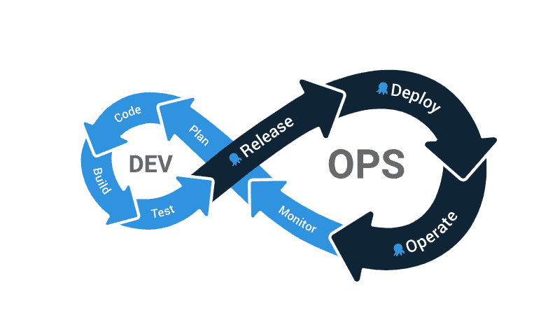

# 不同类型的软件测试- Octopus 部署

> 原文：<https://octopus.com/blog/different-types-of-tests>

对于软件团队来说，测试是有意义的，应该对应用程序进行缺陷筛选。但是，为什么测试对您的业务很重要，它如何适应 DevOps？

测试是连续交付的一部分，在进入下一阶段之前，确保交付管道每个阶段的质量。DevOps 是在短迭代中构建、测试和发布软件的迭代周期。全面的测试环境有助于 DevOps 循环的每次迭代增强产品的质量。一个弱的测试阶段可能意味着缺陷进展到发布，开发人员需要在产品运行时修复 bug。开发团队分属于测试领域的两个方面。

由 [Mabel 进行的关于 DevOps](https://www.dropbox.com/s/nnagymzdcnoswc6/Benchmark-Report-State-of-Testing-in-DevOps.pdf?dl=0) 中测试状态的调查表明，自动化测试(至少 4-5 种不同类型的测试)是客户满意度的关键。 [2021 年 DevOps DORA 报告](https://www.dropbox.com/s/xycst8qsxnpsieu/state-of-devops-2021.pdf?dl=0)显示，持续测试是成功的一个指标，达到可靠性目标的精英员工使用持续测试的可能性是其他人的 3.7 倍。

在这篇文章中，我将讨论自动化和手动测试，以及两种常见的测试类型:功能性和非功能性。

在 Octopus Deploy，我们通过提供一流的部署管理工具来帮助简化复杂的部署，该工具可与您的 DevOps 流程一起创建如下所示的部署循环:

[](#)

## 手动和自动测试

软件测试可以是手工的，也可以是自动的。如果你在你的设备上使用了一个应用程序并报告了一个错误，那么你已经进行了一次手动测试。自动化测试是预先编写好脚本并由机器执行的，它们将预期结果与实际结果进行比较。这两种测试方法在软件应用中都有它们的位置，但是手动测试比较慢，并且需要一个测试环境。

由于开发人员提前编写了自动化测试，在手工测试中发现的错误可以通知自动化测试来加强测试套件。当意见和细微差别起作用时，比如用户体验，手动测试是合适的。在这些情况下，自动化测试没有预先确定的检查结果。

自动化测试几乎是即时的，在运行时执行成百上千次。自动化测试检查功能，并确保每一行代码和功能都按预期工作。在 DevOps 过程中，自动化测试通过给出应用程序的测试覆盖来实现连续交付。如果您想要为您的应用程序设置一个测试覆盖率，您可以为应用程序的每个组件安装自动化测试。

当您向版本中添加新功能时，您可以运行测试来确定测试覆盖率是否已经降低。您可以使用结果来识别新版本的缺陷。自动化测试补充了连续交付开发运维策略。自动化的测试越多，应用程序在构建、测试和发布的 DevOps 循环中迭代和循环的速度就越快。

## 功能和非功能测试

您可以对您的应用程序执行许多测试。对测试进行分类的一种方式是功能性和非功能性。

功能测试会问这样的问题:

*   这个按钮能用吗？
*   一个模块与另一个模块一起工作吗？
*   用户之旅是否从体验开始一直到结束？

维护测试检查应用程序是否保留了不同版本的所有功能。它询问应用程序中是否有任何功能在不同版本之间退化。我将维护测试包含在功能测试中，因为它与功能相关，尽管一些资料将它列为第三种类型。

非功能性测试检查系统运行的方式，而不是系统的功能。非功能性测试会问这样的问题:

*   应用程序的安全性如何？
*   应用程序可以处理多少负载？
*   如果需要，应用程序可以扩展吗？

### 功能测试的例子

#### 单元测试

单元测试测试单个代码单元的功能。在下面的例子中，我们测试一个函数，它是执行一项任务的代码块。

```
 1\. Test if a function works. This function averages the weather for the previous 14 days.
2\. Give the function the weather inputs for the previous 14 days.
3\. Check whether the expected output matches the actual output. 
```

#### 集成测试

集成测试验证两个或更多模块之间的功能。这个例子测试了电子商务店面和购物车模块之间的集成。

```
 1\. Load the e-commerce store and add some items to the cart, and go to checkout.
2\. Check that the correct number of items are in the cart and the listed price is correct. 
```

#### 烟雾测试

冒烟测试是揭示可能导致拒绝放行的故障的初步测试。

```
 1\. Does the web server return a 200 OK response?
2\. Can I ping the database? 
```

#### 验收测试

验收测试确认您的应用程序按照需求规范运行。在这个例子中，奖励系统需要与应用程序一起工作。测试检查奖励系统的预期行为。

```
 1\. If a user tries to purchase a product with rewards points and they have enough points, the purchase price should be $0.
2\. If a user tries to purchase a product with rewards points and they do not have enough points, the purchase price should be $20. 
```

### 非功能测试的例子

#### 负载和性能测试

负载和性能测试检查应用程序的速度、响应时间和资源使用等指标。

```
 1\. Measure the loading time of the home page and flag if it exceeds a threshold value.
2\. Measure database response time when handling 100 or more concurrent requests. Flag if response time exceeds threshold value.
3\. Under increasing load, test how many nodes an application needs to recover. 
```

#### 安全测试

安全测试检查系统中与安全相关的弱点。

```
 1\. Scan log files for sensitive information. eg. credit card numbers or email addresses.
2\. Scanning for long running sessions as a sign that session handling isn't working as expected. 
```

#### 可扩展性测试

可伸缩性测试测试与应用程序伸缩相关的问题。

```
 1\. Under increasing load, test how many nodes an application needs to recover.
2\. Test the length of time required for more nodes to be added and the application to recover. Chart how quickly you can expect 90% of scale up events to complete in. 
```

## 结论

测试对于 DevOps 过程是必不可少的，确保你的软件在进入下一阶段之前满足质量要求。研究表明，自动化测试是客户满意度和成功团队的重要指标。

测试可以手动运行，也可以自动运行，有两种主要的测试类型:功能性的和非功能性的。

强大的测试环境非常适合 Octopus Deploy。Octopus 负责发布和部署，并自动化 DevOps 生命周期的各个部分，使复杂的部署变得更加容易。

要了解更多关于测试的重要性，请阅读我们关于[为什么您应该在部署](https://octopus.com/blog/track-vulnerabilities-after-deployment)后跟踪漏洞的帖子。

愉快的部署！