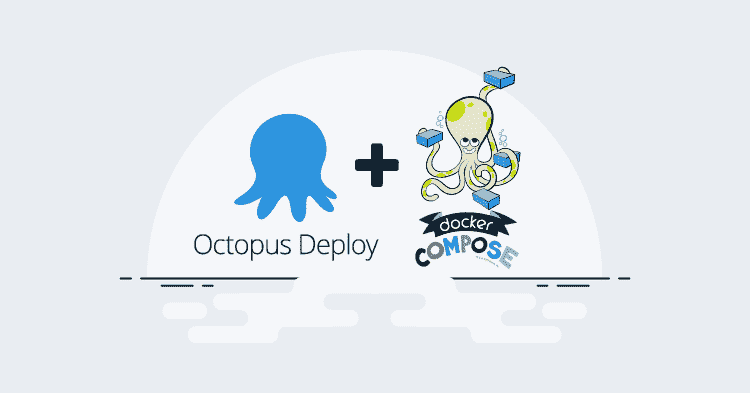
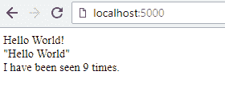
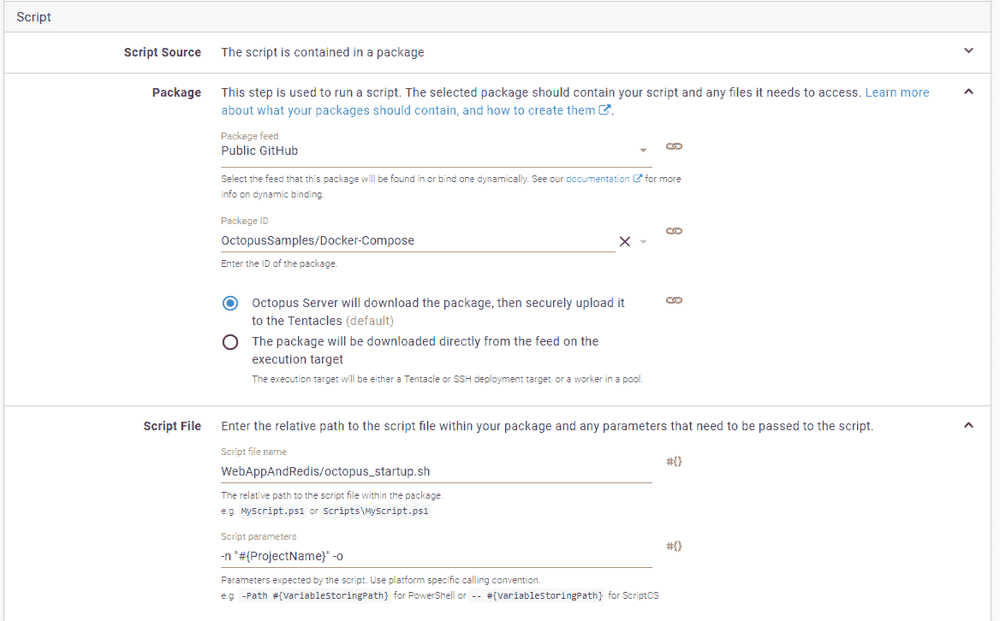
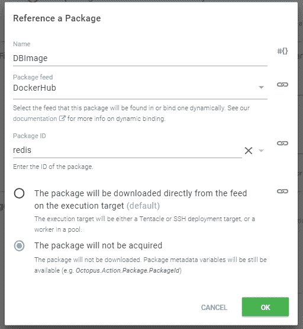
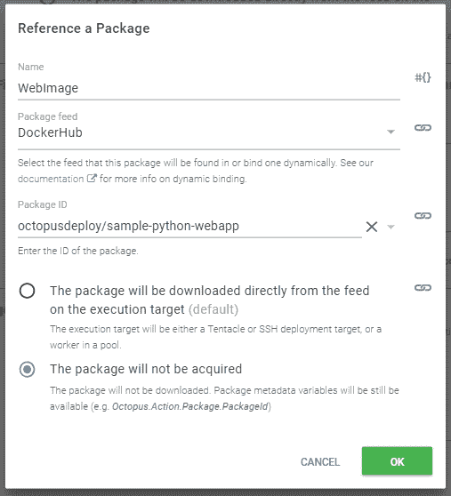
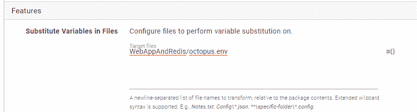
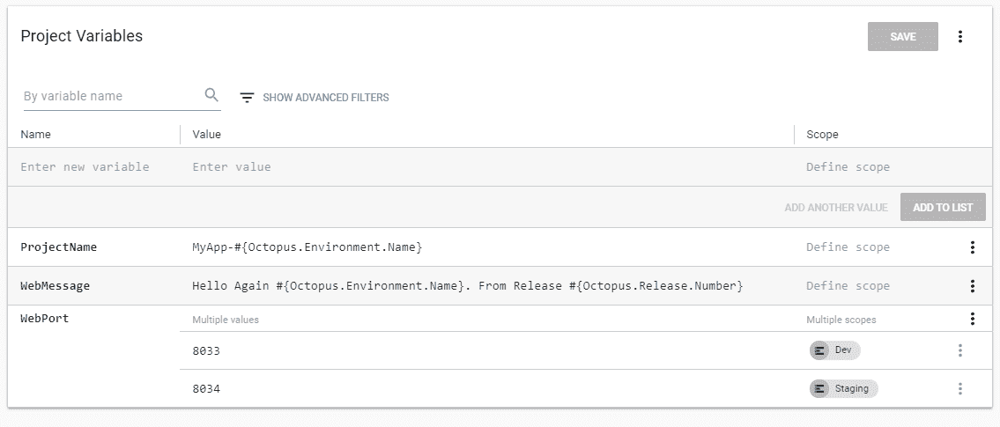
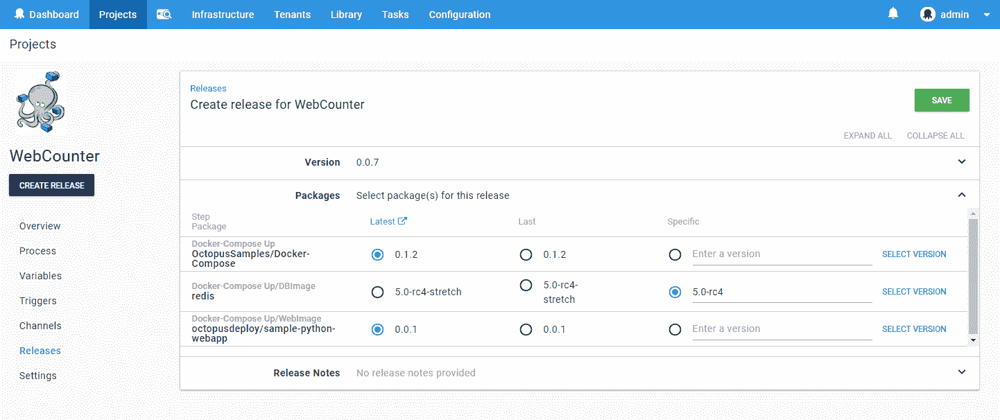
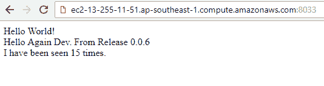
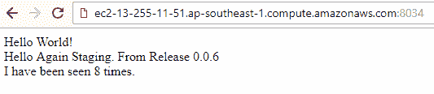

# 集成 docker-compose 步骤和 Octopus Deploy - Octopus Deploy

> 原文：<https://octopus.com/blog/docker-compose>

[](#)

从版本 3.5.0 开始，Octopus 就支持简单的 Docker 步骤，从那时起，容器的前景发生了巨大的变化。越来越多的持续部署管道使用容器，无论是标准化构建环境、测试还是运行时。尽管我们最近将注意力集中在改进我们的 Kubernetes 支持上，但是对于某些需求，一个简单的 docker-compose 文件就足够了。你只需要一把锤子，为什么还要用射钉枪呢？

随着最近在`2018.8.0`版本中对`Run a Script`部署步骤的升级，执行`docker-compose`任务现在可以更好地集成到您的 Octopus 部署项目中。在本帖中，我们将看看如何通过利用一些伟大的新脚本特性来轻松提供环境变量以及将图像版本绑定到 Octopus 版本。本例中的所有图片和脚本都可以在 GitHub 或 DockerHub 上找到。

## 从简单的作曲开始

我们想建立一个简单的网站，有一个访问者计数器(你好，1990 年的)和一个简单的消息。为此，我们将运行一个小型 python 网站，将访问者状态存储在 redis 数据存储中。将网站包装到一个容器中，并通过 docker-compose 运行它们，这意味着我们可以确保执行环境总是符合我们的期望。我不会深入讨论编写 python 脚本或为该网站构建 docker 映像的细节，但可以随意查看托管这些项目文件的 [GitHub repo](https://github.com/OctopusSamples/Docker-Compose) 上的 [web 应用](https://github.com/OctopusSamples/Docker-Compose/blob/master/WebAppAndRedis/app/app.py)和 [Dockerfile](https://github.com/OctopusSamples/Docker-Compose/blob/master/WebAppAndRedis/app/Dockerfile) 的源代码。

在构建我们的 web 应用程序映像之后，我们可以创建一个类似于

```
version: '2'
services:
  web:
    image: sample-python-webapp:latest
    ports:
     - "5000:5000"
    environment:
      - text="Hello World"
  redis:
    image: redis:latest 
```

然后只需要运行`docker-compose up`就可以了，我们得到了一个很棒的网站

[](#)

## 通过 Octopus 部署

现在我们知道我们的网站工作，我们想通过 Octopus Deploy 部署它，这样我们就可以充分利用环境进展，控制图像版本和变量注入。

### docker 编写期间的自定义值

我们希望能够通过标准的 docker 变量动态传递细节，而不是将图像细节硬编码到`docker-compose.yml`文件中。

然后，`docker-compose.yml`文件看起来像这样

```
version: '2'
services:
  web:
    image: ${WEB_IMAGE}:${WEB_TAG}
    ports:
     - "${WEB_PORT}:5000"
    environment:
      - text=${TEXT_MESSAGE}
  redis:
    image: ${DB_IMAGE}:${DB_TAG} 
```

但是，如果我尝试在本地运行这个，我会得到一堆错误，因为 docker 不知道这些变量应该有什么值。我们可以通过提供一个[T2 文件](https://docs.docker.com/compose/env-file/)来解决这个问题。

```
WEB_IMAGE=mywebapp
WEB_TAG=1.0.0
DB_IMAGE=redis
DB_TAG=latest
TEXT_MESSAGE=I Am A Local Message
WEB_PORT=5889 
```

现在当我运行`docker-compose up`时，docker 将使用这个文件中的值。

### 章鱼项目

虽然没有 docker-compose 的具体步骤，但是我们可以使用最新版本的脚本步骤中提供的多包功能来提供关于我们想要用于`.env`文件的具体图像的信息。我们将自己调用`docker-compose`，所以我们将从`run a script`步骤开始。

由于我们想要对所有的脚本和`docker-compose.yml`文件进行版本化，我们将通过 [GitHub feed](https://octopus.com/docs/packaging-applications/package-repositories/github-feeds) 获取它们。我们实际上没有任何构建这些脚本所需的过程(忽略我们通过单独的过程构建的 web 应用程序映像本身)，所以使用 GitHub feed 允许 Octopus 直接从源代码控制中获得我们的脚本代码。在我们的例子中，我们将使用前面提到的公共 GitHub 库，并将脚本文件设置为`WebAppAndRedis/octopus_startup.sh`，并传递几个参数`-n "#{ProjectName}" -o`。这个脚本将包含我们希望 Octopus 在部署期间运行的代码，我们将很快检查它的内容和那些参数。

[](#)

这些字段下是新特性`Additional Packages`。让我们添加对用于这个项目的两个 docker 图像的引用。在这种情况下，我们将利用 [DockerHub feed](https://octopus.com/docs/packaging-applications/package-repositories/registries/docker-hub) 并选择官方`redis`图像

[](#)

我们之前使用的`sample-python-webapp`图像已经被推送到 [OctopusDeploy DockerHub](https://hub.docker.com/u/octopusdeploy) 注册表中。

[](#)

在这两种情况下，我们都选择了*而不是*在服务器上获得它们。这意味着包的细节将作为变量提供给脚本，但是采集不会被执行。在我们的`docker-compose`步骤中，如果有必要的话，docker 会自动将它们拉下来，但是在某些情况下，您可能希望包文件可用，例如，您希望使用我们在第一步中选择的主包中不包含的附加脚本或工具。注意我们给这两个额外的包引用的名字(`DBImage`和`WebImage`)，这将被用来作为变量引用不同的包细节。

### 让 Octopus 变量进入 docker-compose

我们想要做的是通过`.env`文件向`docker-compose.yml`文件提供选定的图像细节。我们可以用一堆 Octopus 变量替换现有的`.env`文件，以便在部署时[替换](https://octopus.com/docs/deployment-process/configuration-features/substitute-variables-in-files)，但是这样我们就不能在开发期间本地运行它。相反，让我们创建一个单独的文件`octopus.env`

```
WEB_TAG=#{Octopus.Action.Package[WebImage].PackageVersion}
WEB_IMAGE=#{Octopus.Action.Package[WebImage].PackageId}
DB_TAG=#{Octopus.Action.Package[DBImage].PackageVersion}
DB_IMAGE=#{Octopus.Action.Package[DBImage].PackageId}
TEXT_MESSAGE=#{WebMessage}
WEB_PORT=#{WebPort} 
```

脚本步骤的另一个很棒的新特性是执行变量替换或配置转换的能力。让我们启用这个特性，并确保这个新文件`octopus.env`替换了变量。

[](#)

这里是用于这个项目的其他变量。

[](#)

### 执行脚本

我们之前跳过了实际的脚本执行，所以现在我们知道我们将有一个 Octopus 提供的`.env`文件，让我们看看这个脚本实际上做了什么。

在撰写本文时，`docker-compose`还没有提供一个简单的方法来传递一个定制的`.env`文件，尽管有一个活动的 [GitHub 问题](https://github.com/docker/compose/issues/4841)，所以下面的步骤将来可能会变得简化。为了避开这个限制，我们将在部署时把`octopus.env`文件重命名为`.env`。这发生在变量替换之后，因此当我们运行`docker-compose`时，它将利用*这些*变量，而不是我们在开发时包含的默认变量。

因为我们也希望能够在本地运行和测试这个脚本，所以我们将确保`.env`文件更改可以配置为*而不是*发生，因为我们只在 Octopus 部署期间传递了`-o`参数。

```
#!/bin/bash 

 cmd="up"
 octopus=0
 project_name="MyApp"
 while getopts ":n:c:o" opt; do
  case $opt in
    o) octopus=1
    ;;
    n) project_name="$OPTARG"
    ;;
    c) cmd="$OPTARG"
    ;;
    \?) echo "Invalid option -$OPTARG" >&2
    ;;
  esac
done

if [[ $cmd = "up" ]]; then
    if [[ octopus -eq 1 ]]; then
        echo "Replacing '.env' file with '.octopus.env'"
        mv ./.env ./.env.old
        mv ./octopus.env ./.env
    fi
    #docker-compose pushes non errors onto stderr. Redirect to stdout
    docker-compose --project-name $project_name  up -d  2>&1
else
    docker-compose --project-name $project_name  $cmd  2>&1
fi 
```

我们现在可以用`.octopus_startup.sh up`或`.octopus_startup.sh down`在本地运行这个脚本。使用`-n`参数传递项目名称可以设置 docker 放在容器上的名称，并允许我们在同一个服务器上运行多个实例。因为在本例中我们将在同一台机器上运行两个 Octopus 环境，所以 compose 项目名称将包含 Octopus 环境名称作为项目变量`MyApp-#{Octopus.Environment.Name}`。

根据您的部署的简单或复杂程度，您的执行脚本可能需要与这个脚本有很大的不同，因此将它作为说明预期行为的指南。核心目标是替换`.env`文件并调用`docker-compose up`命令。例如，您可能希望增加特定容器的实例数量，或者执行额外的配置，如设置卷装载等。

我们在 SSH 目标上运行这个脚本，所以我使用了 bash 脚本，但是在 GitHub repo 中也有类似的 PowerShell 脚本。

### 创建发布并部署

现在一切就绪，我们可以部署我们的项目了！当我们创建一个版本时，我们可以看到我们能够选择 3 个不同的包，尽管我们只有一个步骤！

【T2 

如你所见，我们可以选择包含 GitHub 中所有脚本文件的包的版本，以及 DockerHub 中包含的两个图像的版本。

然后，我们可以将我们的发布部署到开发中

[](#)

和分级

[](#)

如果我们想更新传递到容器中的问候文本，我们只需更新项目变量并再次部署即可！如果我们推出新版本的 web 应用程序，我们只需创建一个新版本，指定该映像的最新版本并进行部署！

## Docker-Compose 和章鱼

如上所示，使用脚本步骤中可用的新的多包选择为部署自动化提供了全新的可能性，包括更容易的 docker-compose 部署。要将 docker-compose 集成到 Octopus 流程中，请选择每个图像作为附加的脚本步骤包，并使用`.env`文件来提供需要更改的值。

希望这篇文章能给你一些关于从哪里开始 docker-compose 部署的想法。我们将继续向 Octopus Deploy 添加额外的功能，以使部署容器变得尽可能简单，这样您就可以回到实际编写代码的工作中来了！看看我们的 [Kubernetes 支持](/blog/octopus-release-2018.8)在最新的大版本`2018.8.0`中作为 alpha 版本提供！