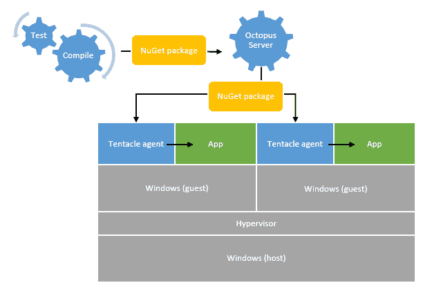
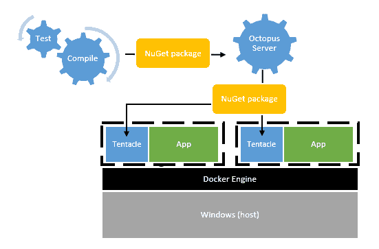
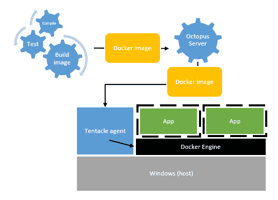

# Docker on Windows 和 Octopus Deploy - Octopus Deploy

> 原文：<https://octopus.com/blog/docker-windows-octopus>

**更新 2016-08:自从本文撰写以来，Docker 与 Windows 的集成已经取得了进展。查看我们的 [RFC 帖子](https://octopus.com/blog/rfc-docker-integration),了解关于我们在 Octopus Deploy 中发展这一特性的令人兴奋的更新！**

今天，Gu 宣布[微软与 Docker 合作，将 Docker 引入 Windows](http://weblogs.asp.net/scottgu/docker-and-microsoft-integrating-docker-with-windows-server-and-microsoft-azure?__r=8d1b6a232c813b9) 。

> 微软和 Docker 正在将开源的 Docker 引擎与下一个版本的 Windows Server 集成在一起。此版本的 Windows Server 将包括新的容器隔离技术，并支持同时运行这两种技术。NET 和这些容器中的其他应用程序类型(Node.js、Java、C++等)。开发人员和组织将能够使用 Docker 为 Windows Server 创建分布式的、基于容器的应用程序，这些应用程序利用了 Docker 的用户、应用程序和工具生态系统。

多刺激啊！在过去的几个小时里，我一直在钻研 Docker，以及这一声明对的未来可能意味着什么。NET 应用程序部署。以下是我目前为止的想法。

## 容器与虚拟机

除了 Scott 的帖子，我找不到太多关于 Windows Server 中容器支持的信息，所以我先声明这只是推测，纯粹是假设它们的工作方式类似于 Linux 容器。

曾几何时，你只有一台物理服务器，运行着包含上百个网站的 IIS。现在，随着虚拟化和云计算的兴起，我们倾向于拥有一台物理服务器，运行几十个虚拟机，每个虚拟机运行一个应用程序。

我们为什么要这么做？这真的是关于孤立。每个应用程序可以在不同的操作系统上运行，具有不同的系统库、不同的修补程序、不同的 Windows 功能(例如，安装了 IIS)、不同版本的。NET 运行时，等等。更重要的是，如果一个应用程序出现严重故障，导致操作系统崩溃，或者操作系统需要重启进行更新，其他应用程序不会受到影响。

过去，我们开始在一个版本的。NET framework(比如说 3.5)，却被告知没有人会把 3.5 放在生产服务器上，因为在那个服务器上有 49 个使用 3.0 的应用程序可能会崩溃，并且要花很长时间来测试它们。虚拟化让我们摆脱了这些限制。

从部署自动化的角度来看，构建服务器编译代码，并生成准备部署的包。Octopus Deploy 服务器将包推送到远程代理(即触手)进行部署。

所以，隔离很好。但是主要的缺点是我们实际上只有一台物理服务器，每台服务器都运行相同操作系统内核的多个副本。这是一个真正的遗憾，因为这个操作系统是为多任务设计的服务器级操作系统。事实上，假设您在每个虚拟机上运行一个主应用程序，那么您的物理机器实际上运行的操作系统比运行的主应用程序还要多！

容器是相似的，但是不同的:只有一个内核，但是每个容器保持相对独立。有很多关于安全容器与虚拟机相比如何的争论，所以对于共享相同硬件的完全不同的客户来说，VM 可能总是更受欢迎。然而，假设存在基本的信任，容器是一个很好的中间地带。

什么是 Docker 页面很好地概述了为什么容器不同于虚拟机。我还没有看到 Windows Server 中的容器是如何工作的，但是在这篇文章中，我假设它们是非常相似的。

## Docker 适合哪里

Docker 在这些容器之上提供了一个层，使得构建在容器中运行的图像以及共享这些图像变得更加容易。使用基于文本的[Docker 文件](https://docs.docker.com/reference/builder/)定义 docker 图像，该文件指定:

*   从基础操作系统映像开始
*   准备/构建映像的命令
*   图像“运行”时要调用的命令

对于一个 Windows Dockerfile 文件，我想它看起来会像这样:

*   从 Windows Server 2014 SP1 基础映像开始
*   安装。NET 4.5.1
*   安装 IIS 并启用 ASP.NET
*   复制动态链接库，CSS，JS 等。ASP.NET web 应用程序的文件
*   配置 IIS 应用程序池等。并启动网站

因为它只是一个小的文本文件，所以您的 Dockerfile 可以提交给源代码控制。然后从命令行构建一个“映像”(即执行 Dockerfile)，它将下载所有的二进制文件并创建一个磁盘映像供以后执行。然后，您可以在不同的机器上运行该映像的实例，或者通过 Docker 的 Hub 与其他人共享它。

Docker 和使用这样的容器的巨大优势不仅仅在于节省内存/CPU，还在于使您在测试环境中测试的应用程序更有可能在生产环境中实际工作，因为它将以完全相同的方式配置——它是完全相同的映像。这是一件非常好的事情，将[构建二进制文件一次](http://octopusdeploy.com/blog/build-your-binaries-once)发挥到了极致。

## 这对章鱼意味着什么

首先，记住 Octopus 是一个部署自动化工具，我们特别适合那些不断构建同一应用程序新版本的团队。例如，一个团队在两周的冲刺中构建一个内部 web 应用程序，每两周部署一个新的应用程序版本。

考虑到这一点，Docker 和 containers 可能以几种不同的方式与 Octopus 一起使用。

### 方法 1: Docker 是一个基础设施问题

这可能是最基本的方法。基础架构团队将维护 docker 文件，并根据这些文件构建映像，然后在配置新服务器时部署它们。这将保证无论他们使用哪个托管提供商，服务器都有一个共同的基线——相同的系统库、服务包、启用的操作系统特性，等等。

该图像将简单地包含我们的触手服务，而不是将应用程序作为图像的一部分。结果看起来类似于 Octopus 现在的工作方式，事实上不需要对 Octopus 做任何修改。

这有利于加快应用程序部署——我们只是推动应用程序二进制文件，而不是整个映像。这仍然意味着应用程序相互隔离，几乎就像在虚拟机中一样，没有开销。然而，它确实允许 cruft 随着时间的推移在图像中累积，所以它可能不是 Docker 的一个非常“纯粹”的用法。

### 方法 2:为每个部署构建一个新的映像

这种方法非常不同。我们只需要在物理服务器上有一个，而不是有很多触手的副本。在部署时，我们会创建新的映像并在 Docker 中运行它们。

1.  构建服务器构建代码，运行单元测试，等等。并创建一个 NuGet 包
2.  包中包含一个 Dockerfile 文件，其中包含构建映像的指令
3.  在部署期间，Octopus 将 NuGet 包推送到远程机器
4.  触手运行`docker build`来创建图像
5.  如果实例正在运行，Tentacle 会停止它，然后使用新的映像启动新的实例

这样做的缺点是，由于我们每次都构建不同的图像，我们失去了 Docker 的一致性；每个 web 服务器的配置可能会稍有不同，这取决于当时各种库的最新版本。

从好的方面来看，我们确实获得了一些灵活性。每个应用程序可能有不同的`web.config`设置等。，Octopus 可以在文件放入映像之前更改这些值。

### 方法 3:每次发布映像

更好的方法可能是在过程的早期构建 Docker 映像，比如在构建结束时，或者在 Octopus 中第一次创建发布时。

1.  构建服务器构建代码，运行单元测试，等等。
2.  构建服务器(或者可能是 Octopus)运行`docker build`并创建一个映像
3.  图像被推送到 Octopus 或 Docker Hub
4.  Octopus 将该图像部署到远程机器上
5.  如果实例正在运行，Tentacle 会停止它，然后使用新的映像启动新的实例

这种方法似乎最适合 Docker，并在环境之间提供了更多的一致性-生产将与 UAT 相同，因为它在生产中运行的映像与在 UAT 运行的映像完全相同。

有一个问题:我们将如何处理配置变更？例如，在 UAT 和生产环境中，我们将如何处理不同的连接字符串或 API 键？请记住，这些值的变化速率往往不同于应用程序二进制文件或其他将在映像中拍摄快照的文件。

在 Docker 世界中，这些设置似乎是通过在启动映像实例时将环境变量传递给`docker run`来处理的。虽然节点或 Java 开发人员可能习惯于使用环境变量。NET 开发人员很少使用它们进行配置——我们期望从`web.config`或`app.config`获得设置。

还有一些其他的复杂性；目前，在部署 web 应用程序时，Octopus 会将新版本与旧版本并行部署，对其进行配置，然后切换 IIS 绑定，从而减少机器的整体停机时间。使用 Docker，我们需要停止旧的实例，启动新的实例，然后配置它。除非我们每次都用不同的配置构建一个新的映像(方法 2)，否则停机时间将很难管理。

## 八达通还会增值吗？

是的，当然！:-)

Docker 使得打包应用程序和运行它所需的所有依赖项变得非常容易，而且操作系统提供的容器有助于实现高度隔离。Octopus 不是关于单个应用程序/机器部署的机制(触手在这方面有所帮助，但这不是 Octopus 的核心)。章鱼是关于整个配器的。

Octopus 提供价值的地方是涉及多台机器或多种应用程序的部署。例如，在将新的 web 应用程序映像部署到 Docker 之前，您可能需要备份数据库。然后只将它部署到一台机器上，暂停一下进行手动验证，然后转移到其余的 web 服务器上。最后，为不同的应用程序部署另一个 Docker 映像。这些步骤的顺序很重要，有些是并行的，有些是阻塞的。Octopus 将提供这些高级编排能力，无论您是部署 NuGet 包、Azure 云包还是 Docker 映像。

## Azure 云服务项目的未来？

说到 Azure 云包，它们还会有意义吗？

这里有一些相似之处。有了 Azure，就有了网站(只需推送一些文件，它就会在现有的虚拟机上为您托管)，或者您可以供应整个虚拟机并自己管理它们。中间是云服务，即 web 和工作者角色，它涉及到在每次部署时配置一个新的虚拟机，并依赖于打包在一起的应用程序和操作系统设置。老实说，在 Windows Docker 的世界里，很难看到这类包有任何用处。

## 结论

对于 Windows 来说，这是一个非常令人兴奋的变化，这意味着我们在 Windows 中看到的一些其他变化开始融合在一起。Docker 在很大程度上依赖于 Linux 生态系统中的其他工具，比如包管理器，来配置实际的映像。在 Windows 世界中，直到最近的 OneGet 才出现这种情况。PowerShell DSC 也很重要，尽管我确实觉得 sytax 对它来说还是太复杂了，无法真正被采用。

Octopus 将如何适应 Docker？时间会证明一切，但是正如你所看到的，我们有几种不同的方法可以采用，其中#3 是最有可能的(已经支持#1)。随着下一款搭载 Docker 的 Windows 服务器即将上市，我们将密切关注它。