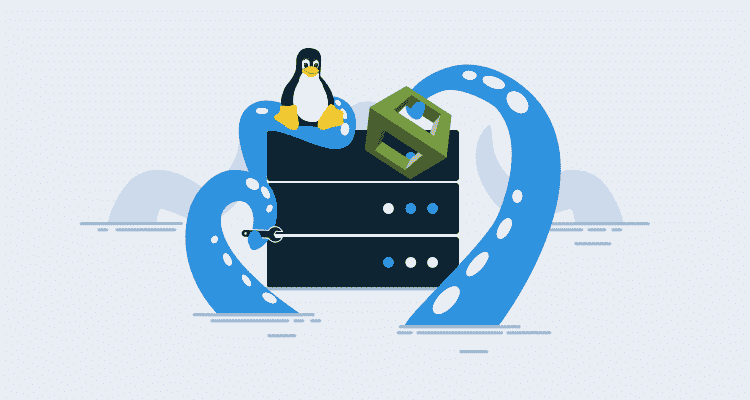
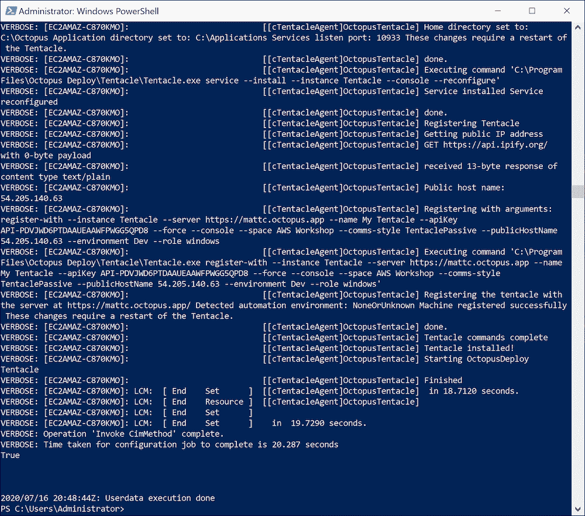

# 在 AWS CloudFormation 模板中使用 DSC 安装 Tentacles-Octopus Deploy

> 原文：<https://octopus.com/blog/dsc-with-aws-cloudformation>

[](#)

在之前的一篇博客文章中，我们查看了一些示例 CloudFormation 模板，它们在 VPC 中创建了一个新的 EC2 虚拟机。

这些模板在[实例用户数据](https://docs.aws.amazon.com/AWSEC2/latest/WindowsGuide/ec2-windows-user-data.html)中有占位符脚本。在这篇博文中，我们将通过 [Octopus DSC 模块](https://github.com/OctopusDeploy/OctopusDSC)，看看如何配置这些用户数据脚本来安装一个触手，作为目标或工作者。

## 安装目标

下面是完整的 CloudFormation 模板，我们用它在 VPC 中构建一个 EC2 实例，并将一个触手配置为目标:

```
AWSTemplateFormatVersion: 2010-09-09
Parameters:
  InstanceTypeParameter:
    Type: String
    Default: t3a.medium
    Description: Enter instance size. Default is t3a.medium.
  WorkstationIp:
    Type: String
    Description: The IP address of the workstation that can RDP into the instance.
  AMI:
    Type: String
    Default: ami-05bb2dae0b1de90b3
    Description: The Windows AMI to use.
  Key:
    Type: String
    Description: The key used to access the instance.
  APIKey:
    Type: String
    Description: The API key used to connect to the Octopus server.
  OctopusURL:
    Type: String
    Description: The Octopus server URL.   
  TentacleRole:
    Type: String
    Description: The tentacle role.   
  TentacleEnvironment:
    Type: String
    Description: The tentacle environment. 
  TentacleSpace:
    Type: String
    Description: The tentacle space.  
Resources:
  VPC:
    Type: AWS::EC2::VPC
    Properties:
      CidrBlock: 10.0.0.0/16
      EnableDnsSupport: true
      EnableDnsHostnames: true
      InstanceTenancy: default
      Tags:
        - Key: Name
          Value: Windows Target VPC
  InternetGateway:
    Type: AWS::EC2::InternetGateway
  VPCGatewayAttachment:
    Type: AWS::EC2::VPCGatewayAttachment
    Properties:
      VpcId: !Ref VPC
      InternetGatewayId: !Ref InternetGateway
  SubnetA:
    Type: AWS::EC2::Subnet
    Properties:
      AvailabilityZone: us-east-1a
      VpcId: !Ref VPC
      CidrBlock: 10.0.0.0/24
      MapPublicIpOnLaunch: true
  RouteTable:
    Type: AWS::EC2::RouteTable
    Properties:
      VpcId: !Ref VPC
  InternetRoute:
    Type: AWS::EC2::Route
    DependsOn: InternetGateway
    Properties:
      DestinationCidrBlock: 0.0.0.0/0
      GatewayId: !Ref InternetGateway
      RouteTableId: !Ref RouteTable
  SubnetARouteTableAssociation:
    Type: AWS::EC2::SubnetRouteTableAssociation
    Properties:
      RouteTableId: !Ref RouteTable
      SubnetId: !Ref SubnetA
  InstanceSecurityGroup:
    Type: AWS::EC2::SecurityGroup
    Properties:
      GroupName: "Octopus Target Group"
      GroupDescription: "Tentacle traffic in from hosted static ips, and RDP in from a personal workstation"
      VpcId: !Ref VPC
      SecurityGroupIngress:
        - IpProtocol: tcp
          FromPort: '10933'
          ToPort: '10933'
          CidrIp:  20.188.245.156/32
        - IpProtocol: tcp
          FromPort: '10933'
          ToPort: '10933'
          CidrIp:  52.147.25.42/32 
        - IpProtocol: tcp
          FromPort: '10933'
          ToPort: '10933'
          CidrIp:  52.147.31.180/32 
        - IpProtocol: tcp
          FromPort: '10933'
          ToPort: '10933'
          CidrIp:  20.188.244.132/32 
        - IpProtocol: tcp
          FromPort: '10933'
          ToPort: '10933'
          CidrIp:  52.147.25.94/32 
        - IpProtocol: tcp
          FromPort: '10933'
          ToPort: '10933'
          CidrIp:  52.147.25.173/32 
        - IpProtocol: tcp
          FromPort: '10933'
          ToPort: '10933'
          CidrIp:  20.188.245.171/32 
        - IpProtocol: tcp
          FromPort: '10933'
          ToPort: '10933'
          CidrIp:  20.188.245.7/32
        - IpProtocol: tcp
          FromPort: '10933'
          ToPort: '10933'
          CidrIp:  20.188.244.147/32
        - IpProtocol: tcp
          FromPort: '10933'
          ToPort: '10933'
          CidrIp:  20.188.244.240/32
        - IpProtocol: tcp
          FromPort: '3389'
          ToPort: '3389'
          CidrIp:  !Sub ${WorkstationIp}/32
      SecurityGroupEgress:
        - IpProtocol: -1
          CidrIp: 0.0.0.0/0
  Windows:
    Type: 'AWS::EC2::Instance'
    Properties:
      ImageId: !Ref AMI
      InstanceType:
        Ref: InstanceTypeParameter
      KeyName: !Ref Key
      SubnetId: !Ref SubnetA
      SecurityGroupIds:
        - Ref: InstanceSecurityGroup
      BlockDeviceMappings:
        - DeviceName: /dev/sda1
          Ebs:
            VolumeSize: 250
      UserData:
        Fn::Base64: !Sub |
          <powershell>
          Set-Content -Path c:\dsc.ps1 -Value @"
          Configuration SampleConfig
          {
              param (`$ApiKey, `$OctopusServerUrl, `$Environments, `$Roles, `$ListenPort, `$Space)

              Import-DscResource -Module OctopusDSC

              Node "localhost"
              {
                  cTentacleAgent OctopusTentacle
                  {
                      Ensure = "Present"
                      State = "Started"

                      # Tentacle instance name. Leave it as 'Tentacle' unless you have more
                      # than one instance
                      Name = "Tentacle"

                      # Defaults to <MachineName>_<InstanceName> unless overridden
                      DisplayName = "My Tentacle"

                      # Defaults to 10933 unless otherwise specified
                      ListenPort = `$ListenPort

                      # Required parameters. See full properties list below
                      ApiKey = `$ApiKey
                      OctopusServerUrl = `$OctopusServerUrl
                      Environments = `$Environments
                      Roles = `$Roles
                      Space = `$Space # This is for versions 2019.1 and above.  If null or not specified, it uses the space designated as Default
                  }
              }
          }

          SampleConfig -ApiKey "${APIKey}" -OctopusServerUrl "${OctopusURL}" -Environments @("${TentacleEnvironment}") -Roles @("${TentacleRole}") -ListenPort 10933 -Space "${TentacleSpace}"

          Start-DscConfiguration .\SampleConfig -Verbose -wait

          Test-DscConfiguration
          "@

          Install-PackageProvider -Name NuGet -MinimumVersion 2.8.5.201 -Force -Confirm:$false
          Set-PSRepository -Name "PSGallery" -InstallationPolicy Trusted
          Install-Module -Name OctopusDSC -Force -Confirm:$false
          Import-Module -Name OctopusDSC

          # Need .NET 4.8 to work around a bug in 4.7
          Set-ExecutionPolicy Bypass -Scope Process -Force; [System.Net.ServicePointManager]::SecurityProtocol = [System.Net.ServicePointManager]::SecurityProtocol -bor 3072; iex ((New-Object System.Net.WebClient).DownloadString('https://chocolatey.org/install.ps1'))
          choco install dotnetfx -y

          # Dot source the DSC config to install the tentacle
          . c:\dsc.ps1
          </powershell>
      Tags:
        -
          Key: Application
          Value:  Windows Server
        -
          Key: Domain
          Value: None
        -
          Key: Environment
          Value: Test
        -
          Key: LifeTime
          Value: Transient
        -
          Key: Name
          Value:  Windows Server Worker
        -
          Key: OS
          Value: Windows
        -
          Key: OwnerContact
          Value: "@matthewcasperson"
        -
          Key: Purpose
          Value: MattC Test Worker
        -
          Key: Source
          Value: CloudForation Script in Octopus Deploy
  ElasticIP:
    Type: AWS::EC2::EIP
    Properties:
      Domain: vpc
      InstanceId: !Ref Windows
Outputs:
  PublicIp:
    Value:
      Fn::GetAtt:
        - Windows
        - PublicIp
    Description: Server's PublicIp Address 
```

与前一篇博文中描述的模板相比，该模板有两处变化。

添加了其他参数:

```
 APIKey:
    Type: String
    Description: The API key used to connect to the Octopus server.
  OctopusURL:
    Type: String
    Description: The Octopus server URL.   
  TentacleRole:
    Type: String
    Description: The tentacle role.   
  TentacleEnvironment:
    Type: String
    Description: The tentacle environment. 
  TentacleSpace:
    Type: String
    Description: The tentacle space. 
```

这些参数定义用于连接 Octopus 的 API 键、Octopus 服务器 URL 以及新目标的角色、环境和空间。

为了配置目标，我们在用户数据部分展开了脚本。让我们来分析一下这个脚本。

我们首先将 DSC 配置保存到第二个 PowerShell 脚本中。我们需要这样做，因为 PowerShell 会在运行其他脚本命令之前解析任何`Configuration`块。`Configuration`模块中的命令`Import-DscResource -Module OctopusDSC`将会失败，因为 DSC 模块尚未安装。

此处使用的解决方法是将`Configuration`块保存到第二个文件，并在安装 DSC 模块后对其进行点源处理:

```
Set-Content -Path c:\dsc.ps1 -Value @"
    Configuration SampleConfig
    {
        param (`$ApiKey, `$OctopusServerUrl, `$Environments, `$Roles, `$ListenPort, `$Space)

        Import-DscResource -Module OctopusDSC

        Node "localhost"
        {
            cTentacleAgent OctopusTentacle
            {
                Ensure = "Present"
                State = "Started"

                # Tentacle instance name. Leave it as 'Tentacle' unless you have more
                # than one instance
                Name = "Tentacle"

                # Defaults to <MachineName>_<InstanceName> unless overridden
                DisplayName = "My Tentacle"

                # Defaults to 10933 unless otherwise specified
                ListenPort = `$ListenPort

                # Required parameters. See full properties list below
                ApiKey = `$ApiKey
                OctopusServerUrl = `$OctopusServerUrl
                Environments = `$Environments
                Roles = `$Roles
                Space = `$Space # This is for versions 2019.1 and above.  If null or not specified, it uses the space designated as Default
            }
        }
    }

    SampleConfig -ApiKey "${APIKey}" -OctopusServerUrl "${OctopusURL}" -Environments @("${TentacleEnvironment}") -Roles @("${TentacleRole}") -ListenPort 10933 -Space "${TentacleSpace}"

    Start-DscConfiguration .\SampleConfig -Verbose -wait

    Test-DscConfiguration
    "@ 
```

要安装 DSC 模块，我们需要安装 NuGet provider，然后从 [PowerShell Gallery](https://www.powershellgallery.com/packages/OctopusDSC) 安装 DSC 模块:

```
Install-PackageProvider -Name NuGet -MinimumVersion 2.8.5.201 -Force -Confirm:$false
Set-PSRepository -Name "PSGallery" -InstallationPolicy Trusted
Install-Module -Name OctopusDSC -Force -Confirm:$false
Import-Module -Name OctopusDSC 
```

由于版本的错误。NET 默认安装在 VM 上，我们需要安装。净 4.8。这是通过[巧克力](https://chocolatey.org/packages/dotnetfx)完成的:

```
Set-ExecutionPolicy Bypass -Scope Process -Force; [System.Net.ServicePointManager]::SecurityProtocol = [System.Net.ServicePointManager]::SecurityProtocol -bor 3072; iex ((New-Object System.Net.WebClient).DownloadString('https://chocolatey.org/install.ps1'))
choco install dotnetfx -y 
```

具备了所有先决条件后，我们开始进行 DSC 配置，现在将成功完成:

```
. c:\dsc.ps1 
```

## 验证安装

用户数据脚本的日志文件在`C:\ProgramData\Amazon\EC2-Windows\Launch\Log\UserdataExecution.log`中。如果我们在新创建的 EC2 实例中查看该文件的内容，我们将看到正在安装的触手:

[](#)

## 安装一个工人

安装工人的模板非常相似:

```
AWSTemplateFormatVersion: 2010-09-09
Parameters:
  InstanceTypeParameter:
    Type: String
    Default: t3a.medium
    Description: Enter instance size. Default is t3a.medium.
  WorkstationIp:
    Type: String
    Description: The IP address of the workstation that can RDP into the instance.
  AMI:
    Type: String
    Default: ami-05bb2dae0b1de90b3
    Description: The Windows AMI to use.
  Key:
    Type: String
    Description: The key used to access the instance.
  APIKey:
    Type: String
    Description: The API key used to connect to the Octopus server.
  OctopusURL:
    Type: String
    Description: The Octopus server URL.   
  WorkerPools:
    Type: String
    Description: The worker pools to add the tentacle to. 
  TentacleSpace:
    Type: String
    Description: The tentacle space.  
Resources:
  VPC:
    Type: AWS::EC2::VPC
    Properties:
      CidrBlock: 10.0.0.0/16
      EnableDnsSupport: true
      EnableDnsHostnames: true
      InstanceTenancy: default
      Tags:
        - Key: Name
          Value: Windows Target VPC
  InternetGateway:
    Type: AWS::EC2::InternetGateway
  VPCGatewayAttachment:
    Type: AWS::EC2::VPCGatewayAttachment
    Properties:
      VpcId: !Ref VPC
      InternetGatewayId: !Ref InternetGateway
  SubnetA:
    Type: AWS::EC2::Subnet
    Properties:
      AvailabilityZone: us-east-1a
      VpcId: !Ref VPC
      CidrBlock: 10.0.0.0/24
      MapPublicIpOnLaunch: true
  RouteTable:
    Type: AWS::EC2::RouteTable
    Properties:
      VpcId: !Ref VPC
  InternetRoute:
    Type: AWS::EC2::Route
    DependsOn: InternetGateway
    Properties:
      DestinationCidrBlock: 0.0.0.0/0
      GatewayId: !Ref InternetGateway
      RouteTableId: !Ref RouteTable
  SubnetARouteTableAssociation:
    Type: AWS::EC2::SubnetRouteTableAssociation
    Properties:
      RouteTableId: !Ref RouteTable
      SubnetId: !Ref SubnetA
  InstanceSecurityGroup:
    Type: AWS::EC2::SecurityGroup
    Properties:
      GroupName: "Octopus Target Group"
      GroupDescription: "Tentacle traffic in from hosted static ips, and RDP in from a personal workstation"
      VpcId: !Ref VPC
      SecurityGroupIngress:
        - IpProtocol: tcp
          FromPort: '10933'
          ToPort: '10933'
          CidrIp:  20.188.245.156/32
        - IpProtocol: tcp
          FromPort: '10933'
          ToPort: '10933'
          CidrIp:  52.147.25.42/32 
        - IpProtocol: tcp
          FromPort: '10933'
          ToPort: '10933'
          CidrIp:  52.147.31.180/32 
        - IpProtocol: tcp
          FromPort: '10933'
          ToPort: '10933'
          CidrIp:  20.188.244.132/32 
        - IpProtocol: tcp
          FromPort: '10933'
          ToPort: '10933'
          CidrIp:  52.147.25.94/32 
        - IpProtocol: tcp
          FromPort: '10933'
          ToPort: '10933'
          CidrIp:  52.147.25.173/32 
        - IpProtocol: tcp
          FromPort: '10933'
          ToPort: '10933'
          CidrIp:  20.188.245.171/32 
        - IpProtocol: tcp
          FromPort: '10933'
          ToPort: '10933'
          CidrIp:  20.188.245.7/32
        - IpProtocol: tcp
          FromPort: '10933'
          ToPort: '10933'
          CidrIp:  20.188.244.147/32
        - IpProtocol: tcp
          FromPort: '10933'
          ToPort: '10933'
          CidrIp:  20.188.244.240/32
        - IpProtocol: tcp
          FromPort: '3389'
          ToPort: '3389'
          CidrIp:  !Sub ${WorkstationIp}/32
      SecurityGroupEgress:
        - IpProtocol: -1
          CidrIp: 0.0.0.0/0
  Windows:
    Type: 'AWS::EC2::Instance'
    Properties:
      ImageId: !Ref AMI
      InstanceType:
        Ref: InstanceTypeParameter
      KeyName: !Ref Key
      SubnetId: !Ref SubnetA
      SecurityGroupIds:
        - Ref: InstanceSecurityGroup
      BlockDeviceMappings:
        - DeviceName: /dev/sda1
          Ebs:
            VolumeSize: 250
      UserData:
        Fn::Base64: !Sub |
          <powershell>
          Set-Content -Path c:\dsc.ps1 -Value @"
          Configuration SampleConfig
          {
              param (`$ApiKey, `$OctopusServerUrl, `$WorkerPools, `$ListenPort, `$Space)

              Import-DscResource -Module OctopusDSC

              Node "localhost"
              {
                  cTentacleAgent OctopusTentacle
                  {
                      Ensure = "Present"
                      State = "Started"

                      # Tentacle instance name. Leave it as 'Tentacle' unless you have more
                      # than one instance
                      Name = "Tentacle"

                      # Defaults to <MachineName>_<InstanceName> unless overridden
                      DisplayName = "My Tentacle"

                      # Defaults to 10933 unless otherwise specified
                      ListenPort = `$ListenPort

                      # Required parameters. See full properties list below
                      ApiKey = `$ApiKey
                      OctopusServerUrl = `$OctopusServerUrl
                      WorkerPools = `$WorkerPools
                      Space = `$Space # This is for versions 2019.1 and above.  If null or not specified, it uses the space designated as Default
                  }
              }
          }

          SampleConfig -ApiKey "${APIKey}" -OctopusServerUrl "${OctopusURL}" -WorkerPools @("${WorkerPools}") -ListenPort 10933 -Space "${TentacleSpace}"

          Start-DscConfiguration .\SampleConfig -Verbose -wait

          Test-DscConfiguration
          "@

          Install-PackageProvider -Name NuGet -MinimumVersion 2.8.5.201 -Force -Confirm:$false
          Set-PSRepository -Name "PSGallery" -InstallationPolicy Trusted
          Install-Module -Name OctopusDSC -Force -Confirm:$false
          Import-Module -Name OctopusDSC

          # Need .NET 4.8 to work around a bug in 4.7
          Set-ExecutionPolicy Bypass -Scope Process -Force; [System.Net.ServicePointManager]::SecurityProtocol = [System.Net.ServicePointManager]::SecurityProtocol -bor 3072; iex ((New-Object System.Net.WebClient).DownloadString('https://chocolatey.org/install.ps1'))
          choco install dotnetfx -y

          # Dot source the DSC config to install the tentacle
          . c:\dsc.ps1
          </powershell>
      Tags:
        -
          Key: Application
          Value:  Windows Server
        -
          Key: Domain
          Value: None
        -
          Key: Environment
          Value: Test
        -
          Key: LifeTime
          Value: Transient
        -
          Key: Name
          Value:  Windows Server Worker
        -
          Key: OS
          Value: Windows
        -
          Key: OwnerContact
          Value: "@matthewcasperson"
        -
          Key: Purpose
          Value: MattC Test Worker
        -
          Key: Source
          Value: CloudFormation Script in Octopus Deploy
  ElasticIP:
    Type: AWS::EC2::EIP
    Properties:
      Domain: vpc
      InstanceId: !Ref Windows
Outputs:
  PublicIp:
    Value:
      Fn::GetAtt:
        - Windows
        - PublicIp
    Description: Server's PublicIp Address 
```

要安装工作线程，我们需要删除角色和环境，并定义一个工作线程池参数:

```
 WorkerPools:
    Type: String
    Description: The worker pools to add the tentacle to. 
```

然后，我们从 DSC 配置中删除角色和环境，并定义工作池:

```
# Required parameters. See full properties list below
ApiKey = `$ApiKey
OctopusServerUrl = `$OctopusServerUrl
WorkerPools = `$WorkerPools
Space = `$Space # This is for versions 2019.1 and above.  If null or not specified, it uses the space designated as Default 
```

## 结论

通过利用用户数据脚本和 Octopus DSC 模块，我们可以快速启动新的虚拟机，在 Octopus 中自动安装和注册目标或工人。在 PowerShell 试图解析 DSC 配置之前，安装 DSC 模块需要做一些工作，但是一旦您理解了 DSC 的特点和解决方法，这个过程就相对容易实现了。