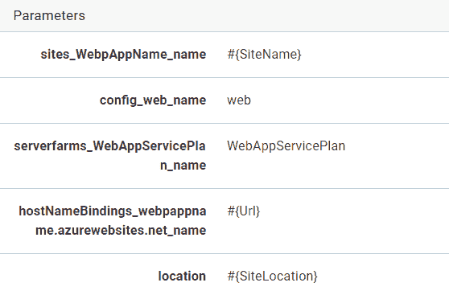

# 管理动态目标- Octopus 部署

> 原文：<https://octopus.com/blog/dynamic-infrastructure>

[](#)

在这篇文章中，我们将通过一个动态创建和拆除 Azure 基础设施的例子，为每个测试人员创建按需 Web 应用。我们还将了解如何在多个地理区域部署网站，以及如何拆除这些网站。这也将是在 [PaaS 部署目标](https://octopus.com/blog/paas-targets)和我们的[发布视频](https://www.youtube.com/watch?v=raepkFD7kx8)中讨论的一些主题的技术概述。

在 2018.5 中，我们引入了从您的部署流程中轻松管理您的 Azure 部署目标的能力。以前在 Octopus 中，你可以使用 Azure PowerShell 模块，你可以在你的 Azure 订阅中创建资源组和 Web 应用程序，但如果不做一些繁重的工作，你就无法向它们部署应用程序。新的动态目标 cmdlets 使这变得简单明了。

显然，您将需要部署一个应用程序，但是我将把它作为读者的[练习。](https://octopus.com/blog/deploying-an-octopus-pi#build-the-application)

## 设置

首先，我们需要配置 Octopus 来管理我们的新项目。

### 创建 Azure 帐户

参见关于[创建 Azure 服务主体帐户](https://octopus.com/docs/infrastructure/azure/creating-an-azure-account/creating-an-azure-service-principal-account)的文档以获取说明。

### 创建环境并配置动态基础架构

创建一个新的环境，如果你还没有的话。默认情况下，环境**不允许**创建或删除动态目标，因此您需要通过编辑环境设置来启用它。

[](#)

### 创造新的生命周期

为了简化我们的 QA 部署，并防止它部署到其他环境(如生产)，我们可以创建一个新的[生命周期](https://octopus.com/docs/infrastructure/lifecycles)，只允许部署到我们的新环境。

[](#)

### 创建脚本模块

脚本模块使您能够创建可以跨项目共享的函数。要生成唯一的站点名称，请将以下 PowerShell 函数放入**脚本模块**中，该模块位于**库**部分下:

```
function GetSiteName($prefix)
{
    # Octopus variables
    $environment = $OctopusParameters['Octopus.Environment.Name'].Replace(" ", "").Replace(".", "-")
    $tenant = $OctopusParameters['Octopus.Deployment.Tenant.Name'].Replace(".", "-")

    # A unique name based on the Octopus environment, release, and tenant
    $uniqueName = "$prefix-$environment-$tenant"

    return $uniqueName
} 
```

### 创建变量集

因为我们在安装和拆卸项目之间需要一个公共变量值，所以我们可以把它放在一个**变量集**中，也可以在**库**部分中找到。

添加一个新的**变量集**，并创建一个变量:

[](#)

### 创建安装项目

我们需要创建的第一个项目是创建所有基础设施和部署应用程序的项目。

创建一个新项目并进行一些初始设置:

*   在*进程*下，将*生命周期*从*默认*更改为新的生命周期，并包含新的*脚本模块*
*   在*变量*->-*库集*下，点击*包含库变量集*，选择上一步创建的**变量集**。
*   在*设置下*:
    *   将*部署目标*更改为*允许在没有部署目标时创建部署*
    *   将*跳过部署目标*更改为*如果部署目标不可用或变得不可用*。如果不更改此设置，任何已从 Azure 中删除但未在 Octopus 中清理的 Web 应用目标都将导致部署失败。这是可选的，取决于您的要求，更多信息请参见[文档](https://octopus.com/docs/deployment-patterns/elastic-and-transient-environments/deploying-to-transient-targets)。

在为这个项目设置流程时，我们将需要一个 **Azure 帐户**，有几种不同的方式为步骤提供帐户:

1.  直接上台阶。

2.  通过租户变量，如果您的租户有不同的 Azure 帐户。

    *   转到*变量* - > *项目模板*点击*添加模板*，将*控件类型*设置为 *Azure Account* 并给变量起个名字。稍后当我们设置*租户*时，这个变量将被赋予一个值。
3.  通过项目变量。

    *   进入*变量*页面，新建一个变量，将其类型设置为 *Azure Account* ，然后选择之前创建的 Azure 账号。

[](#)

[](#)

### 部署流程

让我们配置一个部署流程。

[](#)

这里的第一步是一个 Azure PowerShell 脚本。该步骤应该配置为在 Octopus 服务器上运行，此时它不需要角色。

该脚本将查询 Azure 以检查目标资源组是否存在，并在需要时创建资源组、应用服务计划和 Web 应用。我们还在资源组上使用一个*标签*设置了一个截止日期，这将在以后的拆卸项目中使用。

脚本中的最后一行是让我们下一步工作的魔法，它将在 Octopus 服务器中创建一个新的 **Azure Web 应用目标**，并为其分配一个角色 *QATest* 。`-updateIfExisting`参数将允许命令创建或更新一个同名的现有目标。

```
$uniqueName = GetSiteName($Prefix)
Set-OctopusVariable -name "SiteName" -value $uniqueName
Set-OctopusVariable -name "Url" -value "https://$uniqueName.azurewebsites.net/"

# Check for resource group
Get-AzureRmResourceGroup -Name $uniqueName -ErrorVariable notPresent -ErrorAction SilentlyContinue;

if ($notPresent) {
  # Create resources in Azure

  # set expiry tag on resource group to be used by our teardown script
  # this could be calculated to be a the end of the week or a specific future date
  $expiry =  ([System.DateTime]::Today.AddDays(7)).ToShortDateString();

  New-AzureRmResourceGroup -Name $uniqueName -Location "WestUS" -Tag @{Expiry="$expiry"}
  New-AzureRmAppServicePlan -Name $uniqueName -Location "WestUS" -ResourceGroupName $uniqueName -Tier Free
  New-AzureRmWebApp -Name $uniqueName -Location "WestUS" -AppServicePlan $uniqueName -ResourceGroupName $uniqueName

  # Create new target in Octopus
  Set-OctopusVariable -name "Action" -value "NewSite"
}
else {
  Set-OctopusVariable -name "Action" -value "ExistingSite"
}

# create a new Octopus Azure Web App Target
New-OctopusAzureWebAppTarget -Name $uniqueName `
                             -AzureWebApp $uniqueName `
                             -AzureResourceGroupName $uniqueName `
                             -OctopusAccountIdOrName $OctopusParameters["Azure Account"] `
                             -OctopusRoles "QATest" `
                             -updateIfExisting 
```

下一步是**部署 Azure Web 应用**步骤。这是我们将应用程序部署到我们在上一步中创建的目标的地方。您需要将目标角色设置为 *QATest* ，它不会出现在列表中，您需要键入它并选择 *Add* 。

未来将会改进对*角色*的管理，但是现在，你需要手动输入角色名称

最后一步是通知步骤，可以是 Slack、电子邮件或其他内容。

在我的时差通知步骤中，我设置了以下自定义设置:

*标题*是`Deployment to #{Octopus.Deployment.Tenant.Name}`

*消息*是`#{Octopus.Project.Name} release #{Octopus.Release.Number} to #{Octopus.Environment.Name} for #{Octopus.Deployment.Tenant.Name} Deployed #{Octopus.Action[Setup Azure Web App].Output.Action} to #{Octopus.Action[Setup Azure Web App].Output.Url}`。

在第一个脚本步骤中创建了`Url`和`Action`输出参数。

### 创建租户

在这个例子中，我利用租户来演示如何构建 QA 环境。一个租户可能代表一个测试人员或者一个客户。通过应用这种模式，您可以将您的部署从几个测试人员扩展到数百个测试人员，为每个测试人员部署 Azure 基础设施和最新的应用程序。

在**租户**菜单下，添加两个新租户，并将它们连接到 **Web App Setup** 项目，以及我们之前创建的环境。

[](#)

对于每个租户，您需要单击**连接项目**并选择我们刚刚创建的安装项目。如果您已经选择将您的 Azure 帐户变量创建为一个**项目模板**变量，您将需要在这一步提供实际的 Azure 帐户。这允许您在需要时为每个租户提供不同的帐户。

将**租户**用于您的部署将允许您使用租户变量为每个租户的每个部署提供配置。例如，每个测试人员/客户可能有他们自己的数据库，数据库名称由每个租户的变量提供，以在 web app 部署项目中构建数据库连接字符串。有关更多信息和示例，请参见我们的[文档](https://octopus.com/docs/deployment-patterns/multi-tenant-deployments)。

## 拆卸

所有这些 Azure 资源都可能让你花钱，即使没有人使用它们，所以我们可以使用第二个项目来拆除 Azure 和 Octopus 的应用程序。

创建一个新项目，并在*设置*中进行一些设置配置:

*   将*部署目标*更改为*允许在没有部署目标*时创建部署。
*   将*跳过部署目标*更改为*如果部署目标不可用或变得不可用*。

在*变量*->-*下，库集合*包括我们之前创建的库变量集合。这将在我们的拆卸脚本中使用。

使用另一个新的 Octopus infra structure cmdlet`Remove-OctopusTarget`，我们可以在单个 *Azure PowerShell 脚本*步骤中拆除 Octopus 目标和 Azure 资源。

该脚本使用 Azure 资源组上的到期标签来确定要删除哪些资源。

```
$date = [System.DateTime]::Today
# find all resource groups marked for expiry, with a name starting with #{Prefix}
Write-Host "Checking for resources expiring on or before $date"
$resourceGroups = Get-AzureRmResourceGroup | `
                        Where { $_.ResourceGroupName.StartsWith($Prefix) `
                                -and $_.Tags -ne $null `
                                -and $_.Tags.ContainsKey("Expiry") `
                                -and [DateTime]::Parse($_.Tags["Expiry"]) -ile $date }

Write-Host "Found $($resourceGroups.Count) resource groups"

foreach ($rg in $resourceGroups) {
  Write-Host "Removing $($rg.ResourceGroupName)"
  Remove-AzureRmResourceGroup -Name $rg.ResourceGroupName -Force
  Remove-OctopusTarget -targetIdOrName $rg.ResourceGroupName
} 
```

在运行拆除项目后，所有带有执行日期或更早到期标记的资源组将被移除，相应的 Octopus *Azure Web App* 目标也将被移除。

使用最近推出的[计划项目触发器](https://octopus.com/docs/deployment-process/project-triggers/scheduled-project-trigger)你可以触发每晚或每周执行的拆卸脚本。

## Azure 资源管理器模板和云区域

即使在`2018.5`中添加了所有新的目标，**云区域**仍然在确定您的部署脚本的范围中发挥作用，以支持[多区域部署模式](https://octopus.com/docs/deployment-patterns/multi-region-deployment-pattern)。例如，您可以整合**云区域**来运行不同地理区域的 PowerShell 脚本或 Azure 资源管理器模板。

### 设置

对于这个例子，我们将创建两个**云区域**。

[](#)

然后，我们可以使用这些*云区域*来创建跨越两个不同 Azure 地理区域的基础设施，并为每个区域部署一个 [ARM 模板](https://octopus.com/docs/deployment-examples/azure-deployments/resource-groups)。

现在，让我们创建一个新项目来运行我们的 Azure 资源管理器模板:

[](#)

第一步是**部署 Azure 资源组**:

[](#)

将步骤设置为根据我们分配给新的**云区域**的角色运行，该云区域是在上一步骤中创建的。

在帐户部分，您可以直接选择一个帐户，也可以将其绑定到 Azure 帐户变量。

ARM 步骤还要求目标资源组存在于 Azure 中，然后才能部署模板在资源组中创建资源。以前，这必须在更早的步骤中完成，在 2018.5 中，我们允许在该步骤中运行配置脚本。这些可以通过该步骤顶部的*配置功能*选项打开。一旦打开，您就可以添加预部署和后部署 *PowerShell* 部署脚本。

因为我们希望每个地理区域的资源组有不同的名称和位置，所以我们可以使用变量来提供区域名称和资源组名称，这样它们就可以不同。在资源组名称字段中，添加变量语法`#{SiteResourceGroup}`，并在预部署脚本部分添加以下 *PowerShell* 命令:

```
New-AzureRmResourceGroup -Name $SiteResourceGroup -Location $SiteLocation -Force 
```

对于 ARM 模板本身来说，最简单的入门方式就是去 Azure 门户，在你的模板中创建你想要的所有资源。对于这个例子，我创建了一个*资源组*、*应用服务*和*应用服务计划*。然后，在*资源组*的*自动化脚本*部分，您可以获取重新创建资源所需的模板。或者你可以抓一个[样品](https://github.com/Azure/azure-quickstart-templates)。

您还需要对模板进行一处修改，以允许区域作为输入参数，将以下 JSON 添加到 parameters 部分，不要忘记前一个参数后面的逗号:

```
"location": {
    "defaultValue": "Australia Southeast",
    "type": "String"
} 
```

然后将模板中所有出现的`location`值替换为`"location": "[parameters('location')]"`。

当您将最终模板放入步骤的模板源中时，它将提取参数并允许您用自己的值替换这些值。

[](#)

ARM 模板流程的最后一部分是添加一个后期部署脚本，以在 Octopus 中创建新的 **Azure Web App 目标**:

```
New-OctopusAzureWebAppTarget -name $SiteName `
                             -azureWebApp $SiteName `
                             -azureResourceGroupName $SiteResourceGroup  `
                             -octopusAccountIdOrName "azure" `
                             -octopusRoles "CloudWebSite" `
                             -updateIfExisting 
```

现在，创建支持我们的流程所需的所有变量，注意不同云区域目标的一些值的范围:

[](#)

最后，我们需要在流程中添加一个*部署 Azure Web App* 步骤，该步骤将针对`CloudWebSite`角色运行。这与我们在上面第一个例子中使用的过程完全相同。

### 拆卸

您可以使用与前面的拆卸示例相同的脚本，通过在 ARM 模板步骤的预部署脚本中向`New-AzureRmResourceGroup`命令添加一个`Expiry`标记，或者您可以将一个空的 ARM 模板部署到同一个资源组:

```
{
    "$schema": "https://schema.management.azure.com/schemas/2015-01-01/deploymentTemplate.json#",
    "contentVersion": "1.0.0.0",
    "parameters": {},
    "variables": {},
    "resources": []
} 
```

## 自动部署

随着新的 *Azure* 目标的引入，您还可以利用[自动部署触发器](https://octopus.com/docs/deployment-process/project-triggers/automatic-deployment-triggers)，允许您在应用程序流程的单独部署流程中拥有基础架构脚本/模板。*自动部署触发器*可以设置为在创建 web 应用程序的新实例时触发部署。

## 结论

新的动态目标供应 cmdlets 填补了我们在版本 3 中首次实现 Azure Web App 目标的空白。现在，您可以对您的目标进行全面的端到端管理。对于动态目标来说，这也不是路的尽头，随着动态环境和维护任务等功能的出现，它们将开始发挥更大的作用。我们甚至可以添加一个用户界面，这样你就可以少写一行代码。

愉快的部署。