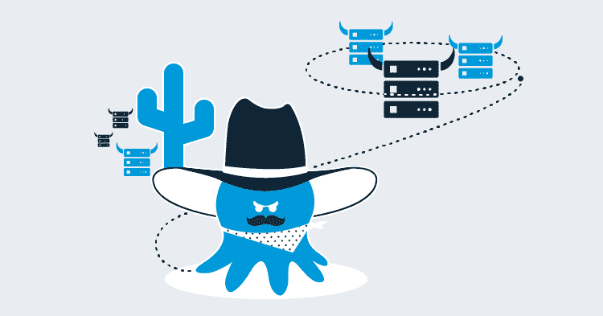
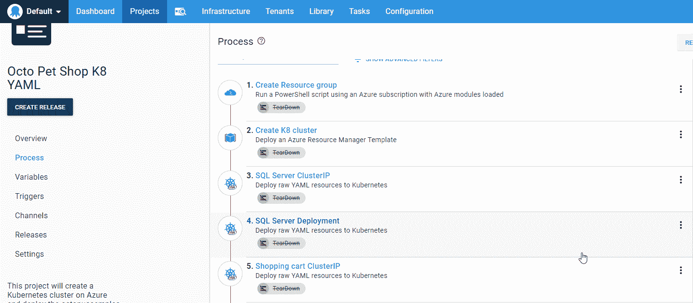
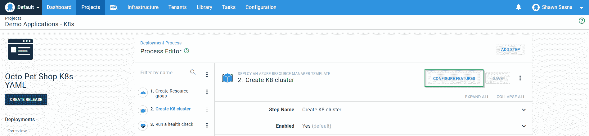
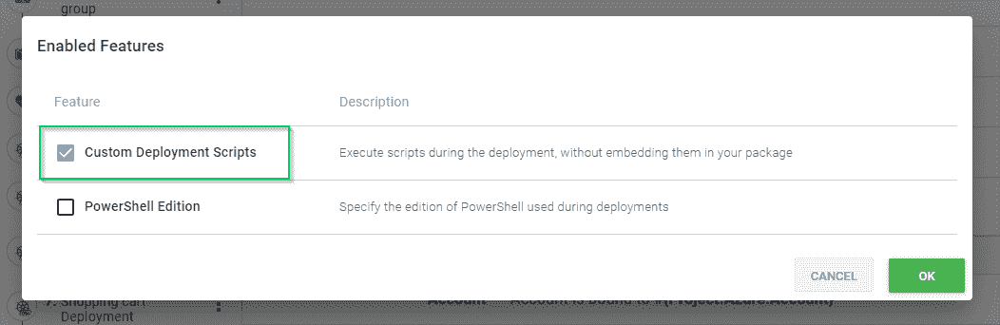
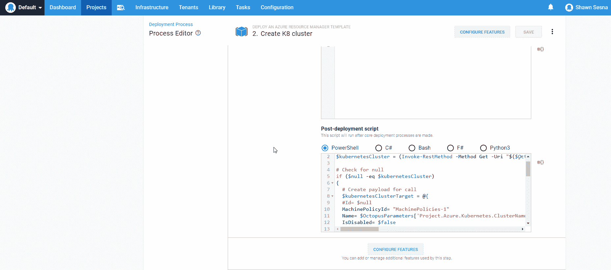
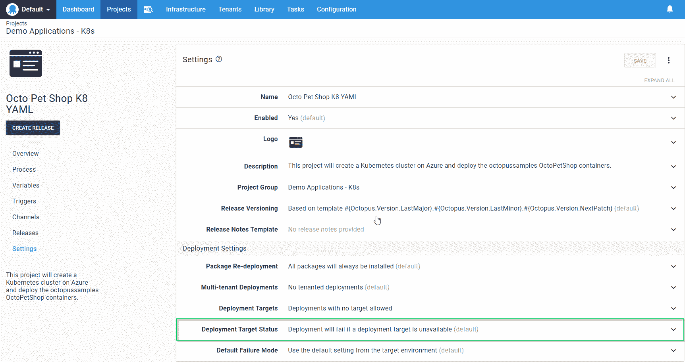
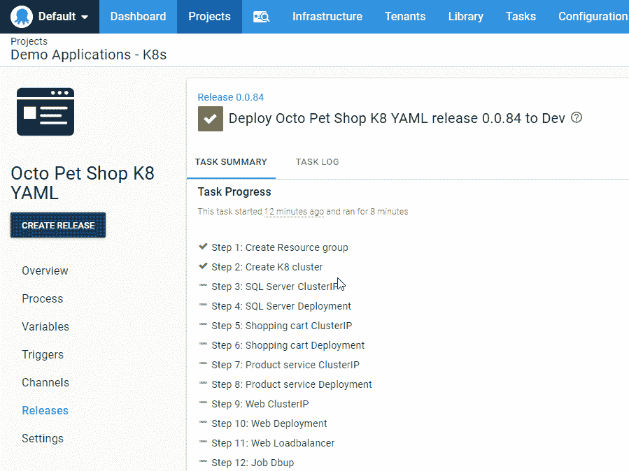
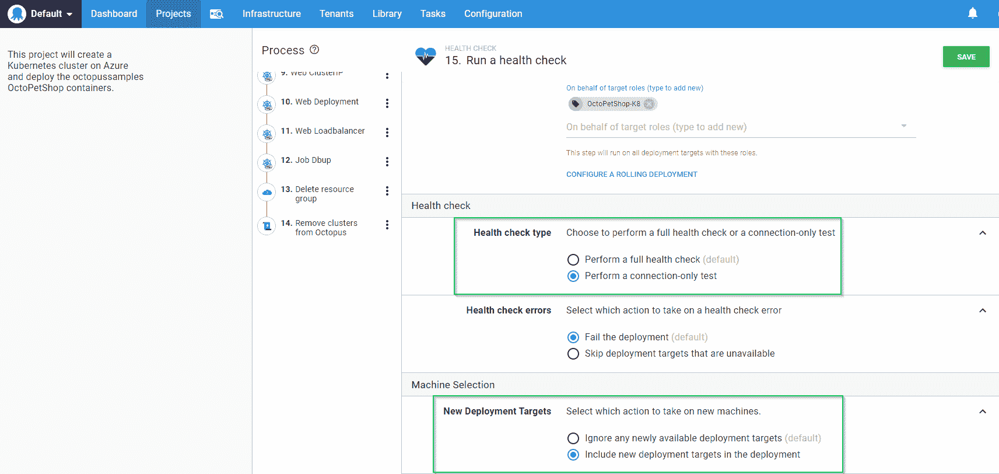
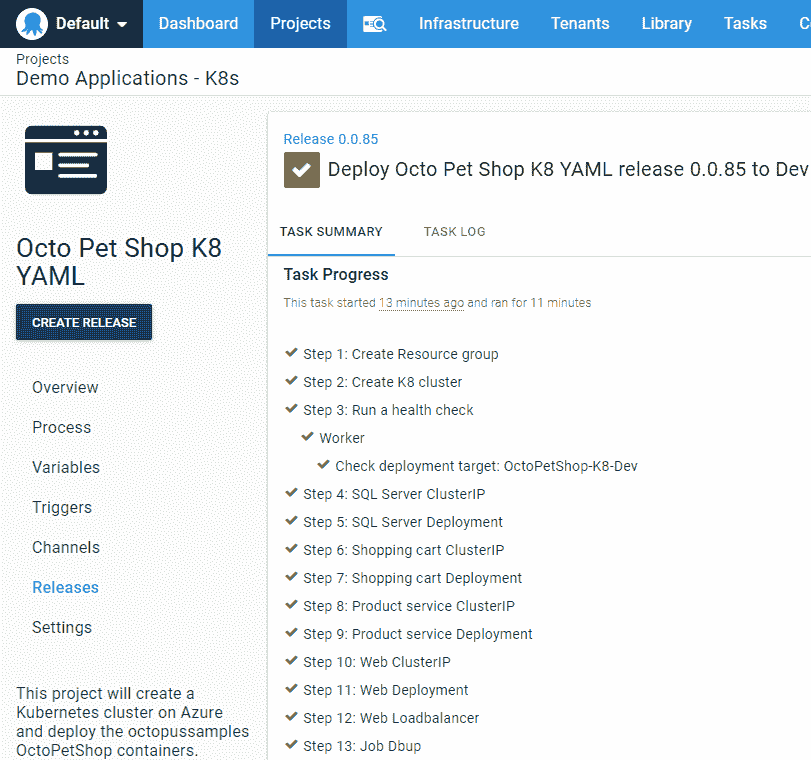

# 部署到动态供应的基础设施- Octopus 部署

> 原文：<https://octopus.com/blog/dynamic-infrastructure-during-deployment>

[](#)

使用项目触发器，可以将您的应用程序部署到动态创建的部署目标。当您有一个配置了伸缩功能的应用程序时，这种方法特别有效。随着更多的服务器被添加来处理负载，您的应用程序将被自动部署。也就是说，在有些情况下，创建部署目标是部署过程的一部分，这可能会有点棘手，因为 Octopus Deploy 会在部署开始时选择要部署到的目标。在本文中，我将向您展示如何将动态添加的目标作为部署过程的一部分。

## 示例场景

假设我们有一个在 Azure 上使用 Kubernetes 的应用程序。我们使用 Azure Resource Manager (ARM)模板来创建我们的 Kubernetes 集群，然后在其上部署我们的应用程序。一旦不再需要群集，我们就将其拆除以节省成本。当我们需要的云资源类型很昂贵，并且我们只在有限的时间内需要它时，这种方法很有用。我们的流程如下所示:

[](#)

我们动态地创建一个资源组，一个 Kubernetes 集群，然后开始向它部署。

为了添加 Kubernetes 集群，我们首先需要向创建 K8 集群步骤添加一个部署后脚本。编辑步骤并点击**配置功能**按钮:

[](#)

选择自定义部署脚本:

[](#)

在 K8s 的例子中，Octopus Deploy 创建了一个名为[New-Octopus kubernetarget](https://octopus.com/docs/infrastructure/deployment-targets/dynamic-infrastructure/kubernetes-target)的助手 cmdlet。对于本文，我使用一个可以添加任何类型目标的脚本。

展开**自定义部署脚本**部分，并在**后期部署脚本**窗口中输入以下内容。该脚本将首先检查它是否已经存在，如果不存在，则为 API 调用创建有效负载以添加它:

```
# Get current clustername
$kubernetesCluster = (Invoke-RestMethod -Method Get -Uri "$($OctopusParameters['Octopus.Web.BaseUrl'])/api/Spaces-1/machines/all" -Headers @{"X-Octopus-ApiKey"="$($OctopusParameters['Global.Octopus.ApiKey'])"}) | Where-Object {$_.Name -eq $OctopusParameters['Project.Azure.Kubernetes.ClusterName']}

# Check for null
if ($null -eq $kubernetesCluster)
{
  # Create payload for call
  $kubernetesClusterTarget = @{
  #Id= $null
  MachinePolicyId= "MachinePolicies-1"
  Name= $OctopusParameters['Project.Azure.Kubernetes.ClusterName']
  IsDisabled= $false
  HealthStatus= "Unknown"
  HasLatestCalamari= $true
  StatusSummary= $null
  IsInProcess= $true
  EndPoint= @{
  #Id= $null
  CommunicationStyle= "Kubernetes"
  Links= $null
  Authentication= @{
  AuthenticationType= "KubernetesAzure"
  AccountId= $OctopusParameters['Project.Azure.Account']
  ClusterName= $OctopusParameters['Project.Azure.Kubernetes.ClusterName']
  ClusterResourceGroup= $OctopusParameters['Project.Azure.ResourceGroup.Name']
  }
  AccountType= "AzureServicePrincipal"
  ClusterUrl= $null
  ClusterCertificate= $null
  SkipTlsVerification= $null
  DefaultWorkerPoolId= "WorkerPools-41"
  }
  Links= $null
  TenantedDeploymentParticipation= "Untenanted"
  Roles= @("OctoPetShop-K8")
  EnvironmentIds= @($OctopusParameters['Octopus.Environment.Id'])
  TenantIds= @()
  TenantTags= @()
  }

  # Convert to json
  $jsonBody = $kubernetesClusterTarget | ConvertTo-Json -Depth 10

  # Add cluster to deployment targets
  Invoke-RestMethod -Method Post -Uri "$($OctopusParameters['Octopus.Web.BaseUrl'])/api/Spaces-1/machines" -Body $jsonBody -Headers @{"X-Octopus-ApiKey"="$($OctopusParameters['Global.Octopus.ApiKey'])"}
} 
```

[](#)

然后，我们更新项目设置以允许创建部署，即使目标不存在:

[](#)

现在我们安排我们的部署，看着它进行！

## 为什么跳过了一些步骤？

尽管成功地创建了 Kubernetes 集群并将其注册到 Octopus Deploy，但是部署的结果看起来像是跳过了部署到 Kubernetes 集群的所有步骤。部署目标是在部署开始时选择的，由于集群还没有注册到 Octopus Deploy，Octopus 确定没有可用的部署目标，因此跳过了所有的部署步骤。

[](#)

## 包括新的目标

将健康检查步骤添加到您的流程中，并将其配置为包含新的目标，可以解决这个问题。

配置运行状况检查时，选择`connection-only test`作为运行状况检查类型，并在新部署目标部分选择`Include new deployment targets`。

【T2 

完成此操作后，新配置的 Kubernetes 集群将包含在部署中，我们的其余步骤将成功部署！

[](#)

## 摘要

虽然这不是一个常见的场景，但是这篇文章演示了如何在您的部署中包含在部署过程中创建的目标。