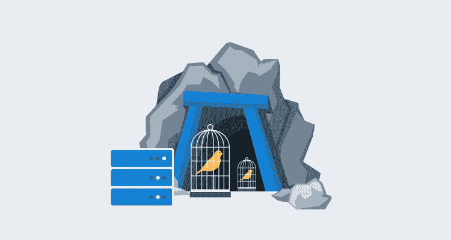
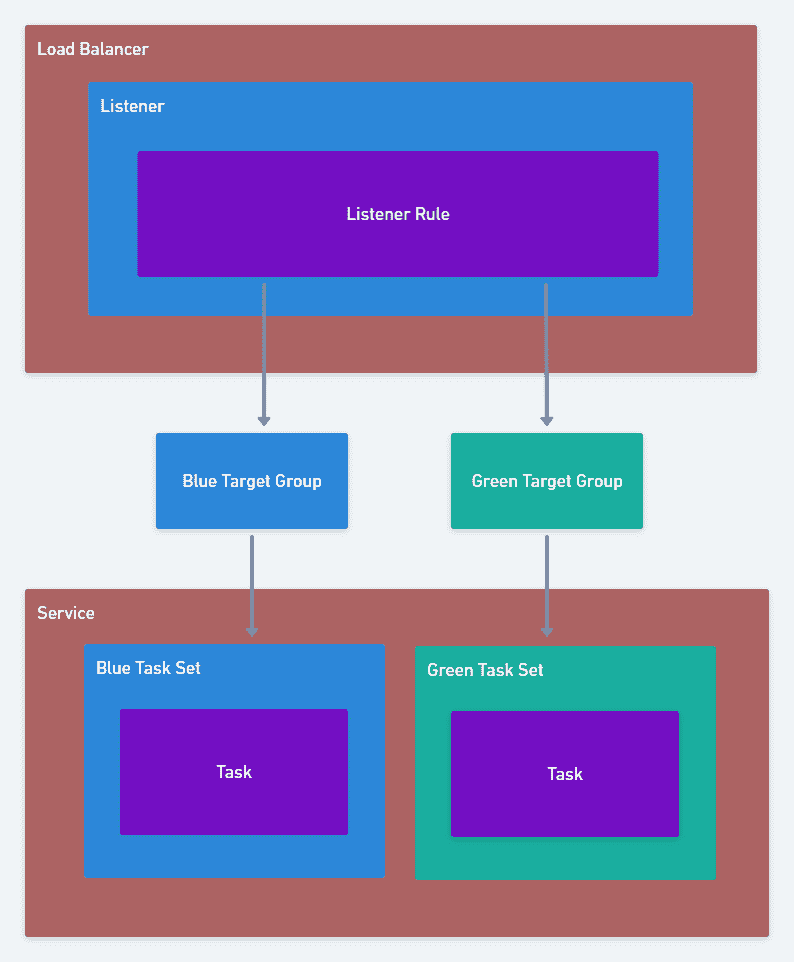
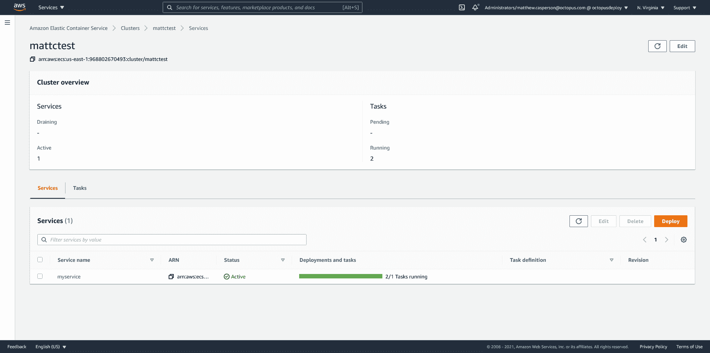
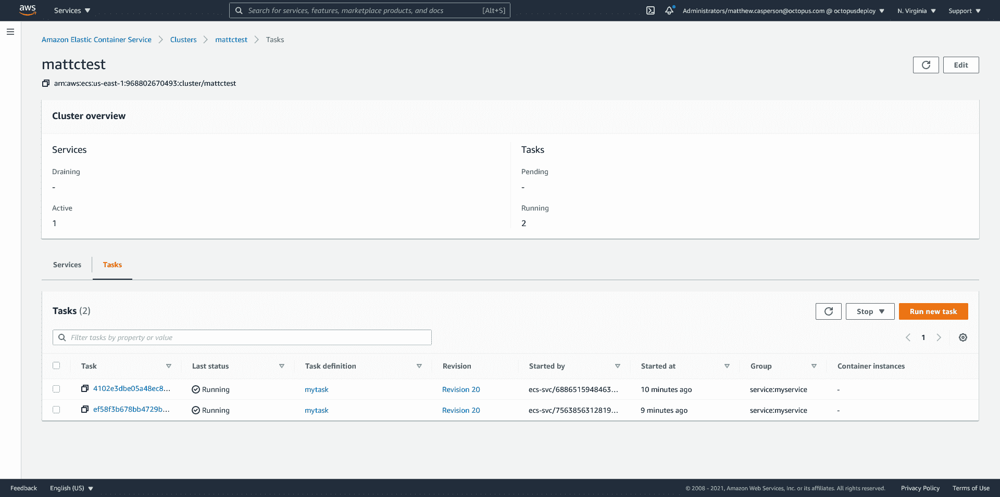
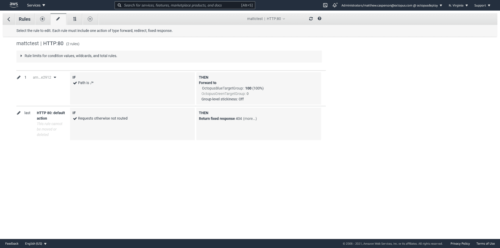
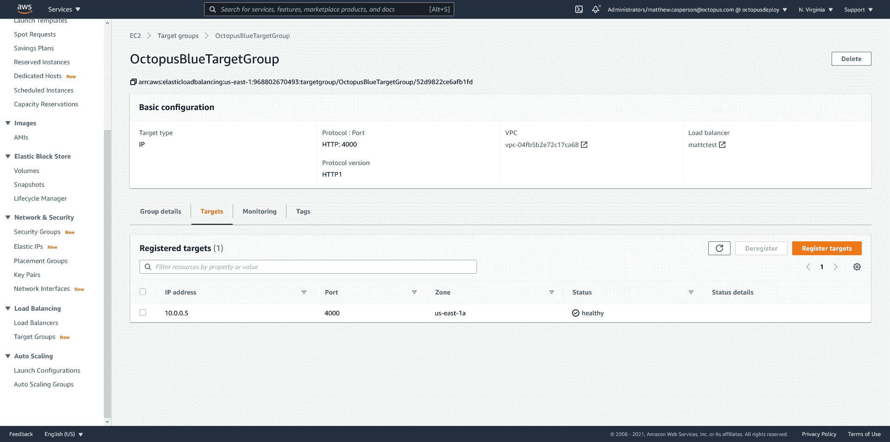
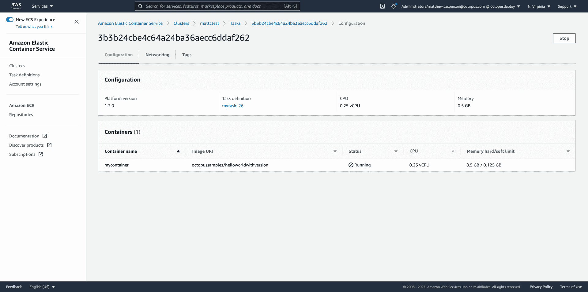
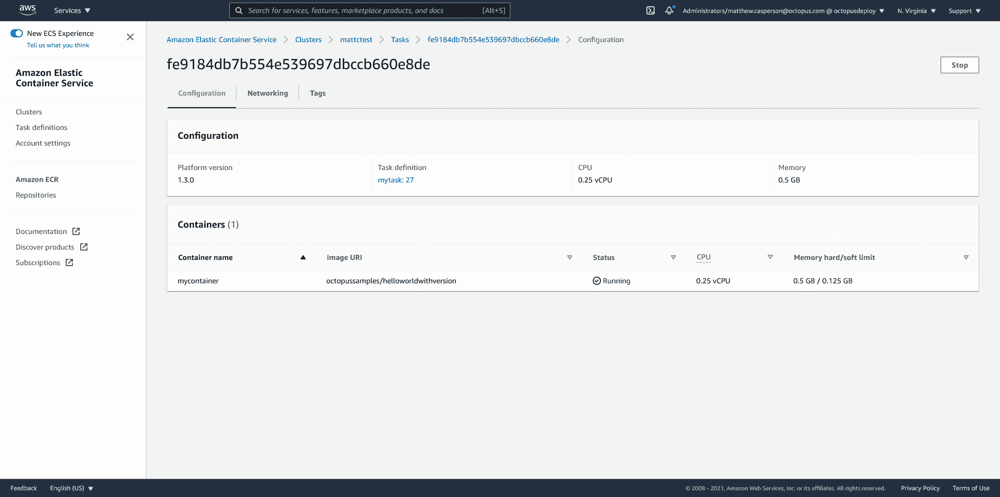
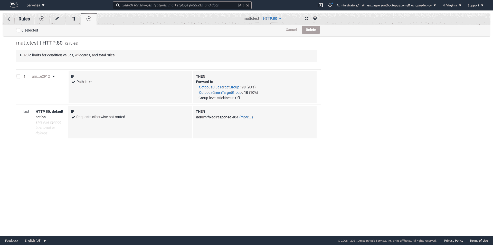
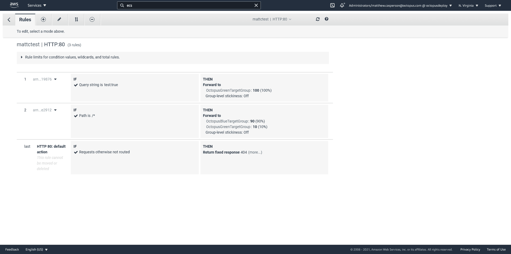

# ECS - Octopus 部署的金丝雀部署

> 原文：<https://octopus.com/blog/ecs-canary-deployments>

[](#)

Canary 部署是一种流行的模式，它允许您向越来越多的最终用户逐步推出新版本的应用程序。通过在首次展示期间观察新版本的错误或不良影响，有可能在产品错误影响大多数用户之前捕捉并恢复它们。

ECS 具有对[滚动更新](https://docs.aws.amazon.com/AmazonECS/latest/developerguide/deployment-type-ecs.html)的本地支持，其中服务中的任务是渐进的，但是是自动的，用应用程序的新版本进行更新。通过与 CodeDeploy 集成，可以执行 ECS 所谓的[蓝/绿部署](https://docs.aws.amazon.com/AmazonECS/latest/developerguide/deployment-type-bluegreen.html)，尽管该部署选项可以配置为执行金丝雀部署，将流量转移到新版本。您甚至可以[创建自己的部署策略](https://docs.aws.amazon.com/cli/latest/reference/deploy/create-deployment-config.html)，但是您受限于基于时间的金丝雀规则，即:

> 一种配置，以两个增量将流量从一个版本的 Lambda 函数或 ECS 任务集转移到另一个版本。

或者基于时间的线性规则，即:

> 一种配置，以相等的增量将流量从一个版本的 Lambda 函数或 ECS 任务集转移到另一个版本，每次增量之间的分钟数相等。

但是，有时候，在一段固定的时间内，将更多流量转移到 canary 部署的决定并不容易做出。例如，您可能需要一个人根据一系列输入(如支持请求、日志中的错误或资源使用情况)来决定是否继续进行 canary 部署。这种部署中的手动干预比 ECS 公开的蓝/绿策略需要更大的灵活性。

幸运的是， [ECS 可以推迟向外部系统进行部署的决定](https://docs.aws.amazon.com/AmazonECS/latest/developerguide/deployment-type-external.html)。它需要一些工作来设置，但是非常灵活。

在这篇博文中，我们将看看如何使用 CloudFormation 管理 ECS canary 部署。

## ECS 云形成资源

我们的 ECS 部署将通过 CloudFormation 创建和管理，并将利用以下资源:

*   [`AWS::ECS::TaskDefinition`](https://docs.aws.amazon.com/AWSCloudFormation/latest/UserGuide/aws-resource-ecs-taskdefinition.html) :任务定义配置 ECS 要执行的容器。
*   [`AWS::ECS::Service`](https://docs.aws.amazon.com/AWSCloudFormation/latest/UserGuide/aws-resource-ecs-service.html) :服务在 ECS 集群中保持一个或多个任务定义(或多个任务定义，当使用任务集时)的实例运行。
*   [`AWS::ECS::TaskSet`](https://docs.aws.amazon.com/AWSCloudFormation/latest/UserGuide/aws-resource-ecs-taskset.html) :一个服务可以包含多个任务集，每个任务集都配置有自己的任务定义。多个任务集允许单个服务管理从多个任务定义创建的任务。
*   [`AWS::ElasticLoadBalancingV2::Listener`](https://docs.aws.amazon.com/AWSCloudFormation/latest/UserGuide/aws-resource-elasticloadbalancingv2-listener.html) :监听器定义接收负载平衡器流量的端口和协议。
*   [`AWS::ElasticLoadBalancingV2::ListenerRule`](https://docs.aws.amazon.com/AWSCloudFormation/latest/UserGuide/aws-resource-elasticloadbalancingv2-listenerrule.html) :监听器规则定义了高级规则，如路径、查询字符串、头匹配等，必须满足这些规则才能将流量传送到目标组。
*   [`AWS::ElasticLoadBalancingV2::TargetGroup`](https://docs.aws.amazon.com/AWSCloudFormation/latest/UserGuide/aws-resource-elasticloadbalancingv2-targetgroup.html) :目标组将下游服务(如 ECS 任务)绑定到负载平衡器侦听器规则。

最终的架构如下所示:

[](#)

## 示例应用程序

为了演示 canary 部署，我们将使用从位于[https://github . com/OctopusSamples/DockerHelloWorldWithVersion](https://github.com/OctopusSamples/DockerHelloWorldWithVersion)的代码创建的 Docker 映像。这是一个简单的“hello world”node . js 应用程序，它还打印了环境变量`APPVERSION`的值以响应 HTTP 请求。

## `AWS::ECS::TaskDefinition`资源

任务定义将示例应用程序配置为侦听端口 4000 上的流量。它还定义了一个名为`APPVERSION`的环境变量，该变量将显示在响应中。

我们将更新`APPVERSION`环境变量，作为模拟新应用程序版本部署的一种方式。

这是第一个任务定义。注意`UpdateReplacePolicy`属性被设置为`Retain`。这意味着 CloudFormation 将创建一个新的任务定义，但不会删除(或者，从技术上讲，标记为非活动的)任何以前部署的任务定义:

```
 "MyTask": {
      "Type": "AWS::ECS::TaskDefinition",
      "UpdateReplacePolicy": "Retain",
      "Properties": {
        "ContainerDefinitions": [
          {
            "Cpu": 256,
            "Image": "octopussamples/helloworldwithversion",
            "Memory": 512,
            "MemoryReservation": 128,
            "Name": "mycontainer",
            "Environment": [
              {
                "Name": "APPVERSION",
                "Value": "1.0.0"
              }
            ],
            "PortMappings": [
              {
                "ContainerPort": 4000,
                "HostPort": 4000,
                "Protocol": "tcp"
              }
            ]
          }
        ],
        "Cpu": "256",
        "Family": "mytask",
        "Memory": "512",
        "RequiresCompatibilities": [
          "FARGATE"
        ],
        "NetworkMode": "awsvpc"
      }
    } 
```

## `AWS::ElasticLoadBalancingV2::TargetGroup`资源

目标组定义了响应网络请求的下游服务。我们在这里不定义任何服务，因为 ECS 本身会在创建任务时将任务放入目标组，并在销毁任务时删除任务。

下面的两个目标组将包含蓝色(或现有部署)任务和绿色(或新部署)任务:

```
 "GreenTargetGroup": {
      "Type": "AWS::ElasticLoadBalancingV2::TargetGroup",
      "Properties": {
        "HealthCheckEnabled": true,
        "HealthCheckIntervalSeconds": 5,
        "HealthCheckPath": "/",
        "HealthCheckPort": "4000",
        "HealthCheckProtocol": "HTTP",
        "HealthCheckTimeoutSeconds": 2,
        "HealthyThresholdCount": 2,
        "Matcher": {
          "HttpCode": "200"
        },
        "Name": "OctopusGreenTargetGroup",
        "Port": 4000,
        "Protocol": "HTTP",
        "TargetType": "ip",
        "UnhealthyThresholdCount": 5,
        "VpcId": "vpc-04fb5b2e72c17ca68"
      }
    } 
```

```
 "BlueTargetGroup": {
      "Type": "AWS::ElasticLoadBalancingV2::TargetGroup",
      "Properties": {
        "HealthCheckEnabled": true,
        "HealthCheckIntervalSeconds": 5,
        "HealthCheckPath": "/",
        "HealthCheckPort": "4000",
        "HealthCheckProtocol": "HTTP",
        "HealthCheckTimeoutSeconds": 2,
        "HealthyThresholdCount": 2,
        "Matcher": {
          "HttpCode": "200"
        },
        "Name": "OctopusBlueTargetGroup",
        "Port": 4000,
        "Protocol": "HTTP",
        "TargetType": "ip",
        "UnhealthyThresholdCount": 5,
        "VpcId": "vpc-04fb5b2e72c17ca68"
      }
    } 
```

## `AWS::ECS::TaskSet`资源

使用标准滚动部署，ECS 服务将仅引用一个任务定义，服务资源将定义所有相关设置，如网络和任务计数。

任务集提供了一种更灵活的方法来定义服务中的任务定义。当使用任务集时，[服务资源定义很少的设置](https://docs.aws.amazon.com/AmazonECS/latest/developerguide/deployment-type-external.html#deployment-type-external-workflow)，并且主要作为其子任务集的父资源存在。

在这个例子中，每个任务集指向相同的任务定义。这意味着对于初始部署，堆栈的蓝色和绿色部分是相同的。在本文的后面，我们将了解如何使用新的任务定义更新该模板，以便绿色堆栈执行金丝雀或蓝/绿部署:

```
 "GreenTaskSet": {
      "Type": "AWS::ECS::TaskSet",
      "Properties": {
        "Cluster": "arn:aws:ecs:us-east-1:968802670493:cluster/mattctest",
        "ExternalId": "OctopusGreenStack",
        "LaunchType": "FARGATE",
        "NetworkConfiguration": {
          "AwsvpcConfiguration": {
            "AssignPublicIp": "ENABLED",
            "SecurityGroups": [
              "sg-043789abf52c12d9a"
            ],
            "Subnets": [
              "subnet-0af41f8e0404d7b23",
              "subnet-0c2515119bdf77d4c",
              "subnet-09d1a3362fac596a9"
            ]
          }
        },
        "LoadBalancers": [
          {
            "ContainerName": "mycontainer",
            "ContainerPort": 4000,
            "TargetGroupArn": {
              "Ref": "GreenTargetGroup"
            }
          }
        ],
        "Scale": {
          "Unit": "PERCENT",
          "Value": 100
        },
        "Service": "myservice",
        "TaskDefinition": {"Ref": "MyTask10d4f29d4aa0474dbd4b0435922cd032"}
      },
      "DependsOn": [
        "MyService",
        "GreenTargetGroup"
      ]
    } 
```

```
 "BlueTaskSet": {
      "Type": "AWS::ECS::TaskSet",
      "Properties": {
        "Cluster": "arn:aws:ecs:us-east-1:968802670493:cluster/mattctest",
        "ExternalId": "OctopusBlueStack",
        "LaunchType": "FARGATE",
        "NetworkConfiguration": {
          "AwsvpcConfiguration": {
            "AssignPublicIp": "ENABLED",
            "SecurityGroups": [
              "sg-043789abf52c12d9a"
            ],
            "Subnets": [
              "subnet-0af41f8e0404d7b23",
              "subnet-0c2515119bdf77d4c",
              "subnet-09d1a3362fac596a9"
            ]
          }
        },
        "LoadBalancers": [
          {
            "ContainerName": "mycontainer",
            "ContainerPort": 4000,
            "TargetGroupArn": {
              "Ref": "BlueTargetGroup"
            }
          }
        ],
        "Scale": {
          "Unit": "PERCENT",
          "Value": 100
        },
        "Service": "myservice",
        "TaskDefinition": {"Ref": "MyTask10d4f29d4aa0474dbd4b0435922cd032"}
      },
      "DependsOn": [
        "MyService",
        "BlueTargetGroup"
      ]
    } 
```

## `AWS::ECS::Service`资源

该服务将确保运行所需数量的任务，并且它们将继续运行。通常，我们会将服务配置为直接引用任务定义，但是在我们的例子中，我们将使用上面的任务集将服务链接到任务定义。这意味着我们的服务很少。

我们确实给服务添加了一个标记，以指示保存先前稳定部署的堆栈。在部署这个模板时，我们总是认为蓝色堆栈是以前的稳定部署，绿色堆栈是新的部署。然而，从蓝色到绿色的转换将涉及更新该标签，以指示绿色堆栈通过了测试，并且是新的稳定堆栈:

```
 "MyService": {
      "Type": "AWS::ECS::Service",
      "Properties": {
        "Cluster": "arn:aws:ecs:us-east-1:968802670493:cluster/mattctest",
        "ServiceName": "myservice",
        "DeploymentController": {
          "Type": "EXTERNAL"
        },
        "Tags": [
          {
            "Key": "StableStack",
            "Value": "Blue"
          }
        ]
      }
    } 
```

## `AWS::ElasticLoadBalancingV2::Listener`资源

监听器连接到负载平衡器，并定义用于将流量定向到目标组的协议和端口规则。下面的侦听器被配置为在端口 80 上接收 HTTP 流量，并且有一个默认规则，如果没有其他自定义规则与传入的请求匹配，则用 HTTP 404 状态代码进行响应。

请注意，我们对现有的 [ALB](https://docs.aws.amazon.com/elasticloadbalancing/latest/application/introduction.html) 或 [NLB](https://docs.aws.amazon.com/elasticloadbalancing/latest/network/introduction.html) 的 ARN 进行了硬编码。这里的要求是现有的负载平衡器还没有配置使用端口 80 的侦听器:

```
 "MyListener": {
      "Type": "AWS::ElasticLoadBalancingV2::Listener",
      "Properties": {
        "DefaultActions": [
          {
            "FixedResponseConfig": {
              "StatusCode": "404"
            },
            "Order": 1,
            "Type": "fixed-response"
          }
        ],
        "LoadBalancerArn": "arn:aws:elasticloadbalancing:us-east-1:968802670493:loadbalancer/app/mattctest/3a1496378bd20439",
        "Port": 80,
        "Protocol": "HTTP"
      }
    } 
```

## `AWS::ElasticLoadBalancingV2::ListenerRule`资源

侦听器规则附加到侦听器上，并提供对如何匹配传入请求以及如何将请求转发到目标组的细粒度控制。下面的侦听器规则匹配所有请求路径(本质上匹配所有请求)，并在蓝色和绿色目标组之间划分流量。

修改分配给蓝色和绿色目标组的权重是我们实现蓝色/绿色或淡黄色部署的方式。从蓝堆栈到绿堆栈的硬切换实现了传统的蓝/绿部署，而逐渐增加到绿堆栈的流量实现了金丝雀部署:

```
 "MyListenerRule": {
      "Type": "AWS::ElasticLoadBalancingV2::ListenerRule",
      "Properties": {
        "Actions": [
          {
            "ForwardConfig": {
              "TargetGroups": [
                {
                  "TargetGroupArn": {
                    "Ref": "GreenTargetGroup"
                  },
                  "Weight": 0
                },
                {
                  "TargetGroupArn": {
                    "Ref": "BlueTargetGroup"
                  },
                  "Weight": 100
                }
              ]
            },
            "Order": 1,
            "Type": "forward"
          }
        ],
        "Conditions": [
          {
            "Field": "path-pattern",
            "PathPatternConfig": {
              "Values": [
                "/*"
              ]
            }
          }
        ],
        "ListenerArn": {
          "Ref": "MyListener"
        },
        "Priority": 10
      },
      "DependsOn": [
        "MyListener",
        "GreenTargetGroup",
        "BlueTargetGroup"
      ]
    } 
```

## 完整的模板

这是完整的云形成模板:

```
{
  "Resources": {
    "MyTask": {
      "Type": "AWS::ECS::TaskDefinition",
      "UpdateReplacePolicy": "Retain",
      "Properties": {
        "ContainerDefinitions": [
          {
            "Cpu": 256,
            "Image": "octopussamples/helloworldwithversion",
            "Memory": 512,
            "MemoryReservation": 128,
            "Name": "mycontainer",
            "Environment": [
              {
                "Name": "APPVERSION",
                "Value": "1.0.0"
              }
            ],
            "PortMappings": [
              {
                "ContainerPort": 4000,
                "HostPort": 4000,
                "Protocol": "tcp"
              }
            ]
          }
        ],
        "Cpu": "256",
        "Family": "mytask",
        "Memory": "512",
        "RequiresCompatibilities": [
          "FARGATE"
        ],
        "NetworkMode": "awsvpc"
      }
    },   
    "GreenTargetGroup": {
      "Type": "AWS::ElasticLoadBalancingV2::TargetGroup",
      "Properties": {
        "HealthCheckEnabled": true,
        "HealthCheckIntervalSeconds": 5,
        "HealthCheckPath": "/",
        "HealthCheckPort": "4000",
        "HealthCheckProtocol": "HTTP",
        "HealthCheckTimeoutSeconds": 2,
        "HealthyThresholdCount": 2,
        "Matcher": {
          "HttpCode": "200"
        },
        "Name": "OctopusGreenTargetGroup",
        "Port": 4000,
        "Protocol": "HTTP",
        "TargetType": "ip",
        "UnhealthyThresholdCount": 5,
        "VpcId": "vpc-04fb5b2e72c17ca68"
      }
    },
    "BlueTargetGroup": {
      "Type": "AWS::ElasticLoadBalancingV2::TargetGroup",
      "Properties": {
        "HealthCheckEnabled": true,
        "HealthCheckIntervalSeconds": 5,
        "HealthCheckPath": "/",
        "HealthCheckPort": "4000",
        "HealthCheckProtocol": "HTTP",
        "HealthCheckTimeoutSeconds": 2,
        "HealthyThresholdCount": 2,
        "Matcher": {
          "HttpCode": "200"
        },
        "Name": "OctopusBlueTargetGroup",
        "Port": 4000,
        "Protocol": "HTTP",
        "TargetType": "ip",
        "UnhealthyThresholdCount": 5,
        "VpcId": "vpc-04fb5b2e72c17ca68"
      }
    },
    "GreenTaskSet": {
      "Type": "AWS::ECS::TaskSet",
      "Properties": {
        "Cluster": "arn:aws:ecs:us-east-1:968802670493:cluster/mattctest",
        "ExternalId": "OctopusGreenStack",
        "LaunchType": "FARGATE",
        "NetworkConfiguration": {
          "AwsvpcConfiguration": {
            "AssignPublicIp": "ENABLED",
            "SecurityGroups": [
              "sg-043789abf52c12d9a"
            ],
            "Subnets": [
              "subnet-0af41f8e0404d7b23",
              "subnet-0c2515119bdf77d4c",
              "subnet-09d1a3362fac596a9"
            ]
          }
        },
        "LoadBalancers": [
          {
            "ContainerName": "mycontainer",
            "ContainerPort": 4000,
            "TargetGroupArn": {
              "Ref": "GreenTargetGroup"
            }
          }
        ],
        "Scale": {
          "Unit": "PERCENT",
          "Value": 100
        },
        "Service": "myservice",
        "TaskDefinition": {"Ref": "MyTask"}
      },
      "DependsOn": [
        "MyService",
        "GreenTargetGroup"
      ]
    },
    "BlueTaskSet": {
      "Type": "AWS::ECS::TaskSet",
      "Properties": {
        "Cluster": "arn:aws:ecs:us-east-1:968802670493:cluster/mattctest",
        "ExternalId": "OctopusBlueStack",
        "LaunchType": "FARGATE",
        "NetworkConfiguration": {
          "AwsvpcConfiguration": {
            "AssignPublicIp": "ENABLED",
            "SecurityGroups": [
              "sg-043789abf52c12d9a"
            ],
            "Subnets": [
              "subnet-0af41f8e0404d7b23",
              "subnet-0c2515119bdf77d4c",
              "subnet-09d1a3362fac596a9"
            ]
          }
        },
        "LoadBalancers": [
          {
            "ContainerName": "mycontainer",
            "ContainerPort": 4000,
            "TargetGroupArn": {
              "Ref": "BlueTargetGroup"
            }
          }
        ],
        "Scale": {
          "Unit": "PERCENT",
          "Value": 100
        },
        "Service": "myservice",
        "TaskDefinition": {"Ref": "MyTask"}
      },
      "DependsOn": [
        "MyService",
        "BlueTargetGroup"
      ]
    },
    "MyService": {
      "Type": "AWS::ECS::Service",
      "Properties": {
        "Cluster": "arn:aws:ecs:us-east-1:968802670493:cluster/mattctest",
        "ServiceName": "myservice",
        "DeploymentController": {
          "Type": "EXTERNAL"
        },
        "Tags": [
          {
            "Key": "StableStack",
            "Value": "Blue"
          }
        ]
      }
    },
    "MyListener": {
      "Type": "AWS::ElasticLoadBalancingV2::Listener",
      "Properties": {
        "DefaultActions": [
          {
            "FixedResponseConfig": {
              "StatusCode": "404"
            },
            "Order": 1,
            "Type": "fixed-response"
          }
        ],
        "LoadBalancerArn": "arn:aws:elasticloadbalancing:us-east-1:968802670493:loadbalancer/app/mattctest/3a1496378bd20439",
        "Port": 80,
        "Protocol": "HTTP"
      }
    },
    "MyListenerRule": {
      "Type": "AWS::ElasticLoadBalancingV2::ListenerRule",
      "Properties": {
        "Actions": [
          {
            "ForwardConfig": {
              "TargetGroups": [
                {
                  "TargetGroupArn": {
                    "Ref": "GreenTargetGroup"
                  },
                  "Weight": 0
                },
                {
                  "TargetGroupArn": {
                    "Ref": "BlueTargetGroup"
                  },
                  "Weight": 100
                }
              ]
            },
            "Order": 1,
            "Type": "forward"
          }
        ],
        "Conditions": [
          {
            "Field": "path-pattern",
            "PathPatternConfig": {
              "Values": [
                "/*"
              ]
            }
          }
        ],
        "ListenerArn": {
          "Ref": "MyListener"
        },
        "Priority": 10
      },
      "DependsOn": [
        "MyListener",
        "GreenTargetGroup",
        "BlueTargetGroup"
      ]
    }
  },
  "Outputs": {
    "BlueTaskSet": {
      "Description": "The blue service task set",
      "Value": {"Fn::GetAtt": ["BlueTaskSet", "Id"]}
    },
    "GreenTaskSet": {
      "Description": "The green service task set",
      "Value": {"Fn::GetAtt": ["GreenTaskSet", "Id"]}
    },
    "BlueTargetGroup": {
      "Description": "The blue target group",
      "Value": {"Ref": "BlueTargetGroup"}
    },
    "GreenTargetGroup": {
      "Description": "The green target group",
      "Value": {"Ref": "GreenTargetGroup"}
    }
  }
} 
```

部署这个堆栈会在 ECS 中产生一个新的服务。

运行的 **2/1 任务的报告可能看起来有点奇怪，但是这个值是两个任务集的结果，每个任务集都被配置为运行其父服务所需任务计数的 100%,即 1。这意味着我们有两个任务集，每个任务集运行一个任务，从而为服务中定义的一个所需任务运行两个任务:**

[](#)

这两个任务是在蓝色和绿色任务集中配置的任务。请注意，任务集不会显示在控制台中，我们必须推断任务所属的任务集:

[](#)

我们的负载平衡器侦听器已经配置为将流量定向到两个目标组:

[](#)

ECS 向目标群体添加了以下任务:

[](#)

由于这是我们的第一次部署，任务集都指向相同的任务定义，作为蓝/绿或淡黄色部署的一部分，没有什么可切换的。

此时，我们假设初始部署已经完成。这意味着蓝色堆栈表示当前部署的公开可用版本的应用程序接收 100%的流量，绿色堆栈未使用。

## 将新版本部署到绿色任务集

如果您还记得之前的内容，我们在服务中添加了一个标记来指示哪个堆栈(蓝色或绿色)是稳定堆栈。我们现在希望找到稳定堆栈的详细信息，并在开始新的部署时将它们复制回蓝色堆栈。

我们知道这个标签当前被设置为蓝色，因为这是我们设置的，没有任何东西改变它。然而，我们仍然希望以可重复的方式运行提取标记值的过程，因为下一个部署不能假设标记有已知的值。

下面的命令将提取标签的值:

```
STACK=`aws ecs list-tags-for-resource --resource-arn arn:aws:ecs:us-east-1:968802670493:service/mattctest/myservice | jq -r '.tags[] | select(.key == "StableStack") | .value'` 
```

然后，我们可以使用以下命令从 CloudFormation 模板输出中获取活动堆栈的任务集 ID:

```
TASKSET=`aws cloudformation describe-stacks --stack-name ecs-task-test-2 --query "Stacks[0].Outputs[?OutputKey=='${STACK}TaskSet'].OutputValue" --output text` 
```

最后，我们可以使用以下命令检查稳定任务集的状态:

```
aws ecs describe-task-sets --cluster "arn:aws:ecs:us-east-1:968802670493:cluster/mattctest" --service myservice --task-sets "${TASKSET}" 
```

这将返回蓝色任务集的配置。该任务集定义了稳定任务集的状态:

```
{
    "taskSets": [
        {
            "id": "ecs-svc/8260773081660460393",
            "taskSetArn": "arn:aws:ecs:us-east-1:968802670493:task-set/mattctest/myservice/ecs-svc/8260773081660460393",
            "serviceArn": "arn:aws:ecs:us-east-1:968802670493:service/myservice",
            "clusterArn": "arn:aws:ecs:us-east-1:968802670493:cluster/mattctest",
            "externalId": "OctopusBlueStack",
            "status": "ACTIVE",
            "taskDefinition": "arn:aws:ecs:us-east-1:968802670493:task-definition/mytask:26",
            "computedDesiredCount": 1,
            "pendingCount": 0,
            "runningCount": 1,
            "createdAt": 1611869109.157,
            "updatedAt": 1611869219.178,
            "launchType": "FARGATE",
            "platformVersion": "1.3.0",
            "networkConfiguration": {
                "awsvpcConfiguration": {
                    "subnets": [
                        "subnet-0af41f8e0404d7b23",
                        "subnet-0c2515119bdf77d4c",
                        "subnet-09d1a3362fac596a9"
                    ],
                    "securityGroups": [
                        "sg-043789abf52c12d9a"
                    ],
                    "assignPublicIp": "ENABLED"
                }
            },
            "loadBalancers": [
                {
                    "targetGroupArn": "arn:aws:elasticloadbalancing:us-east-1:968802670493:targetgroup/OctopusBlueTargetGroup/52d9822ce6afb1fd",
                    "containerName": "mycontainer",
                    "containerPort": 4000
                }
            ],
            "serviceRegistries": [],
            "scale": {
                "value": 100.0,
                "unit": "PERCENT"
            },
            "stabilityStatus": "STEADY_STATE",
            "stabilityStatusAt": 1611869219.178,
            "tags": []
        }
    ],
    "failures": []
} 
```

为了执行第二次部署，我们需要将稳定任务集状态中的任何相关值复制到我们自己的 CloudFormation 模板中定义的蓝色任务集资源中。特别是，我们希望保留任务集当前配置的任务定义。

如果需要更新其他细节，如容器名或端口，也值得考虑。然而，在我们的例子中，我们知道唯一需要复制的属性是`TaskDefinition`。

将稳定任务集的状态复制到我们新的蓝色任务集中，将我们的部署重置为规范的蓝色/绿色状态，其中蓝色是稳定的部署，绿色是新的部署。

下面我们更新`TaskDefinition`属性来引用固定的任务定义版本:

```
 "BlueTaskSet": {
      "Type": "AWS::ECS::TaskSet",
      "Properties": {
        "Cluster": "arn:aws:ecs:us-east-1:968802670493:cluster/mattctest",
        "ExternalId": "OctopusBlueStack",
        "LaunchType": "FARGATE",
        "NetworkConfiguration": {
          "AwsvpcConfiguration": {
            "AssignPublicIp": "ENABLED",
            "SecurityGroups": [
              "sg-043789abf52c12d9a"
            ],
            "Subnets": [
              "subnet-0af41f8e0404d7b23",
              "subnet-0c2515119bdf77d4c",
              "subnet-09d1a3362fac596a9"
            ]
          }
        },
        "LoadBalancers": [
          {
            "ContainerName": "mycontainer",
            "ContainerPort": 4000,
            "TargetGroupArn": {
              "Ref": "BlueTargetGroup"
            }
          }
        ],
        "Scale": {
          "Unit": "PERCENT",
          "Value": 100
        },
        "Service": "myservice",
        "TaskDefinition": "arn:aws:ecs:us-east-1:968802670493:task-definition/mytask:26"
      },
      "DependsOn": [
        "MyService",
        "BlueTargetGroup"
      ]
    } 
```

到目前为止，我们所做的就是用一个固定的`TaskDefinition`重新创建蓝色任务集。这似乎是多余的，但是找到稳定的任务集并基于其值配置新的蓝色堆栈的过程将允许我们在执行(并且可能失败)蓝色/绿色或金丝雀部署时在蓝色和绿色堆栈之间来回循环。

现在让我们配置一个新版本的任务定义。我们将通过更新`APPVERSION`环境变量来演示这个新版本:

```
 "MyTask": {
      "Type": "AWS::ECS::TaskDefinition",
      "UpdateReplacePolicy": "Retain",
      "Properties": {
        "ContainerDefinitions": [
          {
            "Cpu": 256,
            "Image": "octopussamples/helloworldwithversion",
            "Memory": 512,
            "MemoryReservation": 128,
            "Name": "mycontainer",
            "Environment": [
              {
                "Name": "APPVERSION",
                "Value": "1.0.1"
              }
            ],
            "PortMappings": [
              {
                "ContainerPort": 4000,
                "HostPort": 4000,
                "Protocol": "tcp"
              }
            ]
          }
        ],
        "Cpu": "256",
        "Family": "mytask",
        "Memory": "512",
        "RequiresCompatibilities": [
          "FARGATE"
        ],
        "NetworkMode": "awsvpc"
      }
    } 
```

这个新任务定义是在绿色任务集中配置的。以下是新部署的完整模板:

```
{
  "Resources": {
    "MyTask": {
      "Type": "AWS::ECS::TaskDefinition",
      "UpdateReplacePolicy": "Retain",
      "Properties": {
        "ContainerDefinitions": [
          {
            "Cpu": 256,
            "Image": "octopussamples/helloworldwithversion",
            "Memory": 512,
            "MemoryReservation": 128,
            "Name": "mycontainer",
            "Environment": [
              {
                "Name": "APPVERSION",
                "Value": "1.0.1"
              }
            ],
            "PortMappings": [
              {
                "ContainerPort": 4000,
                "HostPort": 4000,
                "Protocol": "tcp"
              }
            ]
          }
        ],
        "Cpu": "256",
        "Family": "mytask",
        "Memory": "512",
        "RequiresCompatibilities": [
          "FARGATE"
        ],
        "NetworkMode": "awsvpc"
      }
    },   
    "GreenTargetGroup": {
      "Type": "AWS::ElasticLoadBalancingV2::TargetGroup",
      "Properties": {
        "HealthCheckEnabled": true,
        "HealthCheckIntervalSeconds": 5,
        "HealthCheckPath": "/",
        "HealthCheckPort": "4000",
        "HealthCheckProtocol": "HTTP",
        "HealthCheckTimeoutSeconds": 2,
        "HealthyThresholdCount": 2,
        "Matcher": {
          "HttpCode": "200"
        },
        "Name": "OctopusGreenTargetGroup",
        "Port": 4000,
        "Protocol": "HTTP",
        "TargetType": "ip",
        "UnhealthyThresholdCount": 5,
        "VpcId": "vpc-04fb5b2e72c17ca68"
      }
    },
    "BlueTargetGroup": {
      "Type": "AWS::ElasticLoadBalancingV2::TargetGroup",
      "Properties": {
        "HealthCheckEnabled": true,
        "HealthCheckIntervalSeconds": 5,
        "HealthCheckPath": "/",
        "HealthCheckPort": "4000",
        "HealthCheckProtocol": "HTTP",
        "HealthCheckTimeoutSeconds": 2,
        "HealthyThresholdCount": 2,
        "Matcher": {
          "HttpCode": "200"
        },
        "Name": "OctopusBlueTargetGroup",
        "Port": 4000,
        "Protocol": "HTTP",
        "TargetType": "ip",
        "UnhealthyThresholdCount": 5,
        "VpcId": "vpc-04fb5b2e72c17ca68"
      }
    },
    "GreenTaskSet": {
      "Type": "AWS::ECS::TaskSet",
      "Properties": {
        "Cluster": "arn:aws:ecs:us-east-1:968802670493:cluster/mattctest",
        "ExternalId": "OctopusGreenStack",
        "LaunchType": "FARGATE",
        "NetworkConfiguration": {
          "AwsvpcConfiguration": {
            "AssignPublicIp": "ENABLED",
            "SecurityGroups": [
              "sg-043789abf52c12d9a"
            ],
            "Subnets": [
              "subnet-0af41f8e0404d7b23",
              "subnet-0c2515119bdf77d4c",
              "subnet-09d1a3362fac596a9"
            ]
          }
        },
        "LoadBalancers": [
          {
            "ContainerName": "mycontainer",
            "ContainerPort": 4000,
            "TargetGroupArn": {
              "Ref": "GreenTargetGroup"
            }
          }
        ],
        "Scale": {
          "Unit": "PERCENT",
          "Value": 100
        },
        "Service": "myservice",
        "TaskDefinition": {"Ref": "MyTask"}
      },
      "DependsOn": [
        "MyService",
        "GreenTargetGroup"
      ]
    },
    "BlueTaskSet": {
      "Type": "AWS::ECS::TaskSet",
      "Properties": {
        "Cluster": "arn:aws:ecs:us-east-1:968802670493:cluster/mattctest",
        "ExternalId": "OctopusBlueStack",
        "LaunchType": "FARGATE",
        "NetworkConfiguration": {
          "AwsvpcConfiguration": {
            "AssignPublicIp": "ENABLED",
            "SecurityGroups": [
              "sg-043789abf52c12d9a"
            ],
            "Subnets": [
              "subnet-0af41f8e0404d7b23",
              "subnet-0c2515119bdf77d4c",
              "subnet-09d1a3362fac596a9"
            ]
          }
        },
        "LoadBalancers": [
          {
            "ContainerName": "mycontainer",
            "ContainerPort": 4000,
            "TargetGroupArn": {
              "Ref": "BlueTargetGroup"
            }
          }
        ],
        "Scale": {
          "Unit": "PERCENT",
          "Value": 100
        },
        "Service": "myservice",
        "TaskDefinition": "arn:aws:ecs:us-east-1:968802670493:task-definition/mytask:26"
      },
      "DependsOn": [
        "MyService",
        "BlueTargetGroup"
      ]
    },
    "MyService": {
      "Type": "AWS::ECS::Service",
      "Properties": {
        "Cluster": "arn:aws:ecs:us-east-1:968802670493:cluster/mattctest",
        "ServiceName": "myservice",
        "DeploymentController": {
          "Type": "EXTERNAL"
        },
        "Tags": [
          {
            "Key": "StableStack",
            "Value": "Blue"
          }
        ]
      }
    },
    "MyListener": {
      "Type": "AWS::ElasticLoadBalancingV2::Listener",
      "Properties": {
        "DefaultActions": [
          {
            "FixedResponseConfig": {
              "StatusCode": "404"
            },
            "Order": 1,
            "Type": "fixed-response"
          }
        ],
        "LoadBalancerArn": "arn:aws:elasticloadbalancing:us-east-1:968802670493:loadbalancer/app/mattctest/3a1496378bd20439",
        "Port": 80,
        "Protocol": "HTTP"
      }
    },
    "MyListenerRule": {
      "Type": "AWS::ElasticLoadBalancingV2::ListenerRule",
      "Properties": {
        "Actions": [
          {
            "ForwardConfig": {
              "TargetGroups": [
                {
                  "TargetGroupArn": {
                    "Ref": "GreenTargetGroup"
                  },
                  "Weight": 0
                },
                {
                  "TargetGroupArn": {
                    "Ref": "BlueTargetGroup"
                  },
                  "Weight": 100
                }
              ]
            },
            "Order": 1,
            "Type": "forward"
          }
        ],
        "Conditions": [
          {
            "Field": "path-pattern",
            "PathPatternConfig": {
              "Values": [
                "/*"
              ]
            }
          }
        ],
        "ListenerArn": {
          "Ref": "MyListener"
        },
        "Priority": 10
      },
      "DependsOn": [
        "MyListener",
        "GreenTargetGroup",
        "BlueTargetGroup"
      ]
    }
  },
  "Outputs": {
    "BlueTaskSet": {
      "Description": "The blue service task set",
      "Value": {"Fn::GetAtt": ["BlueTaskSet", "Id"]}
    },
    "GreenTaskSet": {
      "Description": "The green service task set",
      "Value": {"Fn::GetAtt": ["GreenTaskSet", "Id"]}
    },
    "BlueTargetGroup": {
      "Description": "The blue target group",
      "Value": {"Ref": "BlueTargetGroup"}
    },
    "GreenTargetGroup": {
      "Description": "The green target group",
      "Value": {"Ref": "GreenTargetGroup"}
    }
  }
} 
```

在部署了第二个模板之后，我们现在有了一个任务引用两个任务定义的服务。蓝色任务集指向以前的稳定部署，而绿色任务集指向新部署:

[](#)

[](#)

最终用户仍然无法访问新的部署，因为侦听器规则将 100%的流量定向到蓝色稳定堆栈。

要将 canary 部署向绿色堆栈推进，我们可以运行以下 AWS CLI 命令，该命令将更新权重，将 10%的流量导向绿色堆栈中的新部署:

```
aws elbv2 modify-rule \
  --rule-arn "arn:aws:elasticloadbalancing:us-east-1:968802670493:listener-rule/app/mattctest/3a1496378bd20439/b934cb81e0365dab/945df85599ee2912" \
  --actions '[{
    "Type": "forward",
    "Order": 10, 
    "ForwardConfig": {
      "TargetGroups": [
        { 
          "Weight": 90, 
          "TargetGroupArn": "arn:aws:elasticloadbalancing:us-east-1:968802670493:targetgroup/OctopusBlueTargetGroup/52d9822ce6afb1fd" 
        },
        { 
          "Weight": 10, 
          "TargetGroupArn": "arn:aws:elasticloadbalancing:us-east-1:968802670493:targetgroup/OctopusGreenTargetGroup/f52cb2839cc063d9" 
        }
      ]
    }
  }]' 
```

[](#)

随着稳定的蓝色任务集和新的绿色任务集之间的流量分离，我们现在可以运行我们需要的任何测试来验证新部署是否按预期工作。与 CodeDeploy 驱动的蓝/绿部署不同，没有从蓝到绿的自动进展，我们可以完全控制在堆栈之间以及何时拆分多少流量。

权重可以递增地更新，以将更多流量驱动到绿色堆栈，最终达到绿色堆栈接收 100%流量的点。此时，绿色堆栈代表稳定堆栈。我们通过以下命令将这一变化反映在分配给服务的标记中:

```
aws ecs tag-resource --resource-arn arn:aws:ecs:us-east-1:968802670493:service/mattctest/myservice --tags key=StableStack,value=Green 
```

如果我们发现新的绿色堆栈有错误，我们只需将所有流量返回到蓝色堆栈。 **StableStack** 标签仍然设置为**蓝色**，我们可以再次运行该流程。只要我们每次创建 CloudFormation 模板时，我们都使用由 **StableStack** 标签标识的旧稳定堆栈的详细信息来重新创建新的蓝色堆栈，最后一次部署是否成功过渡到绿色堆栈并不重要，因为 **StableStack** 标签将为我们指出什么是最后一次稳定堆栈颜色。

此时，我们可以返回并再次运行该流程:

1.  找到分配给 **StableStack** 标签的值。
2.  从 CloudFormation 输出中获取稳定任务集的 ID。
3.  查询稳定任务集的当前状态。
4.  用新的任务定义更新 CloudFormation 模板，并将蓝色任务集配置为匹配当前的稳定任务集。
5.  将流量从蓝色目标群体导向绿色目标群体。
6.  如果一切顺利，将 100%的流量导向绿色堆栈，并将 **StableStack** 标签设置为**绿色**。
7.  如果发现问题，将 100%的流量导向蓝色堆栈，并将 **StableStack** 标记为**蓝色**。
8.  转到步骤 1。

## 绿色堆栈的高级测试

如果您仔细观察为在蓝栈和绿栈之间划分流量而创建的侦听器规则，您会发现我们已经在`10`定义了它的优先级。这些优先级编号有点像旧的基本应用程序中的命令编号，您总是以 10 为步长递增，以便为以后添加中间的步长留出空间。

在我们的例子中，将少量的主要流量导向绿色堆栈可能是有用的，但是也允许使用只有测试人员知道的 URL 来访问绿色堆栈。例如，您可以添加一个规则，仅在提供了特殊查询字符串时将流量定向到绿色堆栈。

如果查询字符串 **test** 的值为 **true** ，下面的命令将创建一个新规则，将流量定向到绿色堆栈:

```
aws elbv2 create-rule \
  --listener-arn "arn:aws:elasticloadbalancing:us-east-1:968802670493:listener/app/mattctest/3a1496378bd20439/b934cb81e0365dab" \
  --priority 5 \
  --conditions '[{
    "Field": "query-string",
    "QueryStringConfig": {
      "Values": [
        {
          "Key": "test",
          "Value": "true"
        }
      ]
    }
  }]' \
  --actions '[{
    "Type": "forward",
    "Order": 10, 
    "ForwardConfig": {
      "TargetGroups": [
        { 
          "Weight": 100, 
          "TargetGroupArn": "arn:aws:elasticloadbalancing:us-east-1:968802670493:targetgroup/OctopusGreenTargetGroup/f52cb2839cc063d9" 
        }
      ]
    }
  }]' 
```

请注意，在 UI 中，规则以并发优先级显示，因此即使我们创建了优先级为 5 和 10 的规则，它们在 UI 中也显示为规则 1 和 2:

[](#)

我们现在可以用类似[http://mattctest-314950320.us-east-1.elb.amazonaws.com/?的 URL 测试绿色堆栈测试=真](http://mattctest-314950320.us-east-1.elb.amazonaws.com/?test=true)。不管我们的 CloudFormation 模板定义的规则中的流量划分如何，我们都将被定向到绿色堆栈进行测试。

## 结论

ECS 通过 CodeDeploy 支持许多现成的有用部署选项。然而，canary 部署的进展遵循一个模型，该模型假设所有流量将从旧部署切换到新部署，除非您明确中断它。

通过利用 ECS 中的外部部署策略，可以构建允许手动进行新部署的任务集。当由可能必须审查新部署的状态或获得将更多流量定向到新部署的许可的人明确做出切换流量的决定时，这是有用的。

在本帖中，我们查看了一个示例 ECS CloudFormation 模板，该模板定义了一个外部部署并通过一个负载均衡器提供了一个定制的流量分割，并描述了一个允许逐步手动部署新部署的流程。

最终结果是一个可重复的部署过程，支持蓝/绿和金丝雀部署，支持手动测试和显式流量切换。

愉快的部署！