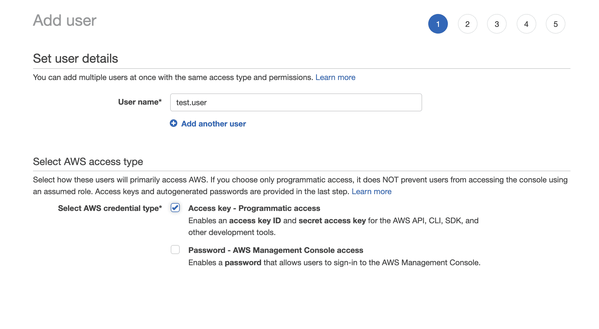
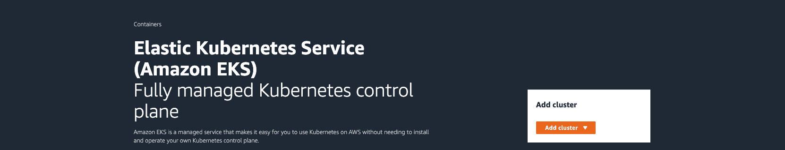
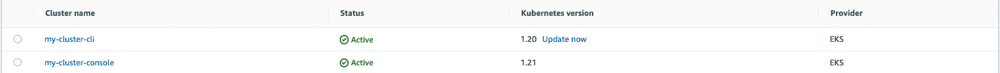

# 在 AWS - Octopus 部署中创建 EKS 集群

> 原文：<https://octopus.com/blog/eks-cluster-aws>

在本文中，您将学习如何在 Amazon Web Services (AWS)中建立一个弹性的 Kubernetes 服务(EKS)集群。

EKS 是一个托管容器服务，用于在云中或内部运行和扩展 Kubernetes。Kubernetes 提供了一种可扩展的分布式方法来管理工作负载。它通过容器化应用程序来做到这一点。容器确保了跨不同环境和云基础设施的可复制性。

您在本文中创建的集群将在我们的[持续集成系列](https://octopus.com/blog/tag/CI%20Series)的后续文章中使用，以设置 web 应用程序并作为工作流的一部分。我们将在相关帖子可用时添加链接:

## 先决条件

要跟进这篇文章，你需要:

在 EKS 有两种方式来建立集群:

*   命令行界面
*   控制台

在此之前，您需要设置一些访问密钥和用户帐户。

## 初步设置

在 AWS 中，您需要配置访问策略。这些策略决定了哪种用户可以访问群集。

通常，遵循最小特权原则是有用的。这意味着您为用户提供了执行其角色所需的最小权限集。这通过不向用户授予超出他们需要的权限来支持云基础架构的安全性。

按照以下步骤设置您的访问密钥和用户帐户:

*   进入 **AWS 控制台**，然后 **IAM** ，然后**用户**，然后**添加用户**
*   给用户一个名字，并勾选**访问键-编程访问**
*   点击**下一个**

[](#)

*   选择**直接附加现有策略**，然后**创建策略**

IAM 策略允许您从命令行创建 EKS 集群。[此策略中的操作是 eksctl](https://eksctl.io/usage/minimum-iam-policies/) 要求的最低策略。

*   点击下一个的**，并为策略命名**
*   点击**添加策略**

亚马逊然后向你展示**访问密钥 ID** 和**秘密访问密钥**。下载此文件供以后参考。

## 命令行界面

使用`aws login`登录 AWS 命令行。

运行`aws configure`。

请提前输入您的访问密钥 ID 和秘密访问密钥。将区域设置为`us-east-2`并接受默认值。

现在您可以创建您的集群了。

```
eksctl create cluster \
--name my-cluster \
--region us-east-2 \
--fargate 
```

AWS Fargate 允许您运行容器，而无需管理服务器或 Amazon EC2 实例集群。这个概要文件提供了一个简单的方法来启动一个测试集群。测试集群配置:

```
kubectl get svc 
```

**输出**

```
NAME         TYPE        CLUSTER-IP   EXTERNAL-IP   PORT(S)   AGE
kubernetes   ClusterIP   10.100.0.1   <none>        443/TCP   25h 
```

运行以下命令查看集群节点:

```
kubectl get nodes -o wide 
```

**输出**

```
NAME                                                    STATUS   ROLES    AGE   VERSION              INTERNAL-IP       EXTERNAL-IP   OS-IMAGE         KERNEL-VERSION                  CONTAINER-RUNTIME
fargate-ip-192-168-129-76.us-east-2.compute.internal    Ready    <none>   25h   v1.20.7-eks-135321   192.168.129.76    <none>        Amazon Linux 2   4.14.243-185.433.amzn2.x86_64   containerd://1.4.6
fargate-ip-192-168-165-146.us-east-2.compute.internal   Ready    <none>   25h   v1.20.7-eks-135321   192.168.165.146   <none>        Amazon Linux 2   4.14.243-185.433.amzn2.x86_64   containerd://1.4.6 
```

查看集群上运行的工作负载:

```
kubectl get pods --all-namespaces -o wide 
```

**输出**

```
NAMESPACE     NAME                       READY   STATUS    RESTARTS   AGE   IP                NODE                                                    NOMINATED NODE   READINESS GATES
kube-system   coredns-85f9f6cd8b-2n8wr   1/1     Running   0          25h   192.168.129.76    fargate-ip-192-168-129-76.us-east-2.compute.internal    <none>           <none>
kube-system   coredns-85f9f6cd8b-c4jfk   1/1     Running   0          25h   192.168.165.146   fargate-ip-192-168-165-146.us-east-2.compute.internal   <none>           <none> 
```

## 控制台界面

您也可以从 AWS 控制台创建集群。

转到 **EKS** ，然后**添加集群**，然后**创建**。

[](#)

*   **名称**:为您的集群命名
*   **Kubernetes 版本**:选择最新的 Kubernetes 版本
*   集群服务角色:重用从 CLI 集群创建的服务角色

接受所有其他默认设置来创建集群。

## 检查集群

通过转到 **EKS** ，然后转到**集群**，检查您的两个集群的状态。

[](#)

既然您的集群是活动的，那么您可以对它们执行操作，比如部署应用程序或配置资源。对于本例，我们将删除它们。

## 删除集群

您可以通过运行以下命令，使用 CLI 删除群集。用您的值替换分类名称和区域。

`eksctl delete cluster --name my-cluster --region us-east-2`

您可以使用控制台删除集群，方法是选择集群，单击**删除**，并键入要删除的集群的名称。

您只能按照创建资源的方式删除资源。这意味着通过 CLI 创建的群集只能通过 CLI 删除。通过控制台创建的集群只能通过控制台删除。

[T32](#)

## 结论

在本文中，您将在 AWS 中设置 IAM 权限。您使用 CLI 和控制台创建、检查和删除了 EKS 集群。

AWS 上的 EKS 允许您在云中提供 Kubernetes 服务来部署和扩展工作负载。

您创建的集群可用于设置 web 应用程序，并作为后续帖子中工作流的一部分。我们将在相关帖子可用时添加链接:

阅读我们的[持续集成系列](https://octopus.com/blog/tag/CI%20Series)的其余部分。

愉快的部署！