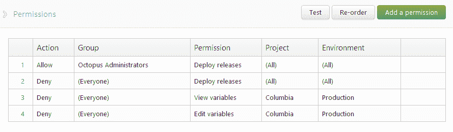
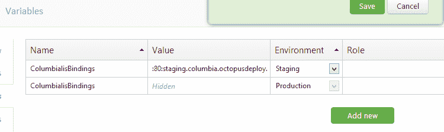

# 特定于环境的可变权限- Octopus 部署

> 原文：<https://octopus.com/blog/environment-specific-variable-permission>

今天我发布了另一个 Octopus Deploy 更新，主要包含了继 [1.1 发布](http://octopusdeploy.com/blog/1.1)之后的小错误修复。然而，这个版本还包含了一个新的小特性——在环境级别控制可变的查看/编辑权限的能力。

例如，在下面的截图中，我已经**拒绝了**对哥伦比亚项目生产环境的变量查看/编辑权限:

现在，当有人试图查看或编辑该项目的变量时，他们会发现无法看到生产值:

编辑时,“生产”环境在“环境”下拉列表中不可用，并且他们不能对生产环境中已经存在的变量进行更改。

通常，您将为一个组(可能是“devops”)设置该权限，该组被允许查看/编辑生产变量，而拒绝其他任何人。

希望这一特性可以更容易地管理 Octopus 中的生产设置和密码，而不会让整个组织看到它们。