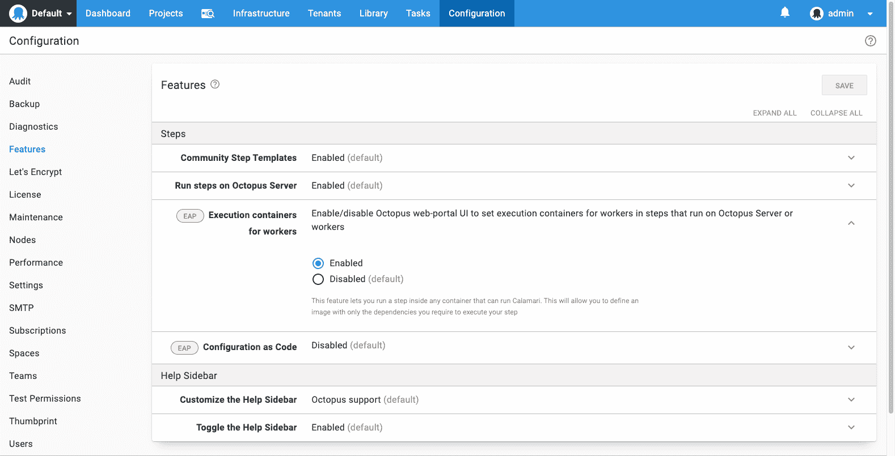

# 工人的执行容器- Octopus 部署

> 原文：<https://octopus.com/blog/execution-containers>

现代部署依赖于工具。比如 AWS、Azure、Google 命令行、Terraform、kubectl、Helm、Java、NodeJS、。网，等等等等，*等等*。

章鱼在历史上对这些采取了不一致的方法。有些与 Octopus 服务器捆绑在一起，并被推送到部署目标(在 Windows 上)。例如 Azure CLI、AWS CLI 和 Terraform。在其他情况下，Octopus 假设依赖项已经预先安装在目标上，例如 kubectl、Helm、Java。

这两种方法都不是完美的。

捆绑的依赖关系有许多缺点。它们总是过时的，用户经常需要最新版本的工具，但它们不能独立于 Octopus 服务器进行更新。没有办法固定捆绑的依赖项的版本，因此如果工具的发布者引入了突破性的更改，我们会发现自己无法在不潜在地导致用户部署过程失败的情况下更新它们(这是 Terraform 当前的一个问题)。

当然，通过*而不是*捆绑依赖关系，我们将痛苦推给了我们的用户。如果你必须安装几十个依赖项，那么让一台新机器旋转起来作为 Octopus Worker 是一件苦差事。并且管理各种项目的部署过程和工人之间的关系并不明显。

幸运的是，有一种技术非常适合这个场景:*容器*。

容器允许[捆绑依赖](https://twitter.com/b0rk/status/1237464479811633154)，并且(这是神奇的一点)在容器内执行命令。

CI 工具集中使用容器作为构建软件的执行环境并不是巧合。同样的能力也可以用于部署。

Octopus 2020.2 引入了在容器内[运行部署动作的能力:](https://octopus.com/docs/deployment-process/execution-containers-for-workers)

这将可用于在 Worker 上执行的任何步骤(或者在 Octopus 服务器上，对于自托管实例)。

通常情况下，Octopus 服务器通过触手服务将 [Calamari](https://octopus.com/docs/octopus-rest-api/calamari) 可执行文件发送给工人，在工人机器上直接运行。

当一个步骤被配置为使用执行容器时，Octopus 服务器仍然会发送 Calamari，但是它不是直接在工作机上运行，而是在指定的容器内执行(使用 [docker exec](https://docs.docker.com/engine/reference/commandline/exec/) )。

您可以使用任何 Docker 映像，但为了帮助提供一个愉快的路径，我们已经将一些映像发布到 Docker hub([octopus deploy/worker-tools](https://hub.docker.com/r/octopusdeploy/worker-tools))上的存储库中，其中包含许多最常用的[部署工具](https://github.com/OctopusDeploy/WorkerTools/blob/master/ubuntu.18.04/Dockerfile)，我们将定期发布包含工具的最新版本的更新。如果您的部署过程需要不在`octopusdeploy/worker-tools`映像中的工具，或者您喜欢较小的映像，那么您可以使用另一个映像，甚至构建您自己的映像。

值得注意的是，当您将部署操作配置为在容器内部执行时，指定的映像会被以不同于正在部署的包的方式处理。动作图像是在部署过程中完全指定的(包括标签)，不像已部署的包在创建发布时选择它们的版本。这很重要，因为它允许部署过程的维护者控制映像的更新时间，并且任何创建项目发布的人都不需要这些映像的任何知识。

由于 Octopus 继续支持部署多种类型的应用程序(。NET，Java，NodeJS 等。)到很多云(自托管、AWS、Azure 等)的很多平台(Windows、Linux、PaaS)。)，我们希望这将成为驯服部署工具依赖的有力武器。

在 Octopus 2020.2 中，执行容器作为早期访问预览版提供。章鱼云动态工作器目前不支持该功能；在不久的将来，我们将增加对此的支持。

愉快的(集装箱化)部署！