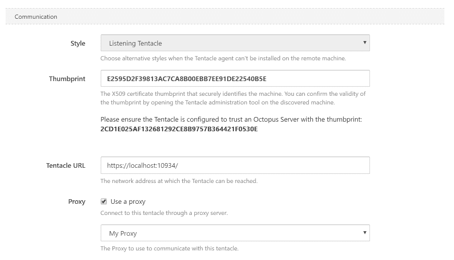
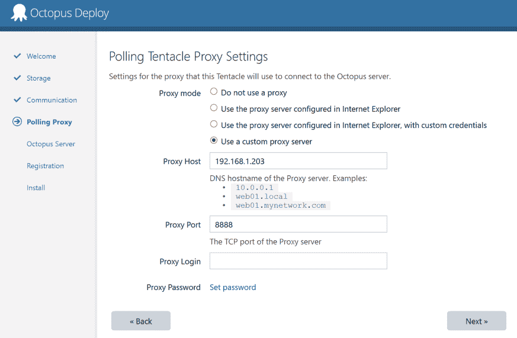

# 扩展代理支持- Octopus 部署

> 原文：<https://octopus.com/blog/expanding-proxy-support>

这篇文章是我们 Octopus 3.4 博客系列的一部分。在我们的[博客](https://octopus.com/blog/octopus34-blog-series-kickoff)或我们的[推特](https://twitter.com/OctopusDeploy)上关注它。

**Octopus Deploy 3.4 已经发货！阅读[博文](https://octopus.com/blog/octopus-deploy-3.4)和[今天就下载](https://octopus.com/downloads)！**

* * *

# 当前状态

在 3.4 版本之前，Octopus 中的代理支持仅限于您的 Octopus 服务器或需要与其他服务器通信的触手。它仅限于在部署期间，如果您的触手需要在 Powershell 脚本中发出 web 请求，或者在 Azure 部署期间，当 Octopus 服务器连接到 Azure 时。Octopus 服务器和 Tentacles 之间的通信通过我们的通信库 [Halibut](https://github.com/OctopusDeploy/Halibut) 进行，它不知道代理。

 *八达通中代理支持的当前状态*

这是因为 Octopus 依赖于。NET 的`System.Net.WebRequest`，但是大比目鱼在`TcpClient`级别工作。

# 扩展代理支持

在 3.4 中，我们已经教会了比目鱼如何游过代理。这意味着您现在可以让轮询触角通过代理轮询服务器，让 Octopus 服务器通过代理连接到侦听触角。如果您的网络需要，您甚至可以为不同的触角使用不同的代理服务器。

这将结束我们的用户需要乞求他们的公司 IT 部门只为八达通提供防火墙津贴。(在轮询是解决方法的某些情况下，它还允许使用监听触角。)

*3.4 即将到来——代理无处不在！*

# 设置它

让我们快速浏览一下，在配置监听触手时，如何配置 Octopus 来使用代理。首先，您需要在 Octopus 的配置部分设置代理详细信息:

然后，您可以在触手的通信设置区域中通过这个代理告诉 Octopus 与侦听触手进行通信:

就是这样！现在，章鱼服务器和你的触手之间的所有通信都将通过这个代理。轮询触角有一点不同，因为轮询触角发起所有通信，我们需要在触角端设置代理。当您安装轮询触手时，您现在可以选择设置一个代理，触手将使用它进行轮询(它也将用于触手在设置期间进行的注册调用):

所以你有它。更多的代理支持比你可以摇一棒。如果这是你认为对你的 Octopus 使用有用的东西，为什么不下载 3.4 测试版并试用一下，或者更多信息，请参见 Octopus proxy [支持页面](https://octopus.com/support)。