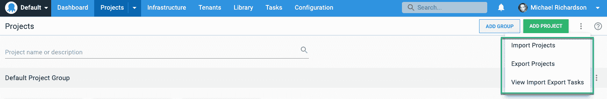
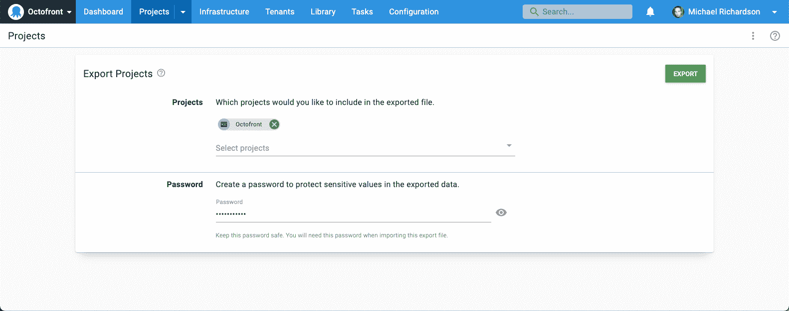
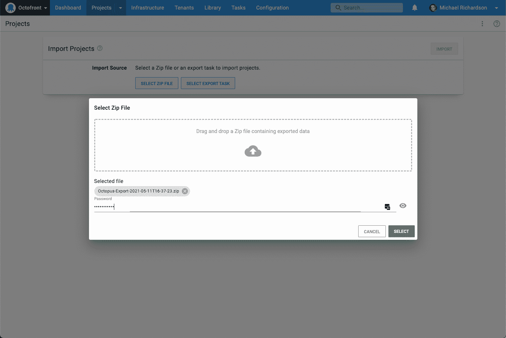

# 在空间之间导出和导入项目- Octopus 部署

> 原文：<https://octopus.com/blog/exporting-projects>

2021 Q2 Octopus Deploy 版本包括一个新功能，使项目可以导出，然后导入到另一个空间，让您可以更多地控制如何组织您的 Octopus 实例。这也允许您轻松地将内部部署的 Octopus 项目迁移到 Octopus Cloud。

在开发过程中，我们称之为项目便当，因为目标是为你的章鱼项目提供一个可移植的容器。

## 空间和章鱼云

Octopus 2019.1 引入了 [Spaces](https://octopus.com/docs/administration/spaces) ，一种对你的 Octopus 服务器进行分区的方式。

我们没有包括在空间之间移动项目的功能，因为这个功能的设计和构建很复杂。对此的需求一直很强烈，反馈是，如果无法将现有项目划分为新的空间，空间的价值就会降低。

我们的客户解决方案团队通过 [Space Cloner](https://github.com/OctopusDeployLabs/SpaceCloner) 项目填补了这一空白，这是一个 PowerShell 脚本集合，用于帮助在空间之间进行复制。这在很多情况下都是有用的，但是也有局限性，因为它是通过 HTTP API 操作的，而不是现成的。

快进两年，人们还希望将项目从自托管的 Octopus 实例迁移到 [Octopus Cloud](https://octopus.com/docs/octopus-cloud) 。

2021 年 Q2 发布版引入了导出和导入项目的能力，这是一个完全受支持的内置特性。

## 导出项目

您可以选择一个或多个项目进行导出，并且您需要提供一个密码来加密导出的数据，因为导出将包含敏感变量。

导出作为任务运行，并生成一个可以下载的 zip 文件。

## 导入项目

然后可以将 zip 文件导入到同一台 Octopus 服务器上的另一个空间、另一台服务器上，甚至是 Octopus 云实例上。

与导出类似，导入作为任务运行(大型导出可能需要一些时间)。

选定的项目及其所需的一切都包括在内:

*   环境
*   房客
*   可变集合
*   步骤模板
*   帐目
*   证书

注意*不包括*的内容也很重要:

*   [部署目标](https://octopus.com/docs/projects/export-import#deployment-targets)。这些将需要在目标空间中重新配置，因为需要显式配置 Tentacles 来信任另一个 Octopus 服务器。
*   [包](https://octopus.com/docs/projects/export-import#packages)。自托管项目拥有数百千兆字节的包是很常见的。将这些包含在出口 zip 中是不切实际的。在许多情况下，不需要旧的包，构建服务器可以简单地指向新的 Octopus 服务器。对于需要包的情况，我们提供了一个[示例脚本](https://github.com/OctopusDeploy/OctopusDeploy-Api/blob/master/REST/PowerShell/Feeds/SyncPackages.ps1)来演示通过 Octopus API 同步包。

## 何时使用项目导出/导入功能

项目导出/导入特性的第一次迭代主要是为项目的一次性导入/导出而设计的。这在下列情况下很有用:

*   将项目从自托管实例移动到 Octopus Cloud。
*   在同一实例的两个空间之间移动项目，例如将一个空间拆分为多个空间时。

这个迭代*没有*解决在空间之间重复移动项目的问题，例如测试升级或者将项目升级到一个安全的、隔离的 Octopus 实例。

这些场景在细微但重要的方面有所不同，通常需要不同的变量值、生命周期、租户等。，在实例之间进行维护。我们已经用这个特性为支持这些场景打下了基础，并希望在未来的版本中也能这样做。同时，[迁移器实用程序](https://octopus.com/docs/octopus-rest-api/octopus.migrator.exe-command-line)仍然是一个有效的选项。

## 结论

项目导出/导入功能现在在 Octopus Cloud 实例中可用，并且是可从[下载页面](https://octopus.com/downloads)获得的 2021.1 版本的一部分。

该功能目前是一个早期版本，我们非常希望听到您的反馈。我们希望这能让项目从自托管迁移到 Octopus Cloud 变得简单而顺利。

## 观看网络研讨会

[https://www.youtube.com/embed/Dm4vOwuo9GI](https://www.youtube.com/embed/Dm4vOwuo9GI)

VIDEO

我们定期举办网络研讨会。请参见[网络研讨会第](https://octopus.com/events)页，了解过去的网络研讨会和即将举办的网络研讨会的详细信息。

愉快的部署！