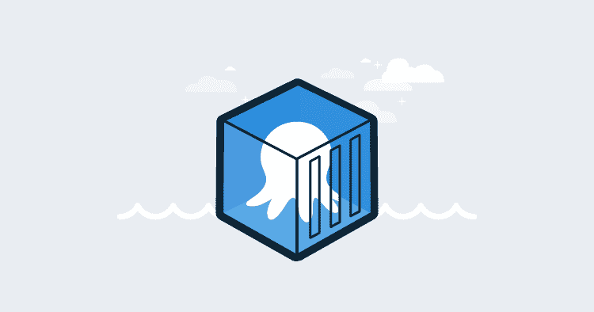
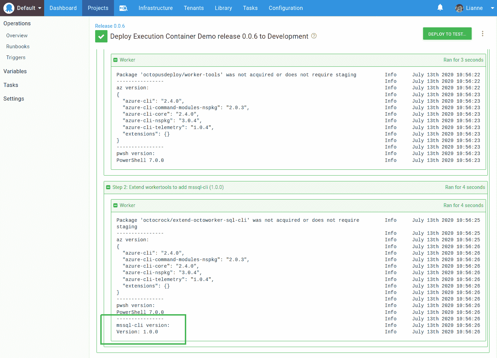
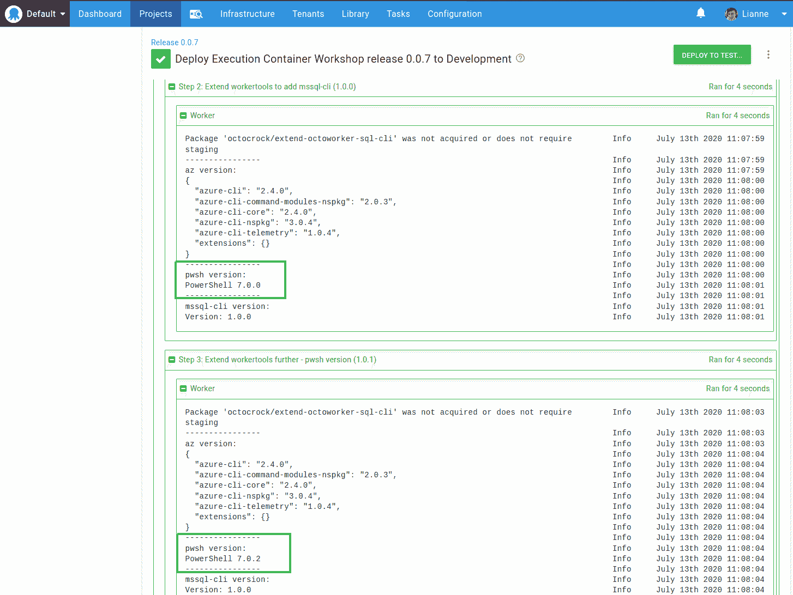
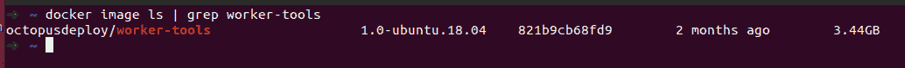
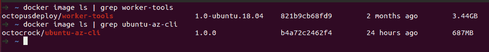
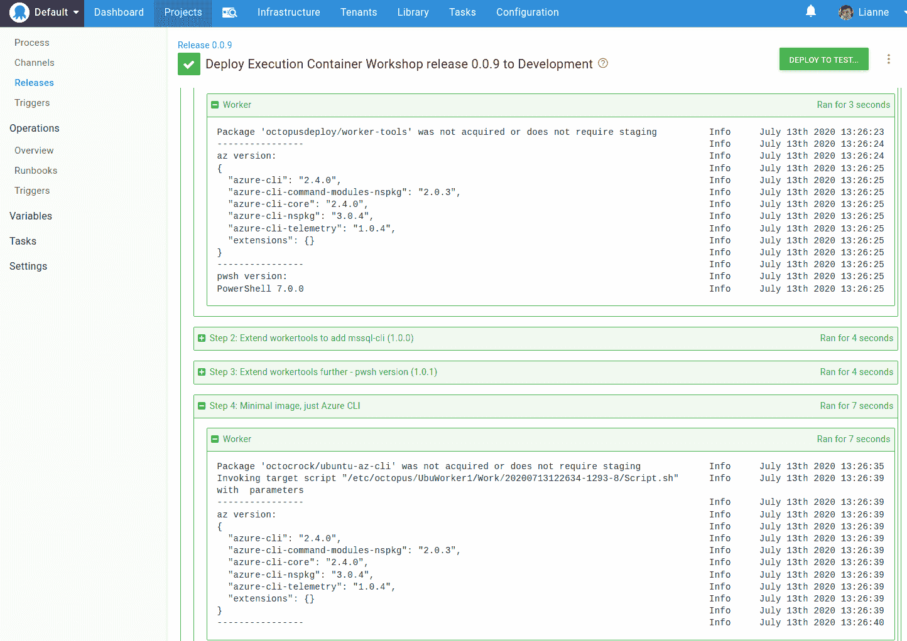

# 工人的执行容器:扩展 Octopus 工人-工具 Docker 映像- Octopus 部署

> 原文：<https://octopus.com/blog/extending-octopus-execution-container>

[](#)

我们最近为工人发布了[执行容器，我们认为有很多理由使用这个新功能。如果你不熟悉执行容器，Michael 在上面链接的文章中做了很好的介绍，你也可以看看](https://octopus.com/blog/execution-containers)[的执行容器文档](https://g.octopushq.com/ExecutionContainersForWorkers)。

在这篇文章中，我将看看如何扩展 Octopus worker-tool 图像，以及何时需要使用完全不同的图像。

Octopus 提供了一个 [Docker 映像](https://hub.docker.com/r/octopusdeploy/worker-tools)，它可以用作部署流程或 runbook 中某个步骤的[执行容器](https://g.octopushq.com/ExecutionContainersForWorkers)。该映像已经包含了部署所需的大部分工具。但是，如果您需要一个没有包含在映像中的工具，或者您需要包含在映像中的某个工具的不同版本，该怎么办呢？

让我们看一个例子，除了 Octopus 提供的 Docker 图像之外，我们还需要一些东西。假设我有一个需要与 SQL Server 数据库交互的项目步骤，在`worker-tool`映像中没有包含 SQL 工具。我想使用 [mssql-cli](https://github.com/dbcli/mssql-cli/) 。这是 Docker 的伟大之处之一；我们可以获取`octopusdeploy/worker-tools`图像并扩展它以包含附加工具。

这是我们的文档:

```
FROM octopusdeploy/worker-tools:1.0-ubuntu.18.04

ARG DEBIAN_FRONTEND=noninteractive

RUN  echo "deb [arch=amd64] https://packages.microsoft.com/debian/8/prod jessie main" | tee /etc/apt/sources.list.d/mssql-cli.list  && \
  apt-get -y update  && \
  apt-get -y install mssql-cli  && \
  # Install missing dependencies
  apt-get -y install -f 
```

这个文件基于带有标签`1.0-ubuntu.18.04`的镜像`octopusdeploy/worker-tools`，在包管理器`apt-get -y update`更新后，它安装带有`apt-get -y install mssql-cli`的`mssql-cli`

在写出版本的基本 Octopus 步骤中使用它，我们可以看到`mssql-cli`在那里并且可用:

[](#)

通过扩展`octopusdeploy/worker-tools`图像并添加几行代码，我们可以使用基础图像*中所有可用的工具，并且*拥有我们想要的额外工具。

### 选择特定版本的 PowerShell

Dockerfile 文件中指定的软件版本在构建时是固定的；当您使用 Docker 图像时，您不能更改它们。假设您需要一个更高版本的 PowerShell，因为需要修复一个对您的部署过程至关重要的错误。有几种方法可以实现这一点。

首先是将版本更新添加到我们的扩展 docker 文件中:

```
FROM octopusdeploy/worker-tools:1.0-ubuntu.18.04

ARG DEBIAN_FRONTEND=noninteractive
ARG Powershell_Version=7.0.2\*    # UPDATED Powershell Version

RUN  echo "deb [arch=amd64] https://packages.microsoft.com/debian/8/prod jessie main" | tee /etc/apt/sources.list.d/mssql-cli.list  && \
  apt-get -y update  && \
  apt-get -y install mssql-cli  && \
  # Install specific version of Powershell
  apt-get install -y powershell=${Powershell_Version} && \
  # Install missing dependencies
  apt-get -y install -f 
```

我已经将它添加到我的[octo crock/extend-octo worker-SQL-CLI](https://hub.docker.com/repository/docker/octocrock/extend-octoworker-sql-cli/general)docker file 中，并在推送到 Dockerhub 之前用新版本 1.0.1 标记了编译后的映像。现在图像有两个标记版本:

*   `1.0.0`:这是通过添加`mssql-cli`来扩展`octopusdeploy/worker-tools`图像的第一个版本。
*   `1.0.1`:该版本进一步扩展了镜像，设置了不同版本的 PowerShell。

通过使用标记为 1.0.1 的图像，我们可以看到不同版本的 PowerShell:

[](#)

指定不同版本的另一种方法是从 [Octopus Worker Tools Github 库](https://github.com/OctopusDeploy/WorkerTools)中获取 [Dockerfile](https://github.com/OctopusDeploy/WorkerTools/blob/master/ubuntu.18.04/Dockerfile) 并使用它来创建您自己的 Dockerfile，将版本号`ARG`值设置为最适合您的部署过程的值:

```
FROM ubuntu:18.04

ARG Powershell_Version=7.0.2\*      # UPDATED Powershell Version
ARG Octopus_Cli_Version=7.3.2
ARG Octopus_Client_Version=8.4.0
ARG Azure_Cli_Version=2.4.0\*
ARG Azure_Powershell_Version=2.2.0
ARG Helm_Version=v3.0.2
ARG Node_Version=12.16.3\*
ARG Kubectl_Version=1.11.1-00
ARG Terraform_Version=0.12.24
ARG Eks_Cli_Version=0.18.0
ARG Ecs_Cli_Version=1.18.1
ARG Aws_Iam_Authenticator_Version=1.16.8
ARG Umoci_Version=0.4.5
... 
```

这样，您只需安装一次 PowerShell，并且不会增加映像的体积，如果您想要指定其他工具的不同版本，这一点尤其正确。

## 尺寸考虑

Octopus 映像涵盖了许多部署场景，作为执行容器的起始映像，它是一个不错的选择。让我们来看看它的大小:

[](#)

很大，3.44 GB。这就是 Linux 的风格；Windows 图像更大，但是与某些图像相比，它并不是那么大，并且当您考虑到您不太可能在该图像上使用所有工具时，显然可以节省空间。

在撰写本文时，`octopusdeploy/worker-tools`图像上的内容如下:

*   18.04 版的 PowerShell
*   Octopus CLI
*   八达通客户端
*   AZ PowerShell 核心模块
*   Helm3
*   。NET SDK 3.1
*   JDK
*   常见 Java 工具
*   Azure CLI
*   NodeJS
*   库贝特尔
*   将（行星）地球化（以适合人类居住）
*   谷歌云 CLI
*   python & groff
*   AWS CLI
*   EKS CLI
*   ECS CLI
*   AWS IAM 验证器
*   Istio CLI
*   Linkerd CLI
*   不使用 Docker 守护程序处理 Docker 映像的工具
*   编写脚本的常用实用程序

这太棒了！

您可以使用所有这些工具，而不必知道 Docker 文件是如何构造的，没有必要建立自己的 Docker 存储库，也没有必要在 Worker VM 上安装所有这些依赖项，您可以直接开始使用执行容器。

然而，我还没有看到一个单独的 Octopus 部署步骤与 AWS、GCP 和 Azure 的基础设施进行交互。Net、Java 和 NodeJS 软件。我在这里开玩笑，但是我你能明白我的观点，你不太可能同时需要这张图片上的所有东西。

### 为什么 Docker 图像大小是一个考虑因素？

在工作机从存储库中下载了容器映像之后，每当 Octopus 部署流程步骤需要它时，它就可以重用它；它不会重新下载它。当有一个新版本的图像，只有新的[层](https://docs.docker.com/storage/storagedriver/#images-and-layers)被下载，而不是整个图像。

当您开始使用多个工作器，尤其是动态工作器时，容器映像大小真正变得引人注目。如果为部署步骤获取了一台工作机，而该机器还没有从存储库中提取 Docker 映像，则映像越大，执行该步骤所需的时间就越长。

在撰写本文时，章鱼云动态工作人员没有安装 Docker。我们正在努力将 Docker 添加到动态机器映像中，所以它将很快可用！

### 把它剥开

让我们把事情往另一个方向发展。如果我有一个运行 Azure CLI bash 脚本的部署步骤会怎样？

这里的 Linux 容器所需的工具很少，基本上只有 Ubuntu 库和 Azure CLI。我还需要`wget`、`apt-utils`和`software-properties-common`，安装 [Azure CLI](https://docs.microsoft.com/en-us/cli/azure/install-azure-cli-apt?view=azure-cli-latest) 所需的基本实用程序。考虑到这一点，我可以将 docker 文件减少到很少几行:

```
FROM ubuntu:18.04

ARG DEBIAN_FRONTEND=noninteractive
ARG Azure_Cli_Version=2.4.0\*

# Install wget, apt-utils, and software-properties-common
RUN apt-get update && \ 
    apt-get install -y wget apt-utils && \
    apt-get install -y software-properties-common 

# Install the Azure CLI
RUN wget --quiet -O - https://packages.microsoft.com/keys/microsoft.asc | gpg --dearmor | tee /etc/apt/trusted.gpg.d/microsoft.asc.gpg > /dev/null && \
    echo "deb [arch=amd64] https://packages.microsoft.com/repos/azure-cli/ bionic main" | tee /etc/apt/sources.list.d/azure-cli.list && \
    apt-get update && \
    apt-get install -y azure-cli=${Azure_Cli_Version}

# Tidy up        
RUN apt-get clean 
```

大小的减少是显著的，新创建的`octocrock/minimumcli-az`映像比 worker-tools 映像小 80%,只有 687 MB。：

[](#)

使用这个容器，我们可以执行一个 Azure 脚本步骤，并从`az version`看到与使用`octopusdeploy/worker-tools`图像的步骤相同的结果:

[](#)

## 结论

这是我第一次看到 Octopus 中的执行容器功能，我不得不说，我可以看到它的好处。更重要的是，它取消了服务器软件的配置，意味着您可以通过一种版本控制的方式来指定部署软件的依赖关系。当然，您可以使用脚本通过您选择的包管理器来安装所需的软件，但是通过使用容器，您消除了软件安装冲突的风险，可以使用多个版本的工具，并且保持一个具有最低安装要求的工作人员。这有可能减少您需要的工作机数量，从而降低成本。

`octopusdeploy/worker-tools`映像意味着您可以立即开始，其中包含部署所需的大多数工具。除此之外，如果您使用自己的映像，您可以进一步增加部署流程的灵活性，并有可能减少部署时间。

愉快的部署！