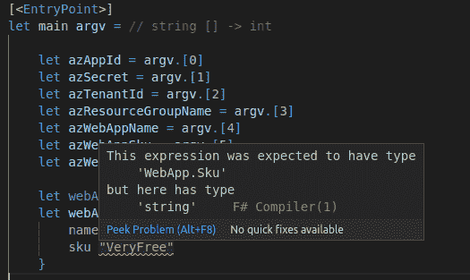
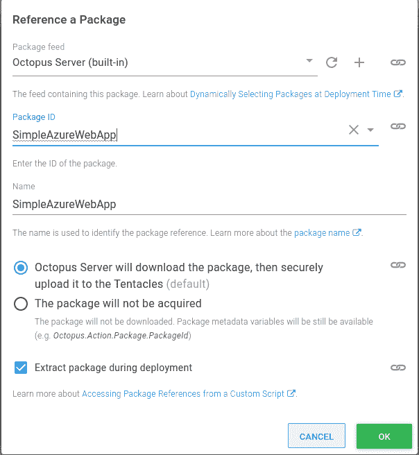
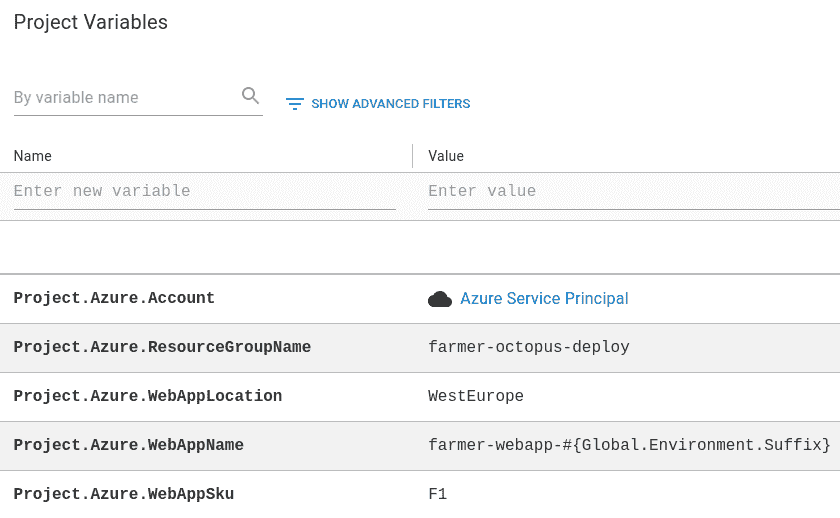
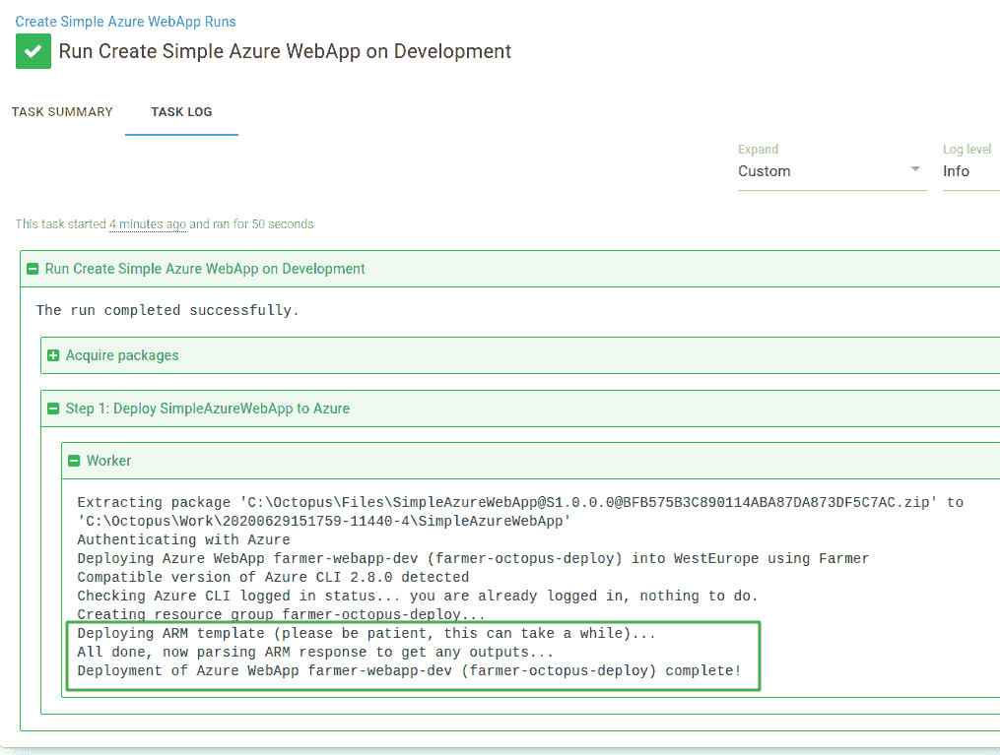
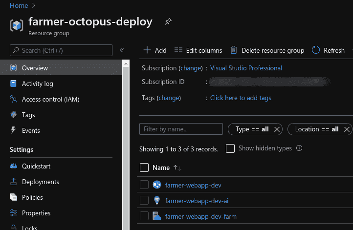

# 农民:用章鱼部署更简单的武器部署-章鱼部署

> 原文：<https://octopus.com/blog/farmer-and-octopus-deploy>

[](#)

与 Azure 合作了一年左右，很明显可以看出为什么 ARM 模板会受欢迎。它们提供了一个声明性的模型，只需点击一个按钮就可以生成整个环境。

然而，如果像我一样，你曾经试图创作一个 ARM 模板文件，你可能会遇到我最大的抱怨之一；它们依赖于字符串，容易出现人为错误。当我在一个模板中有一个打字错误时，没有编译器来帮助我(而且已经有很多了！).

自 2012 年以来，我一直将 C#作为我的主要开发语言，然而，从那以后，它的功能对等物 F#变得越来越受欢迎。正如我最近发现的，它有一些有用的特性可以帮助我摆脱 ARM 模板的困境。F#特别擅长的一个领域是它内置的类型安全。

在这篇文章中，我将通过使用 [Farmer](https://compositionalit.github.io/farmer/) 生成一个简单的 Azure WebApp ARM 模板来演示 F#中的类型安全，然后我将介绍如何通过 Octopus 使用它的部署功能将不同的 WebApp 直接部署到 Azure。

## 在这篇文章中

## 什么是农民？

农夫的作者[说](https://compositionalit.github.io/farmer/about/):

> Farmer 是一个开源软件，可以免费使用。NET 领域特定语言(DSL ),用于快速生成不复杂的 Azure 资源管理器(ARM)模板。

要使用 Farmer，您需要创建一个 [Farmer 模板](https://compositionalit.github.io/farmer/quickstarts/template/)。这些是。NET 核心应用程序通过一个 [NuGet 包](https://www.nuget.org/packages/Farmer/)引用 Farmer，它们定义你希望创建的 Azure 资源。

## 为什么需要农民？

与其重复已经存在的内容，我建议您阅读 Farmer 文档的第节的[部分，以获得更多关于为 ARM 模板创建 DSL 的动机的详细信息。](https://compositionalit.github.io/farmer/about/)

对我来说，亮点是:

*   它提供了一组可以用来创建 Azure 资源的类型，并且它消除了创建无效模板的机会，因为它们是强类型的。
*   它可以以非常简洁的方式生成简单的 ARM 模板，并可选地部署它们。

## 创建农民模板

要创建 Farmer 模板，我们首先需要创建一个. NET 核心应用程序。您可以在您选择的 IDE 中这样做，或者如果您喜欢命令行，您可以使用`dotnet new`命令，传递您需要的应用程序类型的模板。

农民模板通常使用控制台应用程序，您可以使用`dotnet new console`命令创建一个:

```
dotnet new console -lang "F#" -f "netcoreapp3.1" -n "SimpleAzureWebApp" 
```

这会创建一个新的 F#。名为 **SimpleAzureWebApp** 的 NET Core 3.1 应用程序，使用我们提供的`-n`参数。

接下来，我们需要通过运行`add package`命令将 Farmer 添加到项目中:

```
dotnet add package Farmer 
```

现在我们有了依赖项，我们可以继续编辑在我们创建新的控制台应用程序时自动生成的`Program.fs`文件。

**TL；博士**

如果你想看完整的程序，直接跳到[结尾](#complete-farmer-template)或者查看[源代码](https://github.com/OctopusSamples/farmertemplates/blob/main/src/SimpleAzureWebApp/Program.fs)。如果你想了解更多细节，请继续阅读！

### 模板参数

为了使 Farmer 模板更加灵活，我们将在应用程序中添加一些参数。这将允许我们提供不同的价值，Farmer 将基于这些价值在 Azure 中创建我们的资源。

我们需要的前三个与 Azure 认证相关。这些值可以通过创建一个 [Azure 服务主体](https://docs.microsoft.com/en-us/azure/active-directory/develop/app-objects-and-service-principals)来获得。

*   **AppID** :用于服务主体的应用标识符。
*   **Secret** :服务主体使用的密码。
*   **TenantID** :用于服务主体的 ClientID。

**安全凭证:**
将你用来登录 Azure 的凭证存储在一个安全的位置，比如密码管理器，或者你的 Octopus Deploy 实例，最好使用一个 [Azure 账户](https://octopus.com/docs/infrastructure/deployment-targets/azure#azure-service-principal)或者[敏感变量](https://octopus.com/docs/projects/variables/sensitive-variables)。您还应该避免将它们提交到源代码控制中。

为了运行该应用程序，我们还将提供:

*   **资源组名称**:Azure web app 要添加到哪个资源组。
*   **WebApp 名称**:赋予 Azure WebApp 的名称。
*   **web App SKU**:web App 使用什么类型的 [App 服务计划](https://azure.microsoft.com/en-us/pricing/details/app-service/)。
*   **WebApp 位置**:你想要托管 Azure WebApp 的数据中心位置。

要添加我们需要的参数，代码如下所示:

```
let azAppId = argv.[0]
let azSecret = argv.[1]
let azTenantId = argv.[2]
let azResourceGroupName = argv.[3]
let azWebAppName = argv.[4]
let azWebAppSku = argv.[5]
let azWebAppLocation = argv.[6] 
```

这将根据参数在命令行中的位置，分配程序运行时提供给程序的参数集合中的参数。

**参数验证:**
在这个例子中我没有显示参数验证，但是您可能想要考虑将它添加到您的 Farmer 模板中，以确保它们具有可接受的值。

### 定义 Azure 资源

有了参数值后，我们可以用 F#定义我们的 Azure WebApp:

```
let webAppSku = WebApp.Sku.FromString(azWebAppSku)
let webApp = webApp {
    name azWebAppName
    sku webAppSku
} 
```

这里我们将 WebApp SKU 赋给一个名为`webAppSku`的变量。这是由一个助手函数完成的，它返回一个强类型的`Sku`。然后我们使用 Farmer [Web App builder](https://compositionalit.github.io/farmer/api-overview/resources/web-app/) 创建我们的`webApp`变量。

接下来，我们使用 Farmer ARM deployment builder 创建我们的 ARM 部署，在本例中，它由要部署到的位置和前面定义的 Azure WebApp 组成:

```
let deployLocation = Location.FromString(azWebAppLocation)
let deployment = arm {
    location deployLocation
    add_resource webApp
} 
```

#### 内置型安全

在前面的两个代码示例中，F#类型系统发挥了自己的作用。不可能创建根据其类型无效的值。

让我们看一个例子。假设我想用一个值为`VeryFree`的`Sku`来创建我们的 Azure WebApp。如果我试图在我们的应用程序中创建它，编译器会给我一个警告，它不会构建:

[](#)

这是因为编译器知道字符串值`VeryFree`是错误的类型，而应该是`Sku`类型。

这就是法默真正擅长手工制作手臂模板的地方。它使用 F#为您提供了类型安全，以确保您从一开始就拥有有效的模板。

**农夫和手臂:**
农夫和手臂模板[这里有更详细的对比](https://compositionalit.github.io/farmer/arm-vs-farmer/)。

### 生成手臂模板

当你对 Azure 资源建模后，Farmer 支持不同的方式来生成 ARM 模板。一种方法是将它直接写到文件中:

```
deployment |> Writer.quickWrite "output" 
```

然后，您可以使用您喜欢的方法将这个文件部署到 Azure。

### 部署到 Azure

除了生成 ARM 模板，您还可以选择让 Farmer 在应用程序运行时执行到 Azure 的部署。

**需要 Azure CLI**

如果您使用集成部署到 Azure 功能，您将需要在运行应用程序的计算机上安装 Azure CLI。

在我们的示例 **SimpleAzureWebApp** 应用程序中，我们将利用这个特性。

在执行部署之前，我们需要通过 Azure 进行身份验证。Farmer 附带了一个`Deploy.authenticate`命令，您可以通过传递之前提供给应用程序的凭证来调用它，如下所示:

```
Deploy.authenticate azAppId azSecret azTenantId
|> ignore 
```

当 authenticate 调用完成时，它返回与服务主体相关联的 Azure 订阅列表。在本例中，这些结果通过管道传递给`ignore`函数。

如果使用 Azure 进行身份验证时出现任何错误，将会引发一个错误。如果登录成功，我们需要使用`Deploy.execute`命令让 Farmer 执行我们的部署:

```
deployment
|> Deploy.execute azResourceGroupName Deploy.NoParameters
|> ignore 
```

您可以查询 ARM 部署的结果，但是与 authenticate 调用一样，我们忽略它们。类似地，部署中的任何错误都将作为异常出现。

### 完整的农民模板

这就是我们应用程序的全部内容。下面是完成的`Program.fs`文件:

```
open Farmer
open Farmer.Builders
open SimpleAzureWebApp.SkuExtension

[<EntryPoint>]
let main argv =

    let azAppId = argv.[0]
    let azSecret = argv.[1]
    let azTenantId = argv.[2]
    let azResourceGroupName = argv.[3]
    let azWebAppName = argv.[4]
    let azWebAppSku = argv.[5]
    let azWebAppLocation = argv.[6]

    let webAppSku = WebApp.Sku.FromString(azWebAppSku)
    let webApp = webApp {
        name azWebAppName
        sku webAppSku
    }

    let deployLocation = Location.FromString(azWebAppLocation)
    let deployment = arm {
        location deployLocation
        add_resource webApp
    }

    printf "Authenticating with Azure\n"
    Deploy.authenticate azAppId azSecret azTenantId
    |> ignore

    printf "Deploying Azure WebApp %s (%s) into %s using Farmer\n" azWebAppName azResourceGroupName azWebAppLocation

    deployment
    |> Deploy.execute azResourceGroupName Deploy.NoParameters
    |> ignore

    printf "Deployment of Azure WebApp %s (%s) complete!\n" azWebAppName azResourceGroupName

    0 // return an integer exit code 
```

## 打包农民模板

现在我们已经写好了应用程序，下一步是打包它以供 Octopus 使用。为了简单起见，我使用命令行工具来构建和打包应用程序，但是我建议将其作为完整 CI/CD 管道的一部分来自动化。

如果你是建筑新手。NET 核心应用程序，我们有许多[指南](https://octopus.com/docs/guides?application=ASP.NET%20Core)，其中包括使用各种工具设置 CI/CD 管道的分步说明。

为了构建 **SimpleAzureWebApp** 应用程序，我们在应用程序目录中运行一个`dotnet publish`命令:

```
dotnet publish -o output 
```

这将构建并发布控制台应用程序，并将二进制文件放在`output`文件夹中，这是通过使用`-o`参数指定的。

接下来，我们需要打包应用程序，这次我们使用 Octopus CLI [pack](https://octopus.com/docs/octopus-rest-api/octopus-cli/pack) 命令:

```
octo pack --id SimpleAzureWebApp --format Zip --version 1.0.0.0 --basePath output 
```

这将生成一个名为`SimpleAzureWebApp.1.0.0.0.zip`的文件，该文件可以上传到 Octopus [内置存储库](https://octopus.com/docs/packaging-applications/package-repositories/built-in-repository)或外部[包存储库](https://octopus.com/docs/packaging-applications/package-repositories)。

您可以使用 Octopus CLI 命令推送到 Octopus 内置存储库，[推送](https://octopus.com/docs/octopus-rest-api/octopus-cli/push):

```
octo push --package SimpleAzureWebApp.1.0.0.0.zip --server https://my.octopus.url --apiKey API-XXXXXXXXXXXXXXXX 
```

上传完包后，我们可以设置 Octopus 来运行我们的应用程序以部署到 Azure。

## 部署农民模板

Octopus 很酷的一点是你可以选择如何部署。随着去年[运营手册](https://octopus.com/docs/operations-runbooks)的推出，这种灵活性进一步扩展到了运营任务，例如管理您的基础设施。

### 创建操作手册

为了执行我们的 Farmer 模板，我们将创建一个 runbook，将它部署到 Azure。为此:

1.  在 Octopus 中创建新项目。
2.  从操作➜操作手册部分进入操作手册流程。
3.  点击**添加 RUNBOOK** 。
4.  从概述中，点击**定义您的 RUNBOOK 流程**。
5.  点击**添加步骤**。

在步骤选择中，选择[运行脚本](https://octopus.com/docs/deployment-examples/custom-scripts/run-a-script-step)步骤，并为其命名。通过使用脚本步骤，我们可以使用[引用包](https://octopus.com/docs/deployment-examples/custom-scripts/run-a-script-step#referencing-packages)特性将我们的包作为脚本执行的一部分。

为了包含我们的包，在**引用的包**部分，点击 **ADD** 并添加我们之前上传的 SimpleAzureWebApp 包:

[](#)

保留所有默认设置，点击**确定**。

#### 添加 runbook 脚本

接下来，我们需要添加内联脚本来执行我们的 Farmer 模板。我们首先添加所需的 Azure 凭据:

```
$appId = $OctopusParameters["Project.Azure.Account.Client"]
$secret = $OctopusParameters["Project.Azure.Account.Password"]
$tenantId = $OctopusParameters["Project.Azure.Account.TenantId"] 
```

该脚本从名为`Project.Azure.Account`的项目变量中引用了许多扩展的 [Azure 帐户变量属性](https://octopus.com/docs/projects/variables/azure-account-variables#azure-account-variable-properties)，如`Client`和`TenantId`。这很方便，因为我们不需要为每个属性指定单独的变量。

有了凭证后，我们想要指定 Azure WebApp 参数，包括将传递给 SimpleAzureWebApp 的资源组和 WebApp 名称。NET 核心应用程序:

```
$resourceGroupName = $OctopusParameters["Project.Azure.ResourceGroupName"]
$webAppName = $OctopusParameters["Project.Azure.WebAppName"]
$webAppSku = $OctopusParameters["Project.Azure.WebAppSku"]
$webAppLocation = $OctopusParameters["Project.Azure.WebAppLocation"] 
```

最后，我们使用名为`Octopus.Action.Package[SimpleAzureWebApp].ExtractedPath`的[包变量](https://octopus.com/docs/deployment-examples/custom-scripts/run-a-script-step#accessing-package-references-from-a-custom-script)获得提取的农民模板包的路径，然后将工作目录设置为该路径，并调用`dotnet run`命令传入我们的所有参数:

```
$farmerPackagePath = $OctopusParameters["Octopus.Action.Package[SimpleAzureWebApp].ExtractedPath"]
Set-Location $farmerPackagePath

dotnet SimpleAzureWebApp.dll $appId $secret $tenantId $resourceGroupName $webAppName $webAppSku $webAppLocation 
```

**。NET Core 运行时先决条件**

为了执行这个脚本步骤，它需要。NET Core runtime 安装在部署目标或 worker 上，该步骤配置为在其中执行。

#### 添加变量

我们还需要添加上面脚本中引用的变量:

【T2 

`Project.Azure.Account`变量是一个 [Azure 账户变量](https://octopus.com/docs/projects/variables/azure-account-variables)，其余都是文本变量。

### 运行运行手册

如果你已经做到了这一步，最后一部分是把所有的东西放在一起，在 Octopus 中运行我们的 runbook，并把 Farmer 模板部署到 Azure。

您可以看到一个运行到开发阶段的示例 runbook，它创建了名为`farmer-webapp-dev`的 Azure WebApp:

[](#)

runbook 运行完成后，您可以检查您的 WebApp 是否已使用 [Azure portal](https://portal.azure.com) 创建。下面是在 Azure 中创建的相应 WebApp，它是 runbook 运行到开发阶段的结果:

[](#)

## 结论

这种使用 Farmer 生成资源并将其部署到 Azure 的技术的优点在于，您可以对模板进行版本控制。定义基础设施的代码可以与运行在基础设施上的代码共存。另外，手动编辑 JSON 文件不再是一件麻烦的事情，谁不想要呢！

下次再见，愉快的部署！

## 了解更多信息