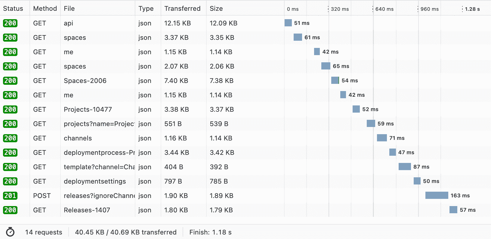
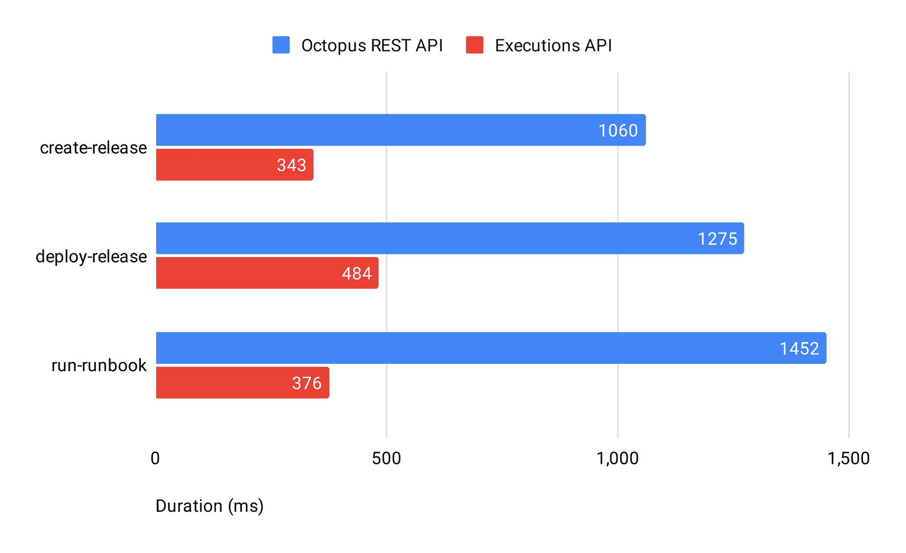

# 通过执行 API - Octopus Deploy 加快部署

> 原文：<https://octopus.com/blog/faster-deployments-with-the-executions-api>

Executions API 是一组新的端点，可以显著提高部署、版本创建和 runbook 执行等操作的性能。在对这些操作进行审查后，我们设计并添加了这些端点，作为 [Octopus 2022 Q3 版本](https://octopus.com/blog/octopus-release-2022-q3)的一部分。结果是这些操作的性能显著提高，部署时的可伸缩性更好。

在这篇文章中，我将深入探讨我们为什么创建 Executions API，以及它如何增强性能和开发人员体验。

## 使用 Octopus CLI 测量网络性能

今年早些时候，少数客户让我们知道了一个可以通过他们的部署来改善的问题。他们注意到构建环境和 Octopus REST API 之间有大量的网络流量。我们希望通过准确了解正在发生的事情来提高性能。

我们的调查从测量 Octopus CLI 生成的网络流量开始，以建立基线。Octopus CLI 广泛用于自动化场景，包括 Azure Pipelines、Buildkite、GitHub Actions、Jenkins 和 TeamCity。Octopus CLI 被用来创建和部署发行版，推送构建信息和软件包，以及运行操作手册。这些操作以 Octopus REST API 为目标来执行工作。

我们运行了一系列测试，涉及 3 个 Octopus CLI 操作:

*   `create-release`
*   `deploy-release`
*   `run-runbook`

我们跟踪了 Octopus CLI 和 Octopus REST API 之间发送的网络流量，并获得了它们的网络配置文件摘要:

| 操作 | 申请数量 | 持续时间 | 请求(正文) | 回应(正文) |
| --- | --- | --- | --- | --- |
| `create-release` | 17 | 1060 毫秒 | 8.1 kB | 96.4 kB |
| `deploy-release` | 18 | 1275 毫秒 | 8.7 kB | 105.6 kB |
| `run-runbook` | 14 | 1452 毫秒 | 6.9 kB | 90 kB |

17 HTTP 请求支持像`create-release`这样的命令确实是一个非常闲聊的话题！对 Octopus CLI 中的`create-release`命令的检查显示，针对 Octopus REST API 发出了以下 HTTP 请求:

```
 1  200  CONNECT  /   
 2  200  GET      /api
 3  200  GET      /api
 4  200  GET      /api
 5  200  GET      /api/spaces
 6  200  GET      /api
 7  200  GET      /api/users/me
 8  200  GET      /api/users/{id}/spaces
 9  200  GET      /api/{id}
10  200  GET      /api/users/me
11  200  GET      /api/{id}/projects/projects?name={name}
12  200  GET      /api/{id}/projects/projects/{id}/channels
13  200  GET      /api/{id}/deploymentprocesses/{id}
14  200  GET      /api/{id}/projects/{id}/deploymentprocesses/template?channel={id}
15  200  GET      /api/{id}/projects/{id}/deploymentsettings
16  201  POST     /api/{id}/releases?{ignore-channel-rules}
17  200  GET      /api/{id}/releases/{id} 
```

第 16 行的 HTTP POST 是负责创建发布的 HTTP 请求。之前的大多数 HTTP 请求都内置在 Octopus CLI 中，以限定资源标识符(例如，项目的 ID 是什么，“octopes”？).这也代表了一条快乐的道路；如果遇到异常和/或错误并需要解决，则可能涉及更多网络流量。更糟糕的是，这些 HTTP 请求是按顺序发出的:

[](#)

这些操作在 Octopus REST API 中强制执行数据检查和决策树。如果一个发布涉及不同的包版本，这种情况会变得更糟，因为这可能会执行额外的服务操作。所有这些网络流量导致了更多的负载，损害了我们的可伸缩性。

我们需要一个更好的解决方案。我们在 2022 年第二季度开始工作，建立一组新的服务端点，统称为执行 API。这些 API 极大地减少了 Octopus REST API 和诸如 Octopus CLI 之类的 API 客户端之间发送的网络流量。

## 执行 API 简介

执行 API 由以下操作和路线组成:

| 操作 | 途径 |
| --- | --- |
| `create-release` | `/api/{space-id}/releases/create/v1` |
| `run-runbook` | `/api/{space-id}/runbook-runs/create/v1` |
| `tenanted-deployment` | `/api/{space-id}/deployments/create/tenanted/v1` |
| `untenanted-deployment` | `/api/{space-id}/deployments/create/untenanted/v1` |

这些 API 包含了 Octopus CLI 执行的所有“繁重”工作。这不仅减少了网络流量，还使这项工作更接近数据。结果是执行 API 比通过 Octopus REST API 表示的集合调用快 3 倍:

[](#)

## 更好的开发人员执行 API 体验

除了解决性能问题之外，我们还希望 Executions API 能够提供出色的开发人员体验。我们通过以下方式实现了这一目标:

1.  将版本控制合并到所有路线中
2.  将版本控制合并到所有消息中
3.  将 camel case 应用于消息模式
4.  将资源名称(尽可能地)应用于消息模式

将版本化策略合并到执行 API 中具有重要的战略意义。我们知道 API 可以存在很长时间，需要进化。将版本应用于路由和消息为我们提供了一条途径，将更改合并到我们的 API 客户端库和现有集成中。

消息模式中键的骆驼大小写提供了更好的开发人员体验，因为它符合客户的期望:

```
{
  "channelName": "Default",
  "gitRef": "refs/heads/main",
  "projectName": "OctoPetShop",
  "releaseVersion": "1.2.3",
  "spaceId": "Spaces-2006",
  "spaceIdOrName": "Pattern - Tenants"
} 
```

使用 Executions API，您可以在消息有效负载中为资源指定名称而不是 id(只要有可能)。这可以节省您执行查找的时间，从而获得更好的整体开发体验。

## 下一步是什么？

Executions API 极大地提高了部署、版本创建和 runbook 执行等操作的性能，并且可供运行 [Octopus Deploy 2022.3](https://octopus.com/downloads/) 的客户使用。

我们的下一步是将它们整合到我们现有的集成和工具中。已经开始将执行 API 与新的 Octopus CLI 结合起来。将新的 Octopus CLI 与 Executions API 结合使用时，您应该会注意到部署时间显著缩短。

愉快的部署！