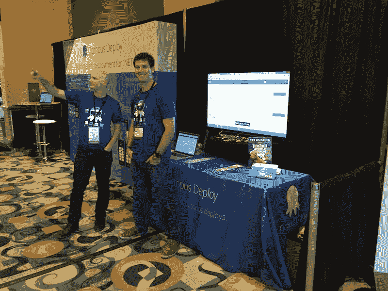

# 我在 Octopus - Octopus Deploy 工作的第一年

> 原文：<https://octopus.com/blog/first-year-working-at-octopus>

本周，我迎来了在 Octopus 工作的一周年纪念日，我想分享一下在这里工作的感受并谈谈我们的文化会很棒。我之前在我的个人博客上写了我的第一印象，但是我想更深入地挖掘一下。

## 船舶

首先也是最重要的，章鱼有航运文化！我加入 Octopus 的时候，团队正准备推出 Octopus 3.0。这是一个巨大的里程碑，看着最后一个 bug 被击败并发布出去是令人兴奋的。也就是说，我实际上已经开始着手改进[Octopus.com](https://octopus.com)的功能，包括增强我们的销售和许可渠道，以及构建[超级升级页面](https://octopus.com/upgrade/)，让客户更容易升级和更新他们现有的许可证。

不久之后，我开始在 Octopus Deploy 上工作，进行错误修复和增强，并为更大的功能发布做出贡献。很高兴看到像`Channels`、`Elastic Environments`和`Multi-tenancy`这样的新功能成形并进入客户手中。我喜欢我们为新功能发布 RFC(征求意见),社区提供反馈来帮助塑造产品。我喜欢的另一件事是，我们定期发布新版本，只要它们准备好了(有时每周几次)，而不是更长的发布周期。这是尽早向我们的客户提供最新功能和修复的好方法。

我们甚至自动化了我们的发布过程，这样任何人都可以在任何时间轻松完成。这大大减少了运输的摩擦！有趣的是，我们确实用章鱼装运章鱼！

我们即将发布 Octopus 3.4，并开始一些非常酷的新工作。这是一个非常令人兴奋的时刻在八达通部署！

## 信任

我们定期发货，并努力发送高质量的版本！信任是实现这一目标的关键。无论我们做什么，整个团队都相互信任和支持。从我们的创始人到最新的团队成员，每个人都愿意随时分享或帮助。这是非常重要的，因为八达通是一个远程友好的公司，我们没有一个深层次的管理。除了需要合作的时候，团队的大部分成员都在家工作。Octopus 的总部设在澳大利亚的布里斯班，我们在中央商务区或市中心有一个办公室，在那里我们可以工作和协作。这是专注的远程工作和面对面交流的完美平衡。

## 我们是章鱼！

基于信任，八达通建立了一个伟大的团队，他们关心自己所做的事情。每个人都有长处和短处，但我们都愿意分享和帮助他人。周围都是很棒的人，感觉很棒。我的同事[达米安·布雷迪](http://twitter.com/damovisa)指出，我们称章鱼为`we`，而不是说`it`或`the company`。我们都乐于谈论章鱼并代表它。我们都是被信任的。我们是一个团队。我们是章鱼！

当章鱼开始[参加会议](https://octopus.com/company/events)并且我们开始与人们面对面交谈时，这一点得到了加强。我们代表公司帮助人们理解我们解决的问题和我们提供的价值。

## 远程工作

向远程工作的转变既有趣又有益。我绝对不怀念每天上下班的时间，这让我有更多时间在家陪妻子和两个年幼的儿子。家庭干扰有时会很有挑战性，但好处远远大于代价。我经常在推特上谈论我的工作生活平衡，我从来没有这么好过。

上次我写了以下内容，它仍然是非常正确的。

> 我可以更经常地见到我的妻子和孩子，我们一起吃午饭，如果我们需要为家庭跑腿，我也会在身边。这极大地改善了我与妻子和孩子的关系，我不认为我会回到过去。

## 成长

我以第 12 名员工的身份加入了 Octopus，我们的[团队页面](https://octopus/team)现在有 19 人，不久将有 2 人加入。我们已经超出了我们的办公室，因此团队已经从每周三与办公室的每个人一起进行 sprint 审查转变为在不同的日子进行协作。我们也开始做每周一次的远程友好 TL；每周三进行简短的演示，其他时间进行更深入的演示。总的来说，变化是积极的，但我们仍在学习和适应。

我们成长过程中最大的变化是，我们正在过渡到一种开放的分配管理风格，在这种风格下，所有团队成员在日常工作中都有很大的自由度。 [Paul](https://twitter.com/paulstovell) 帮助设定总体方向，但我们可以自由地推出新功能，并选择我们认为可以做出最大贡献的团队/任务组。

章鱼团队的新成员与一个伙伴配对，他们在办公室一起工作一周，或者直到他们适应在家工作。我是几个新团队成员的好朋友，这是一个了解新团队成员并让他们快速开始工作的好方法。我们还举办了为期两天的迷你章鱼大学训练营，以帮助我们的一些技术水平较低的团队成员了解软件开发的挑战和手动部署的痛苦。这很有趣，每个人都学到了很多东西！

## 包裹

我喜欢在八达通的第一年，我真的期待更多！再说一次，可以肯定地说，我是一只快乐的章鱼，未来非常光明。