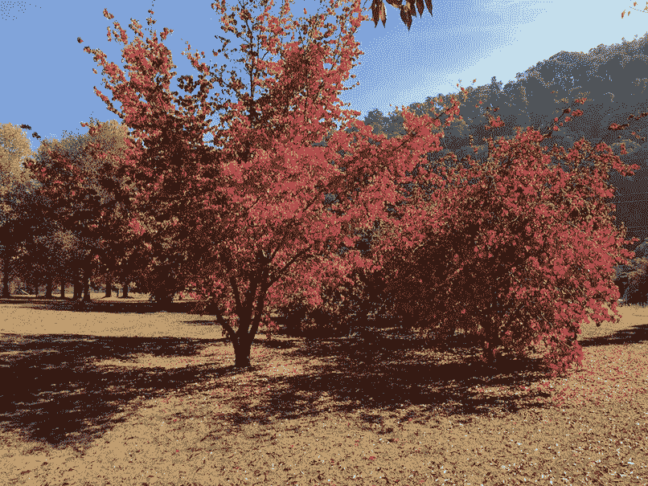
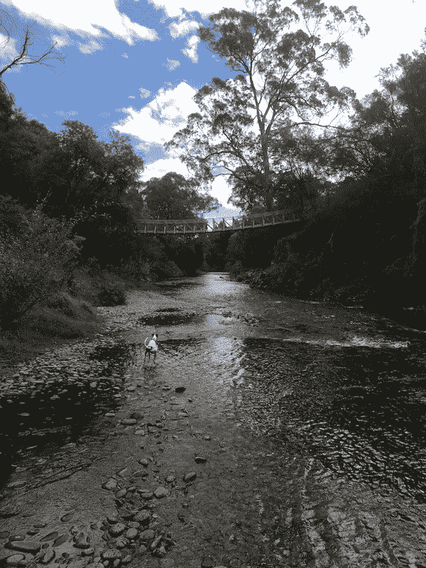
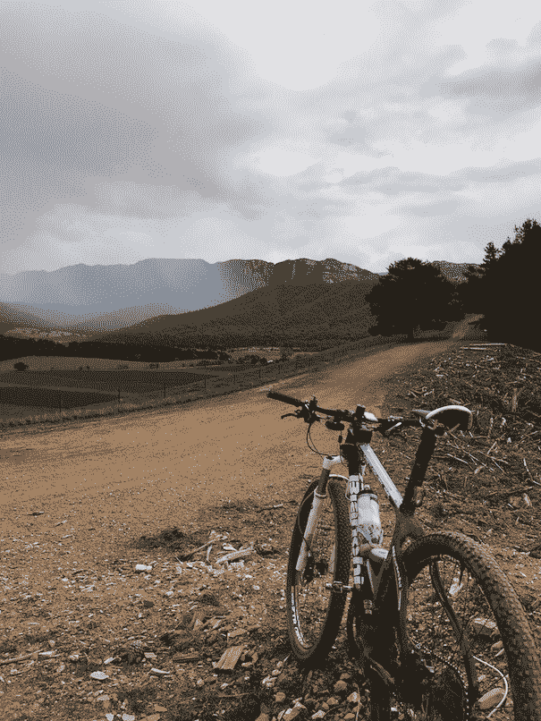

# 灵活工作-杰森的故事-章鱼部署

> 原文：<https://octopus.com/blog/flexible-work-week-jason>

弹性工作在很多方面都可以改变游戏规则。我是 Jason，Octopus Deploy 的云架构师，我将解释为什么它不仅改变了我的游戏规则，而且改变了我的生活。

当我在 2017 年 6 月加入 Octopus Deploy 时，我已经在悉尼生活了近 19 年，老实说，我已经准备好改变了。

在现代悉尼，你有三种生活方式。你要么为住在 CBD 附近支付过高的租金，要么应对非同寻常的通勤，要么试图在两者之间取得平衡。

在我 15 公里的自行车通勤路上与危险的司机发生了太多的冲突后，我放弃了寻求平衡的努力，将我工资的一大部分交给了 Rozelle 的一个仓库，那里距离我以前的工作单位只有 3 公里。当然，我没有一天花三四个小时在火车上，我也不太可能被骑自行车的穿白色衣服的人撞倒，但我仍然压力很大，经常不开心。

Octopus Deploy 是一个远程优先的工作场所。我的许多同事在布里斯班，其他人在墨尔本、阿德莱德、美国，甚至阿根廷。加入 Octopus 后不久，我几乎准备好收拾行李搬到布里斯班加入我的新团队。

当然，结果是章鱼云团队大部分时间都在墨尔本，很适应远程工作，所以我留在了原地。但是悉尼机器仍然在磨我，我骑自行车更少，我现在没有明显的理由支付过高的租金。

老实说，我很不开心。更重要的是，我意识到多年来我一直不快乐。

我需要改变。

于是一个想法开始萌发。

几年前，当我开始认真地骑自行车时，我去了趟维多利亚东北部的布莱特镇。第一次拜访之后，我会一次又一次地回去。

布莱特坐落在群山之中，是严肃的公路自行车手和山地车手所熟知的。它被纵横交错的森林包围，有适合全天探险的极好的砾石小径，在很短的车程内有五六个山地自行车公园，并且是澳大利亚一些最好的公路骑行的基地。因为它是一个旅游城市，所以它的基础设施也很好，靠近两个滑雪场，有足够的咖啡馆、酒吧和娱乐场所，让养尊处优的城市居民在周末也能开心。

我开始怀疑。很久以来，我一直想在布莱特买一个度假基地。我能不能...住在那里？

所以我问老板，如果我搬到维多利亚，他会不会介意。

答案是一个响亮的“是的，当然”。我仍然不太确定是否有人知道我要去维多利亚的哪里，但是我有一个肯定的答案，所以一切都在进行中。我在布莱特郊外的 Porepunkah 找到了一套有四间卧室和一间书房的房子，价格远低于我在悉尼的一间卧室。我租了辆卡车就走了。

【T2 

最初有一些困难，比如安装有线互联网(第一个月我在 4G 上工作)，但一旦我安顿下来，我发现我更放松，更专注，总体上更快乐。生活更简单了，我的作息更有规律了，而且我每天都可以看山！

这花了一段时间，但最终我意识到在一个城市里，噪音主宰了你的生活。我花了一段时间才改掉到处戴降噪耳机的习惯——这个习惯我还没有完全改掉。出去喝杯咖啡或遛狗而不被交通噪音打扰，这是一种简单而不被重视的快乐。

我搬到布莱特已经九个月了，野马也不能把我拖出去。当然，在城市里你不会遇到一些小问题，但是每天看到山和树的价值意味着我可以等几天来修理我的冰箱。

 

我们不要自欺欺人了，在乡下修理你的冰箱可能需要几天时间。这不仅仅是老生常谈，这里的事情确实进展得更慢。我的镇上甚至没有送货上门的邮件。幸运的是，Octopus 的灵活性意味着我可以在一天中抽出时间来做一些需要做的小工作，并在以后弥补时间。有时候，我甚至可以挤出一个下午骑一两个小时的自行车，我发现这非常有用，因为山区冬天冰冷的早晨和黑暗的夜晚开始刺痛。

如果你是一个非常“随叫随到”的人，你重视城市生活提供的无限选择，你可能不会成功。但是，如果你能学会珍惜某种简单的生活，这可能正是你想要的。