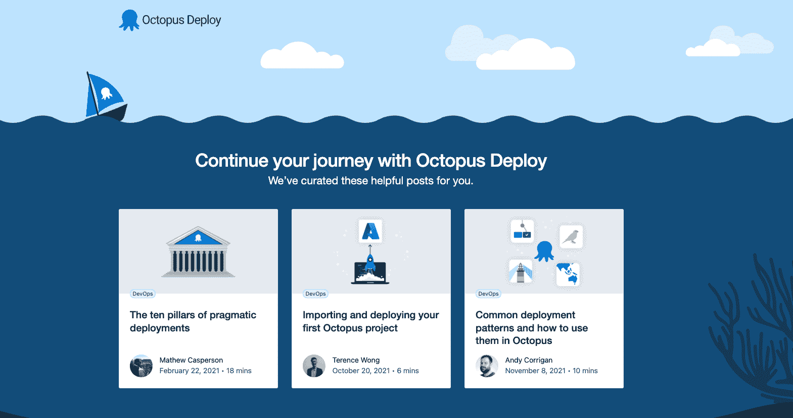

# 集装箱化-你需要什么开始-八达通部署

> 原文：<https://octopus.com/blog/get-started-containers>

容器正在成为运行和托管应用程序和微服务的最流行的方式。简而言之，容器是轻量级的虚拟环境，可以运行应用程序，而不需要庞大的完整操作系统。

没有膨胀，[容器比传统的基础设施和虚拟机有许多好处](https://octopus.com/blog/benefits-of-containerization),包括:

*   更好的安全性
*   很少甚至没有系统维护
*   易于旋转和拆卸
*   轻松扩展资源以满足应用需求

可部署的容器映像也使您的应用程序运行起来更加容易。容器映像通常包括您的软件、运行应用程序所需的所有运行时和先决条件，以及由代码设置的任何配置。

多年来，许多公司都有自己的容器图像格式，但是 Docker 的“OCI”图像(现在是开源的)很快成为了行业标准。事实上，许多供应商现在互换使用术语“OCI 图像”和“码头图像”。

OCI 主张开放集装箱倡议。该计划是一个容器结构，作为行业标准格式。技术、开发和云服务领域的大多数主要参与者都支持这项倡议，并支持 OCI 格式。在[开放容器倡议网站](https://opencontainers.org/)上了解更多信息。

对于那些不熟悉集装箱化概念的人，让我们从高层次上看一下您需要什么，以及它们是如何组合在一起的。

## Docker 桌面

适用于 Windows、Mac 和 Linux 的 Docker Desktop 是开始容器化的最简单方法。

它帮助您从所选的操作系统中执行以下操作:

*   创建、运行和测试容器就绪应用
*   构建现成的容器化工具和环境，比如 NGINX、MySQL 或 Ubuntu
*   管理您的图像并将其发送到存储库和注册表
*   创建开发环境

在撰写本文时，其中一些功能还处于测试或预览阶段。

在 Windows 上，您可以在 Linux 和 Windows 容器映像之间切换兼容性。在大多数情况下，我们建议使用 Linux 映像，因为很少有托管服务支持本机 Windows 映像。

虽然 Docker Desktop 提供了友好的图形界面，但超过 250 名员工的公司每月都要付费。熟悉命令行的 Linux 用户可以像往常一样继续使用容器。

## 主办；主持

如果你想在一个容器中运行你的应用程序，你需要一个地方来托管它以便人们访问。许多供应商提供容器托管，而不仅仅是三大巨头微软 Azure、T2、谷歌云和 T4 亚马逊网络服务。

您不局限于云服务，因为大多数主要操作系统都支持 Docker 映像。所以，如果你想在你自己的硬件上运行你的应用，比如服务器或者你自己的测试电脑，你可以。

其他示例托管提供商包括:

## 集装箱登记处

容器注册中心既是存储库的集合(后面将详细介绍)，也是用于管理和部署映像的可搜索目录。

注册表在两个重要方面有所帮助:

1.  他们确保每个人在搜索时都能获得正确版本的软件，无论他们身在何处。
2.  部署过程使用注册表从存储库中调用正确的映像。

市场上有大量的注册中心，它们都有不同的优势，例如:

*   私有注册表
*   地理位置
*   流行的公共注册表
*   内部选项
*   与管道其他区域的兼容性

当你选择一个主机提供商时，你可能会被锁定在一个特定的注册表中。

示例容器注册表包括:

## 集装箱仓库

注册中心对您的图像进行分类，容器存储库存储这些图像以备部署。通常，您的注册中心供应商会在平面图上提供您的存储库存储空间。

部署您的应用程序时，您的流程将:

*   检查注册表中的正确版本
*   从存储库中提取图像
*   将映像部署到托管服务上新启动的容器中

## 要部署的东西

如果您想尝试容器化，您需要部署一些东西。如果你没有合适的，我们会帮你的。

章鱼水下应用是一个简单的 JavaScript 应用，帮助你测试不同服务提供商的集装箱化。

## 看看它是如何工作的

Terence 在我们最近的 CI 系列中写了一篇优秀的[容器部署指南](https://octopus.com/blog/deploying-java-app-docker-google-azure)，展示了这些概念是如何结合在一起的。

他的指南将带您了解完整的流程，包括:

*   克隆章鱼水下应用的 GitHub 库
*   建立码头工人形象
*   将图像添加到谷歌云的注册和存储服务中
*   从 Google 云注册表部署到 Azure Kubernetes 集群

## 下一步是什么？

在这篇文章中，我们探索了使容器化应用成为可能的基本组件。我们还有更多关于集装箱化的帖子，包括:

*   您应该考虑的注册中心
*   更详细地看集装箱化的好处
*   微服务的良好平台
*   深入探讨云流程编排和云自动化
*   看看“一切都是代码”

愉快的部署！