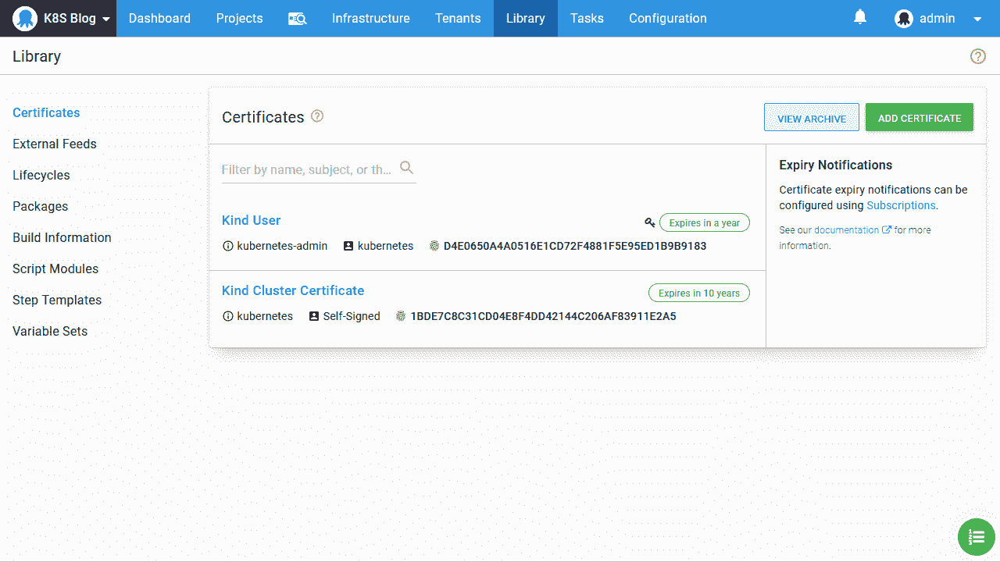
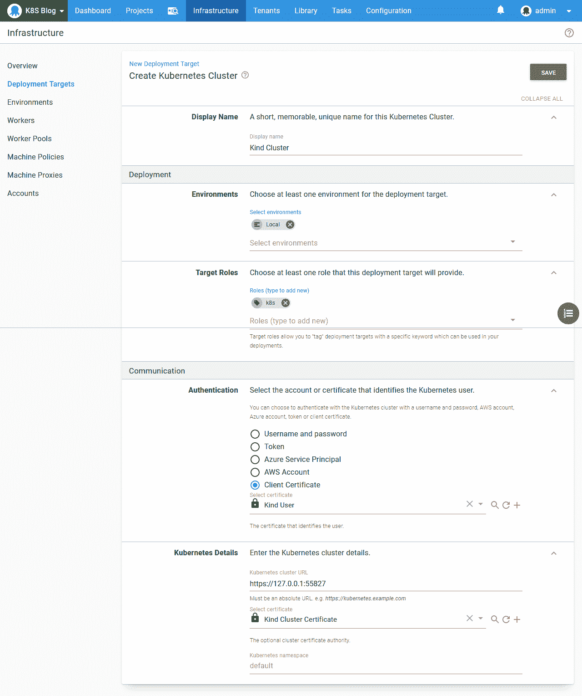
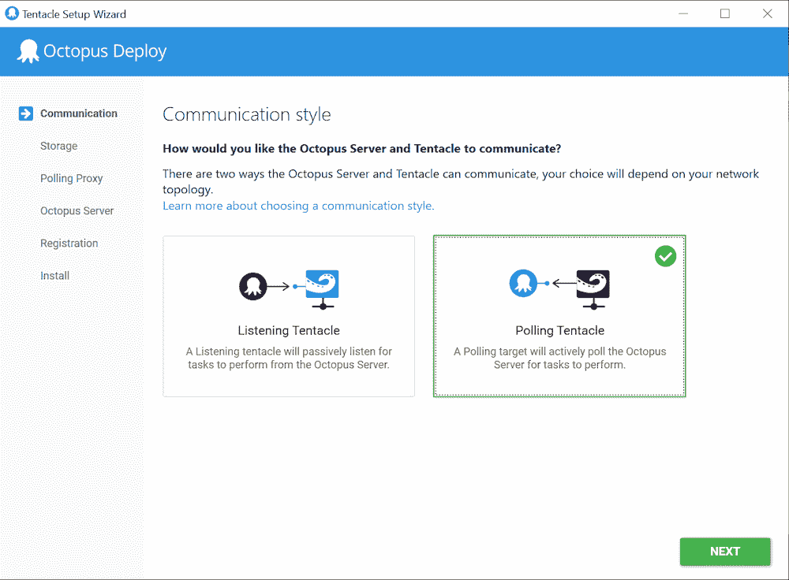
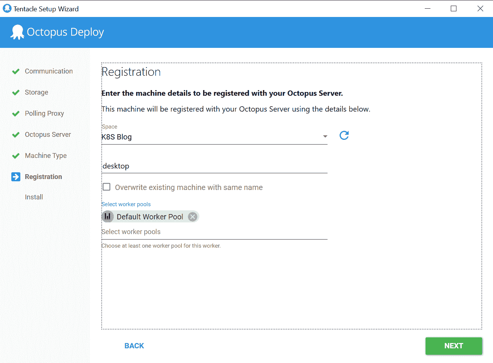
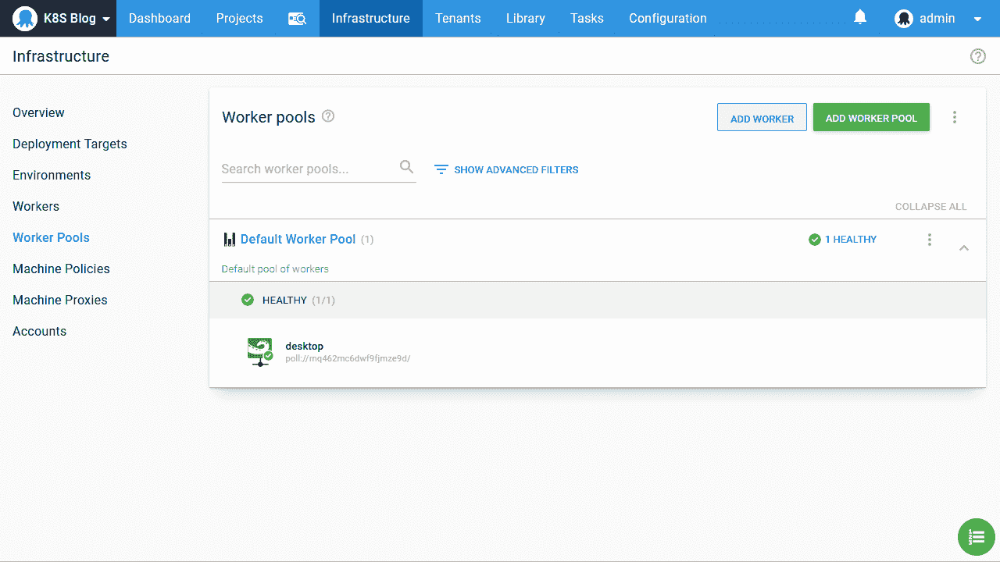
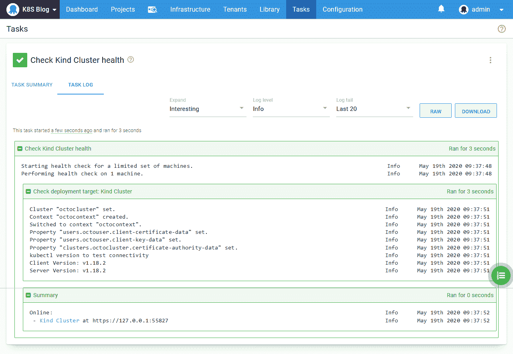

# Kind 和 Octopus - Octopus 部署入门

> 原文：<https://octopus.com/blog/getting-started-with-kind-and-octopus>

[](#)

当您第一次开始使用 Kubernetes 时，在部署哪怕是最简单的示例应用程序之前，可用的工具和选项的数量会是一个很大的障碍。与大多数其他平台不同，Kubernetes 不提供可以下载并安装到本地开发 PC 上的标准包。社区用许多选项填补了这一空白，如 [Minikube](https://github.com/kubernetes/minikube) 、 [MicroK8s](https://microk8s.io/) 、 [k3s](https://k3s.io/) 和[Docker Desktop with Kubernetes](https://docs.docker.com/desktop/kubernetes/)。

在这篇博文中，我们将关注[类](https://kind.sigs.k8s.io/)。虽然前面提到的任何解决方案都是很好的选择，但我更喜欢 Kind，因为它可以无缝地跨所有主要操作系统工作，并且在 [WSL2](https://docs.microsoft.com/en-us/windows/wsl/wsl2-about) 中运行良好，这使得 Windows 开发人员可以很容易地在 Windows 和 Linux 之间切换。

## 安装种类

Kind 创建一个 Kubernetes 集群作为 Docker 容器。想到实现 Kubernetes 平台的 Docker 容器可能有点令人费解，这反过来又编排了更多的 Docker 容器，但在实践中，建立一个友好的 Kubernetes 集群的过程既快又容易。

在[安装好 Docker](https://docs.docker.com/get-docker/) 之后，安装 [kubectl](https://kubernetes.io/docs/tasks/tools/install-kubectl/) 和[类可执行文件](https://kind.sigs.k8s.io/docs/user/quick-start/)。kubectl 和 Kind 都是自包含的可执行文件，这意味着它们只需要下载并保存在您的路径下的一个目录中。

然后用命令`kind create cluster`创建一个集群。这个命令使用名为`kind-kind`的集群和用户在`~/.kube/config`创建或更新 Kubernetes 配置文件。下面显示了一个`config`文件的例子:

```
apiVersion: v1
clusters:
- cluster:
    certificate-authority-data: LS0tLS1CRUdJTiBDRVJUSU...
    server: https://127.0.0.1:55827
  name: kind-kind
contexts:
- context:
    cluster: kind-kind
    user: kind-kind
  name: kind-kind
current-context: kind-kind
kind: Config
preferences: {}
users:
- name: kind-kind
  user:
    client-certificate-data: LS0tLS1CRUdJTiBDRVJUSU...
    client-key-data: LS0tLS1CRUdJTiBSU0EgUF... 
```

要验证集群是否正在运行，请执行`kubectl get nodes`。您应该会看到类似这样的输出:

```
$ kubectl get nodes
NAME                 STATUS   ROLES    AGE    VERSION
kind-control-plane   Ready    master   101s   v1.18.2 
```

我们现在有了一个本地 Kubernetes 集群，可以进行测试了。

Kind 创建的`config`文件嵌入了用于保护 API 流量的集群证书，以及用于识别 Kubernetes 用户的客户端密钥和证书。我们需要将这些值提取到可以导入 Octopus 的文件中。

下面的 Bash 和 PowerShell 脚本提取数据，对其进行解码，并将客户端密钥和证书合并到一个 PFX 文件中。这些脚本给了我们两个文件:`cluster.crt`和`client.pfx`:

下面是 Bash 脚本:

```
kubectl config view --raw -o json | jq -r ".users[] | select(.name==\"$1\") | .user[\"client-certificate-data\"]" | base64 -d > client.crt
kubectl config view --raw -o json | jq -r ".users[] | select(.name==\"$1\") | .user[\"client-key-data\"]" | base64 -d > client.key
kubectl config view --raw -o json | jq -r ".clusters[] | select(.name==\"$1\") | .cluster[\"certificate-authority-data\"]" | base64 -d > cluster.crt
openssl pkcs12 -export -in client.crt -inkey client.key -out client.pfx -passout pass:
rm client.crt
rm client.key 
```

下面是 PowerShell 脚本，其中的`openssl`可执行文件是从[这里的](https://slproweb.com/products/Win32OpenSSL.html)下载的:

```
param($username)

kubectl config view --raw -o json |
  ConvertFrom-JSON |
  Select-Object -ExpandProperty users |
  ? {$_.name -eq $username} |
  % {
    [System.Text.Encoding]::ASCII.GetString([System.Convert]::FromBase64String($_.user.'client-certificate-data')) | Out-File -Encoding "ASCII" client.crt
    [System.Text.Encoding]::ASCII.GetString([System.Convert]::FromBase64String($_.user.'client-key-data')) | Out-File -Encoding "ASCII" client.key
    & "C:\Program Files\OpenSSL-Win64\bin\openssl" pkcs12 -export -in client.crt -inkey client.key -out client.pfx -passout pass:
    rm client.crt
    rm client.key
  }

  kubectl config view --raw -o json |
  ConvertFrom-JSON |
  Select-Object -ExpandProperty clusters |
  ? {$_.name -eq $username} |
  % {
    [System.Text.Encoding]::ASCII.GetString([System.Convert]::FromBase64String($_.cluster.'certificate-authority-data')) | Out-File -Encoding "ASCII" cluster.crt
  } 
```

## 创建章鱼 Kubernetes 目标

文件`cluster.crt`和`client.pfx`被上传到八达通证书商店。这里我将这些证书称为**类用户**和**类集群证书**:

[](#)

我们还需要一个本地环境:

[](#)

最后一步是创建 Kubernetes 目标。该目标使用证书**种类用户**进行身份验证，使用**种类集群证书**进行服务器证书授权，使用 https://127.0.0.1:55827 进行集群 URL。这个 URL 来自 Kubernetes `config`文件中的`clusters[].clusters.server`字段:

[](#)

## 关于工人的一句话

因为 Kubernetes URL 引用了`127.0.0.1`(或`localhost`)，所以我们要么需要在本地开发 PC 上运行 Octopus，要么需要在本地 PC 上安装一个 Worker，这允许远程 Octopus 实例通过隧道进入我们的本地 PC。

在下面的截图中，你可以看到触手管理器配置一个工人的一些步骤:

选择一个轮询触手:

[](#)

将触手配置为工作者:

[](#)

向 Octopus 服务器注册员工:

[](#)

这里我们可以看到分配给**默认工作线程池**的新工作线程:

[](#)

工作人员就位后，远程 Octopus 服务器上的 Kubernetes 目标现在可以访问我们的本地 Kubernetes 集群:

[](#)

## 结论

我们现在已经成功地用 Kind 创建了一个本地 Kubernetes 集群，从 Kubernetes 配置文件中提取了证书，将证书导入到 Octopus 中，并在 Octopus 中创建了一个 Kubernetes 目标，它通过一个 Worker 连接到我们的本地集群。

从这里，我们可以了解如何使用 Octopus 来部署 Kubernetes 资源。以下博客文章向您展示了如何: