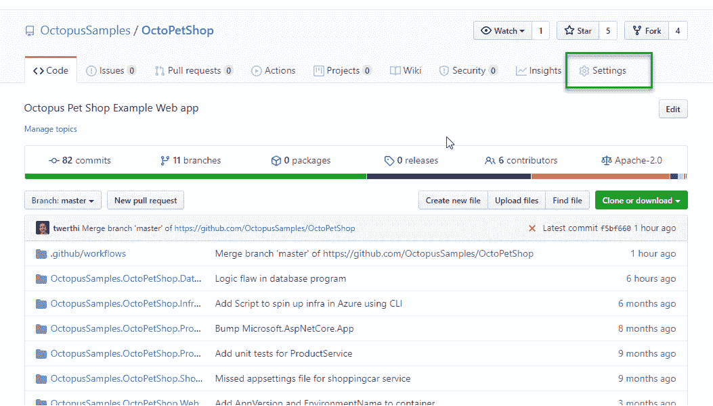
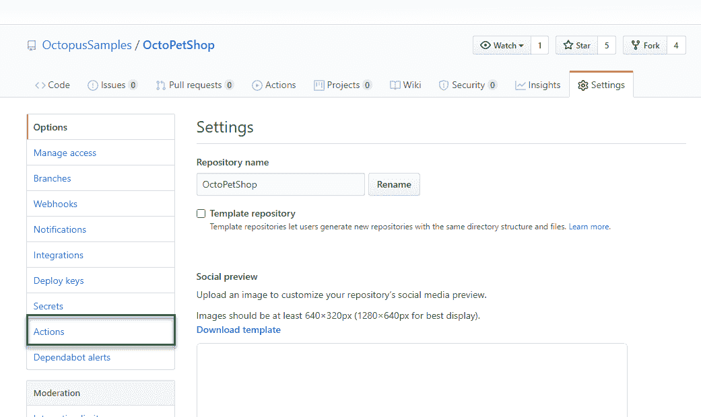
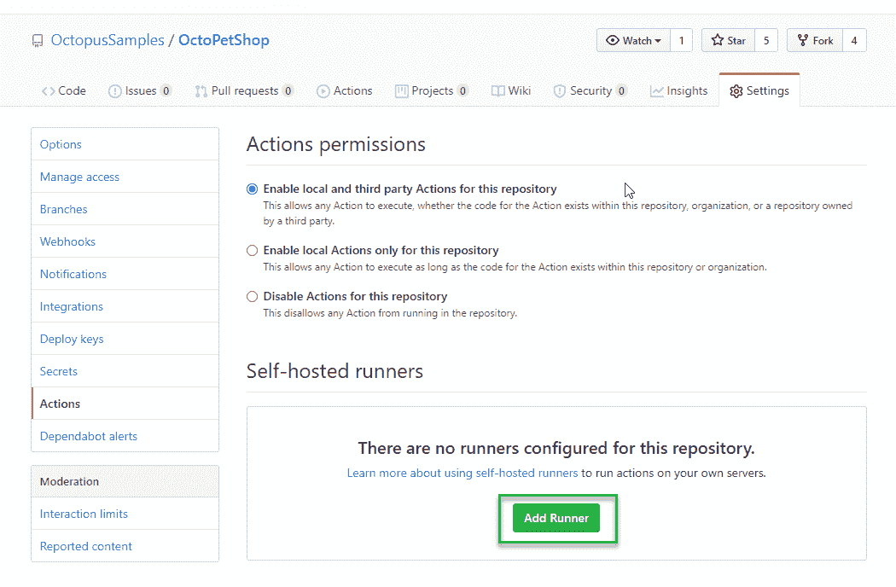
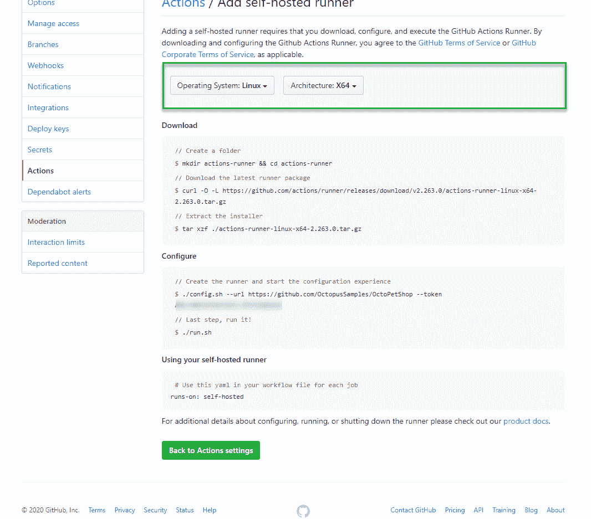
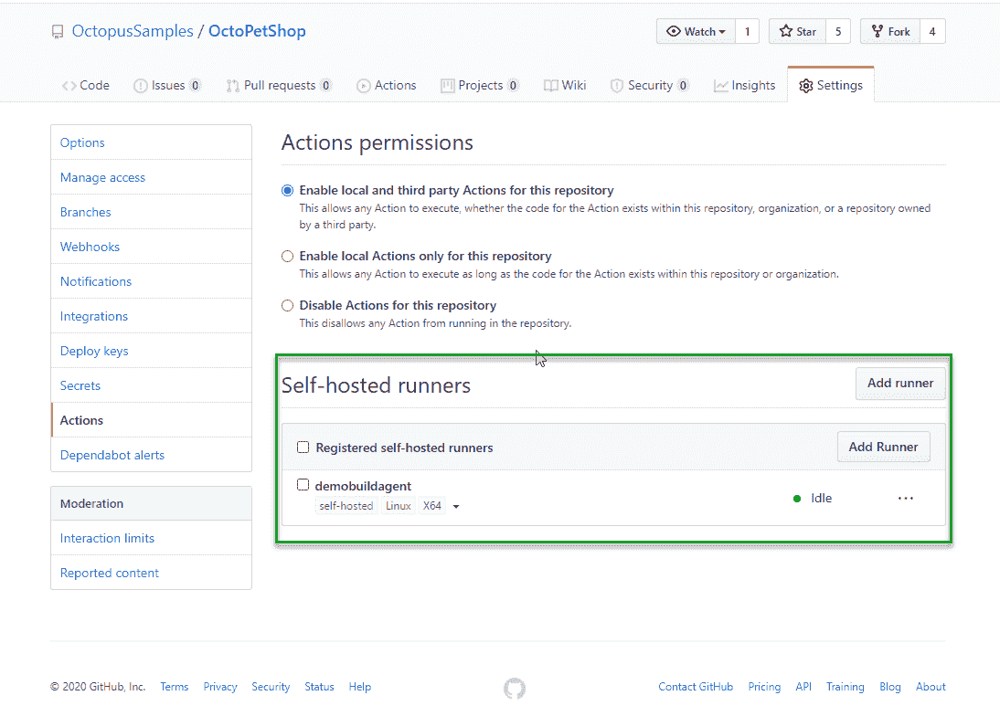
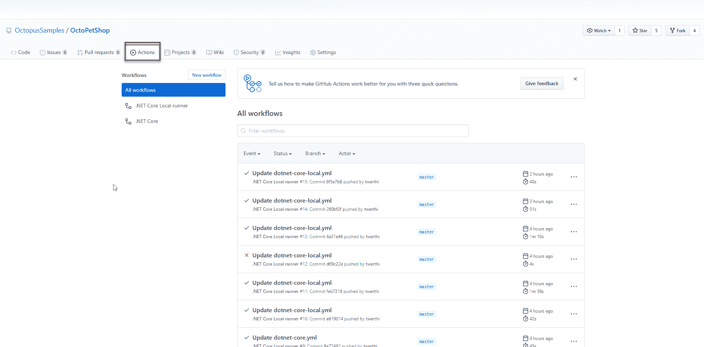
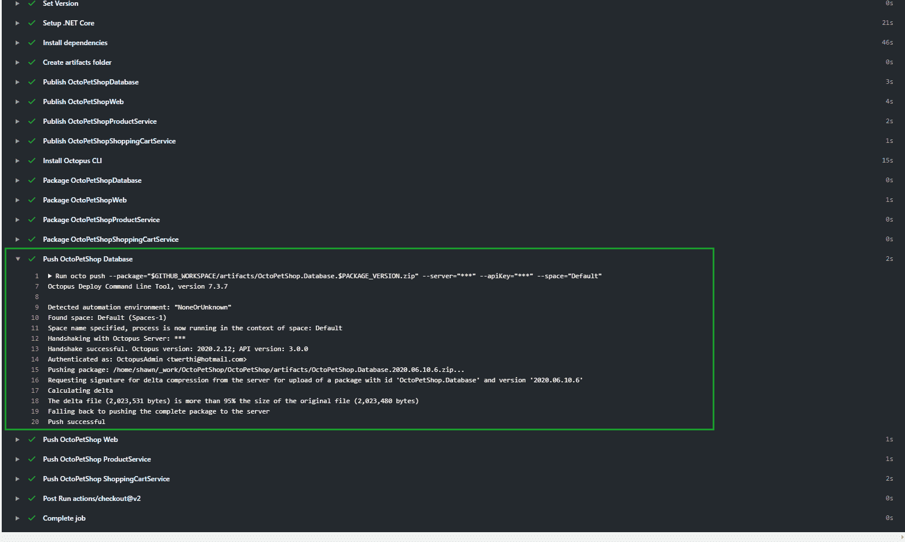
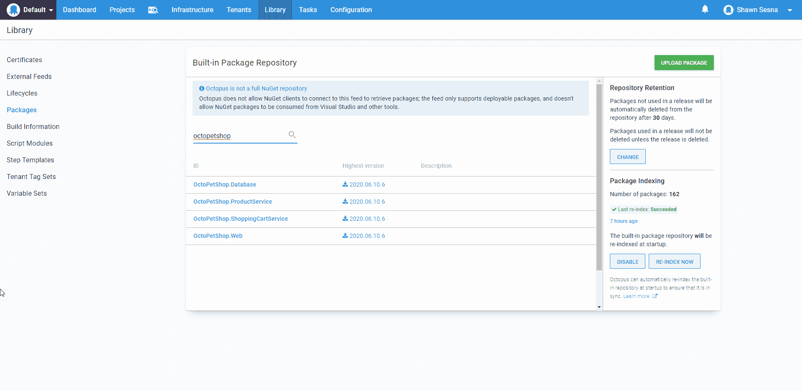

# 使用 GitHub Actions - Octopus Deploy 将包发布到本地 Octopus 实例

> 原文：<https://octopus.com/blog/github-actions-local-runner>

今年早些时候，我的同事 Ryan Rousseau 写了一篇关于使用 GitHub Actions 向 Octopus Deploy 发布一个包的博文。在这篇文章中，我将更进一步，发布一个包到一个用自托管 GitHub Actions Runner 部署的本地 Octopus 实例。

## GitHub 操作

GitHub Actions 是 GitHub 版本的构建服务器。像许多其他构建工具一样，如 BitBucket PipeLines 和 Azure DevOps，GitHub Actions 使用另一种标记语言(YAML)来定义构建过程，称为**工作流**。下面是一个 GitHub Actions 工作流 YAML 文件的例子。

该示例构建了 [OctoPetShop 示例](https://github.com/OctopusSamples/OctoPetShop)。NET 核心应用程序，然后将包推送到我们的 [Octopus Deploy Samples](https://samples.octopus.app/) 实例:

```
name: .NET Core 

on:
  push:
    branches: [ master ] 
  pull_request:
    branches: [ master ]

jobs:
  build:

    runs-on: ubuntu-latest 

    steps:
    - uses: actions/checkout@v2
    - name: Set Version
      run: echo "::set-env name=PACKAGE_VERSION::$(date +'%Y.%m.%d').$GITHUB_RUN_NUMBER"
    - name: Setup .NET Core
      uses: actions/setup-dotnet@v1
      with:
        dotnet-version: 2.2.207
    - name: Install dependencies
      run: dotnet restore
    - name: Build
      run: dotnet build --configuration Release --no-restore
    - name: Test
      run: dotnet test --no-restore --verbosity normal
    - name: Create artifacts folder
      run: |
        mkdir "$GITHUB_WORKSPACE/artifacts"
        mkdir "$GITHUB_WORKSPACE/artifacts/OctopusSamples.OctoPetShop.Database"
        mkdir "$GITHUB_WORKSPACE/artifacts/OctopusSamples.OctoPetShop.Web"
        mkdir "$GITHUB_WORKSPACE/artifacts/OctopusSamples.OctoPetShop.ProductService"
        mkdir "$GITHUB_WORKSPACE/artifacts/OctopusSamples.OctoPetShop.ShoppingCartService"
    - name: Publish OctoPetShopDatabase
      run: dotnet publish OctopusSamples.OctoPetShop.Database/OctopusSamples.OctoPetShop.Database.csproj --configuration Release --no-restore --output "$GITHUB_WORKSPACE/artifacts/OctopusSamples.OctoPetShop.Database"
    - name: Publish OctoPetShopWeb
      run: dotnet publish OctopusSamples.OctoPetShop.Web/OctopusSamples.OctoPetShop.Web.csproj --configuration Release --no-restore --output "$GITHUB_WORKSPACE/artifacts/OctopusSamples.OctoPetShop.Web"
    - name: Publish OctoPetShopProductService
      run: dotnet publish OctopusSamples.OctoPetShop.ProductService/OctopusSamples.OctoPetShop.ProductService.csproj --configuration Release --no-restore --output "$GITHUB_WORKSPACE/artifacts/OctopusSamples.OctoPetShop.ProductService"
    - name: Publish OctoPetShopShoppingCartService
      run: dotnet publish OctopusSamples.OctoPetShop.ShoppingCartService/OctopusSamples.OctoPetShop.ShoppingCartService.csproj --configuration Release --no-restore --output "$GITHUB_WORKSPACE/artifacts/OctopusSamples.OctoPetshop.ShoppingCartService"
    - name: Install Octopus CLI
      uses: OctopusDeploy/install-octocli@v1
      with:
        version: 7.4.2
    - name: Package OctoPetShopDatabase
      run: |
        octo pack --id="OctoPetShop.Database" --format="Zip" --version="$PACKAGE_VERSION" --basePath="$GITHUB_WORKSPACE/artifacts/OctopusSamples.OctoPetShop.Database" --outFolder="$GITHUB_WORKSPACE/artifacts"
    - name: Package OctoPetShopWeb
      run: |
        octo pack --id="OctoPetShop.Web" --format="Zip" --version="$PACKAGE_VERSION" --basePath="$GITHUB_WORKSPACE/artifacts/OctopusSamples.OctoPetShop.Web" --outFolder="$GITHUB_WORKSPACE/artifacts"
    - name: Package OctoPetShopProductService
      run: |
        octo pack --id="OctoPetShop.ProductService" --format="Zip" --version="$PACKAGE_VERSION" --basePath="$GITHUB_WORKSPACE/artifacts/OctopusSamples.OctoPetShop.ProductService" --outFolder="$GITHUB_WORKSPACE/artifacts"
    - name: Package OctoPetShopShoppingCartService
      run: |
        octo pack --id="OctoPetShop.ShoppingCartService" --format="Zip" --version="$PACKAGE_VERSION" --basePath="$GITHUB_WORKSPACE/artifacts/OctopusSamples.OctoPetshop.ShoppingCartService" --outFolder="$GITHUB_WORKSPACE/artifacts"
    - name: Push OctoPetShop Database
      run: |
        octo push --package="$GITHUB_WORKSPACE/artifacts/OctoPetShop.Database.$PACKAGE_VERSION.zip" --server="${{ secrets.OCTOPUSSERVERURL }}" --apiKey="${{ secrets.OCTOPUSSERVERAPIKEY }}" --space="${{ secrets.OCTOPUSSERVERSPACE_HYBRID }}"
    - name: Push OctoPetShop Web
      run: |
        octo push --package="$GITHUB_WORKSPACE/artifacts/OctoPetShop.Web.$PACKAGE_VERSION.zip" --server="${{ secrets.OCTOPUSSERVERURL }}" --apiKey="${{ secrets.OCTOPUSSERVERAPIKEY }}" --space="${{ secrets.OCTOPUSSERVERSPACE_HYBRID }}"
    - name: Push OctoPetShop ProductService
      run: |
        octo push --package="$GITHUB_WORKSPACE/artifacts/OctoPetShop.ProductService.$PACKAGE_VERSION.zip" --server="${{ secrets.OCTOPUSSERVERURL }}" --apiKey="${{ secrets.OCTOPUSSERVERAPIKEY }}" --space="${{ secrets.OCTOPUSSERVERSPACE_HYBRID }}"
    - name: Push OctoPetShop ShoppingCartService
      run: |
        octo push --package="$GITHUB_WORKSPACE/artifacts/OctoPetShop.ShoppingCartService.$PACKAGE_VERSION.zip" --server="${{ secrets.OCTOPUSSERVERURL }}" --apiKey="${{ secrets.OCTOPUSSERVERAPIKEY }}" --space="${{ secrets.OCTOPUSSERVERSPACE_HYBRID }}" 
```

随着 GitHub 托管的 runners 推送到 Octopus Cloud，这个解决方案工作得非常好。然而，如果不穿透防火墙，GitHub 托管的 runners 就无法将包推送到您的自托管 Octopus Deploy 服务器。

### 本地生成运行程序

GitHub 托管的 runner 预打包了许多功能，但有时您有特定的软件需求，需要能够控制您正在使用的版本，或者需要 runner 能够访问内部资源，如 Octopus Deploy。为了解决这个问题，GitHub 的人开发了本地托管跑步者的功能。本地运行器的工作方式类似于 Octopus 轮询触角，它们伸出 GitHub 动作，而不是 GitHub 动作伸入。

#### 设置跑步者

设置本地跑步者非常简单。感谢 GitHub 让它变得如此简单。创建工作流 YAML 文件后，在 GitHub repo 中进行**设置**:

[](#)

在那里，单击操作:

[](#)

稍微向下滚动以看到**添加流道**按钮并点击它:

[](#)

下一个屏幕为您提供了选择本地 runner 架构的选项，然后提供了下载和配置它所必需的命令:

[](#)

当运行配置命令时，您将被询问一些基本的问题，比如 runner 名称、标签和工作文件夹位置。在这些提示下按 Enter 键接受默认值。

当你完成后，你将有一个本地的跑步者监听工作:

[](#)

#### 将工作流配置为使用本地流道

在 YAML 中，将工作流配置为使用本地运行器只需一行代码。以上面的 YAML 为例，我们将行`runs-on`改为本地实例的标签。`runs-on`的当前值使用单个标签`ubuntu-latest`。然而，当你需要多个标签时，你必须把它们放在一个数组中，这个数组是用方括号指定的。对于我们的新跑步者，我们希望它使用标签`self-hosted`和`linux`。为此，我们将改变:

```
runs-on: ubuntu-latest 
```

收件人:

```
runs-on: [self-hosted, linux] 
```

将我们的工作流配置为使用本地运行器后，我们现在可以将包推送到 Octopus Deploy 的本地实例。通过对 YAML 文件进行更改，它启动了一个构建，我可以看到我的本地运行人员通过点击`Actions`已经获得了它:

[](#)

在我的虚拟机上，我看到正在运行作业的消息:

```
 √ Connected to GitHub

2020-06-09 23:47:30Z: Listening for Jobs
2020-06-10 00:27:20Z: Running job: build 
```

检查日志输出，我们可以看到构建的版本号是 2020.06.10.6:

[](#)

在我的本地 Octopus 部署实例上，我发现这已经被推了:

[](#)

## 结论

这篇文章演示了一种使用云构建服务器通过使用本地构建运行器或代理将包推送到自托管 Octopus Deploy 实例的方法。虽然这里关注的是 GitHub 动作，但同样的想法也可以扩展到 TeamCity、Jenkins 或 Azure DevOps。