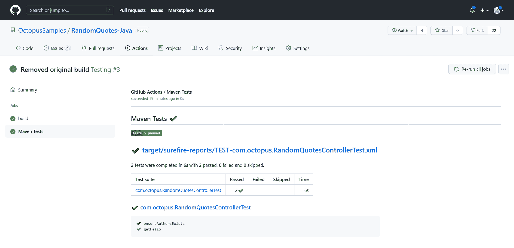
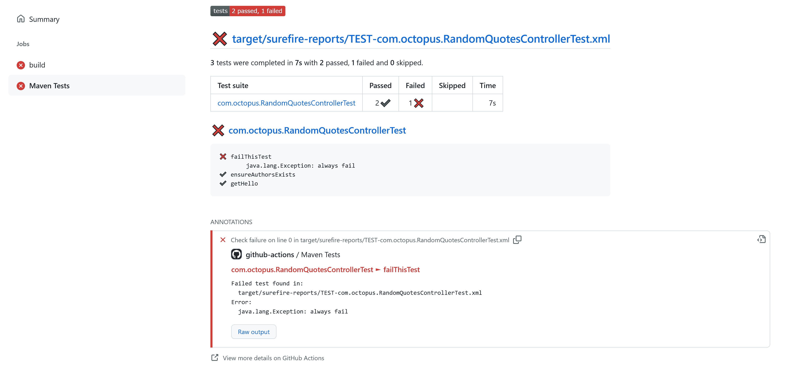
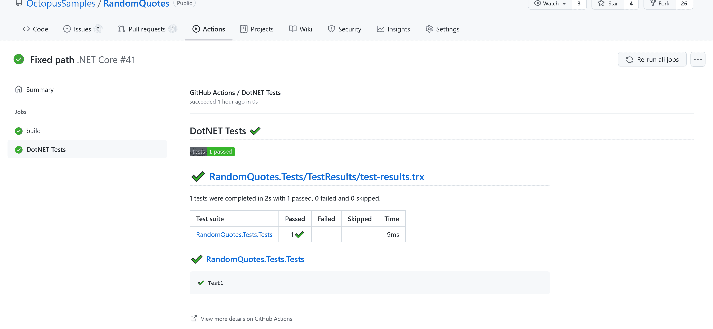

# 在 GitHub Actions - Octopus Deploy 中运行单元测试

> 原文：<https://octopus.com/blog/githubactions-running-unit-tests>

在典型的开发工作流中，用单元测试验证代码变更是一个关键的过程。GitHub Actions 提供了许多自定义操作来收集和处理测试结果，允许开发人员浏览结果、调试失败的测试并生成报告。

在这篇文章中，我将向您展示如何将单元测试添加到 GitHub Actions 工作流中，并配置自定义操作来处理结果。

## 入门指南

GitHub Actions 是一个托管服务，所以你需要的只是一个 GitHub 帐户。所有其他依赖项，如软件开发工具包(SDK)，都是在 GitHub Actions 工作流执行期间安装的。

## 选择操作

GitHub Actions 非常依赖社区贡献的第三方行动。快速的 Google 搜索显示了至少六个处理单元测试结果的操作，包括:

要缩小选择范围，您需要考虑以下功能:

*   行动支持你的测试框架吗？例如，有些动作只处理 JUnit 测试结果，而其他动作则包括其他格式，如 TRX。
*   该操作是否允许您基于失败测试的存在使工作流失败？
*   该操作是否用测试结果的细节注释了源代码？
*   该行动是否会生成有用的报告？
*   项目有几个明星？

经过一些反复试验，我决定采用[测试报告者](https://github.com/marketplace/actions/test-reporter)动作，这将在本文中演示。

## Java 中的单元测试

下面显示的工作流文件使用 Maven 运行测试，并使用 test-reporter 操作处理结果:

```
name: Java

on:
  push:
  workflow_dispatch:

jobs:
  build:

    runs-on: ubuntu-latest

    steps:
      - name: Checkout
        uses: actions/checkout@v1

      - name: Set up JDK 1.11
        uses: actions/setup-java@v2
        with:
          java-version: '11'
          distribution: 'adopt'

      - name: Build
        run: mvn --batch-mode -DskipTests package

      - name: Test
        run: mvn --batch-mode -Dmaven.test.failure.ignore=true test

      - name: Report
        uses: dorny/test-reporter@v1
        if: always()
        with:
          name: Maven Tests
          path: target/surefire-reports/*.xml
          reporter: java-junit
          fail-on-error: true 
```

`Build`、`Test`和`Report`步骤对测试过程很重要。

您从构建应用程序开始，但是跳过测试:

```
 - name: Build
        run: mvn --batch-mode -DskipTests package 
```

接下来，您运行测试，即使有失败的测试，也允许命令通过。这允许您将对失败测试的响应推迟到测试处理操作:

```
 - name: Test
        run: mvn --batch-mode -Dmaven.test.failure.ignore=true test 
```

在最后一步中，您将从 JUnit XML 文件生成一个报告。

`if`属性被设置为总是运行这个步骤，即使上面的`Test`步骤被设置为在测试失败的情况下失败，也允许您生成报告。

如果存在失败的测试，则将`fail-on-error`属性设置为`true`以使该工作流失败。这是一个将对失败测试的响应推迟到测试处理操作的示例:

```
 - name: Report
        uses: dorny/test-reporter@v1
        if: always()
        with:
          name: Maven Tests
          path: target/surefire-reports/*.xml
          reporter: java-junit
          fail-on-error: true 
```

测试结果显示为原始工作流结果下的链接:

[](#)

失败的测试显示其他详细信息，如测试名称、测试结果和原始测试输出:

[](#)

## DotNET 中的单元测试

下面显示的工作流文件使用 DotNET Core CLI 运行测试，并使用 test-reporter 操作处理结果:

```
name: .NET Core

on:
  push:
  workflow_dispatch:

jobs:
  build:

    runs-on: ubuntu-latest

    steps:
    - name: Checkout  
      uses: actions/checkout@v1

    - name: Setup .NET Core
      uses: actions/setup-dotnet@v1
      with:
        dotnet-version: 3.1.402

    - name: Build
      run: dotnet build --configuration Release

    - name: Test
      run: dotnet test --logger "trx;LogFileName=test-results.trx" || true

    - name: Test Report
      uses: dorny/test-reporter@v1
      if: always()
      with:
        name: DotNET Tests
        path: "**/test-results.trx"                            
        reporter: dotnet-trx
        fail-on-error: true 
```

测试由 DotNET 核心 CLI 执行，并将结果保存为 Visual Studio 测试结果(TRX)报告文件。

如果任何测试失败,`test`命令会返回一个非零的退出代码，但是您将响应失败测试的责任委托给了测试处理器。通过将`|| true`链接到命令，您可以确保该步骤总是通过:

```
 - name: Test
      run: dotnet test --logger "trx;LogFileName=test-results.trx" || true 
```

然后，测试报告器动作处理报告文件，如果有任何失败的测试，将`fail-on-error`设置为`true`以使构建失败:

```
 - name: Test Report
      uses: dorny/test-reporter@v1
      if: always()
      with:
        name: DotNET Tests
        path: "**/test-results.trx"                            
        reporter: dotnet-trx
        fail-on-error: true 
```

[](#)

## 结论

GitHub Actions 主要是一个任务执行环境，旨在验证和构建代码，并发布结果工件。有许多第三方动作可以让你生成测试报告并对失败的测试做出响应，但是 GitHub 动作在跟踪测试结果方面有一些不足。尽管如此，今天可用的报告功能是有用的，而且只会改进。

在这篇文章中，你学到了:

*   评估第三方处理测试结果的行动时要问的一些问题
*   如何编写测试 Java 和 DotNET 核心应用程序的基本工作流
*   如何处理测试结果并显示生成的报告

查看我们下一篇关于在 GitHub Actions 中测试的文章:

还可以了解一下为什么 [GitHub 和 Octopus 在一起更好](https://octopus.com/github)。

愉快的部署！