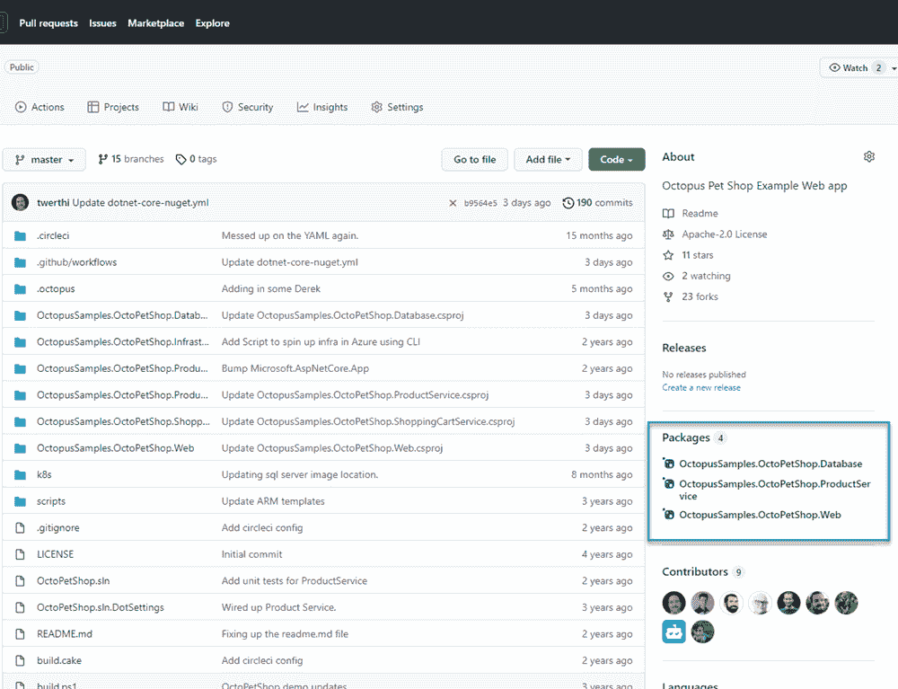
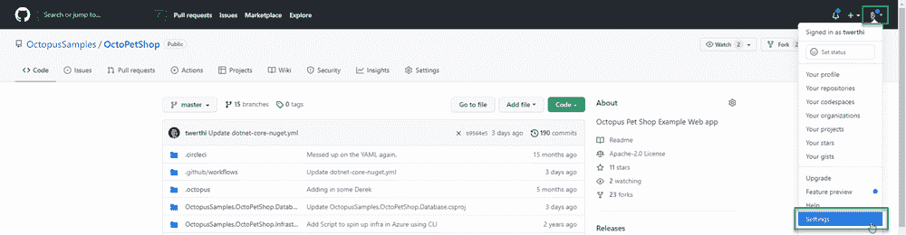
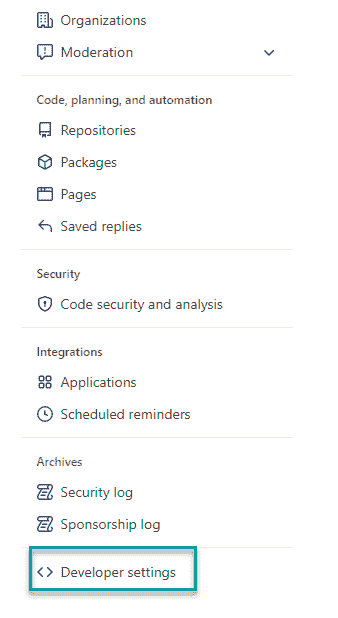
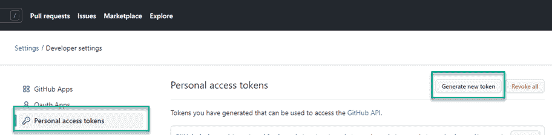
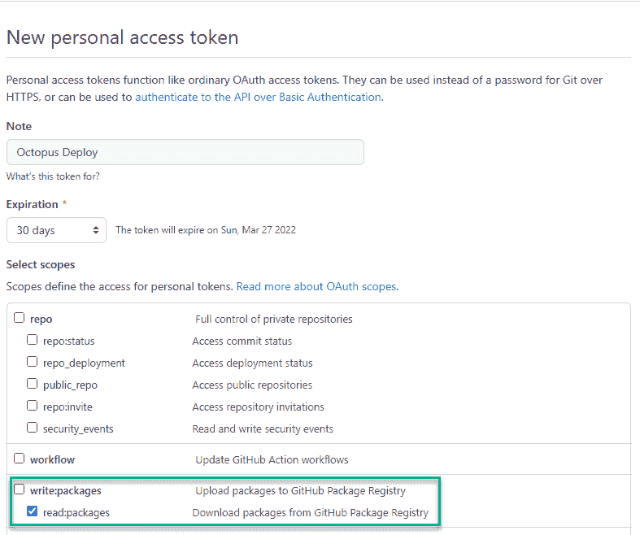
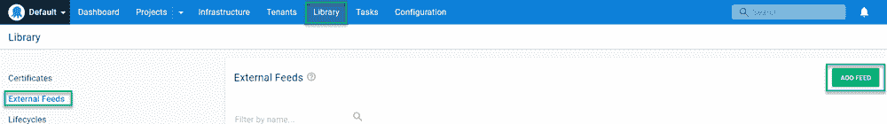
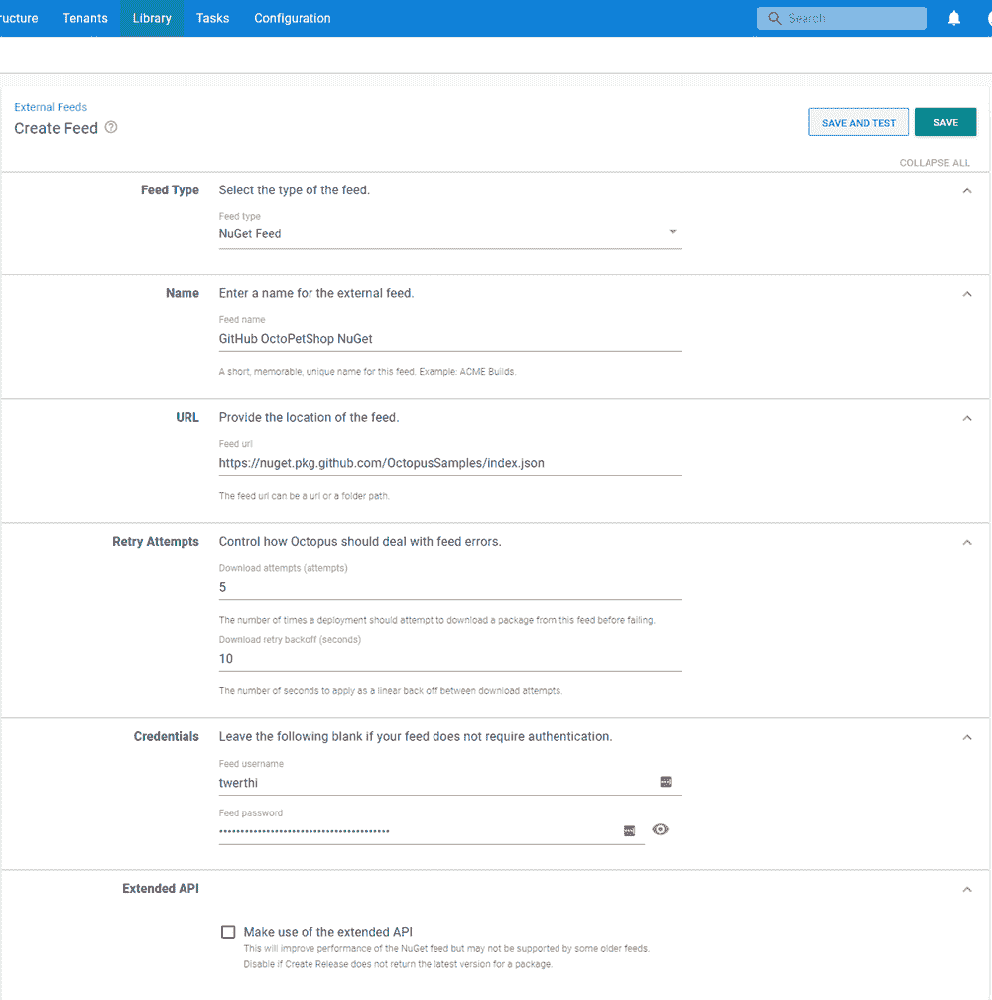
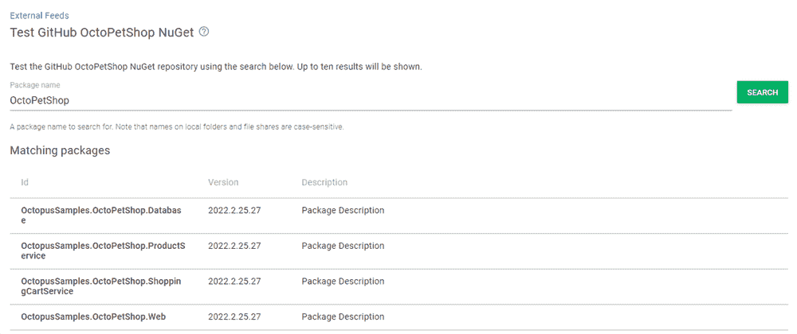

# 将 GitHub NuGet 注册表配置为外部 feed - Octopus 部署

> 原文：<https://octopus.com/blog/github-nuget-external-feed>

GitHub 已经不仅仅是一个源代码库。GitHub 的人们已经开发了一些功能，比如他们的构建服务器产品、GitHub 操作和问题跟踪。他们甚至开发了 GitHub 包，这是一个与 Docker 容器、npm、Maven、NuGet 包和 RubyGems 兼容的注册表。

在这篇文章中，我将向您展示如何配置 GitHub Actions 作业来将. NET 核心 NuGet 包推入注册表，并将注册表连接到 Octopus Deploy，作为一个[外部提要](https://octopus.com/docs/packaging-applications/package-repositories)。

## 正在配置。网络核心应用

要将包推送到 GitHub 包，需要在`.csproj`文件中指定`RepositoryUrl`元素。当打包并将包推送到注册表时，`dotnet`命令会使用这些信息。以下是 OctoPetShop 数据库项目的一个示例:

八分之一样本。OctoPetShop.Database.csproj

```
<Project Sdk="Microsoft.NET.Sdk">

  <PropertyGroup>
    <OutputType>Exe</OutputType>
    <TargetFramework>netcoreapp2.1</TargetFramework>
    <RuntimeIdentifiers>win-x64;linux-x64</RuntimeIdentifiers>
    <TargetLatestRuntimePatch>true</TargetLatestRuntimePatch>
    <RepositoryUrl>https://github.com/OctopusSamples/OctoPetShop.git</RepositoryUrl>
  </PropertyGroup>

  <ItemGroup>
    <PackageReference Include="dbup" Version="4.2.0" />
  </ItemGroup>

  <ItemGroup>
    <EmbeddedResource Include="scripts/*.sql" />
  </ItemGroup>

  <ItemGroup>
    <None Update="deploy.sh" CopyToOutputDirectory="PreserveNewest" />
    <None Update="deploy.ps1" CopyToOutputDirectory="PreserveNewest" />
  </ItemGroup>

</Project> 
```

## 配置 GitHub 操作构建

除了构建应用程序，GitHub Actions 作业还需要执行以下活动:

*   将应用程序组件打包到 NuGet 包中
*   添加 NuGet 存储库源
*   将包推入包注册表

所有这些命令都可以在。NET CLI。

### 将应用程序打包到 NuGet 包中

您可以通过多种方式将应用程序打包到 NuGet 包中。这篇文章使用了内置在。NET CLI。

要设置包版本，请使用 MSBuild 语法`-p:PackageVersion $PACKAGE_VERSION`。变量`$PACKAGE_VERSION`在之前的 GitHub Actions YAML 中已经声明过了(参见[我们的 OctoPetShop 示例](https://github.com/OctopusSamples/OctoPetShop/blob/master/.github/workflows/dotnet-core-nuget.yml)了解整个过程)。以下是显示 OctoPetShop 数据库项目打包的构建摘录:

```
 - name: Pack OctoPetShopDatabase
      run: |
        dotnet pack OctopusSamples.OctoPetShop.Database/OctopusSamples.OctoPetShop.Database.csproj --configuration Release --output "$GITHUB_WORKSPACE/artifacts/OctopusSamples.OctoPetShop.Database" -p:PackageVersion=$PACKAGE_VERSION 
```

### 添加 NuGet 存储库源

要定位 GitHub 包注册表，您需要添加注册表作为源。`source` URL 的格式如下:`https://nuget.pkg.github.com/YourGitHubUsernameOrOrganizationName/index.json`。

您还需要指定具有足够权限的凭据，以便将包推送到注册表。您可以创建个人访问令牌(PAT)或使用 GitHub Actions`GITHUB_TOKEN`中的内置密码。

```
 - name: Add source
      run: |
        dotnet nuget add source "https://nuget.pkg.github.com/OctopusSamples/index.json" --username OctopusSamples --password ${{ secrets.GITHUB_TOKEN }} --store-password-in-clear-text --name github 
```

### 将包推入包注册表

您还需要为`push`命令指定凭证，并且您还可以使用`GITHUB_TOKEN`作为`--api-key`参数:

```
 - name: Push packages to GitHub Packages NuGet feed
      run: |
        dotnet nuget push "$GITHUB_WORKSPACE/artifacts/OctopusSamples.OctoPetShop.Database/OctopusSamples.OctoPetShop.Database.$PACKAGE_VERSION.nupkg"  --api-key ${{ secrets.GITHUB_TOKEN }} --source "github" 
```

推送完包后，它们应该出现在 GitHub 项目的**包**部分。

[](#)

## 将 GitHub 包注册表配置为外部提要

GitHub 包注册中心需要认证来拉包。在配置提要之前，首先需要在 GitHub 中创建一个 PAT。

### 在 GitHub 中创建 PAT

创建 PAT 相对简单。首先，点击右上角的个人资料，然后选择**设置**。

[](#)

滚动至左侧菜单底部，点击**开发者设置**。

[](#)

点击**个人访问令牌**，然后**生成新令牌**。

[](#)

给令牌一个描述，选择一个到期时间，并分配`read:packages`权限。点击**生成令牌**。

[](#)

复制新令牌并将其保存在安全的位置。

### 创建外部源

要创建外部进给，点击**库**，然后点击**外部进给**，然后点击**添加进给**。

【T2 

填写饲料表格:

*   **进给类型** : `NuGet Feed`
*   **名称**:输入描述性名称
*   **网址** : `https://nuget.pkg.github.com/YourGitHubUsernameOrOrganizationName/index.json`
*   **凭证**
    *   **用户名**:令牌的用户名
    *   **密码**:您之前生成的 PAT

[](#)

点击**保存并测试**。输入您用自己的版本创建的包的部分名称，以确保 feed 正常工作。

[](#)

## 结论

在这篇文章中，我演示了如何使用。NET CLI 在 GitHub Actions 中，并将包推送到 GitHub Packages 注册表中。然后，我向您展示了如何在 Octopus Deploy 中将注册中心配置为外部提要。

你可能也会对我关于使用 GitLab feeds 和 Octopus Deploy 的帖子感兴趣。

愉快的部署！