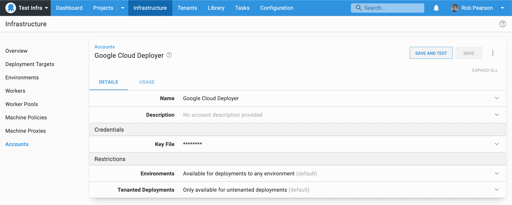
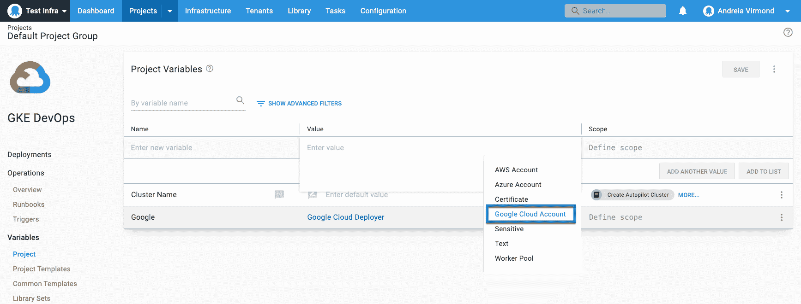
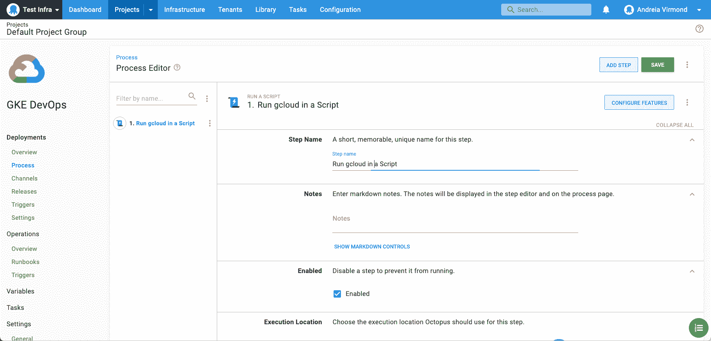
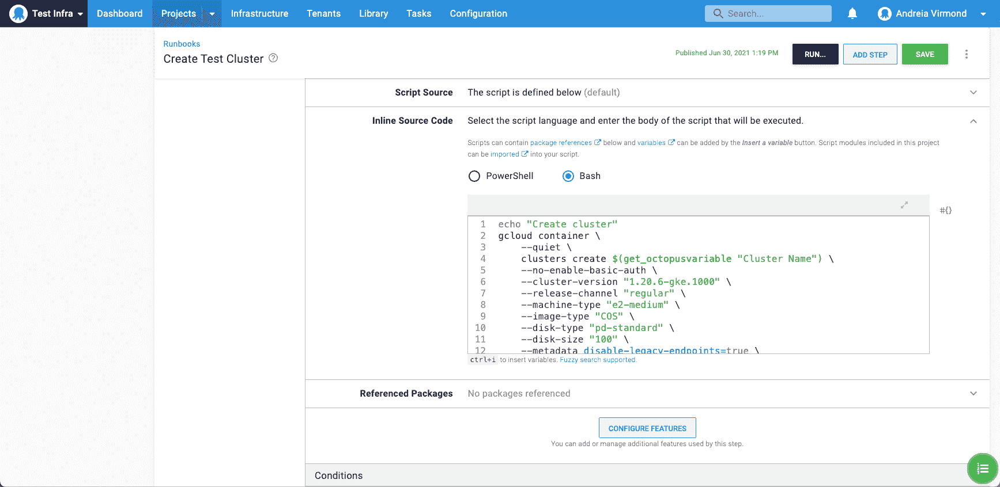

# 介绍 Octopus Deploy 的 Google 云平台集成- Octopus Deploy

> 原文：<https://octopus.com/blog/google-cloud-platform-integration>

根据我们的[公开路线图](https://octopus.com/company/roadmap)，我们引入了对[谷歌云平台(GCP)](https://cloud.google.com/) 的内置支持。

随着这一增加，Octopus 现在为三大云提供商提供内置支持:

这满足了我们客户不断变化的需求，特别是那些拥有 GCP Kubernetes 集群并在 GCP 虚拟机上运行触角的客户。

Octopus 与 GCP 的内置集成允许您:

*   通过专用帐户类型连接到 GCP 并进行身份验证-这允许您集中和保护您的 GCP 身份验证，并在您的部署和操作手册中使用它
*   在现成的定制脚本中使用 GCP 命令行工具 [gcloud](https://cloud.google.com/sdk/gcloud)
*   用[地形](https://www.terraform.io/)创建和拆除 GCP 的基础设施
*   访问由[谷歌容器注册中心(GCR)](https://cloud.google.com/container-registry) 托管的 Docker 图像
*   使用 Octopus 和 Kubernetes 在 GCP 部署、扩展和管理容器化应用程序

GCP 集成在 Octopus Deploy 2021.2 和更新版本中可用。Octopus Cloud 客户已经在运行该版本，内部客户现在可以[下载该版本](https://octopus.com/downloads)。

在我们的[发布公告](https://octopus.com/blog/octopus-release-2021-q3)中了解更多关于 Octopus 2021.2 (Q3)发布的信息。

## 如何部署到谷歌云

为了看到这种新的集成，这篇文章解释了如何在 Octopus 中添加一个新的 Google Cloud 帐户，并运行一个`gcloud`脚本来创建一个新的 Kubernetes 集群。

### 谷歌云账户

[](#)

要与 GCP 整合，首先要在 Octopus 中定义一个谷歌云账户。在 **基础设施➜账户** 中这样做，以及你已经拥有的任何 AWS 或 Azure 账户。

Octopus 管理 Google Cloud steps 使用的 GCP 凭证。这意味着您不需要担心部署过程或 runbook 中的认证，并且您可以运行预认证的`gcloud`脚本。

Google Cloud 帐户受到 JSON 凭证密钥文件的保护，该文件可以从分配给执行部署的实例的服务帐户中检索到。

了解关于[创建谷歌云账户](https://octopus.com/docs/infrastructure/accounts/google-cloud)的更多信息，并查看[谷歌云文档](https://cloud.google.com/iam/docs/creating-managing-service-account-keys)以获取关于创建服务账户和下载密钥文件的说明。

### Google 云帐户变量

[](#)

创建 Google Cloud 帐户后，可以通过类型为 **Google Cloud Account** 的[项目变量](https://octopus.com/docs/projects/variables)在项目中访问它们。项目变量可用于部署和运行手册流程。

在我们的文档中了解有关设置 [Google Cloud 帐户变量](https://octopus.com/docs/projects/variables/google-cloud-account-variables)的更多信息。

#### 运行 gcloud 脚本

Octopus Deploy 帮助你用 Google 云平台在目标上运行脚本。在本例中，我们创建了一个新的 Kubernetes 集群。

这些脚本通常依赖于目标工作人员可用的工具，但是有几个选项可以快速启动:

*   如果你用的是章鱼云，内置的“Windows 2016”[动态工人](https://octopus.com/docs/infrastructure/workers/dynamic-worker-pools)已经预装了`gcloud`。
*   另一个选项是使用 Octopus [`worker-tools`](https://hub.docker.com/r/octopusdeploy/worker-tools) Docker 图像和用于 workers 的[执行容器。](https://octopus.com/docs/projects/steps/execution-containers-for-workers)
*   一般来说，我们建议为您的员工提供您自己的工具。这使您可以控制工具版本，并可以确保它们与您试图执行的脚本兼容。

工人将部署工作从 Octopus 服务器转移到工人池中运行的其他机器上。Octopus Cloud 使用它们来执行定制脚本，它们也通常用于运行云平台和数据库部署的部署和运行手册工作。

阅读我们关于[工人](https://octopus.com/docs/infrastructure/workers)和[工人池](https://octopus.com/docs/infrastructure/workers/worker-pools)的文档来了解更多。

当对 GCP 执行脚本时，Octopus 会自动使用您提供的 Google Cloud 帐户信息向目标实例验证您的身份。或者，您可以使用与目标实例关联的服务帐户。

【T2 

在本例中，您添加了一个新的 [runbook](https://octopus.com/docs/runbooks) 流程，以使用`gcloud`命令行界面创建一个新的 Kubernetes 集群。

为此，使用一个`gcloud container clusters create`命令将脚本中的**Run g cloud**步骤添加到您的自动化流程中。

[](#)

您需要根据自己的需要定制脚本，但它应该是这样的:

```
echo "Create cluster"
gcloud container \
    --quiet \
    clusters create $(get_octopusvariable "Cluster Name") \
    --no-enable-basic-auth \
    --cluster-version "1.20.6-gke.1000" \
    --release-channel "regular" \
    --machine-type "e2-medium" \
    --image-type "COS" \
    --disk-type "pd-standard" \
    --disk-size "100" \
    --metadata disable-legacy-endpoints=true \
    --scopes "https://www.googleapis.com/auth/devstorage.read_only","https://www.googleapis.com/auth/logging.write","https://www.googleapis.com/auth/monitoring","https://www.googleapis.com/auth/servicecontrol","https://www.googleapis.com/auth/service.management.readonly","https://www.googleapis.com/auth/trace.append" \
    --num-nodes "3" \
    --enable-stackdriver-kubernetes \
    --enable-ip-alias \
    --network "projects/<your project>/global/networks/default" \
    --subnetwork "projects/<your project>/regions/australia-southeast1/subnetworks/default" \
    --default-max-pods-per-node "110" \
    --no-enable-master-authorized-networks \
    --addons HorizontalPodAutoscaling,HttpLoadBalancing,GcePersistentDiskCsiDriver \
    --enable-autoupgrade \
    --enable-autorepair \
    --max-surge-upgrade 1 \
    --max-unavailable-upgrade 0 \
    --enable-shielded-nodes 
```

## 结论

我们希望你喜欢在谷歌云平台上部署基础设施。

试试吧，让我们知道你的想法。如果您有任何问题或意见，我们很乐意倾听。请使用下面的评论区或加入[章鱼社区 Slack](https://octopus.com/slack) 的对话。

愉快的部署！