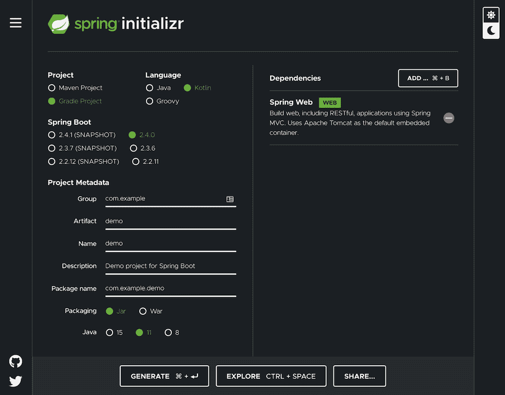

# 章鱼部署 Gradle 插件-章鱼部署

> 原文：<https://octopus.com/blog/gradle-plugin>

[](#)

对于上传到 Octopus 的包，如果您运行的构建服务器本身不受支持，您可以使用 Octopus 命令行(CLI)或 Octopus REST API。对于 Gradle 项目，我们( [Liftric](https://www.liftric.com) )创建了一个小的 Gradle 插件来帮助我们获得与官方支持的 CI-Servers 相似的、没有麻烦的体验:octopus-deploy-plugin。

目前，它支持以下用例:

*   创建并上传包构建信息
*   上传包
*   从 git 历史生成构建信息提交
*   进展八达通部署释放

## 设置示例项目

让我们生成一个 Spring Boot 启动项目来快速启动一个示例项目:

start.spring.io

示例项目必须是一个 Gradle 项目，并且该语言必须使用 Kotlin 在 Kotlin(而不是 Groovy)中生成 Gradle 构建文件。octopus- deploy-plugin 也可以与 Groovy 构建文件一起使用，但是所有的例子都使用 Gradle Kotlin DSL。

还必须添加弹簧腹板和 Spring Boot 致动器相关性。这添加了一个最小的 web 服务和一个健康端点，我们可以打开它来验证项目是否成功运行:

[](#)

解压缩演示项目后，我们可以构建并运行它来验证它是否按预期工作:

```
./gradlew build
java -jar build/libs/demo-0.0.1-SNAPSHOT.jar 
```

现在我们可以通过在`http://localhost:8080/actuator/health`调用健康端点来验证这一点。

## 配置 Octopus 部署插件

接下来，我们将添加 Gradle 插件并添加基本配置。完整的配置使用 Gradle Lazy 配置方法(Provider API ),该方法允许我们依赖其他提供者/任务进行配置，而无需在 Gradle 配置时对值进行硬编码。查看构建生命周期文档，了解为什么惰性配置方法是更好的方法。

`com.liftric.octopus-deploy-plugin`是插件 ID，当前版本是`1.6.0`:

```
plugins {
        id("org.springframework.boot") version "2.4.0"
        id("io.spring.dependency-management") version "1.0.10.RELEASE"
        kotlin("jvm") version "1.4.10"
        kotlin("plugin.spring") version "1.4.10"
        id("com.liftric.octopus-deploy-plugin") version "1.6.0"
} 
```

如果我们调用`./gradlew`任务，我们将看到插件添加的任务:

```
Octopus tasks
-------------
commitsSinceLastTag - Calls git log to receive all commits since the
previous tag or the first commit of the current history.
createBuildInformation - Creates the octopus build-information file.
firstCommitHash - Calls git log to get the first commit hash of the
current history tree
previousTag - Calls git describe to receive the previous tag name. Will
fail if no tag is found.
uploadBuildInformation - Uploads the created octopus build-information
file.
uploadPackage - Uploads the package to octopus. 
```

现在我们必须配置插件(顶级扩展):

```
octopus {
    packageName.set(project.name)
    version.set(project.version.toString())
    serverUrl.set("https://<cloud-instance-name>.octopus.app/")
    apiKey.set("API-XXXXYYYYZZZZZXXXXYYYYYZZZZZ")
    val bootJar by tasks.existing(Jar::class)
    pushPackage.set(bootJar.get().archiveFile)
} 
```

对于名称(`packageName`)和`version`，我们重用了由`start.spring.io`生成器设置的项目值(插件块下的版本，名称在`settings.gradle.kts`中配置)。对于自动版本控制，可能会使用类似于`researchgate/gradle-release`插件的东西，但是静态值对于我们的例子来说是很好的。

`serverUrl`需要您的 Octopus Deploy 实例的基本 URL，该示例使用云实例命名模式。了解如何[创建 API 密匙](https://octopus.com/docs/octopus-rest-api/how-to-create-an-api-key)。

在非原型项目中，出于安全原因，建议不要将秘密存储在构建脚本/存储库本身中。在 Liftric，我们使用 Hashicorp Vault 作为我们的秘密管理工具，甚至提供了一个访问它的小 Gradle 插件:[https://github.com/Liftric/vault-client-plugin](https://github.com/Liftric/vault-client-plugin)。读取安全/秘密环境变量(如 Gitlab 的屏蔽变量)，或从 repo-external 文件(如~ ~/)读取。octopus)可能是成熟的秘密管理解决方案的替代方案。

最后，我们导入`bootJar`任务提供程序，并将`archiveFile`文件属性绑定到`pushPackage`属性，这样插件就知道上传哪个文件。

## 推送构建信息

`uploadBuildInformation`任务为`package` `version`组合构建并上传`build-information`:

```
./gradlew uploadBuildInformation 
```

如果您想调试生成的构建信息，调用`./gradlew createBuildInformation`只构建它而不上传。内容将被打印，但也可以在`build/octopus/build-information.json`处查看。

## 推送包

`uploadPackage`任务上传目标`pushPackage`文件:

```
./gradlew uploadPackage 
```

Octopus Deploy 在包上传期间有一个怪癖:它希望文件的格式是<name>。<version>。<extension>。在 Maven 和 Gradle 的世界中，默认的命名是 <name>- <version>.extension。如果我们保留我们的引导 jar 的默认命名，默认名称是`demo-0.0.1-SNAPSHOT.jar`，它将上传版本为`0.1-SNAPSHOT`的包`demo-0`，这意味着我们必须修改我们的引导 jar 工件的命名:</version></name></extension></version></name>

```
tasks.withType<Jar> {
    archiveFileName.set("${archiveBaseName.get().removeSuffix("-
")}.${archiveVersion.get()}.${archiveExtension.get()}")
} 
```

现在创建了正确的 jar 文件名:`demo.0.0.1-SNAPSHOT.jar`，它与我们生成的构建信息相匹配。

## 了解更多信息

octopus-deploy-plugin 的完整特性集记录在项目的[报告](https://github.com/Liftric/octopus-deploy-plugin)中。