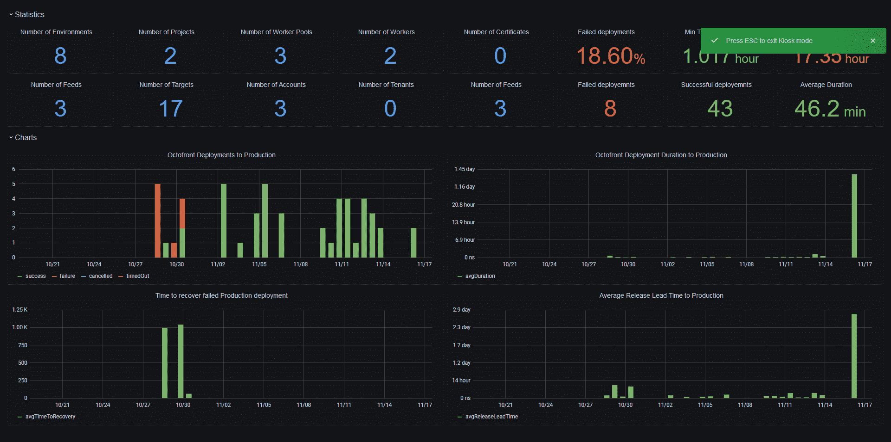

# 集成 Octopus 和 Grafana - Octopus 部署

> 原文：<https://octopus.com/blog/grafana>

[](#)

Octopus 长期以来一直通过`/api/reporting/deployments/xml` API 端点公开部署数据。有了 Octopus 的 Grafana datasource 的 EAP 版本，这些信息可以很容易地可视化，允许团队跟踪他们的部署成功和频率。

在这篇文章和截屏中，我将向您展示如何安装 Grafana 插件，导入示例仪表板，以及定制图表来显示对您重要的信息。

## 截屏

[https://www.youtube.com/embed/bPmjJkkEa3g](https://www.youtube.com/embed/bPmjJkkEa3g)

VIDEO

## 安装插件

这个插件可以通过项目的 [GitHub 发布页面](https://github.com/OctopusDeploy/OctopusGrafanaDataSource/releases)获得。

ZIP 文件需要解压到 Grafana 插件目录下的子目录中。在 Linux 上，这个目录通常是`/var/lib/grafana/plugins`，对于 Windows，默认目录是`INSTALL_DIR\data\plugins`。

对于这个例子，我将部署到 Ubuntu 20.04，我将使用以下命令提取 zip 文件:

```
unzip octopus_grafana_datasource.zip -d /var/lib/grafana/plugins/octopus 
```

## 允许加载未签名的插件

Grafana 区分了签名插件和未签名插件。Octopus 插件是未签名的，必须在 Grafana 中明确允许。这是通过编辑`grafana.ini`文件来完成的。在我的 Ubuntu 虚拟机上，这可以在`/etc/grafana/grafana.ini`找到。

我们需要配置的设置是`[plugins]`部分下的`allow_loading_unsigned_plugins`。该设置必须列出 Octopus 插件的 ID:

```
[plugins]
allow_loading_unsigned_plugins = octopus-deploy-xmlfeed 
```

Grafana 必须重启以加载新的配置，然后加载 Octopus 插件。

## 配置数据源

Octopus 数据源有两个属性:

*   章鱼服务器
*   Octopus API 密钥

[](#)

*Octopus 数据源配置。*

## 导入示例仪表板

我们已经提供了一个显示通用部署指标的示例仪表板。该仪表板可从 [Grafana 仪表板库](https://grafana.com/grafana/dashboards/13413)获得。要导入它，点击左侧面板上的**仪表盘**图标，点击**管理**，然后点击**导入**。在**通过 grafana.com**导入选项下，可以加载[https://grafana.com/grafana/dashboards/13413](https://grafana.com/grafana/dashboards/13413)的示例仪表板 URL:

[](#)

*导入样本仪表板。*

选择上面创建的数据源并完成导入后，将显示以下仪表板:

[](#)

*样本仪表板。*

## 仪表板变量

该插件将空间、环境、项目、渠道和租户作为仪表板[查询变量](https://grafana.com/docs/grafana/latest/variables/variable-types/add-query-variable/)公开:

[](#)

*配置为查询变量的环境的例子。*

然后，这些变量会显示在仪表板的顶部，以自定义在图表中显示哪些部署。变量可以通过**空间名称过滤器**、**项目名称过滤器**、**环境名称过滤器**、**通道名称过滤器**和**租户名称过滤器**字段在查询中引用:

[](#)

*查询中使用的变量。*

## 可用指标

该插件公开了许多指标:

*   **成功**:设置为 1 表示部署成功，否则设置为 0。
*   **失败**:设置为 1 表示部署失败，否则设置为 0。
*   **取消**:设置为 1 表示取消部署，否则设置为 0。
*   **超时**:超时部署设置为 1，否则设置为 0。
*   **总持续时间**:在给定时间段内部署所花费的总时间。
*   **平均持续时间**:给定时间段内部署的平均时间。
*   **总恢复时间**:在给定的时间段内，一次失败的部署和下一次成功的部署之间的总时间。
*   **平均恢复时间**:在给定的时间段内，一次失败的部署和下一次成功的部署之间的平均时间。
*   **总部署提前期**:在给定时间段内，从创建发布到完成部署的总时间。
*   **平均部署提前期**:在给定时间段内，从创建发布到完成部署的平均时间。

计算**总部署提前期**和**平均部署提前期**值需要额外调用 Octopus API，因此如果不需要这些值，就不应该选择它们。

## 结论

我们希望 Grafana 插件能让您深入了解部署的进展情况。这是一个 EAP 版本，所以我们预计会有错误和功能差距，并且只建议在这个阶段进行测试，但是如果您有任何建议或问题，请通过[常规支持渠道](https://octopus.com/support)联系我们。

愉快的部署！