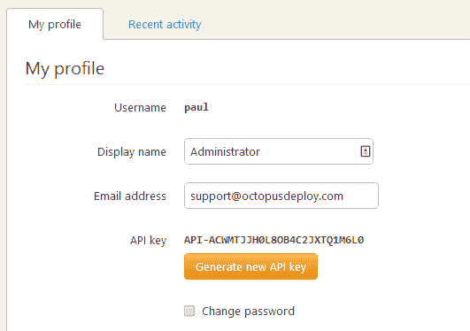
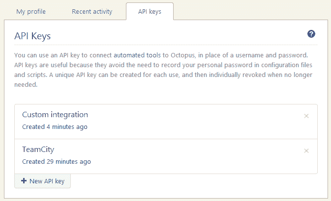
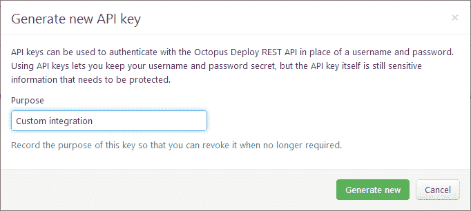
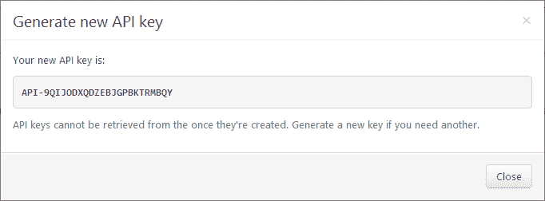

# 哈希 API 密钥以提高安全性- Octopus 部署

> 原文：<https://octopus.com/blog/hashing-api-keys>

在 Octopus Deploy 中，当使用用户名/密码认证时，我们总是小心翼翼地用盐来散列密码，并且我们从不存储纯文本。在早期版本中，我们使用 SHA1 散列，去年三月我们改用 [PBKDF2](https://en.wikipedia.org/wiki/PBKDF2) 。

然而，当使用我们的 HTTP API 时，您也可以使用 API 密钥进行认证。像大多数应用程序一样，我们将 API 密钥存储为一个纯文本字符串(尽管[Octopus 数据库本身是加密的](http://docs.octopusdeploy.com/display/OD/Security+and+encryption))。

许多基于网络的应用程序都是这样工作的——登录后，你会发现一个纯文本的 API 密匙。这意味着密钥可能以纯文本的形式存储在数据库中，或者可以被解密。这意味着，如果有人能够以某种方式从数据库中读取内容，他们就有可能获取您的 API 密钥并使用它来冒充您。

亚马逊网络服务最近[做了一个改变](http://blogs.aws.amazon.com/security/post/Tx1R9KDN9ISZ0HF/Where-s-my-secret-access-key)。过去，您可以在需要时随时返回 AWS 门户获取 API 密钥。现在，当你要一个 API 密匙的时候，他们会给你一次，你应该自己保存它。我不知道他们是否计划开始存储散列的密钥，但这可能是有意义的。

在 Octopus Deploy 2.2 中，我们将做一些类似的事情。我们将使用 PBKDF2 存储经过散列和加盐的 API 密钥，就像我们存储密码一样。**您将无法再从门户网站**获取您的 API 密钥，因为就像密码存储一样，它是不可逆的。我们还将使保留多个 API 密钥成为可能，并在其中一个密钥泄露、意外共享或不再需要时停用它们。

当您请求一个 API 密钥时，您可以给它一个名称。我们假设您将立即使用 API 键进行特定的集成。

生成密钥后，您只能看到密钥一次，我们只存储散列版本。如果你需要再次使用它，把它放在一个安全的地方，比如一个密码管理工具。

为了改进审计，我们还将添加在您对任何审计事件使用 API 密钥时使用的身份验证方法。这样，如果一个 API 键被破坏并被用来做一些淘气的事情，你就知道该停用哪个 API 键。