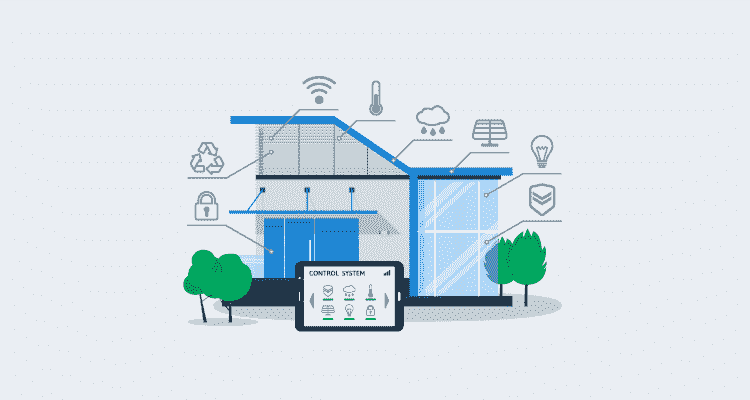
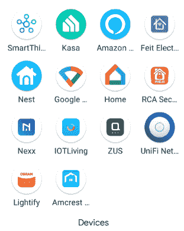

# 家庭自动化的经验教训- Octopus 部署

> 原文：<https://octopus.com/blog/home-automation>

在 Octopus Deploy，我们痴迷于自动化。正如你所料，这种痴迷超越了部署，我们许多人都涉足家庭自动化领域。

家庭自动化允许我们做一些事情，比如当我们的车进入车道时，让我们的车库门自动打开，或者如果有人被锁在外面，用手机打开门。

虽然家庭自动化是一个有趣的爱好，但它也伴随着挑战。在这篇文章中，我回顾了我在家里使用智能产品时学到的一些经验。

## 第一课:Z-Wave、Zigbee 和 WiFi

也许我学到的最重要的一课是，并非所有的智能设备都以相同的方式通信，它们可能需要特殊的设备来操作。

智能设备分为三个不同的通信类别:

Z-Wave 和 Zigbee 不会直接连接到您的家庭网络。它们需要中间的东西来接收和传输指令。这些设备通常以集线器的形式出现，集线器是连接到您的网络的一个硬件，可以是有线的，也可以是无线的。

一些中心是品牌特定的，例如 Phillips Hue，除了他们的品牌之外，不与任何东西交流。其他集线器更通用，兼容大多数东西，可能包括 Z-Wave 和 Zigbee 功能。三星 SmartThings 就是一个很好的例子。

虽然集线器是最常见的设备，但也可以通过 USB 适配器与 Z-Wave 和/或 Zigbee 设备通信。我将在这篇文章的后面深入探讨这个问题。

### z 波

Z-Wave 是一种网状网络技术，使用低能量无线电波(通常为 900 MHz 频段)进行通信。作为一种网状网络技术，Z-Wave 设备连接到恒定的电源，如智能插头或智能灯泡，它们可以像中继器一样工作，允许您将设备放置在远离集线器的地方。

### Zigbee

Zigbee 类似于 Z-Wave，因为它也是一种低能量无线电波网状网络技术。然而，Zigbee 使用 2.4 GHz 频段进行通信，类似于 WiFi 的 B/G/N 频段。

如上所述，Zigbee 设备也需要使用集线器来进行通信。就像 Z-Wave 一样，连接到恒定功率的设备充当中继器，以扩展 Zigbee 网络的范围。

### 无线局域网（wireless fidelity 的缩写）

WiFi 设备是三种设备中唯一不需要集线器进行通信的设备。这些设备连接到你的 WiFi 网络，所以更容易与谷歌家庭助手或亚马逊 Alexa 等东西进行通信。

大多数支持 WiFi 的智能设备工作在 2.4 GHz 频段，这是有意义的，因为他们的数据需求通常很小，而 2.4 的范围更大。与 Z-Wave 和 Zigbee 不同，WiFi 设备依赖于接入点位置，不提供范围扩展功能。

## 第 2 课:网状网络父设备

Zigbee 和 Z-Wave 设备都将自己连接到网状网络上的父设备。一旦联系上，他们不会主动寻找“更好”的父母，直到与第一个父母的沟通中断。

要更新 Z-Wave 以使用新的父设备，您可能需要从网络中移除该设备并重新添加它(一些应用程序具有“修复网络”功能，该功能将强制它寻找新的父设备)。

然而，Zigbee 可以找到一个新的父母，如果你关掉旧的，迫使它去找别的东西。

我学到的教训是:如果孩子仍然可以与父母沟通，它“认为”它仍然在线，即使父母不再与其父母或集线器沟通。

## 第三课:有这样一个应用程序

在我的家庭自动化之旅中，早期的问题之一是每个品牌的设备都需要自己的应用程序来控制它们，或者至少执行初始设置。为每个品牌设置一个账户来配置设备很快就变得很繁琐。

我的建议是，确定你想用你的家庭自动化做什么，研究可用的品牌，尽量减少你需要的应用程序的数量。大多数 WiFi 设备都兼容 Google Home 或亚马逊 Alexa，因此一旦配置好，你就不一定需要他们的应用程序来控制设备。

## 第 4 课:当心应用程序需求

我碰到一个智能插头，广告上说价格很低。在购买之前，我阅读了评论，发现它的应用程序*需要*访问你的联系人。那对我来说是一个危险信号。

## 第五课:Google Home、Amazon Alexa 和 Apple HomeKit 的兼容性

最受欢迎的两种语音控制设备是谷歌 Home 和亚马逊 Alexa。绝大多数支持 WiFi 的智能设备将同时支持这两种技术。然而，也有一些没有，所以在购买前要仔细检查。

Apple HomeKit 的生态系统较小，所以如果这是你的自动化平台，请对你正在考虑的设备进行研究。

就 Zigbee 或 Z-Wave 而言，仅仅因为你的集线器兼容，并不意味着谷歌、亚马逊或苹果将与连接到它们的设备一起工作。

例如，我有一个三星 SmartThings hub 来控制我的 Z-Wave 和 Zigbee 设备。我的集线器连接到一些门传感器，用于简单的开/关检测。虽然我的 SmartThings hub 同时连接到 Google Home 和亚马逊 Alexa，但只有 Alexa 可以使用打开/关闭功能。谷歌把门传感器显示为设备，但不知道用它们做什么(没有高级配置)。

## 第 6 课:基本程序/自动化

使用智能设备执行基本自动化(通常称为**例程**)有多种方式:

*   设备的应用程序
*   亚马逊/谷歌

### 设备的应用程序

如第 3 课所述，每个品牌的设备都有自己的应用程序。这些应用程序允许你设置不同类型的自动操作，但是，它们只适用于自己的品牌。例如，我可以使用 Kasa 应用程序设置一个程序，在黄昏时打开我的 TP-Link 智能灯泡。然而，如果我想让我的 Feit 电灯也打开，我需要在 Feit Electric 应用程序中设置相同的自动化。

### 亚马逊/谷歌

亚马逊 Alexa 和谷歌 Home 允许你将单个品牌账户链接到他们的平台，并授权他们控制你的设备。这为您提供了更多的灵活性，因为您可以创建一个自动化来控制多个品牌的多个设备。

在 Google 或 Amazon 上运行的例程增加了动作和触发之间的延迟，因为需要所有的通信。例如，我有一个例程，当门传感器处于打开状态时，它会打开壁橱中的智能灯泡。这两款设备都是通过 Zigbee 连接到 SmartThings hub 的。如果在 SmartThings 应用程序中定义了该例程，灯几乎会立即亮起。如果在 Alexa 中设置了该例程，则在灯打开之前需要整整一秒钟。

## 第 7 课:高级自动化

设备应用程序、谷歌和亚马逊让你能够进行普通的、基本的自动化操作，就像上面的门传感器和智能灯泡。然而，它们都不允许你做高级或复杂的自动操作，例如如果门关闭并且检测到运动，或者如果门关闭并且没有检测到运动，但是湿度高于特定阈值，不要关灯(很可能有人正在洗澡)。对于这种程度的自动化，你需要实现像 [IFTTT](https://ifttt.com/) 或[家庭助理](https://www.home-assistant.io/)这样的东西。

### IFTTT

IFTTT 代表**If This Then than**，是一个众所周知的高级家庭自动化平台。

IFTTT 是一款适用于苹果和谷歌产品的应用，你可以用它来为你的智能设备定义高级例程。它有免费(有限制)和付费两种形式。

### 家庭助理

家庭助理是一个运行在 Docker 容器中的应用程序，具有可配置的存储选项，如 SQLLite、MySQL 或 PostgreSQL。(我的运行在带有 MySQL 后端的 Raspberry Pi 上的 Docker Swarm 中，因为 SQLLite 和 CIFS 合不来。)

家政助理备受推崇。它拥有大量的追随者，并在每次迭代中增加了更多的集成。家庭助理可以使用 USB 适配器而不是集线器来控制 Z-Wave 或 Zigbee 设备。

特洛伊·亨特最近写了一篇关于家庭助手的文章，涵盖了它可以解决的其他问题。

## 第八课:成本

和大多数爱好一样，家庭自动化可能很贵。即使是基本的智能设备，如插头或灯泡，每个也要 15 到 40 美元不等(价格通常取决于通信类型)，集线器可能要 100 美元以上。

## 第九课:了解他人

虽然家庭自动化和高级例程的配置很有趣，但当它们不起作用时，也会同样令人沮丧。想象一下浴室的灯在洗澡的时候熄灭了！

## 结论

家庭自动化是一个有趣的爱好，如果你钻研先进的自动化领域，它会是一个巨大的时间陷阱。我希望我分享的经验能帮助你踏上家庭自动化之旅。