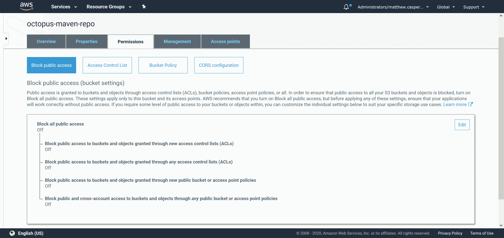
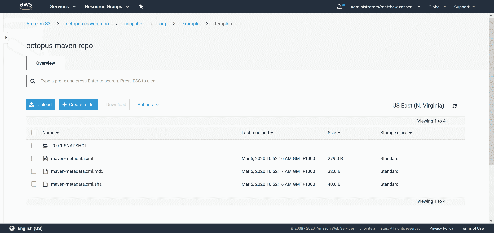
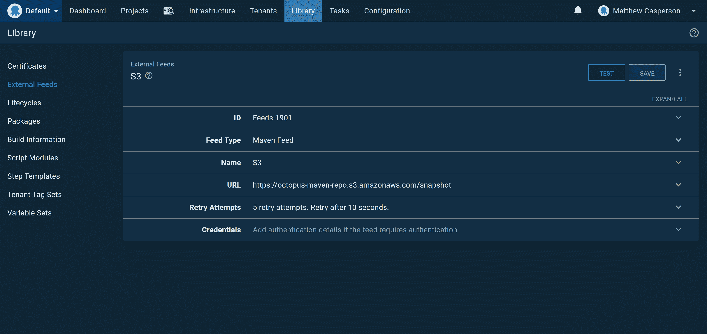
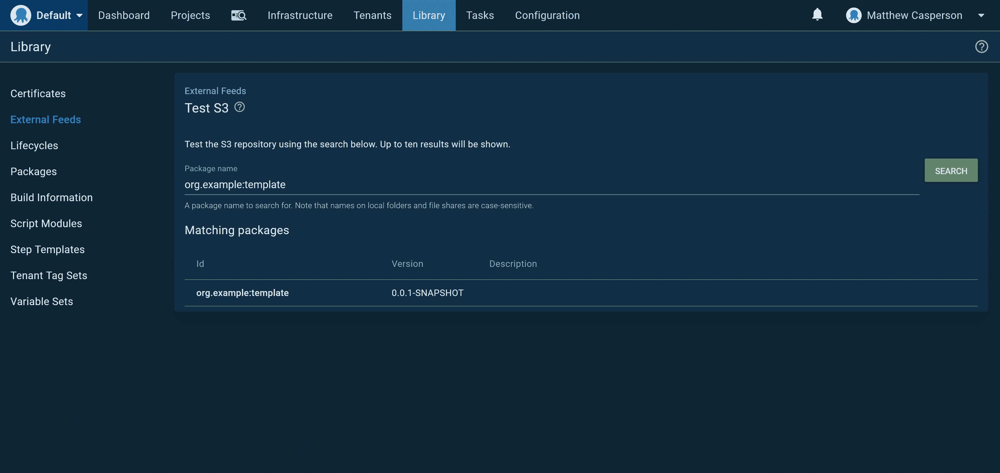

# 在亚马逊 S3 托管 Maven repo-Octopus Deploy

> 原文：<https://octopus.com/blog/hosting-maven-in-s3>

[](#)

包存储库是任何 CI/CD 管道中的核心需求，因为可重复的部署需要在使用标准 API 的工具之间共享正确版本化的工件。

尽管 Maven 是 Java 的同义词，但是 Maven 仓库为几乎所有类型的工件提供了非常灵活的解决方案。Maven 存储库通常存储 JAR 和 WAR 文件，但是它们也可以轻松地存储 ZIP 或 TAR.GZ 文件。

Maven 仓库有些独特，因为它们没有服务器端服务或 API，而是由客户端解析的静态文件组成。这意味着 Maven 仓库可以由几乎任何文件系统托管，包括 HTTP、FTP、WebDAV 或 SVN。

Maven 通过一个名为 [Maven Wagon](https://maven.apache.org/wagon/) 的抽象接口来公开这种文件处理。在这篇博文中，我们将使用一个名为 [S3StorageWagon](https://github.com/gkatzioura/CloudStorageMaven/tree/master/S3StorageWagon) 的第三方库将文件上传到 AWS S3 的 Maven 仓库。

## 编译代码

如果您有兴趣将 S3StorageWagon 集成到您的 Maven 项目中，这篇[博客文章](https://egkatzioura.com/2018/04/09/host-your-maven-artifacts-using-amazon-s3/)解释了这个过程，但是我们将做一些稍微不同的事情，并使用 [deploy:deploy-file](http://maven.apache.org/guides/mini/guide-3rd-party-jars-remote.html) 将单个文件复制到 S3 的 Maven repo 中，而不需要完整的 Maven 项目。

第一步是从 [GitHub](https://github.com/gkatzioura/CloudStorageMaven) 克隆 S3StorageWagon 源代码。使用以下命令编译项目并收集依赖项:

```
mvn "-Dmaven.javadoc.skip=true" "-DskipTests" package dependency:copy-dependencies 
```

在`CloudStorageMaven\S3StorageWagon\target`目录中，您会找到文件`s3-storage-wagon-2.3.jar`。把这个拷贝给`${maven.home}/lib`。

我们还需要在`s3-storage-wagon-2.3.jar`文件旁边复制一些额外的依赖项。附加到 build 命令的`dependency:copy-dependencies`目标将所有的依赖项放到了`CloudStorageMaven/S3StorageWagon/dependencies`目录中。

在一个完美的世界中，我们可以将所有的 JAR 文件从`CloudStorageMaven/S3StorageWagon/dependencies`复制到`${maven.home}/lib`，但是事实证明，这样做会引入一些冲突。通过一个反复试验的过程，我发现这些 JAR 文件需要被复制:

*   云存储核心 2.3.jar
*   aws-java-sdk-core-1.11.595.jar
*   aws-java-sdk-kms-1.11.595.jar
*   S3 11 版。595 .冲突
*   aws-java-sdk-sts-1.11.595.jar
*   杰克逊-注解-2.6.0.jar
*   杰克逊核心 2.6.7.jar
*   杰克逊数据绑定
*   杰克逊数据格式
*   httpclient-4.5.5.jar
*   httpcore-4.4.10.jar
*   joda-time-2.8.1.jar

自从这篇博文发表以来，这些 JAR 文件的具体版本可能已经发生了变化，但是库将保持不变。

## 定义存储库

下一步是在 Maven `settings.xml`文件中定义存储库。该文件通常位于`~/.m2/settings.xml`下。下面显示了一个示例:

```
<settings 
  xmlns:xsi="http://www.w3.org/2001/XMLSchema-instance"
  xsi:schemaLocation="http://maven.apache.org/SETTINGS/1.0.0
                      http://maven.apache.org/xsd/settings-1.0.0.xsd">

  <activeProfiles>
    <activeProfile>s3</activeProfile>
  </activeProfiles>

  <profiles>
    <profile>
      <id>s3</id>
      <repositories>
        <repository>
            <id>octopus-s3-repo</id>
            <url>s3://octopus-maven-repo/snapshot</url>
        </repository>
      </repositories>
    </profile>
  </profiles>

  <servers>
    <server>
      <id>octopus-s3-repo</id>
      <username>AWS ACCESS KEY</username>
      <password>AWS SECRET KEY</password>
      <configuration>
            <region>us-east-1</region>
            <publicRepository>true</publicRepository>
        </configuration>
    </server>
  </servers>
</settings> 
```

这些是重要的设置:

*   定义为`<url>s3://octopus-maven-repo/snapshot</url>`的 URL 包括`s3`协议，这意味着 S3 货车库用于任何传输。
*   定义为`<username>AWS ACCESS KEY</username>`和`<password>AWS SECRET KEY</password>`的 AWS 凭证是有权访问 S3 存储桶的用户的 IAM 凭证。这个用户是在后面的步骤中创建的。
*   用值`<publicRepository>true</publicRepository>`将存储库定义为 public 意味着任何人都可以通过 HTTP 从 repo 下载工件。

## 创建 S3 时段和用户

我们需要创建一个名为`octopus-maven-repo`的 S3 桶，并创建一个可以访问桶中文件的用户。以下 IAM 策略授予 IAM 用户对`octopus-maven-repo`存储桶的完全访问权限:

```
{
    "Version": "2012-10-17",
    "Statement": [
        {
            "Sid": "VisualEditor0",
            "Effect": "Allow",
            "Action": "s3:*",
            "Resource": [
                "arn:aws:s3:::octopus-maven-repo",
                "arn:aws:s3:::octopus-maven-repo/*"
            ]
        }
    ]
} 
```

请记住，S3 存储桶名称是全球唯一的，您必须为您的存储桶指定一个唯一的名称。

下载 IAM 用户的访问密钥和密钥，并替换`settings.xml`文件中`<username>AWS ACCESS KEY</username>`和`<password>AWS SECRET KEY</password>`元素中的值。

## 修复公共权限

AWS 最近通过一个额外的安全层锁定了公共 S3 桶，默认情况下阻止所有公共访问。如果您的存储库将允许公共访问，您需要禁用阻止公共访问的设置。在下面的截图中，您可以看到 S3 铲斗的`Block all public access`设置已经关闭:

[](#)

## 上传文件

最后一步是将文件上传到新的存储库中。以下命令将`template.zip`文件作为工件上传，文件组为`org.example`，ID 为`template`，版本为`0.0.1-SNAPSHOT`:

```
mvn deploy:deploy-file \
  "-DgroupId=org.example" \
  "-DartifactId=template" \
  "-Dversion=0.0.1-SNAPSHOT" \
  "-Dpackaging=zip" \
  "-Dfile=template.zip" \
  "-DrepositoryId=octopus-s3-repo" \
  "-Durl=s3://octopus-maven-repo/snapshot" 
```

然后，生成的文件将作为版本化工件保存在 S3:

[](#)

## 食用章鱼的饲料

使用 S3 作为 Maven 知识库的好处是客户端可以通过 HTTP 访问它。因为我们将我们的存储库配置为公共的，Maven 客户端(比如 Octopus)可以通过 HTTP URL[https://octopus-maven-repo.s3.amazonaws.com/snapshot](https://octopus-maven-repo.s3.amazonaws.com/snapshot)访问工件。

[](#)

[](#)

## 结论

使用 S3 托管 Maven 知识库是一种快速创建公共知识库的方法，不需要任何特殊的软件或托管解决方案。通过使用定制的 Wagon 提供者将工件上传到 S3，然后通过 HTTP 访问相同的文件，我们可以创建一个功能完整的 Maven 存储库，供 Octopus 使用。