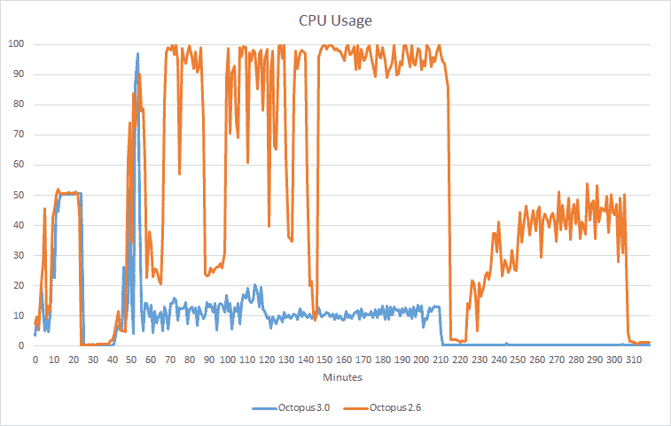
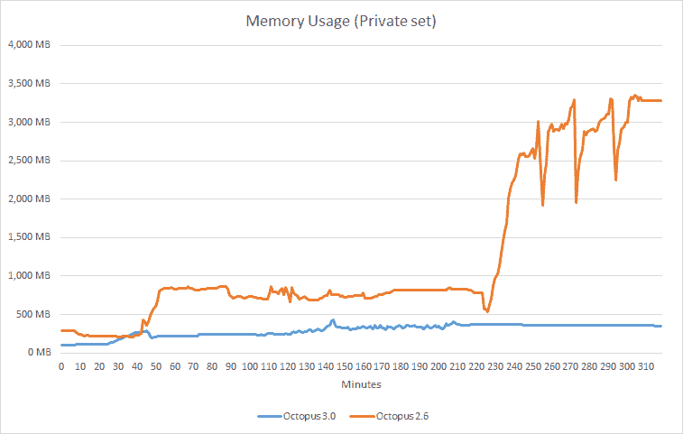

# 章鱼 3.0 如何击败 2.6-章鱼部署

> 原文：<https://octopus.com/blog/how-octopus-3.0-blows-2.6-out-of-the-water>

在 Octopus Deploy，我们一直在努力工作，以创建一个更新，让您的脸上露出微笑。在 2.x 版本中，当我们亲爱的用户测试 Octopus 时，我们经历了一些成长的烦恼。我们对 Octopus 3.0 的目标之一是提供一个主要的性能改进。为了实现这一目标，我们已经:

*   重写了我们的持久层，用 SQL Server 替换了 Raven
*   重写了我们的通讯层，把海龙换成了大比目鱼
*   对日志记录和编排进行了巨大的改进
*   开始测试和测量大规模部署

昨天，作为我们 bug-bash 的一部分，我们在 Octopus 2.6 和 3.0 上执行了一个复杂的部署来比较性能。部署涉及:

*   200 个 NuGet feeds
*   50 个步骤，带 3 个子包步骤
*   从 10MB 到 1000MB 的软件包
*   5 个变量集，每个有 5000 个变量

我们对结果很满意，希望你也一样。3.0 的部署用时 2 小时 41 分钟，而 2.6 用时 4 小时 18 分钟。您会在下面的图表中注意到，3.0 的 CPU 和内存使用率下降的速度比 2.6 快得多:

章鱼服务器 2.6 锤 CPU，两个多小时保持 100%左右。相比之下，Octopus Server 3.0 在部署之初(50 分钟)有一个峰值，然后在部署的剩余时间里持续低于 20%。

什么？！是的，Octopus Server 2.6 使用了将近 3.5GB，而 Octopus Server 3.0 使用了不到 500MB。

在 Octopus 3.0 中，您可以期待显著的性能改进，尤其是对于大型复杂的部署场景。我们将继续研究我们可以改进 Octopus 的方法，并衡量我们的改进，以便您可以相信 Octopus Deploy 可以处理您扔给它的任何部署。此外，还有许多很酷的新功能。即将推出！