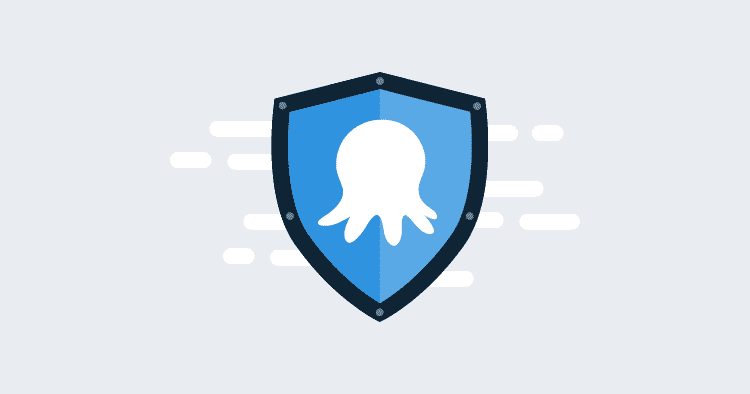

# 章鱼部署到底有多安全？-章鱼部署

> 原文：<https://octopus.com/blog/how-secure-is-octopus-deploy-anyway>

不需要太多的研究就可以得出结论，大多数 It 部门真的关心他们使用的工具的安全性。使用 SaaS 的产品通常是一种信任的练习，章鱼云也不例外。您相信我们会保护您的数据安全，我们也相信您会公平地使用我们的平台，所以这是一个合理的问题，我们到底有多安全？

客户一直在询问我们的安全状况，尤其是章鱼云。现在，我们请他们在线阅读我们的文档，并为他们回答一些特别的问题。

## 我们的安全态势如何？

这是我们不断思考的问题，多年来已经做了很多工作。举几个突出的例子，我们有很棒的 [RBAC 系统](https://octopus.com/docs/security/users-and-teams)，支持[许多流行的认证提供商](https://octopus.com/docs/security/authentication)，我们有[可靠的审计功能](https://octopus.com/docs/security/users-and-teams/auditing)来帮助您保护您的实例，并在您实施我们的产品时保持这种状态。我们已经做了一些功课，比如 [GDPR 合规](https://octopus.com/legal/gdpr)，我们对[开源许可](https://octopus.com/docs/credits)的使用，以及在我们的[状态页面](https://status.octopus.com/)上指出事件。

当新功能被创建时，我们通常会有一个内部 bug bash，我们会定期进行渗透测试，这些测试是由该领域的知名公司和我们自己进行的。

我们的态度一直是，为我们产品的安全性做一些实质性的事情比勾选一些合规性方框更重要。

## 相信我们的话

话虽如此，要求人们相信我们的话只能让我们到此为止，也只能持续这么久。你如何核实我们的工作？现在，你不能，除了我们的行动和我们的记录。

为了帮助您验证我们的立场，我们正在努力为我们的产品和支持其发展的事物获得 ISO 27001 合规认证。在短期内，我们将分享来自云安全联盟(CAIQ Lite v3.1)的自我评估问卷，以便让潜在的云客户了解我们目前的状况。最终，实现 ISO 27001 合规性不仅有利于我们的八达通云客户，也有利于我们的自主托管客户。

所有人都说，这将是一个艰难的旅程，但我们认为我们已经准备好了。我们已经定义了我们希望采用的[高级路线图](https://github.com/OctopusDeploy/Issues/issues/6523)，因此您可以更详细地了解我们的计划。

## 信任，但要验证我们

尽管我们一直致力于实现 ISO 27001 合规性，但我们仍然专注于实际的安全改进，毕竟:

> ***证书并不能让你安全**，但我们的目标是让获得证书的过程有助于确认我们值得你的信任，并帮助我们提高我们的安全水平。*

我们认识到安全不是一种状态；这是一种生活方式的选择。我个人认为能够回答“您的安全状况如何？”用其他企业可以理解的通用语言有很大的价值。

它迫使我们以更全面的方式考虑我们的安全。认证将为我们提供一个常用的路线图，用于分析我们当前的状况并做出进一步的改进，但它也将迫使我们以更系统的方式思考风险管理。

## 轮到你了

在我们进行这一过程时，了解您的优先事项对我们来说非常重要。我们怎样做才能值得您的企业信任？认证对你来说重要吗？如果重要，是哪些？也许我们应该考虑其他的事情？我们很乐意听取您对此的想法和意见。