# 如何:使用 Octopus Deploy 部署 SQL Server 数据库

> 原文：<https://octopus.com/blog/howto/deploy-a-sql-database>

在尝试自动化部署时，数据库可能是最棘手的组件之一。在这篇文章中，我将向您介绍一种处理自动化 SQL Server 数据库部署的方法。这不是唯一的方法，但这是一种多年来对我很有效的方法。

**更新:你可能也想看看一个叫做 [ReadyRoll](http://support.ready-roll.com/customer/portal/articles/889376-deploying-sql-server-dbs-with-octopus) 的第三方工具，它可以为 Octopus Deploy** 制作软件包

## 目标

也许您有一个现有的数据库，并且希望从现在开始自动部署对数据库的更改。或者，对于一个新的应用程序，这可能是一个全新的数据库，您希望从一开始就做正确的事情。无论是哪种情况，我们都应该努力实现一些目标:

1.  我们希望它简单
2.  我们希望它是可重复的
3.  我们希望对变更的开发、QA 和生产部署使用相同的流程
4.  我们不想变得过于依赖 Octopus Deploy 或其他工具

第四点可能听起来出乎我的意料，但实际上，Octopus Deploy 的目标之一是你创建的包应该是独立有用的，*不需要依赖 Octopus。这就是为什么 Octopus 使用 web.config 文件、appSettings、XML 转换和 PowerShell 等标准约定。在最坏的情况下，您可以将 NuGet 包重命名为. ZIP，手动提取文件，手动调用脚本，这样您就部署好了。章鱼的存在只是为了让它更容易。*

## 控制数据库:创建脚本

几年前，我写了一篇关于我如何实现数据库迁移的哲学的博客，我将在这里继续。在我们开始考虑自动化部署之前，我们需要控制数据库。我们将使用*变更脚本*方法来管理部署。

例如，假设 Sally 想要向表中添加一列。为此，她可以使用 SQL Management Studio 中的设计器来添加列并生成一个脚本(Management Studio 中有一个按钮可以完成这项工作)。或者她可能会使用类似于 [Red Gate SQL Compare](http://www.red-gate.com/products/sql-development/sql-compare/ "SQL Compare") 的工具来帮助创建脚本。或者，她可能对 T-SQL 非常了解，足以手写它。

无论用来创建的过程是什么，脚本都是无关紧要的。重要的是,*将会有*剧本。该脚本描述了如何将数据库模式(和数据)从一种状态转换到另一种状态。**这个脚本应该放在源代码控制中。**

例如:

```
alter table dbo.Customer 
add PhoneNumber varchar(20) 
```

这将作为一个文件保存在磁盘上，命名为类似于`Script0091 - Add phone number to customer.sql`的东西。注意名字中的数字；这是因为迁移脚本总是需要以特定的顺序运行(如果一个脚本添加了一个列，而下一个脚本对其进行了重命名，那么不按顺序运行它们是没有意义的)。

这个想法是脚本描述了数据库如何从一个版本转换到另一个版本。**没有人能在不编写脚本并将其签入源代码控制的情况下更改数据库**——即使是 DBA 也不行！:-)

通过这样做，您已经成功地拥有了一个更易于维护的数据库:

1.  它在源代码控制中，所以您可以更好地查看数据库的历史
2.  脚本是连续的，您可以使用任何旧的数据库，通过运行尚未运行的脚本，轻松地将其升级到最新版本
3.  您在 QA 中运行的脚本将与您在生产中运行的脚本完全相同

## 自动化执行

下一步是自动运行这些脚本。这里有几个不同的选项，同样，没有一个是 Octopus Deploy 特定的——您应该能够在不依赖 Octopus Deploy 的情况下处理数据库部署。

一种选择是让 PowerShell 脚本获取脚本，对它们进行排序，并将它们传递给 [SQLCMD](http://msdn.microsoft.com/en-us/library/ms162773.aspx "SQL CMD") 实用程序来执行。

另一个选择是使用开源工具，如 [DbUp](http://dbup.github.com "DbUp") 或[塔伦蒂诺](http://code.google.com/p/tarantino/wiki/DatabaseChangeManagement "Tarantino")，甚至是商业工具，如 [SSW SQL Deploy](http://www.ssw.com.au/ssw/sqldeploy/ "SSW SQL Deploy") 。在这个例子中我将使用 DbUp，因为我认为它是最简单的工具。

## 使用 DbUp 运行脚本

[DbUp](http://dbup.github.com) 是一个类库，您可以从控制台应用程序调用它，所以我将在 Visual Studio 中创建一个控制台应用程序:

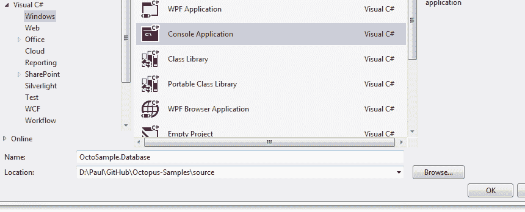

接下来，我将添加 DbUp NuGet 包:

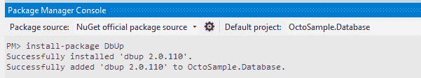

接下来，我将添加一个脚本文件夹，并添加我的 SQL 脚本。在每个脚本文件上，我将设置构建操作，以便将它们嵌入到程序集中:

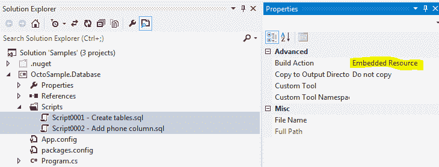

然后，我将把 **Program.cs** 中的`Main()`方法替换为:

```
static int Main(string[] args)
{
    var connectionString = ConfigurationManager.ConnectionStrings["DatabaseConnection"].ConnectionString;

    var upgrader =
        DeployChanges.To
            .SqlDatabase(connectionString)
            .WithScriptsEmbeddedInAssembly(Assembly.GetExecutingAssembly())
            .LogToConsole()
            .Build();

    var result = upgrader.PerformUpgrade();

    if (!result.Successful)
    {
        Console.ForegroundColor = ConsoleColor.Red;
        Console.WriteLine(result.Error);
        Console.ResetColor();
        return -1;
    }

    Console.ForegroundColor = ConsoleColor.Green;
    Console.WriteLine("Success!");
    Console.ResetColor();
    return 0;
} 
```

注意，连接字符串来自我的 app.config 文件的`ConnectionStrings`部分。在我的配置文件中，我添加了以下内容:

```
<?xml version="1.0" encoding="utf-8" ?>
<configuration>
  <connectionStrings>
    <add 
      name="DatabaseConnection" 
      connectionString="Server=(local)\SQL2012;Database=SampleDb;Trusted_connection=true" />
  </connectionStrings>
</configuration> 
```

至此，我已经自动完成了数据库更改——我可以从命令行运行我的应用程序来执行脚本:

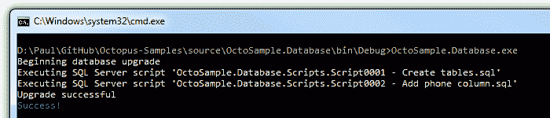

下次运行该应用程序时，DbUp 将检测到它已经运行过:

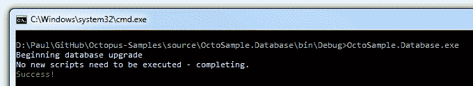

它通过使用一个`SchemaVersions`表来跟踪已经运行的脚本。您可以使用 DbUp API 自定义这种行为，但我认为这是一个很好的默认设置。

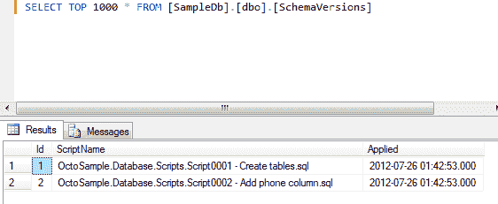

这也给开发人员带来了很好的体验——我团队中的其他开发人员可以获得最新版本，并运行控制台应用程序来更新他们自己的数据库本地副本。我们不再需要使用共享数据库来保持同步。

## 打包 Octopus Deploy 的更改

让我们回顾一下到目前为止我们所拥有的。我们有一套描述数据库需要如何改变的脚本。我们有一个运行这些脚本的控制台应用程序。控制台应用程序从配置文件中获取其连接字符串。所有这些都不依赖于 Octopus 来运行，如果必须的话，我们可以手动运行脚本(或者请 DBA 为我们运行它们)。剩下要做的就是将所有东西打包到一个 NuGet 包中，以便 Octopus 可以运行它们。

我将从添加一个描述我的包的 NuSpec 文件开始:

```
<?xml version="1.0"?>
<package >
  <metadata>
    <id>OctoSample.Database</id>
    <title>Octopus Sample - Database Scripts</title>
    <version>1.0.0</version>
    <authors>OctopusDeploy</authors>
    <owners>OctopusDeploy</owners>
    <licenseUrl>http://octopusdeploy.com</licenseUrl>
    <projectUrl>http://octopusdeploy.com</projectUrl>
    <requireLicenseAcceptance>false</requireLicenseAcceptance>
    <description>Database deployment scripts for the sample application.</description>
  </metadata>
</package> 
```

接下来，我将添加一个非常简单的 **Deploy.ps1** PowerShell 脚本，它将由 Octopus 自动执行:

```
& .\OctoSample.Database.exe | Write-Host 
```

**注意:记得在`Deploy.ps1`的属性上设置`Copy to Output Directory = Copy if newer`以确保它被复制到输出目录**

最后，我将安装 [OctoPack NuGet 包](https://github.com/OctopusDeploy/OctoPack)，它将帮助我创建 Octopus 的最终包:

```
Install-Package OctoPack 
```

此时，如果我将我的构建配置更改为发布模式，我将在我的 bin 目录中获得一个 NuGet 包:

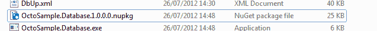

检查这个包，我可以看到它包含了我所有的脚本和运行它们的可执行文件:

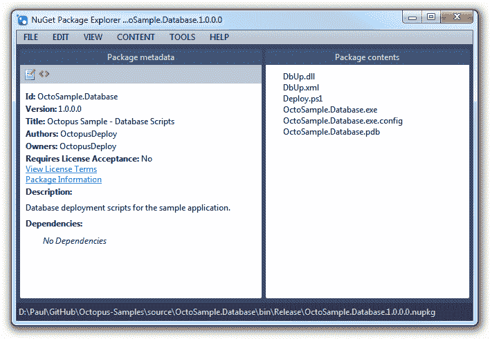

## 使用 Octopus 部署软件包

最后一步是让 Octopus 部署这个包。首先，我将创建一个步骤，并选择它将要运行的机器:

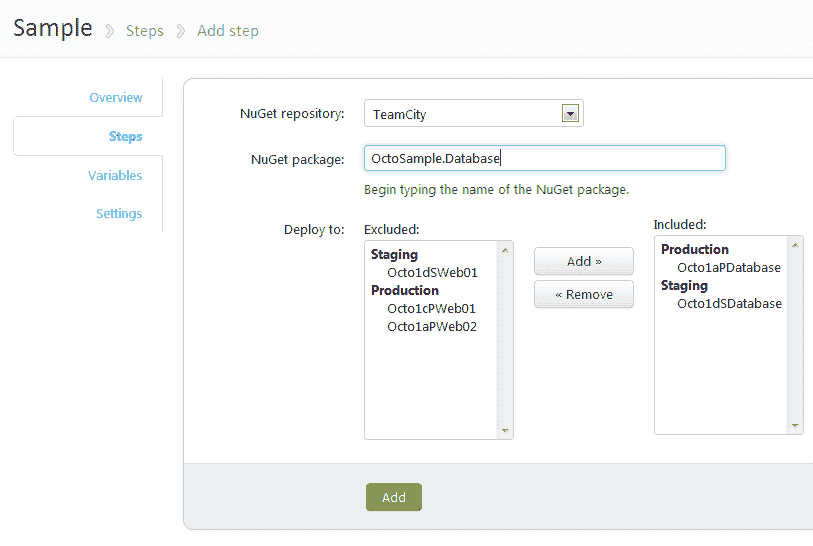

接下来，在 Variables 下，我将为每个环境配置一个带有连接字符串的变量。

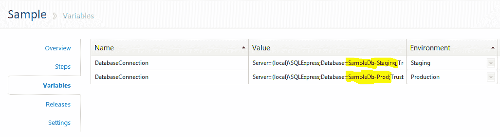

**Octopus 会根据我部署到的环境自动更新 app.config 文件的`connectionStrings`部分。**

现在，我可以将更改部署到暂存:

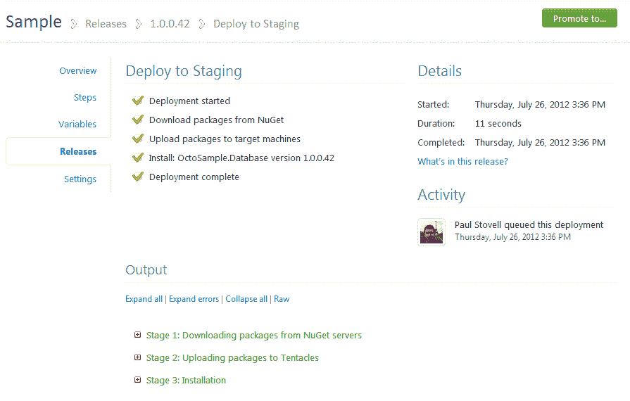

检查输出日志，我看到:

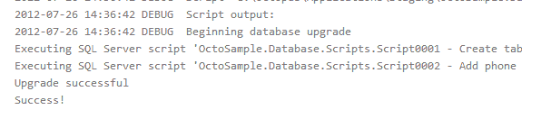

这就是用 Octopus Deploy 实现的自动化数据库部署。

## 摘要

在这篇文章中，我演示了一种使用 Octopus Deploy 实现自动化数据库部署的技术。还有很多其他的解决方案，如果您使用的是 Entity Framework 或 NHibernate，这些工具内置了迁移支持，但是核心方法是相同的。

### 了解更多信息