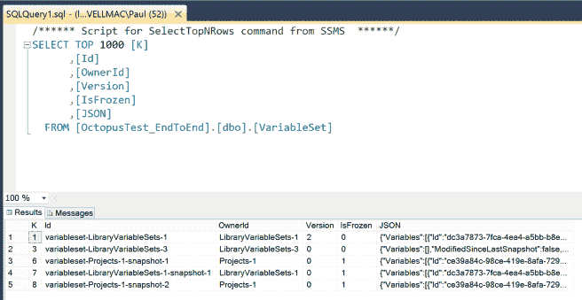

# 我们如何在 Octopus 3.0 中使用 SQL Server-Octopus Deploy

> 原文：<https://octopus.com/blog/how-we-are-using-sql>

在之前的一篇文章中，我宣布我们将把 Octopus 3.0 的[从 RavenDB 切换到 SQL Server。那篇帖子谈到了我们为什么要离开 RavenDB，但没有过多解释我们计划如何使用 SQL Server。在这篇文章中，我想谈谈我们如何使用 SQL Server，并讨论一些小的突破性变化。](http://octopusdeploy.com/blog/3.0-switching-to-sql)

我们刚刚完成了将 Octopus 3.0 移植到 SQL Server 的大部分工作。我们有一套自动化的 API 测试，安装和配置 Octopus 服务器，注册一些触角，并使用 REST API 测试应用程序。这些测试现在已经通过，并且完全针对 SQL Server 运行:

## 版本

我们确保 Octopus 在以下情况下工作:

*   SQL Server 2005、2008、2012、2014 及以上版本；从 Express 到 Enterprise 的任何版本
*   SQL Azure

为了使入门体验顺畅和容易，Octopus 安装程序将为您提供自动下载和静默安装 SQL Server Express edition 的选项，这是免费的。当然，你也可以把它连接到一个集群 SQL Server 企业服务器上，尽管其他 SQL Server 版本的许可费用需要和微软讨论。-)

## 高可用性

如今，Octopus 实际上使用几种不同的数据存储:

*   大多数数据存储在 RavenDB 中
*   部署日志(总是被附加到)存储在磁盘上，因为除非你是 [Schlemiel the Painter](http://en.wikipedia.org/wiki/Joel_Spolsky#Schlemiel_the_Painter.27s_algorithm) 否则不可能附加到附件
*   关于正在进行的部署和其他任务的状态也存储在磁盘上
*   内置存储库中的 NuGet 包存储在磁盘上，元数据存储在 Lucene.NET 索引中

虽然我们支持使用外部(集群)RavenDB 实例，但大多数客户并不真正能够设置和管理它，所以我们几乎总是使用嵌入式版本的 RavenDB。因为我们在许多地方都有数据，所以我们需要在产品中构建我们自己的备份和恢复功能。

对于 Octopus 3.0，我们将确保我们有一个伟大的高可用性故事。大多数企业已经熟悉了如何设置一个集群 SQL Server 实例，并且现场有 DBA 可以帮助管理它。因此，我们的第一个设计原则将是一切(几乎)都需要在 SQL Server 中。具体来说:

*   我们目前存储在 Raven 中的所有文档都将转到 SQL Server
*   部署日志将被压缩(它们压缩得非常好)并存储在 SQL 中
*   正在进行的部署状态:我们将依赖于内存中的状态(参见下面的重大变化部分)
*   NuGet 包仍将在磁盘上(您可以更改它们的存储位置，并将它们放在文件共享/SAN 上)，但元数据将存储在 SQL 中

此外，我们将确保您可以设置多个 Octopus Deploy 服务器，所有这些服务器都指向同一个 SQL 数据库/使用同一个包目录。安装向导和命令行工具将使设置[虹吸管](http://en.wikipedia.org/wiki/Siphonophorae)变得容易:

这不会完全是网络规模，但是 [Stack Exchange 已经很好地证明了](http://stackexchange.com/performance)通过横向扩展应用服务器和纵向扩展数据库，你可以走得很远。

**重大变化:**有一个场景我们将不再支持:在部署期间重启 Octopus 服务器。

以前，您可以启动一个长时间运行的部署，然后关闭 Octopus 服务器，再次启动它，它很有可能会从停止的地方继续运行。我说“机会”是因为不可能测试所有的场景，我们知道在一些领域它不起作用，部署会处于一种奇怪的状态，他们说他们在运行，但实际上没有。通过移除这个特性，我们将能够简化事情并获得更好的性能，因为我不认为它曾经完全可靠地工作过，所以这应该是一个不错的改变。如果这影响到你，请在下面的评论中告诉我！

## 作为文档存储的 SQL

使用像 RavenDB 这样的文档数据库时，我们喜欢(也将会怀念)的一个特性是无需大量连接就能存储和加载大而深的对象图。例如，Octopus 允许您定义[变量](http://docs.octopusdeploy.com/display/OD/Variables)，它们是可以应用于许多不同字段的键/值对。有些客户有成千上万个这样的东西，我们在每个版本中都给它们拍快照，所以用传统的关系模式建模会使事情变得非常复杂。我们实际上永远不会查询这些数据，我们只需要在部署期间将它们全部加载到内存中。

相反，我们将 SQL 视为文档存储。每种文档类型都有自己的表，我们查询的字段将作为常规列存储。但是我们不查询的所有字段和深层对象图都存储为 JSON blob (a `nvarchar(max)`)。

因为我们不做任何连接，所以我们不需要 ORM 来帮助将对象图缝合在一起。相反，我们保持接近金属，本质上使用一些围绕`SqlConnection` / `SqlCommand`的包装器，这些包装器使用 JSON.NET 反序列化 JSON blobs，然后设置额外的字段。自定义 JSON.NET`JsonContractResolver`不包括映射为表列的属性，因此值不会存储两次。

这种设计的唯一缺点是，有一些地方我们必须对表进行`LIKE %x%`查询——例如，查找所有标记有给定角色的机器(角色列表存储为 Machine 表上用管道分隔的 nvarchar 列)。然而，在所有这些情况下，我们期望这些表有几千个条目，所以我真的不认为这有什么关系。如果测试显示不是这样，我们要么使用全文搜索，要么在一个类似 CQRS 的索引表中引入一个新表。

## 备份、恢复和维护

由于我们的所有数据都将位于 SQL Server 或文件共享(NuGet 包)中，因此在此阶段，我希望能够删除我们的自定义备份/恢复功能，而只依赖 SQL Server 备份。我们将提供一些关于如何配置的指导，如果你有一段时间忘记进行 SQL 备份，我们将在 Octopus UI 中提供一些反馈，但总的来说，我认为 SQL Server 的内置备份/恢复功能比我们可能构建的任何功能都要好。

## 移民

从 2.6 到 3.0 的升级体验非常简单:您将安装 3.0，选择/创建一个要使用的 SQL Server 数据库，然后选择要导入的 Octopus 2.6 备份。我们将根据需要转换数据，然后您很快就可以开始运行了。感觉会更像是在 2.5 到 2.6 之间升级，而不是从 1.6 升级到 2.0。

到目前为止，我们已经完成了几乎所有到 SQL Server 的转换，并且还没有进行任何 API 更改，因此没有任何针对我们的 2。X REST API 将在 3.0 上工作。

## 测试

我们收集(选择加入)使用统计数据，并且有一些大型的 Octopus 安装——300 多个项目，1000 多台机器，超过 20，000 次部署。我们将使用这些数据来模拟类似的环境，并确保我们不会发布任何比我们已经拥有的更慢的东西。

我们将首先运行端到端测试，并将当前的 2.6 版本与即将到来的 3.0 版本进行比较，以确保我们当前的操作在较小的数据集上不会变慢。然后，我们将继续进行负载测试，以确保在没有疯狂硬件需求的情况下，我们可以处理比目前至少大 5 倍的安装。

如果有人对这些指标感兴趣，请在评论中告诉我，我会在这个系列的第三篇文章 **:-)**