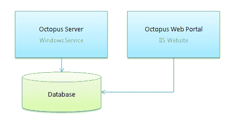
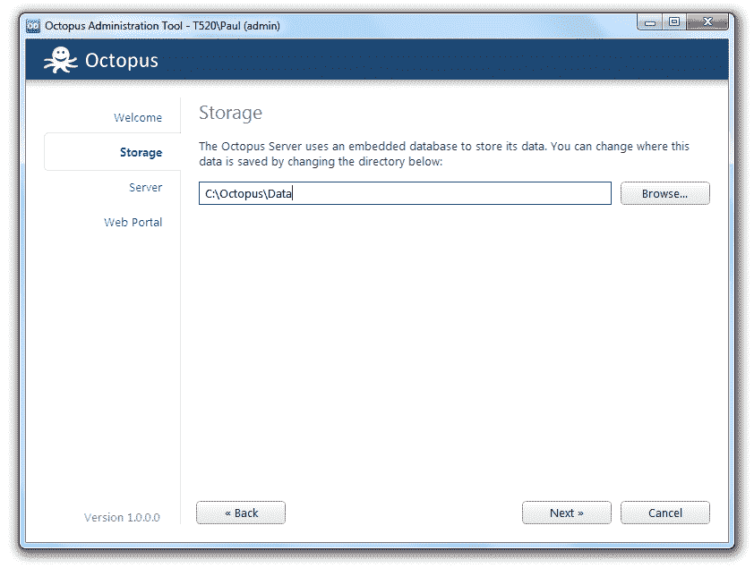
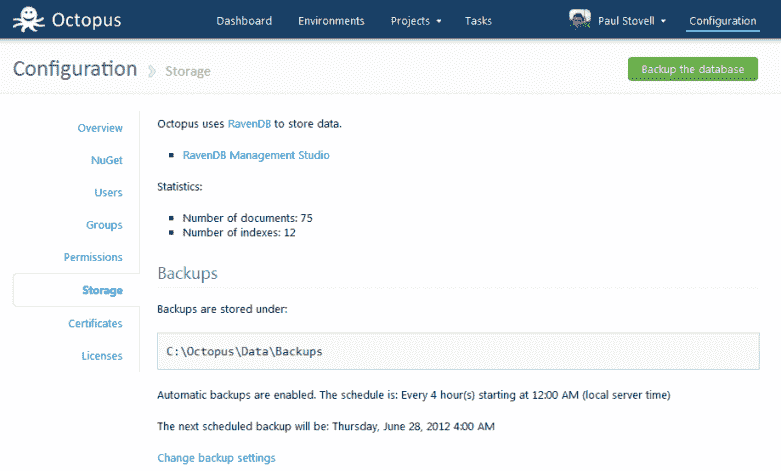

# Octopus 如何使用 RavenDB - Octopus 部署

> 原文：<https://octopus.com/blog/how-we-use-ravendb>

当我开始构建 Octopus Deploy 时，我想构建一些足够好的东西来发布测试版并开始获得反馈。我有很多使用 SQL Server 和 NHibernate/EF 的经验，所以我决定使用 SQL Server + EF 代码优先堆栈作为我的持久层。

在[最近的 1.0 RC 版本](http://octopusdeploy.com/blog/introducing-1.0-rc)中，我把 Octopus 换成了使用 [RavenDB](http://ravendb.net) 。在这篇文章中，我将解释改变的原因，并展示它是如何被使用的。

## SQL Server 让我们失望的地方

测试进行了大约 6 个月后，使用 SQL Server 的决定开始变得越来越受限制。我得到了很多反馈和建议，并且有了很多特色创意。但是我注意到自己根据数据库的复杂程度来权衡特性。我会避免实现意味着太多连接或太多中间表的特性建议。我觉得 SQL 表的僵化本质和笛卡尔乘积的专制对应用程序设计有太多的影响。

不用说，这是一种糟糕的产品设计方式。应用程序的需求应该优先于数据库的需求，而不是相反。然而，我发现自己在决定坚持的事情上几乎是“节俭”的。

SQL Server 也使安装过程变得更加复杂。作为一种热缩包装产品，安装体验对八达通来说非常重要，因为这是客户对该产品的第一次体验。假设用户要么安装 SQL Express，要么使用外部 SQL Server。

这两个都有问题。SQL Express 意味着用户需要运行另一个安装程序。使用独立的 SQL 实例意味着各种各样的安全配置更改，以允许 Octopus IIS 进程和 Windows 服务与数据库对话。我觉得销售一个旨在使自动化部署变得容易的产品是愚蠢的，然而却有如此复杂的安装过程！

## 为什么是 RavenDB？

上面的安装问题表明 SQL Server 不是收缩包装产品的好选择。但是有许多嵌入式关系数据库可能已经工作了——例如 SQLite 或 SQL CE。是什么让 RavenDB 更有吸引力？

有两个原因。第一个是我们的问题领域——部署自动化——似乎自然地导致面向文档的数据模型超过关系模型。对于关系模型，我发现自己担心连接，而我的大多数用例实际上只围绕单个文档。

第二个原因是建筑上的。Octopus 分为两个独立的进程，如下图所示:运行部署和计划任务的 Windows 服务，以及 IIS 网站。



任何嵌入式选项都需要嵌入到一个进程中，但是可以通过另一个进程访问。有了 RavenDB，这就很容易了 Octopus 服务器托管一个嵌入式 RavenDB 实例，该实例也使用 Ravens 嵌入式 HTTP 侦听器在端口 10930 上进行侦听，web 站点在该端口上连接到 RavenDB。这给了我很大的灵活性；您实际上可以使用相同的嵌入式数据库来旋转我们的辅助 Octopus 服务器和网站实例。

这也极大地简化了我们的安装过程。现在，当你安装 Octopus 时，唯一提到的数据库是一个“存储”标签，你可以在这里选择数据的存储位置:



## 文件设计

使用像 RavenDB 这样的文档数据库时，我不得不做的最大调整是弄清楚文档的外观。在 Octopus 中，我们有以下主要文档:

*   **环境**:名称、描述、机器、健康检查结果
*   **项目**:变量，步骤
*   **发布**:变量和步骤快照、发布细节、选定的包版本
*   **部署**:目标环境，选项
*   **任务**:开始、结束、持续时间、输出日志
*   **用户**:姓名，电子邮件
*   **组**:名称、子组、成员用户

这种设计的优势是显而易见的——例如，当我们处理一个**版本**时，我们经常需要知道步骤(要安装的包，要运行的脚本，等等)。).因此，我们在单个文档中获取信息，而不是内部连接。这使它更好地工作。

文档也使得继承关系的建模更加容易。例如，Octopus 会有许多类型的“步骤”:部署包、运行 PowerShell 脚本、等待用户手动干预等等。这些是使用抽象基类建模的。这当然有可能用关系数据库来表示，但是这一点也不好玩。在 RavenDB，它*是*乐趣。我可以随心所欲地构建特性，而不用担心疯狂的连接或级联删除。我觉得解放了。

## 我们如何使用 RavenDB

我有一个理论，应用程序中 90%的性能问题不是由糟糕的算法引起的，而是由糟糕的架构引起的——例如，在控制器和 ORM 之间有服务、管理器和存储库的层。

在 Octopus 中，我们让事情变得简单——ASP.NET MVC 控制器直接与 RavenDB `IDocumentSession`交互:

```
public class GroupsController : OctopusController
{
    readonly IDocumentSession session;

    public GroupsController(IDocumentSession session)
    {
        this.session = session;
    }

    public ActionResult Index(int skip = 0)
    {
        var groups = session.Query<Group>().OrderBy(g => g.CanBeDeleted).OrderBy(g => g.Name).ToList();
        return View(new GroupsModel(groups));
    }
} 
```

或者最多一个控制器[调用一个命令或者一个构建器](http://www.paulstovell.com/clean-aspnet-mvc-controllers)，直接与会话交互。例如，此命令保存一个 NuGet 提要:

```
public class SaveFeedCommand
{
    readonly IDocumentSession session;

    public SaveFeedCommand(IDocumentSession session)
    {
        this.session = session;
    }

    public void Execute(EditFeedPostModel input)
    {
        var feed = string.IsNullOrWhiteSpace(input.Id) ? new Feed(input.Name, input.FeedUri) : session.Load<Feed>(input.Id);
        feed.Name = input.Name;
        feed.FeedUri = input.FeedUri;
        if (input.ChangePassword || !input.IsExisting)
        {
            feed.SetCredentials(input.Username, input.Password ?? string.Empty);
        }

        session.Store(feed);
    }
} 
```

我们使用标准的`ActionFilter`模式在请求开始时打开文档会话，在请求完成时保存更改。

## 问题

我和一个刚刚开始在一个项目中使用 MongoDB 的朋友聊过，他正在努力解决的一个问题是需要定义 map/reduce 索引。我最喜欢的 RavenDB 特性之一是，通常，你可以只使用 LINQ 支持，RavenDB 将隐式创建索引。

不过，我们确实使用了少量的自定义索引，这些索引主要用于预测。例如，在 Octopus 中，`Group`包含该组中用户的 ID 列表——例如,“团队领导”组可能包含“Bob”和“Alice”的 ID。通常，我们需要反向查询这种关系，以回答诸如“Alice 是哪个组的成员”这样的问题。这是通过使用 map/reduce 索引实现的:

```
public class UserGroups : AbstractIndexCreationTask<Group, UserGroups.Result>
{
    public UserGroups()
    {
        Map = groups => from g in groups
                        from u in g.Users
                        select new Result {UserId = u, GroupIds = new[] {g.Id}};

        Reduce = results => from r in results
                            group r by r.UserId into g
                            select new Result { UserId = g.Key, GroupIds = g.SelectMany(i => i.GroupIds).ToArray() };
    }

    public class Result
    {
        public string UserId { get; set; }
        public string[] GroupIds { get; set; }
    }
} 
```

目前，我们只有三个自定义索引——我们的大多数查询都使用通过 LINQ 查询创建的隐式索引。

## 贮藏

> 有些人在遇到性能问题时，会想“我知道，我会使用缓存”。现在他们有两个性能问题。

众所周知，缓存失效是很难纠正的，所以在 Octopus 中我们实际上避免了它——只有几个地方我们显式地使用了缓存，而且它们都不是为了缓存数据库结果(它们实际上是 NuGet 提要查找)。

现在，这个特性在 RavenDB 中经常被忽略，但是 RavenDB 实际上提供了开箱即用的缓存。不，真的，再读一遍。 **RavenDB 为您提供开箱即用的缓存。**这是巨大的！更重要的是，它没有失效问题。

Ayende [在他的博客](http://ayende.com/blog/25601/ravendb-aggressive-caching-mode)上解释了这个特性，但是让我把它解释成 SQL Server 实现了这个特性。首先，您发出如下查询:

```
SELECT * FROM User where IsActive = true 
```

返回 100 个结果。

几秒钟后，可能在另一个 HTTP 请求中，您发出相同的查询:

```
SELECT * FROM User where IsActive = true 
```

除了执行查询并再次点击磁盘并第二次传输结果之外，想象一下，如果 SQL 简单地返回一条消息，告诉您**自上次查询以来没有发生任何变化，并且您应该重用原始结果(如果您仍然拥有它们**)。

SQL Server 能做到这一点吗？不，它不能。您可以发出一个花费 SQL Server 10 秒钟执行的查询，然后立即再次发出该查询，它将再花费 10 秒钟计算与之前相同的结果，尽管它应该知道什么都没有改变。

使用 RavenDB，如果内存中已经有了结果，那么可以提交来自原始 HTTP 结果的 ETag，RavenDB 将通过检查索引状态来告诉您结果是否已经改变。Raven 客户端库可以为您做到这一点。这是一个很棒的功能，值得更多的宣传。

## 自动备份

我曾经在一个使用运行在虚拟机上的 TeamCity 的团队中工作过。一天，虚拟机崩溃了。我们一直使用嵌入式数据库，从未建立任何备份系统。所以数据丢失了，我们花了几天时间才重新设置好。

当你安装 Octopus 时，它会每两个小时自动备份一次自己的数据库。默认情况下，它备份在与 RavenDB 数据库相同的文件夹下，但是我们让它非常容易更改——例如，您可能会将它指向一个备份的文件共享:



我们通过嵌入[RavenDB smugger](http://ravendb.net/docs/server/administration/export-import)库来实现这一点，并有一个预定的 Octopus 任务来自动执行将数据库“导出”到一个配置好的文件夹中。

RavenDB 确实有一个[备份/恢复](http://ravendb.net/docs/server/administration/backup-restore)特性，它有一些好处(例如，备份索引结果)，但也有一些缺点(它对创建备份的机器和恢复备份的机器之间的操作系统兼容性有更严格的要求)。由于无法恢复的备份不是很有用，为了安全起见，我选择使用导入/导出功能，而不是默认的备份/恢复。

## 我们应该两者都支持吗？

我被问到的一个问题是:

> 你能为数据存储选择吗？例如，用户可以选择在安装过程中是使用 RavenDB 还是 SQL Server。

如果我选择了另一种关系模型，这是有可能的——例如，NHibernate 支持大量的数据库提供者。但是 NHibernate 不支持 RavenDB，这并不是因为它只是没有实现，而是因为它们是根本不同的模型。试图同时支持这两者意味着无法真正利用其中任何一个的特性，最终我会得到两个世界中最糟糕的结果。

此外，在要求 SQL Server 将数据存储放在安装产品的用户的前端和中心的同时，我希望使用 RavenDB 的选择将淡出后台。当应用程序维护自己时，谁会关心使用哪种技术呢？这是一个实现细节。

## 结论

切换到 RavenDB 需要一点时间，大部分时间是重新编写应用程序，以充分利用面向文档的持久性模型提供的优势。RavenDB 的嵌入式特性使得我们的安装过程变得更加简单，我感觉应用程序受到的约束也少了很多。

RavenDB 是一个非常棒的产品，虽然 SQL Server 仍然有它的一席之地，但我觉得 RavenDB 已经达到了一个真正的最佳状态。除了报告解决方案之外，我实在想不出我在过去工作过的任何一个基于 SQL Server 的应用程序作为文档存储不会更好。

时间将会证明 NoSQL 运动将会如何发展，但是就我个人而言，我觉得使用文档数据库比使用关系数据库要快乐得多，尤其是对于这个应用程序。