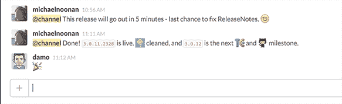

# 我们的工作方式。最近的一些教训-章鱼部署

> 原文：<https://octopus.com/blog/how-we-work-some-lessons>

最近，我们的一位出色客户向我们提出了一个问题，除了说了一些关于我们的非常好的事情(我们喜欢这样的反馈)之外，他还问道:

> “我很想知道你们使用什么样的工具和方法来保持一切顺利运行？”

大约六个月前，Paul 写了一篇关于我们如何工作的博客，但我们仍然是一个小团队，一个不怕尝试新事物的团队，所以事情总是在变化。

这里有一个关于这里发生了什么，发生了什么变化，以及我们在这个过程中学到的一些经验教训。

## 混乱和无序

不久前，我们有一个松散地基于 Scrum 的流程，让我们每两周就有可能发布一些东西。

然后我们做了一件我们努力帮助你不要做的事...那就是 8 个月没有主要发布了！

当你这样做的时候，这意味着当你在做事情和构建特性的时候，还有大量的、无法量化的“事情”要做。我相信你也有过这样的经历，你已经完成了 90%,然而最后 10%的收尾工作却花了 90%的时间。

就是没有合适的时间框工作的问题。许多尝试 Scrum 但没有投入生产的团队也遇到了这个问题。没有严格的截止日期，很容易变得有点自满，留下一些未完成的角落。

公平地说，我们同时处理了大量的架构变更，试图让所有的东西同时工作是相当浪费的。

## 截止日期、Bug Bashes、群集和看板

我们用了几样东西来摆脱困境。我们为我们的[预发布](http://octopusdeploy.com/blog/octopus-3.0-pre-release-is-here)设定了一个日期，并查看了我们需要什么来让我们到达那个点。

我们现在相当定期地做一些我们称之为“bug bash”的事情。我们都安装了一个构建，并花了一个下午试图用各种方法破坏它。我们寻找 bug，不一致，可用性问题，以及其他任何会影响体验的东西。我们把它们都存放在像特雷罗这样的地方。

因此，考虑到预发布，我们这样做了，并开始一次修复一个。这意味着我们有一个非常有限的工作在进行中，我们都非常密切地合作，让一切都通过我们的特雷罗董事会，并进入一个构建。

一旦我们发布了公共预发布，我们就保持这种状态，发布了许多版本，并在我们的板上不断地集中讨论这些问题，以快速修复它们并将其纳入新版本。

## 连续交货

正如保罗上周所说，我们正努力保持这种势头，并更经常地发货，因为它能做一些事情。它让我们专注于“完成”，并帮助 Octopus 每天更好地部署。如果我们(或客户)发现了一个 bug，如果我们可以在第二天发布一个补丁，为什么我们要故意将这个 bug 发布给每个下载我们产品的人两周呢？

我们一直在做一些有趣的事情来自动化我们的许多发布过程，我们也将很快开始分享。

## 更小的团队，更短的站立

当我们还小的时候，对每个人来说跨越一切是有意义的，我们都在一次冲刺中完成。最近几个月，虽然我们碰到了一个点(很多人都熟悉)，我们的站立不集中，你经常需要后续对话来实际计划你的一天。但是我们喜欢在早上看到每个人的脸，所以我们不想把他们放在一起。

所以我们分成了更小的团队，每个团队都有更专注的单口相声。

你看，在我们发布 3.0 的同时，我们也重建了我们的网站。我们改变了设计，从 RavenDB 转移到 SQL Server(使用我们为该产品编写的同一个库，我们可能很快就会开源它)，将它转移到 Azure，并进行了一系列其他更改。

因为我们更有规律地发布这两种产品，所以“站立”更多地是关于“我们需要为下一个版本做什么”，这比标准的“我昨天做了什么，我今天在做什么”类型的问题更集中。

人们也经常提前几分钟加入聚会，所以我们可以聊聊天，聊聊天。

## 每周回顾和计划

我们尽量每周都在同一个房间进行回顾和计划。这并不过分正式，任何有值得展示的东西的人都会做一个简短的介绍、演示或讨论。今天晚些时候，我们将分开来看看下周的优先事项，并讨论任何需要一个小组的事情。这有助于我们在做什么和为什么做的问题上达成共识。

## 适用于分布式(或非分布式)劳动力的工具

虽然我们大部分时间都在布里斯班，而且我们有一个办公室，但我们仍然经常在家工作。我们为此使用的工具有所改变，但这是每个人都想知道的有趣之处。

### 松弛的

我们喜欢 T2 的 Slack T3，几乎可以用它做任何事情。我们所有的其他工具都将它们的信息传输到它里面，所以它是我们公司的持续脉动。这是团队内部合作的一个很好的工具。它可能会有点吵，但你总是可以关闭一段时间，然后在重新上线时补上历史记录。如果有人需要你，提到你的名字就可以在你选择的移动设备上变成一个通知，这样你就可以非常灵活地工作了。添加自己的表情符号也很有趣！

### 谷歌视频

我们使用 Google Hangouts 已经有一段时间了，但我们使用它的次数越来越多。经常会出现文本聊天不起作用的时候，我们已经非常善于认识到这一点，并跳转到一个地方。我认为这是以分布式方式工作的诀窍，知道何时升级到更高保真的交流媒介。

### 华夫饼. io

这是我们工具库的新成员。我们使用 GitHub 来处理代码和问题，以前我们使用 [HuBoard](https://huboard.com/) 来处理我们的问题。HuBoard 不错，但我们发现[华夫饼。io](https://waffle.io/) 对我们来说更好一点。通过一些 GitHub web 挂钩，它让我们可以在 board 和 GitHub 之间进行实时双向同步(直接在 GitHub 中工作对很多事情来说更容易，HuBoard 需要刷新才能获得更改)。它还有一个很棒的功能，即[链接问题和板上的拉请求](https://github.com/waffleio/waffle.io/wiki/FAQs#prs-and-issues)，这些请求会移动到“待审核”栏。

## 课程

他们说，生意场上最危险的一句话是“但我们一直是这么做的”。能够发现问题并做出改变是非常重要的。这是我们“我们如何工作”的最新版本，随着时间的推移，我相信它会再次发生变化。

其他的一些教训是，运输迫使我们把注意力集中在完成事情上，运输经常会在你的团队中根深蒂固。与此相反的是，同时处理太多事情会分散对运输的关注，这使得运输变得更加困难。

纠正这一点并[【群集】](http://programmers.stackexchange.com/questions/147664/what-is-swarming)回到正轨是扭转你的团队的好方法。