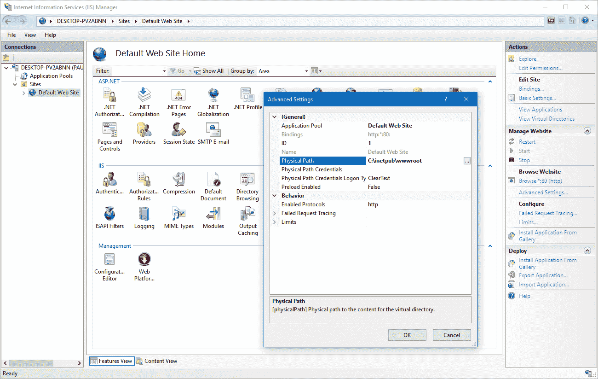
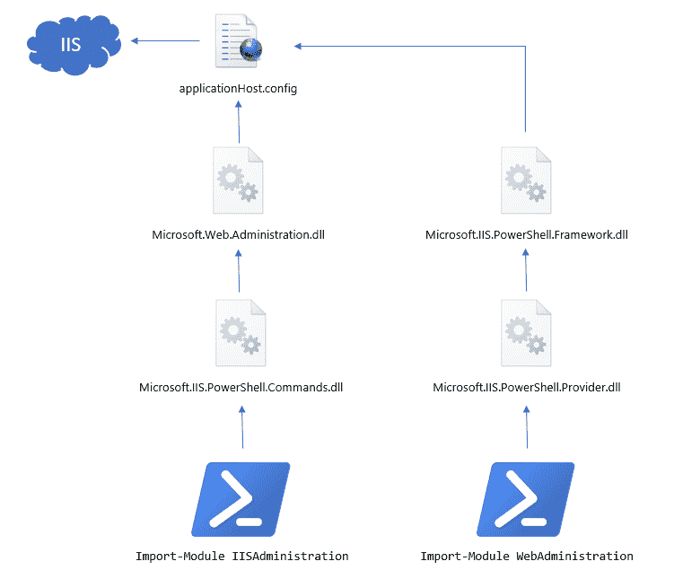
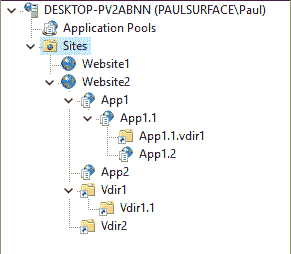

# PowerShell 和 IIS: 20 个实例- Octopus 部署

> 原文：<https://octopus.com/blog/iis-powershell>

在 Octopus Deploy，我们用 IIS 做了大量工作。如果把我们所有客户的部署遥测数据加起来，我们已经完成了超过一百万个网站和服务的部署。在这一过程中，我们学到了很多东西，包括如何使用 PowerShell IIS 模块，它们如何在幕后工作，以及如何可靠地使用它们。我在这篇文章中的目标是分享这些知识，并建立一个单一的地方，当人们需要使用 PowerShell IIS 模块时，我们可以为他们指明方向。

这篇文章包括:

*   `applicationHost.config`文件和 IIS 配置的工作原理。
*   Windows Server 2016/Windows 10 中引入的新`IISAdministration` PowerShell 模块。
*   自 Windows 2008 以来使用的较旧的`WebAdministration` PowerShell 模块。
*   我们从数百万个使用 PowerShell IIS 模块的实际部署中学到了什么。
*   很多很多实际例子，2008-2016 年在所有 Windows Server OS 上测试，还有关于 Nano Server 的信息。

所有这些例子的源代码都存在于一个 [GitHub 库](https://github.com/OctopusDeploy/PowerShell-IIS-Examples)中，我们在运行不同版本 Windows Server OS 的测试机器上自动运行这些例子，所以我对它们的工作相当有信心。当然，如果您遇到任何麻烦，可以在 GitHub 库的问题列表中发布问题，或者向我们发送请求！😄

在我们进入实际例子之前，这篇文章的开头有相当多的理论。有很多网站展示了如何完成基本的 IIS 任务；在这篇文章的结尾，我的目标是**让你成为自动化 IIS 配置的专家**并且例子把它放到了上下文中。

## 如何存储 IIS 配置

如果你打开 **IIS 管理器**用户界面，浏览任何网站或应用程序池，你会发现你可以调整的旋钮和刻度盘并不短缺。有成千上万种可能的设置，从使用什么样的身份验证方法，到应该如何编写日志文件，到运行您的进程的应用程序池应该多久回收一次。

[](#)

所有这些设置都在哪里？

自 IIS 7 (Windows 2008)以来，几乎所有这些设置都位于以下两个位置之一:

*   与应用程序一起部署的`web.config`文件。
*   一个`applicationHost.config`文件，它是服务器范围的。

如果你是一个 ASP.NET 开发者，你肯定对`web.config`文件很熟悉，但是你可能以前没见过`applicationHost.config`。您通常会在以下位置找到它:

```
C:\Windows\System32\inetsrv\config\applicationHost.config 
```

如果您使用 IIS，值得花时间仔细查看一下这个文件，因为您会发现各种有趣的设置。例如，下面是如何定义应用程序池的:

```
<configuration>
    <!-- snip -->
    <system.applicationHost>
        <!-- snip -->
        <applicationPools>
            <add name="DefaultAppPool" managedRuntimeVersion="v4.0" />
            <add name=".NET v2.0 Classic" managedRuntimeVersion="v2.0" managedPipelineMode="Classic" />
            <add name=".NET v2.0" managedRuntimeVersion="v2.0" />
            <add name=".NET v4.5 Classic" managedRuntimeVersion="v4.0" managedPipelineMode="Classic" />
            <add name=".NET v4.5" managedRuntimeVersion="v4.0" />
            <add name="OctoFX AppPool" autoStart="false" startMode="AlwaysRunning">
                <processModel identityType="LocalSystem" />
            </add> 
```

和网站:

```
<configuration>
    <!-- snip -->
    <system.applicationHost>
        <!-- snip -->
        <sites>
            <site name="Default Web Site" id="1">
                <application path="/" applicationPool="Default Web Site">
                    <virtualDirectory path="/" physicalPath="C:\inetpub\wwwroot" />
                </application>
                <bindings>
                    <binding protocol="http" bindingInformation="*:80:" />
                </bindings>
            </site> 
```

为什么熟悉`applicationHost.config`文件很重要？嗯，归结起来就是:

> 我们下面讨论的所有 IIS 的 PowerShell 模块都只是用于编辑这个大 XML 文件的包装器。

如果您理解了这一点，您会发现理解 PowerShell IIS 模块的工作方式会容易得多，并且您将能够解决如何配置不明显的设置。

## IIS PowerShell 模块和操作系统版本

IIS 在很大程度上依赖于 Windows 内核提供的服务，因此 IIS 的每个版本都与 Windows 的一个版本相结合。因为 IIS 的每个版本都带来了新的特性，所以在提供 PowerShell 模块方面有不同的尝试。下表概述了这些组合中的每一种:

| 操作系统 | IIS 版本 | PowerShell 模块 |
| --- | --- | --- |
| Windows Server 2008 | 七 | `Add-PsSnapIn WebAdministration` |
| Windows Server 2008 R2 版 | 7.5 | `Import-Module WebAdministration` |
| Windows Server 2012 | 8 | `Import-Module WebAdministration` |
| Windows Server 2012 R2 版 | 8.5 | `Import-Module WebAdministration` |
| Windows Server 2016 | 10 | `Import-Module WebAdministration`或
或`Import-Module IISAdministration` |
| Windows Server 2016 - Nano | 10 | `Import-Module IISAdministration` |

让我们快速浏览一下历史。

### IIS 7 和 web 管理“管理单元”

IIS 6 支持运行 ASP.NET 应用程序，但它是在非托管(非。NET)代码，所有模块和扩展都是非托管的。IIS 7 是 IIS 支持的第一个版本。NET 模块和新的集成管道模式。Windows Server 2008 附带了 IIS 7，但是 PowerShell 是如何安装的？

PowerShell 1.0 使用了 SnapIns ( **模块**在 PowerShell 2.0 中引入)，但是大部分支持的命令与后来的模块版本中使用的命令相同。在 Windows 2008(R2 之前)上，您可以加载 PowerShell IIS 支持:

```
Add-PsSnapIn WebAdministration
# Use commands like: Get-Website, New-Website, New-WebAppPool 
```

更复杂的是，PowerShell 2.0 可以在 Windows Server 2008 上升级，但 PowerShell IIS 模块不能，您仍然需要使用管理单元。

### IIS 7.5+和 web 管理模块

Windows Server 2008 R2 于 2011 年发布，包含 PowerShell 2.0 **FC** ，这意味着 IIS 命令现在可以作为一个模块使用。您可以使用以下命令加载它们:

```
Import-Module WebAdministration
# Use commands like: Get-Website, New-Website, New-WebAppPool 
```

### IIS 10 和 IISAdministration 模块

Windows Server 2016/Windows 10 自带的 IIS 10 为你提供了两种选择。您可以继续使用旧模块:

```
Import-Module WebAdministration
# Use commands like: Get-Website, New-Website, New-WebAppPool - same as before 
```

或者您可以使用[全新的](https://www.iis.net/learn/get-started/whats-new-in-iis-10/iisadministration-powershell-cmdlets) `IISAdministration`模块:

```
Import-Module IISAdministration 
# Use commands like: Get-IISSite, New-IISSite, New-IISAppPool 
```

为什么要改变？下图解释了每个模块是如何构建的。

[](#)

当 IIS 7 发布时，为了更容易地从托管代码中使用`applicationHost.config`，微软创建了一个名为`Microsoft.Web.Administration.dll`的. NET 库。你可以在 GAC 中找到它，你可以从 C#代码中引用它并[使用它:](https://www.iis.net/learn/manage/scripting/how-to-use-microsoftwebadministration)

```
using (var manager = new ServerManager())
{
    foreach (var site in manager.Sites)
    {
        Console.WriteLine("Site: " + site.Name);
    }
} 
```

如果您浏览类库文档，您会发现它很大程度上是 XML 配置文件的包装。例如，`Application`类继承自`ConfigurationElement`基类。

出于某种原因，`WebAdministration` PowerShell 模块从未直接构建在这个类库之上，而是复制了它的大部分。当你在反编译器中观察它时，这种重复是非常明显的。

有了新的`IISAdministration`模块，微软基本上已经:

*   在`Microsoft.Web.Administration` DLL 的基础上重新构建它
*   已删除`IIS:\`驱动器 PowerShell 提供程序。
*   创建了新的`IIS*`cmdlet，提供了进入`Microsoft.Web.Administration`类的“跳转点”。

作为用户，`IISAdministration`版本的模块有一个很大的优势；命令返回的类型更加有用。虽然它们仍然是 XML 包装器，但是它们用有用的属性和方法进行了修饰，使得对象更加可用，而不依赖于命令:

```
Import-Module IISAdministration
$site = Get-IISSite -Name "Default Web Site"
$site.ServerAutoStart = $true   # Make the website start when the server starts
$site.Applications.Count        # How many applications belong to the site?
$site.Bindings[0].Protocol      # Get the protocol (HTTP/HTTPS) of the first binding 
```

如果您使用的是旧的`WebAdministration`，那么您几乎必须使用 PowerShell CmdLets 或采用 XML 来做所有事情。举个简单的例子，没有办法从`Get-Website`返回的站点导航到它的应用程序。这个新模块在 PowerShell 管道中也能更好地工作。

总的来说，虽然我认为微软在新模块中的重构是一个很好的举措，但我希望它不是一个突破性的变化。我可以想象这简化了他们的维护，但他们没有构建一流的 PowerShell/IIS 体验，而是构建了一些返回的 cmdlets。NET 对象，然后对它们进行标准的方法调用。

### 纳米服务器打破了一切！

也许这有点苛刻，但也有一定的道理。事情是这样的:

1.  Nano Server 是一个非常精简的 Windows 版本，设计用于容器或作为 VM；就是几百 MB，瞬间开机。我对此非常兴奋。
2.  Nano 服务器无法完全运行。NET 框架，它只能运行。网芯。
3.  PowerShell 构建于。NET 框架。
4.  为了能够在 Nano 服务器(和 Linux！)，他们在上重建了 PowerShell。网芯。
5.  旧的`WebAdministration`模块也需要完整的。NET 框架。他们将一个版本的`Microsoft.Web.Administration.dll`移植到。NET Core(毕竟，它只是一个大的 XML 包装器)所以`IISAdministration`模块可以工作，但是他们从来没有移植过`WebAdministration`模块。
6.  微软没有将 WebAdministration 移植到 Nano 服务器的计划。

这意味着如果你的脚本需要在 Nano 服务器上运行，你只能使用`IISAdministration`模块，我们已经知道并喜欢的旧的`WebAdministration`模块不再工作了。

[](#)

### 编写在多种操作系统上运行的脚本

在 Octopus，我们部署 IIS 网站的代码必须支持所有这些操作系统。我们发现的加载`WebAdministration`模块的最简单和最可靠的方法是，不管你使用的是什么操作系统:

```
Add-PSSnapin WebAdministration -ErrorAction SilentlyContinue
Import-Module WebAdministration -ErrorAction SilentlyContinue
# Use commands like: Get-Website, New-Website, New-WebAppPool 
```

如果你想确定你已经加载了至少一个模块(IIS 可能没有安装)，你可以[看看我们在 Octopus](https://github.com/OctopusDeploy/Calamari/blob/master/source/Calamari/Scripts/Octopus.Features.IISWebSite_BeforePostDeploy.ps1#L33-L45) 中是怎么做的。

以这种方式编写的脚本应该可以在操作系统之间移植，除非你在 Nano 服务器上运行它。在这种情况下，您需要使用新模块，而不是`IIS*`cmdlet。

## 重述 IIS 理论

### 站点、应用程序和虚拟目录

我们将在这篇文章中大量使用这些术语，所以我认为有必要稍微回顾一下。让我们看看这个 IIS 服务器:

[](#)

这里我们有一个 IIS 服务器，它服务于多个**网站**(网站 1 和网站 2)。每个网站都有绑定，指定它监听的协议(HTTP/HTTPS，有时是其他)、端口(80/443/其他)和主机头。

Website2 还有很多**应用** (App1，App1.1，App1.2，App2)和**虚拟目录** (App.1.1.vdir1，vdir1，Vdir1.1，Vdir2)。

不要让 IIS 管理器的截图欺骗了你。在幕后，IIS 对这些站点、应用程序和虚拟目录之间的关系有着完全不同的看法。来自[IIS 团队](https://www.iis.net/learn/get-started/planning-your-iis-architecture/understanding-sites-applications-and-virtual-directories-on-iis):

> 简而言之，站点包含一个或多个应用程序，应用程序包含一个或多个虚拟目录，虚拟目录映射到计算机上的物理目录。

这可能需要几分钟来理解，但这很重要。IIS 管理器显示了上面的树，因为这是用户考虑他们的站点、应用程序和 vdirs 的方式，但下面是 IIS *实际上*如何对数据建模:

*   站点:**网站 1**
*   网站:**网站 2**
    *   应用: **/**
        *   虚拟目录: **/**
        *   虚拟目录: **/Vdir1**
        *   虚拟目录: **/Vdir1/Vdir1.1**
        *   虚拟目录: **/Vdir2**
    *   应用: **/App1**
    *   应用: **/App1/App1.1**
        *   虚拟目录: **/**
        *   虚拟目录: **/App1.1.vdir1**
    *   应用: **/App1/App1.1/App1.2**
    *   应用: **/App2**
    *   应用: **/Vdir1/Vdir1。附录 3**

这是微软的对象模型。网络管理。NET 程序集提供的模型，但它也是 XML 在`applicationHost.config`中使用的模型:

```
<sites>
    <site name="Website2" id="2">
        <application path="/" applicationPool="MyAppPool">
            <virtualDirectory path="/" physicalPath="..." />
            <virtualDirectory path="/Vdir1" physicalPath="..." />
            <virtualDirectory path="/Vdir1/Vdir1.1" physicalPath="..." />
            <virtualDirectory path="/Vdir2" physicalPath="..." />
        </application>
        <application path="/App1" applicationPool="MyAppPool">
            <virtualDirectory path="/" physicalPath="..." />
        </application>
        <application path="/App1/App1.1" applicationPool="MyAppPool">
            <virtualDirectory path="/" physicalPath="..." />
            <virtualDirectory path="/App1.1.vdir1" physicalPath="..." />
        </application>
        <application path="/App1/App1.1/App1.2" applicationPool="MyAppPool">
            <virtualDirectory path="/" physicalPath="..." />
        </application>
        <application path="/App2" applicationPool="MyAppPool">
            <virtualDirectory path="/" physicalPath="..." />
        </application>
        <application path="/Vdir1/Vdir1.App3" applicationPool="MyAppPool">
            <virtualDirectory path="/" physicalPath="..." />
        </application>
        ... 
```

一些注意事项:

*   在 IIS 中，对象模型并不像 IIS 管理器中的树那样疯狂。网站有应用程序。应用程序有虚拟目录。就是这样。通过存储路径来模拟深度嵌套的关系。
*   尽管 IIS 管理器显示 VDir1 内部有一个应用程序，但实际上该应用程序属于该站点。
*   Website1 只是一个站点，没有任何应用程序或虚拟目录，但这只是 IIS 管理器让我们的生活又变得简单了。实际上有一个应用程序和一个虚拟目录，它们只是使用“/”作为路径。
*   所有这些东西的物理路径实际上是由虚拟目录定义的。

web administrationPowerShell 模块实际上做了相当大的努力来隐藏这一点，您可以像 IIS Manager 一样导航 IIS。但是新的 **IISAdministration** 模块放弃了这个漏洞百出的抽象，以这种方式向你展示世界。

### 位置部分

IIS 配置的一个令人困惑的行为是，当您在 IIS 管理器中进行更改时，不同的设置会存储在不同的位置:

*   在上面显示的`<sites>`元素中。
*   在 applicationHost.config 的`<location>`部分中
*   在您自己的 web.config 文件中。

例如，当你改变一个网站的物理路径或绑定时，它会存储在`<sites>`中。

当你改变设置，比如是否启用目录浏览，这将进入虚拟目录的物理路径中的`web.config`文件(记住，网站和应用都有虚拟目录！).

当您更改身份验证模式(匿名、基本、Windows 等)时。)应该适用，这是写在`applicationHost.config`底部的`<location>`部分:

```
<location path="Website2/Vdir1">
    <system.webServer>
        <security>
            <authentication>
                <anonymousAuthentication enabled="false" />
            </authentication>
        </security>
    </system.webServer>
</location> 
```

似乎适用的规则是:

1.  如果它是一个设置，应该是它所应用的东西的本地设置，它被存储在。例如，当我更改**网站 2** 的应用程序池时，我不希望它也更改分配给其中应用程序的应用程序池。
2.  如果这是一个应用程序开发人员可能想要自己设置的设置，它会转到 web.config。
3.  如果这是一个由 IIS 管理员设置的设置，而不是由应用程序开发人员设置的，但这是他们期望*沿着路径*继承的东西，那么就用`applicationHost.config`中的`<location>`来设置。例如，如果我在根网站禁用匿名身份验证，我希望这适用于它下面的所有内容。如果我为一个虚拟目录重新启用它，我希望该路径下的其他应用程序和虚拟目录继承新值。

值得注意的是，你实际上对规则#3 有一些控制。IIS *锁定*某些设置，例如认证设置，这样它们就不会被恶意的应用程序开发者覆盖。但是你可以自己解锁它们，允许单个应用程序在自己的 web.config 文件中覆盖它们。

最简单的方法是在 IIS 管理器中进行更改，然后查看是 applicationHost.config 还是您的 web.config 发生了更改。

## IIS:\驱动器提供程序与 CmdLets

使用 PowerShell IIS 模块有两种受支持的范例:

*   `IIS:\`驱动 PowerShell 提供程序，它让您可以像使用文件系统一样使用 IIS。
*   基于任务的助手 cmdlets，如`New-Website`。

事实上，如果您反编译 cmdlet，大多数 cmdlet 实际上都包装了 IIS 驱动方法。当您调用`New-Website`时，cmdlet 实际上会这样做:

```
# When you call this
New-Website -Name "MySite" -Port 8080 -PhysicalPath "C:\Test"

# It actually generates and calls:
New-Item -Path "IIS:\Sites\MySite" -Type Site -Bindings @{protocol="http";bindingInformation="*:8080:"}
Set-ItemProperty -Path "IIS:\Sites\MySite" -name PhysicalPath -value "C:\Test" 
```

在 Octopus，我们发现虽然我们经常从 cmdlet 方法开始，但我们的脚本通常都转向使用`IIS` drive 方法，因为它允许更高级的设置。这就是为什么下面显示的大多数例子使用这种方法。

注意，`IIS:\`驱动方法是不被 IISAdministration 模块支持的**，它实际上已经过时了。**

## 重试，重试，重试

正如我已经讨论过的，所有的 PowerShell IIS 模块实际上只是 XML 文件的包装器。并且当多个进程读写文件时，文件不会做得很好。各种东西可以锁定文件，病毒扫描程序，备份解决方案，IIS 重启，有人使用 IIS 管理器用户界面。在 Octopus 的一段时间里，我们最持久的支持问题之一是当文件被锁定时出现的问题。

实际上，在数百万客户部署中，唯一可靠地为我们工作的解决方案——并且摆脱了支持投诉——是重试。很多。我们是这样做的。首先，我们创建一个可以重试执行 PowerShell 块的函数:

```
function Execute-WithRetry([ScriptBlock] $command) {
    $attemptCount = 0
    $operationIncomplete = $true
    $maxFailures = 5

    while ($operationIncomplete -and $attemptCount -lt $maxFailures) {
        $attemptCount = ($attemptCount + 1)

        if ($attemptCount -ge 2) {
            Write-Host "Waiting for $sleepBetweenFailures seconds before retrying..."
            Start-Sleep -s $sleepBetweenFailures
            Write-Host "Retrying..."
        }

        try {
            # Call the script block
            & $command

            $operationIncomplete = $false
        } catch [System.Exception] {
            if ($attemptCount -lt ($maxFailures)) {
                Write-Host ("Attempt $attemptCount of $maxFailures failed: " + $_.Exception.Message)
            } else {
                throw
            }
        }
    }
} 
```

然后，我们使用 IIS 执行的每个操作都包含在这个函数中:

```
# Start App Pool
Execute-WithRetry { 
    $state = Get-WebAppPoolState $applicationPoolName
    if ($state.Value -eq "Stopped") {
        Write-Host "Application pool is stopped. Attempting to start..."
        Start-WebAppPool $applicationPoolName
    }
} 
```

## 例子

这篇文章的其余部分将用来展示大量如何使用 PowerShell IIS 模块的真实例子。

### 创建站点(简单)

```
Import-Module WebAdministration

New-Website -Name "Website1" -Port 80 -IPAddress "*" -HostHeader "" -PhysicalPath "C:\Sites\Website1" 
```

```
Import-Module IISAdministration

New-IISSite -Name "Website1" -BindingInformation "*:80:" -PhysicalPath "C:\Sites\Website1"

# Examples of -BindingInformation:
#    "*:80:"                - Listens on port 80, any IP address, any hostname
#    "10.0.0.1:80:"         - Listens on port 80, specific IP address, any host
#    "*:80:myhost.com"      - Listens on port 80, specific hostname 
```

### 创建网站(高级)

最有可能的是，当你创建一个真实的站点时，你会想要指定一些额外的设置。为此，您可以在创建站点后获取它，并添加额外的设置。由于我们正在进行多项更改，因此可以使用延迟提交将它们一次性写入 applicationHost.config。

这里我们将添加一个额外的绑定，并设置站点 ID:

```
Import-Module WebAdministration

New-Item -Path "IIS:\Sites" -Name "Website1" -Type Site -Bindings @{protocol="http";bindingInformation="*:8021:"}
Set-ItemProperty -Path "IIS:\Sites\Website1" -name "physicalPath" -value "C:\Sites\Website1"
Set-ItemProperty -Path "IIS:\Sites\Website1" -Name "id" -Value 4
New-ItemProperty -Path "IIS:\Sites\Website1" -Name "bindings" -Value (@{protocol="http";bindingInformation="*:8022:"}, @{protocol="http";bindingInformation="*:8023:"})

Start-Website -Name "Website1" 
```

```
Import-Module IISAdministration

$manager = Get-IISServerManager
$site = $manager.Sites.Add("Website1", "http", "*:8022:", "C:\Sites\Website1")
$site.Id = 4
$site.Bindings.Add("*:8023:", "http")
$site.Bindings.Add("*:8024:", "http")
$manager.CommitChanges() 
```

### 在虚拟目录中创建应用程序

大多数时候，当人们想到将一个. NET 应用程序部署到一个*虚拟目录*时，他们指的是在一个网站下面创建一个*应用程序*。下面的例子创建了一个可以在`http://site/MyApp`看到的应用程序。我们还分配了一个应用程序池:

```
Import-Module WebAdministration

New-Item -Type Application -Path "IIS:\Sites\Website1\MyApp" -physicalPath "C:\Sites\MyApp" 
```

```
Import-Module IISAdministration

$manager = Get-IISServerManager
$app = $manager.Sites["Website1"].Applications.Add("/MyApp", "C:\Sites\MyApp")
$manager.CommitChanges() 
```

### 创建应用程序池

您需要将每个应用程序(网站或虚拟目录中的应用程序)分配到一个*应用程序池*。应用程序池定义了处理应用程序请求的可执行进程。

IIS 附带了一些已经为公共选项定义的应用程序池，但是我总是建议为您部署的每个网站或应用程序创建您自己的应用程序池。这提供了应用程序之间的进程级隔离，并允许您围绕每个应用程序可以做什么来设置不同的权限。下面的示例显示了许多常见的应用程序池设置。对于 IIS 管理模块，没有内置的 CmdLets 来创建应用程序池，所以您必须直接使用`ServerManager`对象来创建:

```
Import-Module WebAdministration

New-Item -Path "IIS:\AppPools" -Name "My Pool" -Type AppPool

# What version of the .NET runtime to use. Valid options are "v2.0" and
# "v4.0". IIS Manager often presents them as ".NET 4.5", but these still
# use the .NET 4.0 runtime so should use "v4.0". For a "No Managed Code"
# equivalent, pass an empty string.
Set-ItemProperty -Path "IIS:\AppPools\My Pool" -name "managedRuntimeVersion" -value "v4.0"

# If your ASP.NET app must run as a 32-bit process even on 64-bit machines
# set this to $true. This is usually only important if your app depends
# on some unmanaged (non-.NET) DLL's.
Set-ItemProperty -Path "IIS:\AppPools\My Pool" -name "enable32BitAppOnWin64" -value $false

# Starts the application pool automatically when a request is made. If you
# set this to false, you have to manually start the application pool or
# you will get 503 errors.
Set-ItemProperty -Path "IIS:\AppPools\My Pool" -name "autoStart" -value $true

# What account does the application pool run as?
# "ApplicationPoolIdentity" = best
# "LocalSysten" = bad idea!
# "NetworkService" = not so bad
# "SpecificUser" = useful if the user needs special rights. See other examples
# below for how to do this.
Set-ItemProperty -Path "IIS:\AppPools\My Pool" -name "processModel" -value @{identitytype="ApplicationPoolIdentity"}

# Older applications may require "Classic" mode, but most modern ASP.NET
# apps use the integrated pipeline.
#
# On newer versions of PowerShell, setting the managedPipelineMode is easy -
# just use a string:
#
#   Set-ItemProperty -Path "IIS:\AppPools\My Pool 3" `
#      -name "managedPipelineMode" `
#      -value "Integrated"
#
# However, the combination of PowerShell and the IIS module in Windows
# Server 2008 and 2008 R2 requires you to specify the value as an integer.
#
#  0 = Integrated
#  1 = Classic
#
# If you hate hard-coding magic numbers you can do this (or use the string
# if 2008 support isn't an issue for you):
#  
#   Add-Type -Path "${env:SystemRoot}\System32\inetsrv\Microsoft.Web.Administration.dll"
#   $pipelineMode = [Microsoft.Web.Administration.ManagedPipelineMode]::Integrated
#   Set-ItemProperty -Path "..." -name "managedPipelineMode" -value ([int]$pipelineMode)
#
# If this DLL doesn't exist, you'll need to install the IIS Management
# Console role service.
Set-ItemProperty -Path "IIS:\AppPools\My Pool" -name "managedPipelineMode" -value 0

# This setting was added in IIS 8\. It's different to autoStart (which means
# "start the app pool when a request is made") in that it lets you keep
# an app pool running at all times even when there are no requests.
# Since it was added in IIS 8 you may need to check the OS version before
# trying to set it.
#
# "AlwaysRunning" = application pool loads when Windows starts, stays running
# even when the application/site is idle.
# "OnDemand" = IIS starts it when needed. If there are no requests, it may
# never be started.
if ([Environment]::OSVersion.Version -ge (new-object 'Version' 6,2)) {
    Set-ItemProperty -Path "IIS:\AppPools\My Pool" -name "startMode" -value "OnDemand"
} 
```

```
Import-Module IISAdministration

$manager = Get-IISServerManager
$pool = $manager.ApplicationPools.Add("My Pool")

# Older applications may require "Classic" mode, but most modern ASP.NET
# apps use the integrated pipeline
$pool.ManagedPipelineMode = "Integrated"

# What version of the .NET runtime to use. Valid options are "v2.0" and
# "v4.0". IIS Manager often presents them as ".NET 4.5", but these still
# use the .NET 4.0 runtime so should use "v4.0". For a "No Managed Code"
# equivalent, pass an empty string.
$pool.ManagedRuntimeVersion = "v4.0"

# If your ASP.NET app must run as a 32-bit process even on 64-bit machines
# set this to $true. This is usually only important if your app depends
# on some unmanaged (non-.NET) DLL's.
$pool.Enable32BitAppOnWin64 = $false

# Starts the application pool automatically when a request is made. If you
# set this to false, you have to manually start the application pool or
# you will get 503 errors.
$pool.AutoStart = $true

# "AlwaysRunning" = application pool loads when Windows starts, stays running
# even when the application/site is idle.
# "OnDemand" = IIS starts it when needed. If there are no requests, it may
# never be started.
$pool.StartMode = "OnDemand"

# What account does the application pool run as?
# "ApplicationPoolIdentity" = best
# "LocalSysten" = bad idea!
# "NetworkService" = not so bad
# "SpecificUser" = useful if the user needs special rights
$pool.ProcessModel.IdentityType = "ApplicationPoolIdentity"

$manager.CommitChanges() 
```

### 分配应用程序池

一旦定义了应用程序池，就必须向其分配应用程序。以下示例显示了如何将虚拟目录中的网站或应用程序分配到新的应用程序池:

```
Import-Module WebAdministration

# Assign the application pool to a website
Set-ItemProperty -Path "IIS:\Sites\Website1" -name "applicationPool" -value "My Pool"

# Assign the application pool to an application in a virtual directory
Set-ItemProperty -Path "IIS:\Sites\Website1\MyApp" -name "applicationPool" -value "My Pool" 
```

```
Import-Module IISAdministration

$manager = Get-IISServerManager

# Assign to a website
$website = $manager.Sites["Website1"]
$website.Applications["/"].ApplicationPoolName = "My Pool"

# Assign to an application in a virtual directory
$website = $manager.Sites["Website1"]
$website.Applications["/MyApp"].ApplicationPoolName = "My Pool"

$manager.CommitChanges() 
```

### 检查站点、虚拟目录或应用程序池是否已经存在

在项目过程中，您将多次将应用程序重新部署到 IIS，因此您不能假设脚本是第一次运行。以下示例显示了在进行更改之前检查站点、应用程序或应用程序池是否已经存在的模式:

```
Import-Module WebAdministration

# The pattern here is to use Test-Path with the IIS:\ drive provider

if ((Test-Path "IIS:\AppPools\My Pool") -eq $False) {
    # Application pool does not exist, create it...
    # ...
}

if ((Test-Path "IIS:\Sites\Website1") -eq $False) {
    # Site does not exist, create it...
    # ...
}

if ((Test-Path "IIS:\Sites\Website1\MyApp") -eq $False) {
    # App/virtual directory does not exist, create it...
    # ...
} 
```

```
Import-Module IISAdministration

$manager = Get-IISServerManager

# The pattern here is to get the things you want, then check if they are null

if ($manager.ApplicationPools["My Pool"] -eq $null) {
    # Application pool does not exist, create it...
    # ...
}

if ($manager.Sites["Website1"] -eq $null) {
    # Site does not exist, create it...
    # ...
}

if ($manager.Sites["Website1"].Applications["/MyApp"] -eq $null) {
    # App/virtual directory does not exist, create it...
    # ...
}

$manager.CommitChanges() 
```

### 更改站点或应用程序的物理路径

当部署一个应用程序的新版本时，我的偏好(以及 Octopus Deploy 的工作方式)是部署到磁盘上一个全新的新文件夹，然后更新 IIS 以指向它。所以你从:

```
C:\Sites\Website1\1.0   <--- IIS points here 
```

您部署新版本:

```
C:\Sites\Website1\1.0   <--- IIS points here
C:\Sites\Website1\1.1 
```

然后，您可以对配置文件等进行任何必要的更改。然后更新 IIS 以指向它:

```
C:\Sites\Website1\1.0
C:\Sites\Website1\1.1   <--- Now IIS points here 
```

如果您需要快速回滚，您可以将旧文件夹留在磁盘上，并指向它:

```
C:\Sites\Website1\1.0   <--- IIS points here (we rolled back manually)
C:\Sites\Website1\1.1 
```

```
Import-Module WebAdministration

# The pattern here is to use Test-Path with the IIS:\ drive provider

Set-ItemProperty -Path "IIS:\Sites\Website1" -name "physicalPath" -value "C:\Sites\Website1\1.1"
Set-ItemProperty -Path "IIS:\Sites\Website1\MyApp" -name "physicalPath" -value "C:\Sites\Website1\1.1" 
```

```
Import-Module IISAdministration

$manager = Get-IISServerManager

# Remember, in the IIS Administration view of the world, sites contain
# applications, and applications contain virtual directories, and it is
# virtual directories that point at a physical path on disk.

# Change for a top-level website
$manager.Sites["Website1"].Applications["/"].VirtualDirectories["/"].PhysicalPath = "C:\Sites\Website1\1.1"

# Change for an app within a website
$manager.Sites["Website1"].Applications["/MyApp"].VirtualDirectories["/"].PhysicalPath = "C:\Sites\Website1\1.1"

$manager.CommitChanges() 
```

### 更改身份验证方法

IIS 支持多种身份验证方法。如上所述，默认情况下这些*被锁定*到`applicationHost.config`，如果您想要自动启用它们，下面的示例显示了如何启用/禁用:

*   匿名认证
*   基本认证
*   摘要认证
*   Windows 身份验证

IIS 管理器还将`ASP.NET impersonation`和`Forms authentication`显示为同一级别的设置，但这些实际上是在你的应用程序的`web.config`文件中设置的，所以我在这里省略了它们:

```
Import-Module WebAdministration

# The pattern here is to use Test-Path with the IIS:\ drive provider.

Set-WebConfigurationProperty `
    -Filter "/system.webServer/security/authentication/windowsAuthentication" `
    -Name "enabled" `
    -Value $true `
    -Location "Website1/MyApp" `
    -PSPath IIS:\    # We are using the root (applicationHost.config) file

# The section paths are:
#
#  Anonymous: system.webServer/security/authentication/anonymousAuthentication
#  Basic:     system.webServer/security/authentication/basicAuthentication
#  Windows:   system.webServer/security/authentication/windowsAuthentication 
```

```
Import-Module IISAdministration

$manager = Get-IISServerManager

# ServerManager makes it easy to get the various config files that belong to
# an app, or at the applicationHost level. Since this setting is locked
# to applicationHost, we need to get the applicationHost configuration.
$config = $manager.GetApplicationHostConfiguration()

# Note that we have to specify the name of the site or application we are
# editing, since we are working with individual <location> sections within
# the global applicationHost.config file.
$section = $config.GetSection(`
    "system.webServer/security/authentication/windowsAuthentication", `
    "Website1")
$section.Attributes["enabled"].Value = $true

# The section paths are:
#
#  Anonymous: system.webServer/security/authentication/anonymousAuthentication
#  Basic:     system.webServer/security/authentication/basicAuthentication
#  Windows:   system.webServer/security/authentication/windowsAuthentication

# Changing options for an application in a virtual directory is similar,
# just specify the site name and app name together:
$section = $config.GetSection(`
    "system.webServer/security/authentication/windowsAuthentication", `
    "Website1/MyApp")
$section.Attributes["enabled"].Value = $true

$manager.CommitChanges() 
```

### 更改日志记录设置

HTTP 请求日志记录由 IIS 提供，可以在服务器范围内指定，也可以在单个站点级别指定。应用程序和虚拟目录可以禁用日志记录，但它们自己不能进行任何日志记录。以下示例显示了如何在站点级别设置日志记录。

日志记录设置存储在站点下面的`applicationHost.config`中:

```
<system.applicationHost>
    <!-- ... -->
    <sites>
        <site name="Default Web Site" id="1">
            <bindings>
                <binding protocol="http" bindingInformation="*:80:" />
            </bindings>
            <logFile logFormat="IIS" directory="%SystemDrive%\inetpub\logs\LogFiles1" period="Hourly" />
        </site>
        <siteDefaults>
            <logFile logFormat="W3C" directory="%SystemDrive%\inetpub\logs\LogFiles" />
            <traceFailedRequestsLogging directory="%SystemDrive%\inetpub\logs\FailedReqLogFiles" />
        </siteDefaults>
        <!-- ... --> 
```

```
Import-Module WebAdministration

$settings = @{ `
    logFormat="W3c";                `   # Formats:   W3c, Iis, Ncsa, Custom
    enabled=$true;                  `
    directory="C:\Sites\Logs";      `
    period="Daily";                 `
}

Set-ItemProperty "IIS:\Sites\Website1" -name "logFile" -value $settings 
```

```
Import-Module IISAdministration

$manager = Get-IISServerManager

$site = $manager.Sites["Website1"]
$logFile = $site.LogFile
$logFile.LogFormat = "W3c"               # Formats:   W3c, Iis, Ncsa, Custom
$logFile.Directory = "C:\Sites\Logs"     
$logFile.Enabled = $true
$logFile.Period = "Daily"

$manager.CommitChanges() 
```

### 以特定用户身份运行应用程序池

您通常可以通过运行您的应用程序池作为`ApplicationPoolIdentity`帐户来获得。这将为每个不同的应用程序池自动创建一个虚拟帐户，将它们彼此隔离开来。在本地机器上，您可以向每个单独的应用程序池授予对资源(如文件系统)的访问权。对于远程资源(如不同机器上的 SQL Server)，应用程序池标识充当网络服务，因此您可以在机器级别授予访问权限。了解关于[应用程序池标识](https://www.iis.net/learn/manage/configuring-security/application-pool-identities)的更多信息。

为了更好地控制应用程序池的功能，您应该在特定的自定义用户帐户下运行它。您需要使用 [`aspnet_regiis`](https://msdn.microsoft.com/en-us/library/k6h9cz8h.aspx) 来为您的自定义帐户提供作为应用程序池运行和执行 ASP.NET 请求所需的所有权限。然后，您可以将应用程序池设置为以该用户身份运行:

```
Import-Module WebAdministration

New-Item -Path "IIS:\AppPools" -Name "My Pool" -Type AppPool

$identity = @{  `
    identitytype="SpecificUser"; `
    username="My Username"; `
    password="My Password" `
}
Set-ItemProperty -Path "IIS:\AppPools\My Pool" -name "processModel" -value $identity 
```

```
Import-Module IISAdministration

$manager = Get-IISServerManager
$pool = $manager.ApplicationPools.Add("My Pool")
$pool.ProcessModel.IdentityType = "SpecificUser"
$pool.ProcessModel.Username = "My User"
$pool.ProcessModel.Password = "Password"

$manager.CommitChanges() 
```

## 摘要

如果您第一次着手自动化您的 IIS 部署，我希望您会发现本文中的背景信息和示例很有用。正如我提到的，这些例子在 GitHub 库的[中，我们在 Windows 2008 R2 到 Windows Server 2016 上运行它们。如果你发现任何问题或者对这篇文章应该包括的其他例子有想法，请在评论中告诉我或者发送一个请求！](https://github.com/OctopusDeploy/PowerShell-IIS-Examples)

## 了解更多信息