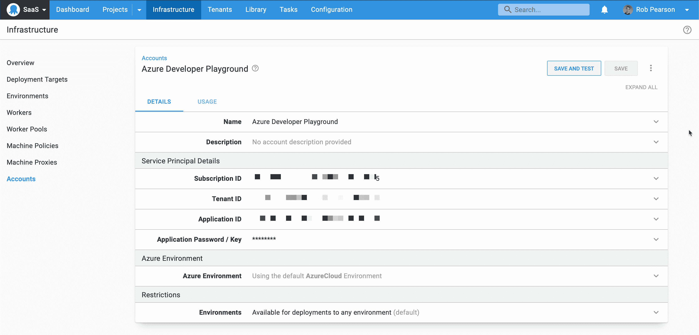

# 将 ASP.NET web 应用从 IIS 内部迁移到 Azure 应用服务- Octopus Deploy

> 原文：<https://octopus.com/blog/iis-to-azure-app-service>

[](#)

团队正在将他们的应用程序和基础设施迁移到云中。在微软的 IIS web 服务器上运行的 ASP.NET web 应用的自然迁移路径是迁移到微软的 Azure 云平台上的应用服务。改变应用程序的托管方式相对简单，但确保 CI/CD 流程仍然可重复且可靠也很重要。

在这篇博客文章中，我介绍了如何使用 Octopus Deploy 更新现有 web 应用程序的部署过程，将它从本地迁移到云中。

## 示例应用程序

在本迁移指南中，我们将使用 [Random Quotes](https://github.com/octopussamples/randomquotes) web 应用程序作为示例。这个 web 应用程序随机检索并显示名人名言。这是一个简单的应用程序，具有 ASP.NET 前端和 SQL Server 后端，有助于说明所需的更改，而不会让人不知所措。

注意:这是一个基于 ASP.NET 的 web 应用程序，但它也可以是一个 Spring Boot Java web 应用程序或 Ruby on Rails 应用程序。我们将重点放在部署流程的变化上，因此技术堆栈不那么重要了。

## 部署过程:之前和之后

更新我们的部署流程非常简单。

[](#)

我们现有的*本地部署流程*有两个步骤:

1.  执行命令行工具来更新数据库的脚本步骤。
2.  第二步是将我们的 web 应用程序包部署到 IIS 并配置绑定。

[](#)

我们新的*基于云的部署流程*与此类似，但是，它被更新为部署到云提供商。我们的第一步仍然是运行一个脚本步骤来更新我们的数据库。第二步已经改变，现在是**部署 Azure 应用服务**步骤。它捕获了将我们的 web 应用程序部署到 Azure 应用程序服务所需的一切，包括更新我们的配置文件。

## 迁移到 Octopus 云(可选)

随着团队逐渐远离本地虚拟机，一种常见的模式是将其 CI/CD 平台迁移到云中。例如，公司可能会从使用 [TeamCity](https://www.jetbrains.com/teamcity/) 和 Octopus 内部部署到 [TeamCity Cloud](https://www.jetbrains.com/teamcity/cloud/) 和 [Octopus Cloud](https://octopus.com/cloud) 。

我们最近推出了[项目导出和导入支持](https://octopus.com/blog/exporting-projects)，使项目从一个 Octopus 实例转移到另一个实例变得容易。这是自助服务，意味着开发人员可以自己完成这项工作，无需系统管理员的帮助。也就是说，我们建议让运营团队参与进来，让他们了解情况。

注意:这个过程要求两个 Octopus 实例都运行 Octopus 2021.1 或更新版本。

### 本地 Octopus 实例:

[](#)

1.  导航至项目控制板。选择溢出菜单(三个垂直省略号)，然后点击**导出项目**按钮。
2.  选择您想要导出的项目。
3.  设置密码以保护导出的文件。
4.  点击**导出**按钮，下载工件。

### Octopus 云实例:

[](#)

1.  导航到**项目**仪表板。选择溢出菜单(三个垂直省略号)，然后点击**导入项目**按钮。
2.  从本地服务器中选择导出的 ZIP 文件，并输入密码。
3.  查看导入预览并点击**导入**按钮。

完成之后，您应该会看到新项目被导入到 Octopus Cloud 实例中。

最后一步是将您的应用程序包(即 NuGet、JAR、WAR 和 ZIP 文件)导入 Octopus Cloud。如果您只想移动最新的包，可以手动[完成此操作](https://octopus.com/docs/packaging-applications/package-repositories/built-in-repository#pushing-packages-to-the-built-in-repository)，或者可以通过[自动](https://octopus.com/docs/projects/export-import#packages)保存历史记录。

注意:我建议阅读我们的[文档](https://octopus.com/docs/projects/export-import)，以了解导出/导入项目特性的局限性。

## 将 Octopus 配置为基于云的部署

本节将介绍过渡到基于云的部署所需的步骤。

### 更新您的基础设施

[](#)

要迁移到 Azure 解决方案，我们需要创建基于云的基础设施，并更新 Octopus 以与之集成。在 Azure 门户中，我创建了多个[应用服务](https://azure.microsoft.com/en-us/services/app-service/)，我[将](https://docs.microsoft.com/en-us/azure/azure-sql/database/database-import?tabs=azure-powershell)迁移到一个 [Azure SQL 数据库](https://azure.microsoft.com/en-au/products/azure-sql/database/)。

接下来，我们需要在 Octopus 中配置一个 Azure 帐户，并添加一个或多个 Azure Web App 部署目标。

Octopus 中的 Azure 帐户捕获了使用 Azure 订阅进行身份验证所需的一切，然后您可以使用它来配置您的 Azure web 应用程序目标。

导航到**基础架构**，然后导航到**帐户**以添加一个或多个 Azure 帐户。配置一个 Azure 帐户需要四个特定的 id，这有点难以找到。我不会在这里详述，但建议查看我们的 Azure 账户文档来配置这个集成。

[](#)

接下来，我们需要添加一个或多个 Azure Web App 部署目标。这些应用程序服务取代了运行 IIS 的本地虚拟机，我们正在向这些虚拟机部署 web 应用程序。

添加 Azure web 应用部署目标:

1.  导航到**基础设施**，然后**部署目标**。
2.  点击**添加目标**按钮，选择 Azure，然后选择 Azure Web App。
3.  配置名称、角色并选择 Azure 帐户和 Azure Web 应用。
4.  点击**保存**按钮。

根据您的开发、测试和生产环境，对不同的订阅重复上述步骤。

### 更新您的部署流程

我们需要更新我们的部署流程，以支持我们向云的迁移。我们可以使用 [Octopus channels](https://octopus.com/docs/releases/channels) 来支持旧的和新的部署流程，但是我们正在远离我们的内部基础架构，因此我将删除旧的基于 IIS 的部署步骤。

首先，回顾一下**更新数据库**步骤。这个脚本步骤使用数据库连接字符串来连接数据库，因此这里不需要任何更改。不过，我们确实需要确保我们的 Octopus 实例可以连接到我们的 Azure SQL 数据库。我需要更新 Azure SQL 数据库防火墙，以允许章鱼云[静态 IP 地址](https://octopus.com/docs/octopus-cloud/static-ip)连接到它。

接下来，我们需要添加一个新的 **Azure 应用服务部署**步骤。我们已经配置了基础设施，所以这并不困难。

[](#)

这个截图显示了我们的步骤配置。我们使用一个 worker 以`web`角色部署到 Azure web app 目标，我们指定包、应用服务和连接字符串配置更新。Octopus 最近推出了一个改进的 [Azure 应用服务部署步骤](https://octopus.com/blog/azure-app-service-step)，它允许我们在该步骤中直接配置更新。

例如，Random Quotes 显示两个配置值，以显示应用程序版本及其部署到的环境。为此，我们使用以下 JSON 字符串和类似的数据库连接字符串:

```
[
   {
      "name": "AppSettings.EnvironmentName",
      "value": "#{AppSettings:EnvironmentName}",
      "slotSetting": false
   },
   {
      "name": "AppSettings.AppVersion",
      "value": "#{AppSettings:AppVersion}",
      "slotSetting": false
   }
] 
```

注意:这个语法使用与 Azure 门户[批量编辑](https://docs.microsoft.com/en-us/azure/app-service/configure-common#edit-in-bulk)特性相同的模式。这对我来说是新的，但是很容易学。

### 更新您的配置变量

[](#)

我们还需要更新我们的项目变量来支持云。首先，我们需要更改数据库连接字符串。在这种情况下，我用单独的变量编写了数据库连接字符串，使其易于更新。我还删除了 IIS 绑定和端口配置中未使用的变量。

## 探索操作手册

现在我们已经转移到了云，值得一提的是 runbooks 可以帮助的一些领域。常见场景包括:

*   按计划供应和拆除开发和测试基础设施，以节省资金。
*   运行常规数据库维护作业，如索引和清理。
*   切换蓝/绿部署以在测试后推出新版本。

我不会在这篇文章中详细介绍，但在云基础设施中利用 runbook 自动化是很自然的下一步。

## 结论

团队正在淘汰旧虚拟机，并转向基于云的 CI/CD 基础架构和应用托管。在这篇博文中，我演示了如何将现有的 web 应用程序从本地迁移到云中，以及如何从本地的 Octopus 服务器迁移到 Octopus 云。

愉快的部署！