# 实施自动化数据库部署流程- Octopus Deploy

> 原文：<https://octopus.com/blog/implementing-db-deployment-process>

[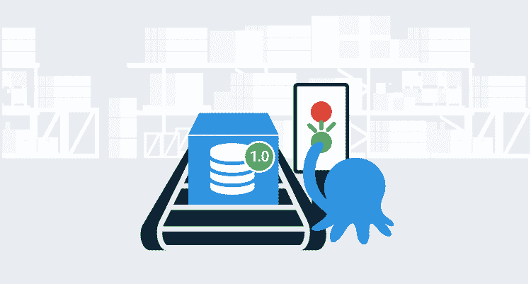](#)

使用 TeamCity、Redgate 和 Octopus Deploy 实现理想的自动化数据库部署过程需要多次迭代。我重点介绍了如何自动化 SQL Server 的部署，但是这些经验也适用于其他数据库和工具。迭代是学习工具和听取反馈的结果。在本文中，我将带您经历自动化数据库部署过程中的几次迭代。

本文是系列文章的最后一篇。这里是其他文章的链接，以防你错过。

我们所有的数据库部署文章都可以在这里找到[。](https://octopus.com/database-deployments)

## 概述

所有这些工作都是在我以前工作过的公司完成的。该公司有四个环境。

*   发展
*   试验
*   脚手架
*   生产

开发人员、数据库开发人员和首席开发人员都拥有对`development`和`test`的系统管理员权限。他们对`staging`和`production`拥有只读权限。只有数据库管理员拥有所有环境的系统管理员权限。

在自动化数据库部署之前，我们的流程是:

1.  开发人员在`test`中对数据库进行了更改。所有开发人员在`test`中都有 sysadmin 权限。他们应该在`development`进行变更，但是`test`有所有的数据来验证变更。这是他们的代码所指向的服务器。
2.  开发人员在 SSMS 更改连接，并对`development`进行更改。所有开发人员在`development`中都有 sysadmin 权限。
3.  数据库开发人员或首席开发人员运行 [Redgate SQL Compare](https://www.red-gate.com/products/sql-development/sql-compare/) 来生成`test`和`staging`之间的增量脚本。任何复杂的数据库更改(移动列、合并列等。)被删除并手动编写脚本。脚本保存在共享文件夹中。除了 DBA 之外，每个人都对`staging`拥有只读权限。数据库管理员必须运行脚本。
4.  通过电子邮件通知 DBA 在`staging`运行共享文件夹中的脚本。它们运行脚本并将输出发送给请求者。
5.  在转到`production`之前，可以将多个数据库更改推送到`staging`。因此，数据库开发人员或首席开发人员会在`staging`和`production`之间生成一个新的 Redgate SQL 比较增量脚本。就像以前一样，任何复杂的数据库更改(移动列、合并列等。)被删除并手动编写脚本。脚本保存在共享文件夹中。除了 DBA 之外，每个人都对`production`拥有只读权限。
6.  DBA 通过变更请求得到通知，在`production`中运行一组脚本。他们运行脚本，将结果保存到变更请求系统，该系统会向请求者发送电子邮件。

这个过程中有几个缺陷。

*   多个部署流程，如何将变更部署到`development`和`test`与`staging`和`production`不同。
*   手动生成脚本。
*   在每个环境中手动运行每个脚本。
*   每个环境唯一的增量脚本。
*   独特的 delta 脚本意味着很难或者几乎不可能测试。
*   没有提到跟踪变更以及需要部署什么。
*   共享开发环境。
*   到了去`staging`的时候才进行点评。
*   因此，在`production`部署期间，“所有人都在甲板上”。

此时，我们使用的工具是:

*   Git 正在作为 TFS 版本控制的替代品进行试点。
*   团队城市正在作为 TFS 2012 的替代项目进行试点。
*   没有部署服务器。
*   没有数据库部署工具(这就是 [Redgate 的工具](https://www.red-gate.com/products/sql-development/sql-toolbelt/)的用武之地)。

## 自动化数据库部署 v1

当你有一把锤子时，所有的东西看起来都像钉子。正如我的前一篇文章中所详述的，我首先着手在现有的过程中实现自动化。在那之前，我只知道上面的过程，或者某种形式的过程。

我的重点是:

*   强制每个人在`development`中进行数据库更改，并自动部署到`test`。
*   自动生成`staging`和`production`的增量脚本。

理想情况下，我们会自动部署到`staging`和`production`。这将要求构建服务器(在本例中为 TeamCity)在这些环境中运行一个具有权限的代理。数据库管理员说得很清楚，TeamCity 无权部署到`staging`或`production`。

我已经让 TeamCity 编写了代码。我需要将数据库注入到现有的构建过程中。Redgate 为 TeamCity 提供了一个插件。查看 [Redgate 的 TeamCity 插件](https://documentation.red-gate.com/display/SCA3/Use+the+TeamCity+plugin+with+a+SQL+Change+Automation+Project)的文档可以发现它支持三个功能:

*   构建一个包。
*   将包与数据库同步。
*   测试那个包裹。

为了使构建包过程能够工作，必须使用 [Redgate 的 SQL 源代码控制](https://documentation.red-gate.com/soc)将数据库置于源代码控制中。在将数据库放入源代码控制之前，我应该已经解决了每个环境之间的差异。需要不同的用户和角色成员。缺少表、不同的存储过程和其他模式变化，没有那么多。

增量需要通过以下三种方式之一来解决:

*   如果只是错过了改变，那就去应用它。
*   如果变更是有意的，并且不应该包含在源代码控制中(备份表或测试表)，您可以[利用过滤器](https://www.codeaperture.io/2016/10/14/using-sql-source-control-to-filter-out-unwanted-items/)来排除那些项目。
*   如果差异是环境造成的，比如用户和角色成员，您将需要查看文档[以了解您需要包含哪些开关。](https://documentation.red-gate.com/sc13/using-the-command-line/options-used-in-the-command-line#Optionsusedinthecommandline-IgnorePermissions)

难题的最后一部分是自动生成 delta 脚本。谢天谢地，Redgate 的模式比较工具有一个 CLI 版本。

知道了这一点，我的攻击计划是:

0.  解决所有的差异。
1.  将`development`中的内容放入源代码控制中。接下来，所有数据库更改都必须在`development`中进行，并签入源代码控制。
2.  让 TeamCity 从源代码控制中构建包。
3.  让 TeamCity 将该包与`development`同步。
4.  让 TeamCity 将该包与`test`同步。
5.  让 TeamCity 运行模式比较 CLI，为`staging`和`production`生成增量脚本。

步骤 1 和 3 相互冲突。所以我们跳过这一步。

0.  解决所有的差异。
1.  将`development`中的内容放入源代码控制中。接下来，所有数据库更改都必须在`development`中进行，并签入源代码控制。
2.  让 TeamCity 从源代码控制中构建包。
3.  ~~让 TeamCity 将该包与`development`同步。~~
4.  让 TeamCity 将该包与`test`同步。
5.  让 TeamCity 运行模式比较 CLI，为`staging`和`production`生成增量脚本。

我不打算介绍如何将数据库放入源代码控制中。我已经写了[那篇文章](https://www.red-gate.com/hub/product-learning/sql-source-control/database-version-control-2)。

我完成了四个团队城市项目。

[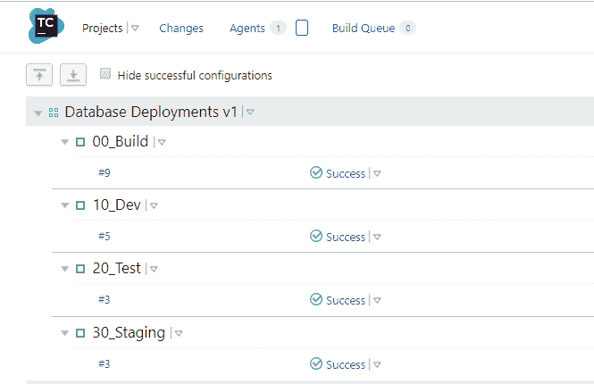](#)

项目将源代码控制中的内容打包。

[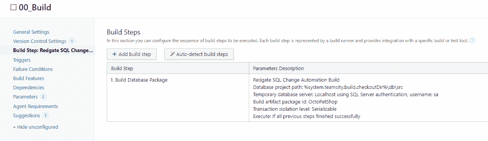](#)

我正在利用 TeamCity 的[快照依赖](https://www.jetbrains.com/help/TeamCity/snapshot-dependencies.html)和工件依赖。为了利用这一点，我需要将创建的包标记为工件。

[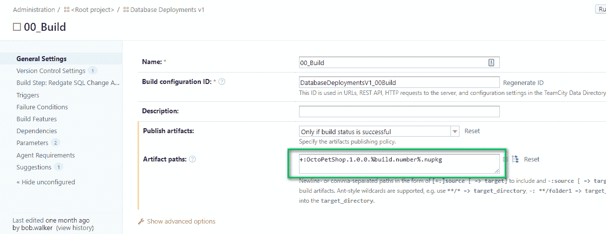](#)

`10_Dev`和`20_Test`遵循相同的流程。首先，我需要配置构建的依赖关系。依赖关系包括快照依赖关系和工件依赖关系。

[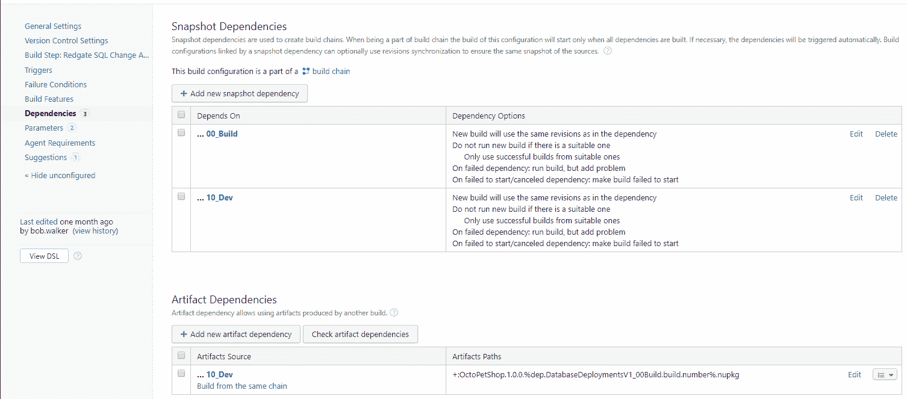](#)

现在我已经配置了包和依赖项，我可以添加步骤来将`test`数据库与包同步。请注意，为了部署最新的包，我将使用来自`00_Build`项目的值覆盖内部版本号。

建造是非常不同的。首先，我像以前一样配置依赖项。

[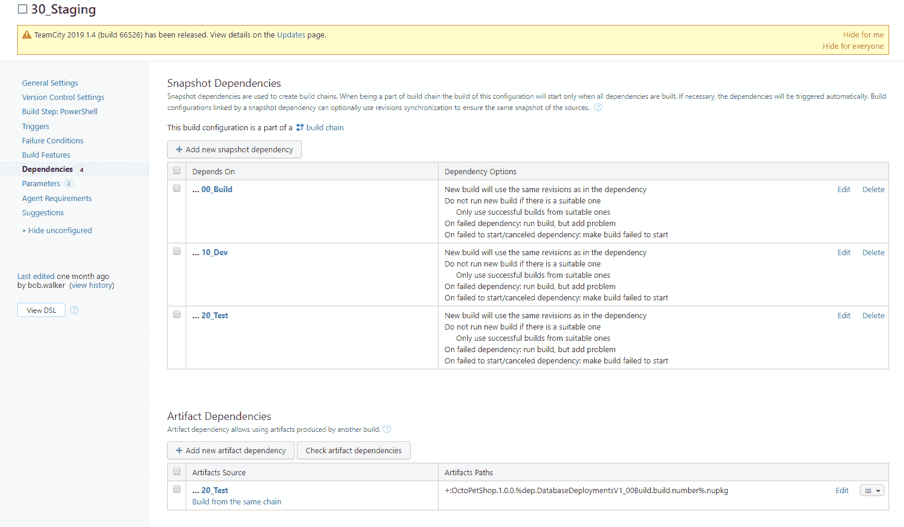](#)

它不运行同步步骤，而是运行一个 PowerShell 脚本来生成用于转移和生产的增量脚本。

[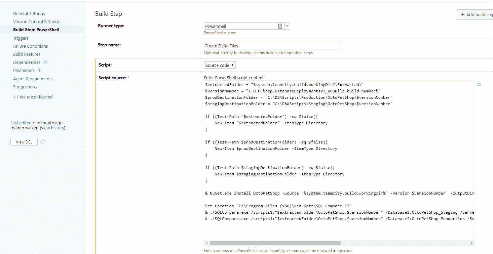](#)

## 自动化数据库部署的缺陷 v1

让我们重新审视现有流程的缺陷，看看我们在这一努力之后做得如何。

这个过程中有几个缺陷。

*   两种不同的工艺，一种是针对`development`和`test`，另一种是针对`staging`和`production`的略有不同。这种情况仍在发生。
*   手动生成脚本。**解决了。**
*   在每个环境中手动运行每个脚本。这仅针对`test`解决。
*   每个环境唯一的增量脚本。这仍在发生
*   独特的 delta 脚本意味着很难或者几乎不可能测试。这仍在发生
*   没有提到跟踪变更以及需要部署什么。**解决了。**
*   共享开发环境。这仍在发生
*   直到该去`staging`的时候，评论才出现。这仍在发生
*   因此，在`production`部署期间，“所有人都在甲板上”。这不是什么大问题，但仍在发生

此外，我还引入了几个新问题。

*   从`30_Staging`生成脚本到在`staging`或`production`中运行脚本之间的小时数或天数。
*   当`30_Staging`运行时，很难知道将使用什么版本来生成增量脚本。
*   只有最新的变化，你不能选择旧版本。

## 新进程

在我之前的文章中，我讨论了 Redgate 如何帮助我所在公司的一个工作组。让我们回顾一下我们提出的流程。

1.  开发人员/数据库开发人员/首席开发人员创建一个分支。
2.  所有数据库更改和代码更改都在该分支上进行。
3.  变更已完成并签入分支。
4.  创建了一个合并请求，这启动了一个构建。构建验证更改是有效的 SQL。
5.  数据库开发人员或首席开发人员审查合并请求中的数据库更改，并提供修复反馈。
6.  分支机构被批准并合并。
7.  构建服务器启动一个构建，验证更改是否是有效的 SQL，如果是，将它们打包并推送到部署服务器。构建服务器告诉部署服务器部署到`development`。
8.  部署服务器部署到`development`。
9.  一个开发人员/数据库开发人员/首席开发人员告诉部署服务器部署到`test`。
10.  部署服务器部署到`test`。
11.  数据库变更在`test`进行验证。
12.  一个开发人员/数据库开发人员/首席开发人员告诉部署服务器部署到`staging`。部署服务器使用数据库工具来生成审查脚本。
13.  部署服务器向 DBA 通知对`staging`的部署请求。他们审查变更并提供修复反馈。
14.  DBA 批准对`staging`的更改。
15.  部署服务器完成对`staging`的部署。
16.  在`staging`中验证数据库变更。
17.  变更请求被提交给 DBA，以将部署服务器中的特定包升级到`production`。
18.  几小时后，DBA 告诉部署服务器部署到`production`。部署服务器使用数据库工具来生成审查脚本。
19.  DBA 审查该脚本作为最后的完整性检查。
20.  部署服务器完成对`production`的部署。

自动化数据库部署过程的下一次迭代将实现这一点。

## 自动化数据库部署 v2

Octopus Deploy 被添加到自动化数据库部署的 v2 中。这是我们不知道我们需要的部署服务器。部署服务器使我们能够:

*   简化 TeamCity，它只需构建一个包并将其推送到 Octopus Deploy。
*   在所有环境中使用相同的流程和工具。
*   拥有数据库变更的审计历史记录。不仅如此，它还提供了了解谁部署了变更的能力。

团队城市被简化为两个项目。

[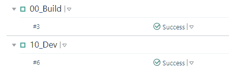](#)

会像以前一样构建包。`10_Dev`推送该包并在 Octopus Deploy 中触发部署到`development`。我们的文档很好地向您展示了如何做到这一点。

[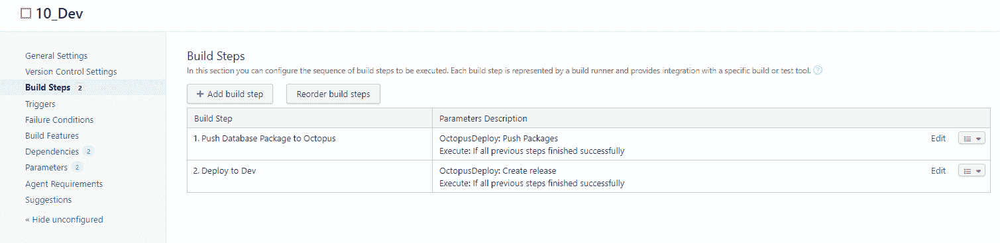](#)

经过一段时间的反复试验，Octopus Deploy 中的部署过程变成了这样:

[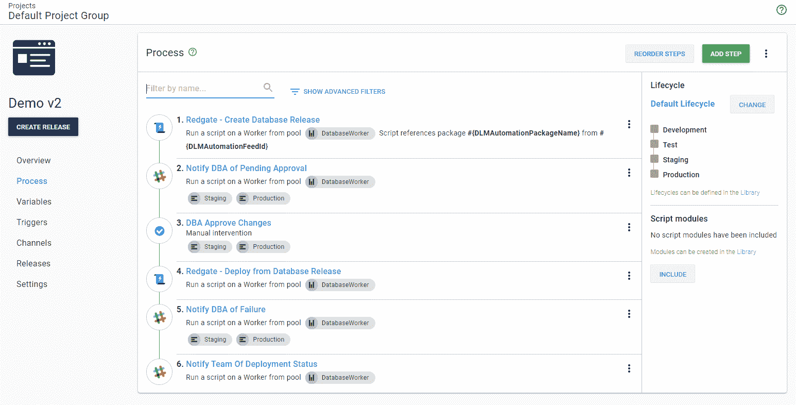](#)

在这个过程中，反复试验是围绕步骤 1 和 4 进行的。首先，我从 TeamCity 运行相同的 CLI 脚本来生成 delta 脚本以供审查。这与正在部署的不同。最终，我了解了 Redgate 提供的[创建数据库发布](https://library.octopus.com/step-templates/c20b70dc-69aa-42a1-85db-6d37341b63e3/actiontemplate-redgate-create-database-release)和[从数据库发布](https://library.octopus.com/step-templates/7d18aeb8-5e69-4c91-aca4-0d71022944e8/actiontemplate-redgate-deploy-from-database-release)部署步骤模板。

使用 Redgate 提供的 step 模板自动生成并上传 delta 脚本作为 [Octopus 工件](https://octopus.com/docs/deployment-process/artifacts)。DBA 可以下载这些文件，并在批准部署到`staging`或`production`时进行审查。

[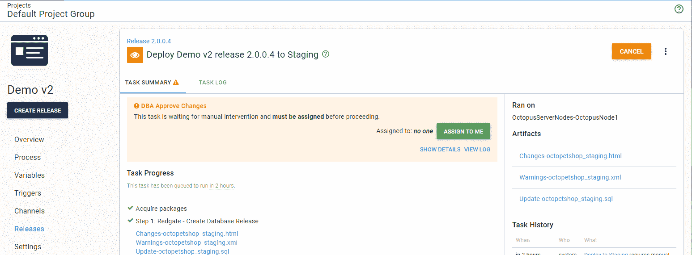](#)

按照这个流程，DBA 非常乐意让 Octopus 部署到`staging`和`production`。他们可以在部署期间审查脚本，并且审查脚本的人会被审计。此外，他们很高兴看到只需要按一个按钮。正如一位数据库管理员所说，“这太简单了。”

决定这笔交易的是控制谁可以按下部署按钮的能力。所有开发人员(包括数据库开发人员和首席开发人员)都可以部署到`development`、`test`和`staging`。

[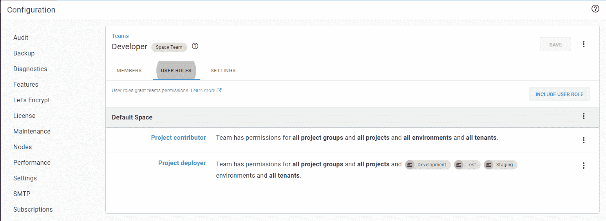](#)

虽然 DBA 可以部署到`production`，但是他们无权更改部署过程，只有开发人员可以这么做。

[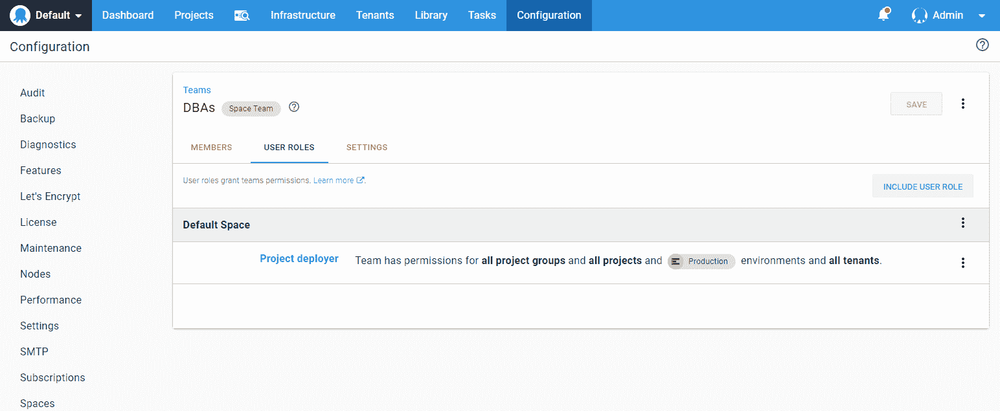](#)

虽然开发人员可以部署到`staging`，但是 DBA 才是批准变更的人。

[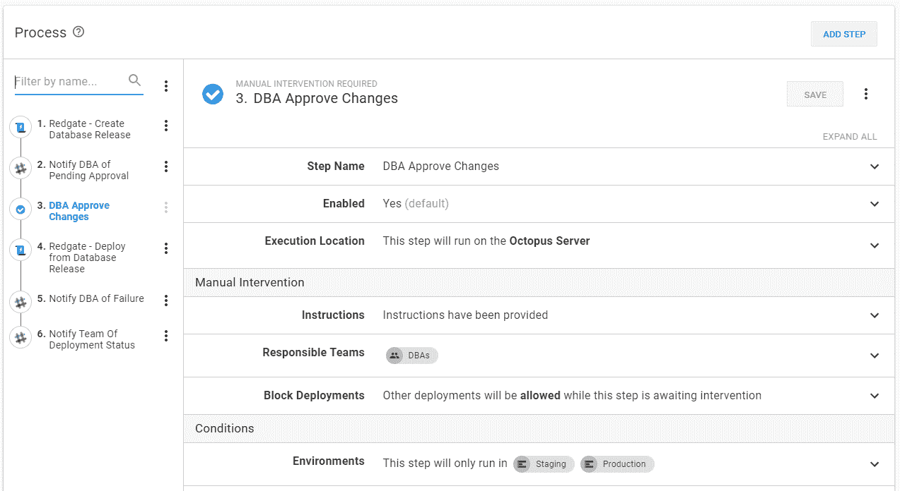](#)

这些安全策略和手动干预在这个过程中建立了很多信任。

## 自动化数据库部署 v2 的缺陷

让我们看看我们的问题列表。

*   两种不同的工艺，一种针对`development`和`test`，另一种针对`staging`和`production`略有不同。**解决了。**
*   手动生成脚本。**解决了。**
*   在每个环境中手动运行每个脚本。**解决了。**
*   每个环境唯一的增量脚本。**减轻**，这就是工具的工作原理。
*   独特的 delta 脚本意味着很难或者几乎不可能测试。由于使用了相同的流程，减少了导致错误的机会。
*   没有提到跟踪变更以及需要部署什么。**解决了。**
*   共享开发环境。**解决了。**
*   到了去`staging`的时候，评论才发生。**解决了。**，数据库开发人员审核特性分支变更，DBA 在`staging`审核。因此，在`production`部署期间，“所有人都在甲板上”。**解决了。**
*   从`30_Staging`生成脚本到在`staging`或`production`运行脚本之间的小时或天。**解决了。**
*   当`30_Staging`运行时，很难知道哪个版本将用于生成增量脚本。**解决了。**
*   只有最新的变化，你不能选择旧版本。**解决了。**

太棒了，所有原来的问题，加上 v1 的问题，都被解决或减轻了。但是有趣的事情发生了。这个过程奏效了，随着时间的推移，我们开始对`production`和`staging`进行越来越多的部署。

*   在编写流程时，DBA 必须在每个`production`部署期间在线。
*   开发人员必须等到数据库管理员在部署之前完成对他们在`staging`中的脚本的审查。数据库管理员跟不上。
*   开发人员的本地数据库中没有测试数据；这导致他们将未完成的变更推送到`test`。然后他们将代码指向`test`，这样他们就有数据可以测试。

## 自动化数据库部署 2.1 版

工作组召开了会议，我们同意对流程进行以下更改:

*   DBA 将只批准`staging`中的变更。
*   `staging`中的批准将在部署发生后进行。
*   DBA 只想在部署到`production`失败时得到通知。
*   DBA 希望在试运行部署期间看到`production`的增量脚本。不会 100%一样，但也足够近，让他们复习。实际的`production`部署脚本将在`production`部署期间创建，并保存为工件。
*   每次部署后生成`test`的备份。然后，开发人员可以在他们的实例上恢复备份，以获取测试数据。

最终的过程如下所示:

[T35【](#)

完成这些更改后，DBA 可以利用 Octopus Deploy 中的`Deploy Later`功能。他们不再需要每次部署到`production`都在线。

【T2 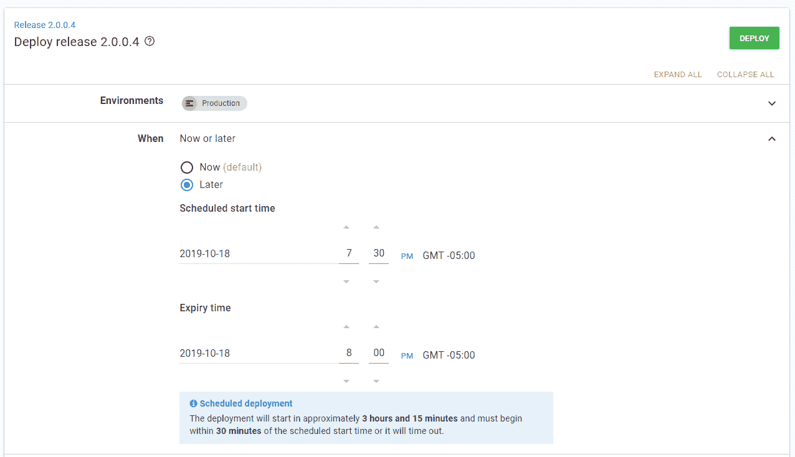

## 结论

经过这一过程后，部署到`production`就不再是一件大事了。数据库管理员只需要在`production`部署期间出现故障时跳转到在线，这种情况越来越少，但需要几次迭代才能到达。

最让我惊讶的是，从开始到结束，一切都发生了多大的变化。我实话实说。如果我遇到一个有最终数据库部署流程的客户，我会有很多问题。但是在实现它的公司的上下文中是有意义的。这符合他们的要求。不要对你的迭代次数和最终结果感到惊讶。每个公司都不一样。

愉快的部署！

如果你喜欢这篇文章，好消息，我们有一个关于自动化数据库部署的完整系列。