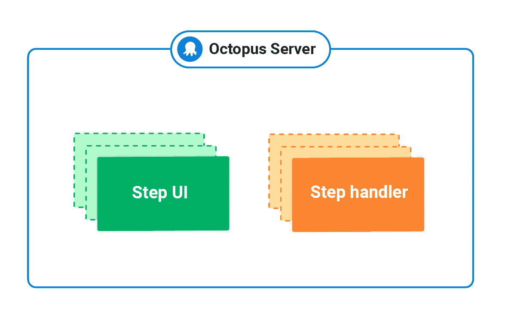
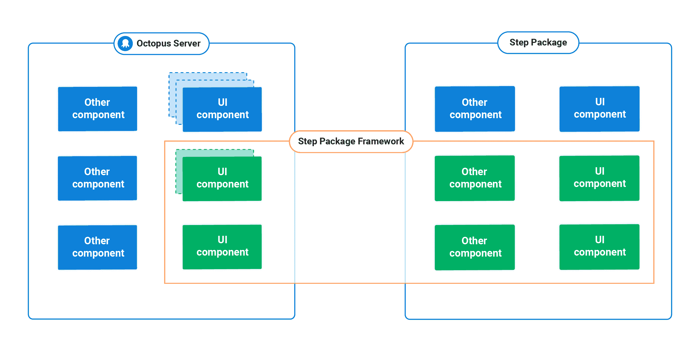
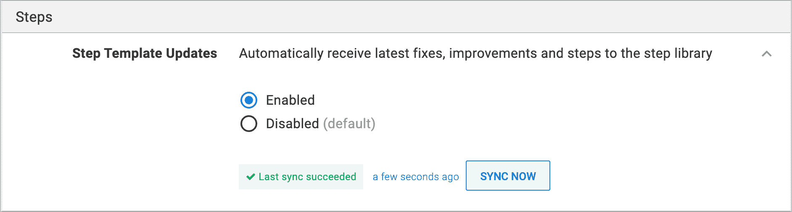
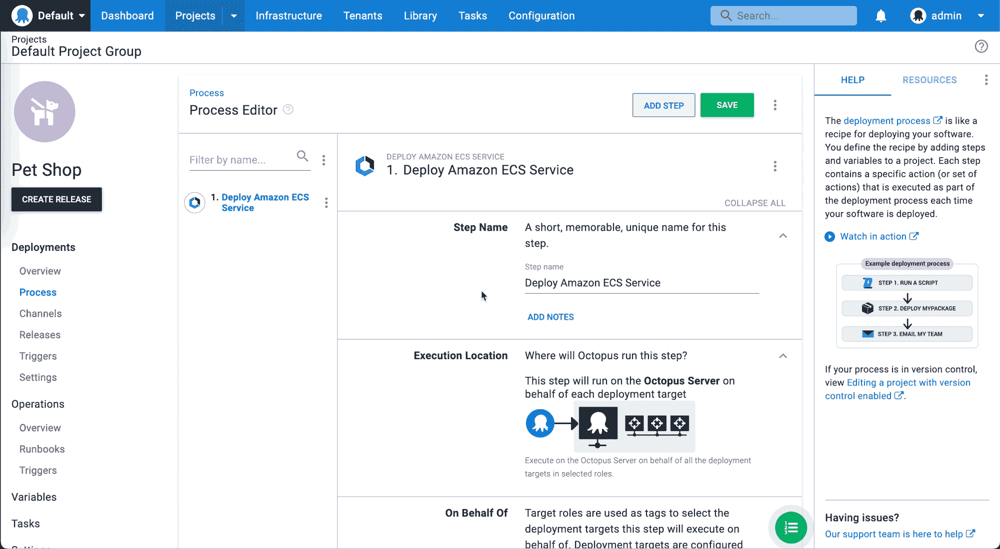
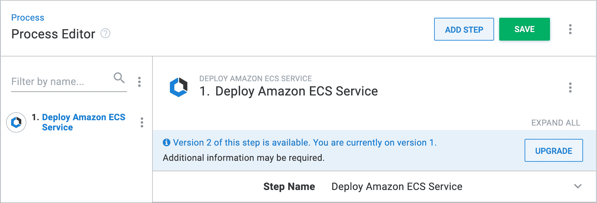
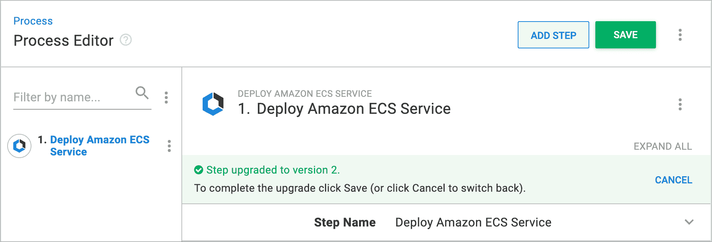

# 改进部署步骤的交付- Octopus Deploy

> 原文：<https://octopus.com/blog/improving-delivery-deployment-steps>

我们一直在研究一种新的方法来开发您在 Octopus Deploy 中使用的部署步骤，我们称之为步骤包框架。

在本帖中，我们将探索:

*   为什么我们要建立一个新的框架
*   新框架是什么以及我们的设计决策
*   我们如何测试和迭代新框架
*   八达通用户的利益
*   如何使用我们新的 step 包 feed 将步骤传递到 Octopus 服务器实例

## 为什么要创建一个新的步骤包框架？

为了尽可能方便地在任何地方部署您的软件，Octopus Deploy 是一款固执己见的产品。Octopus Server 在理解您要部署到的公共目标时工作得最好，从服务器上的 IIS 实例到云中的 Amazon ECS 集群。

为了帮助指导您完成与这些服务交互的过程，我们创建了自以为是的步骤。例如，Octopus 部署步骤允许您:

*   部署或更新 Amazon ECS 服务
*   针对 Azure 或 Kubernetes 运行脚本
*   使用地形模板创建或破坏基础设施

步骤包框架是我们如何开发这些新步骤的一个发展，供您在 Octopus Deploy 中使用。

为了理解为什么需要一个新的框架，我们必须首先看看我们试图解决的问题。

### 我们之前如何为 Octopus 部署创建步骤

随着 Octopus Deploy 的发展，step 开发经历了几个架构实现。最初，步骤是在 Octopus Deploy 的核心中开发的。这允许组成一个步骤的组件和使用这些组件执行定义的部署的实际过程之间的紧密集成。

[](#)

这种方法的一个优点是，创建这些步骤的开发人员拥有所有的库和依赖项，可以在开发时开发一个步骤。这种方法还支持与我们的 React 前端紧密集成。

然而，在 Octopus 的核心中开发有几个缺点，特别是当我们开发更多步骤时:

*   步骤只能作为整个 Octopus Deploy 安装程序的一部分提供。这意味着要尝试新功能，您必须升级整个 Octopus 实例。由于 Octopus 通常位于关键任务基础设施的中间，升级周期长且不频繁，这意味着您可能无法使用新的步骤。
*   对现有步骤的任何必要更改，包括错误修复，都必须通过整个发布管道，并且在问题解决之前需要完整的实例升级。这意味着即使很小的补丁也可能需要几周才能更新，而不是几天或几小时。
*   开发一个新的步骤需要理解 Octopus 的几个主要组成部分以及它们是如何相互联系的。这导致交付时间增加，并且很难构建实验步骤。
*   独立于 Octopus 的版本化步骤在任何实际意义上都是不可能的。例如，如果云提供商发布了他们服务的新的主要版本，我们必须在现有步骤中构建许多交换机，而不是仅仅发布现有步骤的新版本，可以与原始版本一起使用。

在快速变化的环境中，新的云服务频繁出现，我们意识到我们需要更灵活的方法来继续提供世界一流的体验。随着 Octopus 中步骤数量的增加，step package 框架被用来解决这些问题。

## 介绍步骤包框架

step package framework 是一个 TypeScript 库集合，支持创建步骤并将其集成到 Octopus Server 中。它提供了一个 CLI，使步骤作者能够构建和打包他们的新步骤。

使用步骤包框架构建的新步骤现在称为步骤包。步骤包由几个组件组成:

*   描述 Octopus Server 应该在流程编辑器中呈现的 UI 元素的 UI 定义
*   输入模式和验证器
*   步骤执行器，即在部署时执行的代码

与前面的实现不同，所有这些元素现在都存在于 step 包本身中，而不是在 Octopus 服务器中。

这些新步骤是针对 step 包框架中公开的 API 构建的，而不是像 steps 以前那样针对 Octopus Server 中可用的接口。step 包框架将 step 包及其所有组成部分集成到 Octopus 服务器中。

step 包框架通过向 Octopus 服务器提供 2 个组件来实现这一点:

1.  首先是获取、注册 step 包并将其集成到 Octopus Server 中的组件集合，这样就可以将 step 包添加并配置到部署流程中。
2.  其次是步进引导程序。引导程序在步骤包执行时调用，它向步骤包提供运行时配置，然后执行步骤包中定义的执行器代码。

[](#)

除了新的框架之外，我们还需要创建一个新的机制来交付 Octopus 服务器版本之外的 step 包。为此，我们构建了一个全局可访问的步骤包 feed 来发布打包的步骤。与 NPM 或 NuGet feeds 的操作方式不同，任何经过身份验证的用户都可以发布包，step package feed 只包含由 Octopus Deploy 开发和发布的包。在编写、构建和打包一个步骤之后，就可以将它发送到任何地方的 Octopus 实例了。我们通过将它发布到 step package feed 来实现这一点。

## 设计决策

在设计 step package 框架时，我们为自己设定了几个约束条件来帮助塑造最终设计:

*   步骤必须易于编写，即使对于对 Octopus 工作原理知之甚少的人来说也是如此。
*   底层 Octopus 服务器组件的复杂性不能泄露到单个步骤的代码中。
*   步骤必须以生态系统惯用的方式编写。例如，如果我们使用 JavaScript，它必须以大多数 JavaScript 开发人员期望的方式编写。
*   将外部组件或框架引入您的步骤应该很容易。
*   配置步骤的 UI 代码应该是声明性的和抽象的，这样步骤作者就不需要知道呈现了哪些特定组件或它们的内部工作方式。
*   步骤必须进行版本控制，并在 Octopus 服务器的带外分发
*   步骤作者应该能够确定地告诉他们从 Octopus 服务器接收到什么输入。

当涉及到我们的设计决策时，我们必须在这些指导原则上进行权衡，因为它们并不完全兼容。我们以这些权衡和约束为指导，做出了以下设计决策。

### 步骤必须用大多数程序员熟悉的语言编写

从一开始，我们就想向尽可能多的人展示编写步骤的新方法，所以我们必须选择一种编程语言。一些考虑因素是:

*   这种语言是否足够流行以至于外部库和 API 可以很容易地获得，从而消除那些没有广泛用于构建 web 应用程序的系统级语言。
*   它是否足以表达复杂的部署场景。虽然现在有很多强大的脚本语言可供选择，比如 Lua 和 Groovy，但是随着规模和复杂性的增加，它们会变得难以管理。
*   一个丰富的类型系统，为 step 作者提供关于传入数据的足够信息，并允许编译时代码验证。

我们发现 JavaScript 足够流行和富于表现力，可以满足前两个条件。通过添加 TypeScript，我们还可以构建一个表达式类型系统，保护 step 作者编写无效代码，并为如何使用 step 包框架提供指导。

此外，JavaScript 项目可以集成到一个可分发的文件中，简化了发布和本地部署，尤其是在频繁跨网络移动时(Octopus 就是这种情况)。

### 执行环境

自然，今天的本地 JavaScript 执行是 Node.js 的同义词。这适合 Octopus，因为它是跨平台的，得到广泛支持，并且足够轻便，可以在任何环境中快速启动。它还是可移植的，因此我们可以将环境和可执行文件直接发送到目的地(例如，发送到部署目标或工作人员),而不用担心兼容性问题。

### 声明式用户界面

在早期，我们探索了表示一个步骤的用户界面的不同选项。一种选择是利用 React，让用户编写自己的组件，使用 React 的机制来更改渲染器。

然而，我们出于多种原因决定不这么做:

*   这种灵活性导致了很大的兼容性，这意味着保持 Octopus 服务器和众多步骤及其版本的同步是很困难的。
*   我们永远无法支持 React 生态系统中所有可用的库。因此，很难说哪些库受到支持，因此为 Octopus 步骤编写 React 代码与为 web 编写 React 代码将是不同的体验。
*   关于 React 代码有一些隐含的假设:您可以添加自己的原始组件并为它们编写样式，但是这些假设都不适用于受约束的环境。

考虑到这一点，我们决定将 Octopus Server 中 UI 的工作机制和步骤如何定义它们的部分分离开来。我们没有要求 step 作者在我们的原语之上编写他们自己的组件，而是让开发人员将他们的输入与他们想要表示这些输入的语义组件联系起来。例如，下面的代码显示了一个文本字段:

```
text({
    input: inputs.myTextInput,
    label: "Some text field",
    helpText: "The help text for the field"
}) 
```

由于代码是声明性的，不依赖于文本框的任何特定实现，我们可以轻松地将其替换为其他内容，而 step 作者不必做任何工作。

另一个好处是，我们可以使用类型系统来引导开发人员使用正确的组件。例如，我们可以检查在构建时只有数字输入用于数字组件。

声明式风格还允许在 Octopus 服务器和 step 包之间定义良好的契约，帮助我们减少兼容性表面，并更慎重地考虑框架版本之间的变更。

### 版本控制

我们新框架的最大目标是能够快速发布新的步骤，而不必发布新版本的 Octopus 服务器。实现这个目标的结果是，步骤也必须有它们自己的版本控制、升级和迁移机制。这也意味着 Octopus 服务器必须准确地知道:

*   它支持哪些 step 版本
*   如何从步骤的一个版本迁移到另一个版本
*   哪些步骤版本可以静默迁移，哪些迁移需要额外的用户输入
*   如何处理不兼容的步骤

我们通过在等式两边产生粒度兼容性清单来解决这个问题。Octopus Server 的每个版本都有一组可以保证兼容的内部组件，我们在构建时将这些组件的特定版本注入到 step 包中。然后，我们不仅可以很容易地判断一个 step 包是否兼容，还可以判断该包的哪些特定部分已经兼容，哪些部分需要迁移到最新版本。

我们还在 Octopus 服务器中建立了版本号的隐式保证，这样 step 作者可以确保，例如，如果他们开始为版本 2022.1 构建 step，他们的 step 将始终在该版本上运行，无论我们后来发布了多少次要版本和修补程序。

### 尝试新的框架

在 Octopus，我们认为验证产品创意的最佳方式是在真实环境中亲自使用产品，这被称为“狗食”。

在我们完成 step package 框架的第一次迭代之后，是时候改进和验证我们的假设和设计决策了。为此，我们使用新框架构建了两个功能全面的步骤:

*   部署 ECS 服务
*   更新 ECS 服务

这两个步骤的区别在于,“部署 ECS 服务”步骤从头开始构建新的 ECS 服务定义并将其部署为云形成模板，而“更新 ECS 服务”步骤更新现有的一组定义。

有了这两个新步骤，我们从一个空白页开始，就像任何其他步骤作者在将来使用框架时会做的那样。这让我们能够测试框架设计中的决策是否能够成立。大多数情况下，他们做到了，但是我们学到了一些教训，这导致了进一步的改进。

### 框架改进

#### 对新 UI 组件的需求

步骤 UI 组件是步骤包框架的一部分，它允许步骤作者定义步骤的用户界面。当 ECS 项目开始时，该框架支持大多数基本的 UI 组件，这些组件可用于构建与其他内置 Octopus 步骤具有相同外观和感觉的界面。然而，团队意识到需要一些高级组件，比如容器图像选择器组件。

需要新 UI 组件的一个特性是允许将步骤信息导出到 CloudFormation 模板。在我们的声明式 UI 中实现这些新的 UI 组件提出了一些挑战。由于这是所有步骤包的共享组件集，我们必须考虑如何使新组件足够通用，以便它可以被其他步骤包使用，但仍然支持 ECS 步骤所需的所有功能。这个挑战是框架中的一个有意识的权衡，它以只向步骤公开 Octopus 功能的子集为代价，大大降低了创作新步骤的复杂性。

#### 端到端测试框架

团队在开发 ECS 步骤时考虑的一个关键方面是如何编写集成测试。需要进行测试来构建云服务中所需的所有资源，以便可以执行被测试步骤的部署。

在测试实际运行之前，我们需要在 AWS 中设置大量的资源。我们决定用一个 Terraform 模板来旋转集成测试的资源，以消除对静态资源的需求。

意识到这些需求也适用于未来其他类型的步骤，例如使用 Azure 或 GCP 基础设施的步骤，我们开发了一个测试框架，该框架从客户端提供的 Terraform 模板中获取并设置基础设施。客户端声明所需的云提供商(Azure、AWS 或 GCP)并提供凭证。然后，该框架输出一个随机资源代码，该代码既可用于 step 作者自己的 Terraform 模板，也可用于访问和验证资源的测试。

该测试框架促进了我们在 ECS 步骤中实施的多个集成测试的开发，并且对于在主要云提供商中执行需要基础架构设置的任何步骤的步骤作者来说，是一个必不可少的工具。

#### 局部测试步骤的痛苦

用 step 包框架构建的步骤是从 Octopus Server 独立开发的。因此，当我们想要直观地看到这些步骤如何工作时，我们需要手动地将正在开发的步骤包集成到 Octopus Server 中。为此，我们需要:

*   从步骤项目中构建并输出压缩的步骤包
*   将 zip 文件复制到 Octopus 服务器存储库中的本地文件夹
*   删除该步骤先前版本的任何缓存文件
*   重启/重建八达通服务器

在开发 ECS 步骤的过程中，这个过程非常耗时。因此，我们实现了一个本地 feed，允许 Octopus Server 定期在本地获取 step 包，并将它们加载到正在运行的 Octopus Server 实例中。这使得 step 作者可以方便地应用他们的 step 包更改，而无需重新启动他们的 Octopus 服务器。

## 步骤包框架如何让您受益

step 包框架是为了帮助 Octopus 以一种新的方式开发 steps 而构建的，但是这对于作为 Octopus Deploy 用户的你来说意味着什么呢？

*   我们现在可以独立于 Octopus Server 构建步骤，因此它们不再与我们的发布管道绑定。
*   我们现在可以在安装或升级 Octopus 服务器之外发布步骤，让您无需升级即可更快地访问步骤。

请注意，虽然 step 软件包是与 Octopus 服务器分开打包和交付的，但它们仍需要安装在服务器上才能使用。

### 分步包装的交付

在步骤包提要上有了步骤包之后，下一次 Octopus 服务器实例检查新步骤提要时，它将下载步骤包并立即在 Octopus 服务器实例中可用。如果您使用的是 Octopus Server 2022.1 或更高版本，并且您的实例已配置为允许它连接到我们的 step package feed，则此功能可用。这将按计划进行，也可以手动触发。你可以在**配置** > **功能** > **步骤模板更新**下找到这个同步的状态。

[](#)

### 步骤包更新

在下载了一个步骤包并将其处理到 Octopus 服务器实例中之后，它会根据当前版本和新版本之间的差异，更新部署过程中该步骤包的使用情况。

Step 包使用语义版本化格式:major.minor.patch。如果发布了新的次要版本或修补版本的 step 包，您的流程将会自动更新。

在部署编辑器的步骤的**关于这个步骤**部分中可以找到关于正在使用的步骤包版本的详细信息。

[](#)

如果发布了主要版本，那么使用这些步骤的部署过程不会自动更新以使用新版本。这是因为主要版本更新需要用户干预，以便将来成功部署。要使用新的主要版本，您需要手动更新每个部署过程以使用新的主要版本。

[](#)

如果有新的主要版本可用，您将在步骤编辑器中看到以下横幅。

[](#)

升级到使用新的主要版本非常简单，只需点击**升级**按钮，用新要求的参数更新您的部署流程，然后点击**保存**。

## 结论

step 包框架正在改变我们为您的 Octopus 服务器实例构建和交付新步骤的方式。这意味着可以更快地交付新步骤，而无需升级。

随着我们推出更多的功能，我们期待着使用该框架为您带来新的和改进的步骤。

愉快的部署！

*感谢雷·纳姆、叶戈尔·帕夫利欣和马特·谢泼德对本文的贡献。*