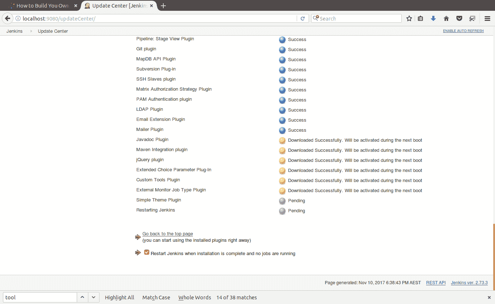
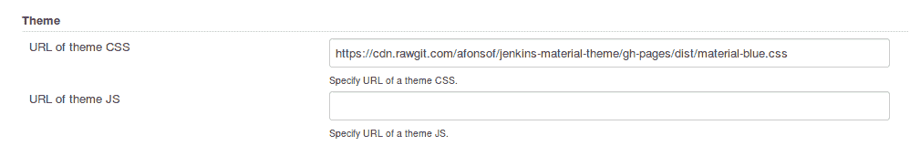

# 从头开始安装 Jenkins-Octopus 部署

> 原文：<https://octopus.com/blog/installing-jenkins-from-scratch>

在 [2017 JetBrains 开发者生态系统调查](https://www.jetbrains.com/research/devecosystem-2017/team-tools/)中，Jenkins 在 CI 系统中排名第一。凭借丰富的插件和庞大的用户群，Jenkins 是构建软件项目的强大解决方案，在这篇博文中，我们将看看如何启动并运行一个基本的 Jenkins 实例。

首先，我安装了全新的 Ubuntu 17.10。

我们需要安装一些标准 Ubuntu 安装中没有的便利工具。Jenkins 只需要`git`和`openjdk-8-jdk`,但是我经常使用其他工具来保证安装它们是理所当然的。

```
sudo apt-get install htop vim iftop git openssh-server openjdk-8-jdk 
```

## 安装 Jenkins

为了安装 Jenkins，我们将使用这里的自定义回购文件。

```
wget -q -O - https://pkg.jenkins.io/debian-stable/jenkins.io.key | sudo apt-key add -
deb https://pkg.jenkins.io/debian-stable binary/
sudo apt-get update
sudo apt-get install jenkins 
```

## 初始 Jenkins 配置

在 web 浏览器中打开 http://localhost:8080。您将看到一条来自 Jenkins 的消息，要求您输入在文件`/var/lib/jenkins/secrets/initialAdminPassword`中找到的密码。

[](#)

然后会提示您要安装的插件。此时，我安装了建议的插件。稍后我们会再添加一些。

[](#)

给 Jenkins 几分钟时间安装建议的插件。

[](#)

创建您的第一个管理员用户。

[](#)

你完了！

[](#)

## 安装附加插件

我们需要一些额外的插件来构建一个 Maven 项目，并用 Octopus 部署它。

点击管理詹金斯➜管理插件。

点击`Available`标签。

勾选以下插件:

点击`Download now and install after restart`。

勾选`Restart Jenkins when installation is complete and no jobs are running`选项。

詹金斯重启后，你将拥有你需要的所有插件。

[](#)

## 应用自定义 Jenkins 主题

我们之前安装的简单主题插件允许我们用一个 CSS 文件更新 Jenkins 的外观。

点击管理詹金斯➜配置系统，在`Theme`部分下将 URL `http://afonsof.com/jenkins-material-theme/dist/material-<color>.css`添加到`URL of theme CSS`字段。你可以在 [Jenkins 材料主题网站](http://afonsof.com/jenkins-material-theme/)上找到一个颜色列表来替换<color>标记。我用了蓝色，所以我输入的网址是`http://afonsof.com/jenkins-material-theme/dist/material-blue.css`</color>

[](#)

我想你会同意这些主题大大改善了詹金斯的外观。

[](#)

## 准备詹金斯

我们需要配置一些工具，以便在构建项目时使用。特别是，我们希望添加一个 Maven 安装以在我们的构建中使用，一个 Java 安装以运行 Maven，以及一个 Octopus CLI 定制工具以推送和部署文件。

我发现让 Jenkins 为我下载并安装这些工具更容易，这些工具可以在管理 Jenkins ➜全球工具配置下进行配置。

### 配置 Java

为了构建我们的应用程序，我们需要一份 Java。在`JDK`部分点击`ADD JDK`按钮。

[](#)

给这个工具起个名字(我用的是`Java 9`)并选择要安装的 JDK 版本。

我们将在下一篇博文中引用这些工具的名称，在这篇博文中，我们将使用`Jenkinsfile`构建和部署一个 Java 应用程序。

[](#)

输入下载 JDK 所需的 Oracle 凭据。

[](#)

### 配置 Maven

我们的 Java 项目将被配置为使用 Maven，因此我们需要一个可用的 Maven 实例来完成构建。在`Maven`部分点击`ADD MAVEN`按钮。

[](#)

给这个工具命名，并选择最新版本的 Maven。

[](#)

### 配置 Octopus CLI

虽然在 Jenkins 中没有自带的 Octopus CLI 工具，但是我们安装的自定义工具插件确实允许我们很容易地将 CLI 作为 Jenkins 工具公开。

在`Custom Tools`部分，创建一个名为`Octo CLI`的新工具，并在`Download URL for binary archive`字段中输入 Ubuntu CLI 的 URL。

确保将`Label`字段留空。

[](#)

你可以从 [Octopus 下载页面](https://octopus.com/downloads)获得 Octo CLI 的下载链接。

[](#)

虽然 Octo CLI 支持的 Ubuntu 最新版本是 16.04，但我在 Ubuntu 17.10 中使用它推送包和创建版本时没有任何问题。

## 结论

至此，我们已经基本安装了 Jenkins，并配置了构建和部署 Java 应用程序所需的所有工具。

在下一篇博文[中，我们将看看如何使用](/blog/deploying-to-octopus-from-jenkins) [Jenkins Pipelines](https://jenkins.io/doc/book/pipeline/) 来配置一个要构建并推送到 Octopus 的 Java 应用程序。

如果您对 Java 应用程序的自动化部署感兴趣，[下载 Octopus Deploy 的试用版](https://octopus.com/downloads)，并查看我们的文档。