# 从头开始安装 Tomcat-Octopus Deploy

> 原文：<https://octopus.com/blog/installing-tomcat-from-scratch>

Tomcat 是目前最流行的 Java web 服务器，对于任何希望托管 Java web 应用程序的人来说都是一个可靠的选择。

Tomcat 的一个优点是它非常容易上手，通常只需要下载和解压部署档案。但是有几个步骤是每个 Tomcat 管理员都应该知道的，以便充分利用他们的 Tomcat 安装。

在这篇博客文章中，我们将介绍设置 Tomcat 服务器的过程。

## 安装 Java

作为一个 Java web 服务器，Tomcat 需要安装 Java 才能运行。

[Tomcat 7 至少需要 Java 6，Tomcat 8 至少需要 Java 7，Tomcat 9 至少需要 Java 8](http://tomcat.apache.org/whichversion.html) 。

请记住，您需要安装一个既支持 Tomcat 本身又支持 Tomcat 将要托管的应用程序的 Java 版本。如果您的应用程序是为 Java 8 编译的，那么 Tomcat 也需要与 Java 8 一起运行。

### 杰尔还是 JDK？

Java 安装以 Java 运行时环境(JRE)或 Java 开发工具包(JDK)的形式提供。

JRE 提供了运行 Java 应用程序所需的所有功能，包括 Tomcat。JDK 提供了 JRE，以及一些开发人员用来编译和管理 Java 应用程序的附加工具。

Tomcat 可以和 JRE 或者 JDK 一起工作。开发人员通常使用 JDK，它是一个较大的软件包，所以如果您有疑问，请安装 JRE。

### OpenJDK 还是甲骨文 JDK？

OpenJDK 是 Java 平台的开源实现。它通常包含在 Linux 包管理器中，包名类似于`openjdk-8-jre`或`openjdk-8-jdk`。

OpenJDK 是项目的名称，虽然它的名称中包含缩写“JDK ”,但 OpenJDK 项目同时提供了 JRE 和 JDK。

Oracle JDK 是 Oracle 提供的 Java 实现。通常，您必须从 [Oracle 网站](http://www.oracle.com/technetwork/java/javase/downloads/index.html)手动下载并安装 Oracle JDK。

使用 OpenJDK 还是 Oracle JDK 是个人选择的问题。我将在 Linux 发行版中使用 OpenJDK，因为使用包管理器安装很容易。在 Windows 或 MacOS 中，我会安装 Oracle JDK。

## 下载 Tomcat

Tomcat 可以从 [Apache Tomcat](https://tomcat.apache.org/index.html) 主页下载。

Tomcat 可以作为 zip、tar.gz、Windows zip 或 Windows exe 下载。

在写这篇博文的时候，Tomcat 8.5 是最新的官方版本，Tomcat 9 接近最终版本。仍然支持 Tomcat 7，所有以前的版本都被认为是过时的。

### 下载 Tomcat for Linux

如果你在 Linux 中运行 Tomcat，那么 tar.gz 包就是你需要的。这比 zip 包更可取，因为 tar.gz 格式保留了 shell 脚本上的可执行标志。

如果你在 Linux 中下载 zip 包，你需要用命令`chmod +x <scriptname>`在脚本`bin/startup.sh`和`bin/shutdown.sh`上手动设置可执行标志。

### 下载 Tomcat for Windows

如果你在 Windows 中运行 Tomcat，那么你可以下载任何格式的文件。但是，我建议 Windows 用户下载 Windows zip 或 exe 包。

这些包包括`tcnative-1.dll`库，它是 [Tomcat 本地](https://tomcat.apache.org/native-doc/)库的一部分。Tomcat Native 用于让 Tomcat 访问 [Apache 可移植运行时](https://apr.apache.org/) (APR)。APR 反过来用于通过 OpenSSL 提供 HTTPS 等功能，这比使用原生 Java HTTPS 实现(也称为 JSSE 实现)可以提供更好的性能。

此外，Windows 软件包还包括用于将 Tomcat 安装为 Windows 服务的可执行文件。

[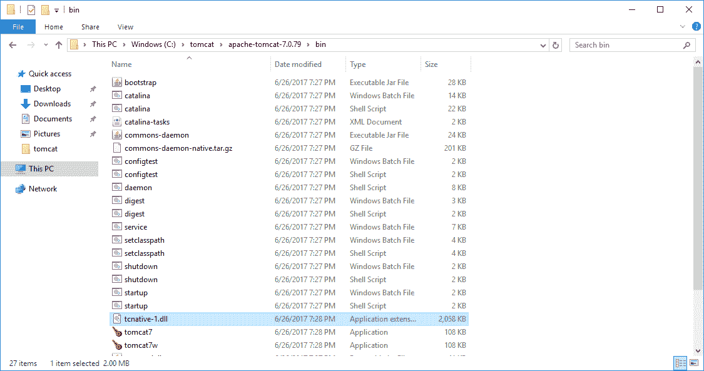](#)

## 配置 JAVA_HOME 环境变量

Tomcat 脚本使用`JAVA_HOME`环境变量来查找将用于启动 Tomcat web 服务器的 Java 可执行文件。

### 在 Windows 中配置 JAVA_HOME 环境变量

Windows 在系统属性中定义环境变量。

打开`System`控制面板小程序内的`Advanced System Settings`。

[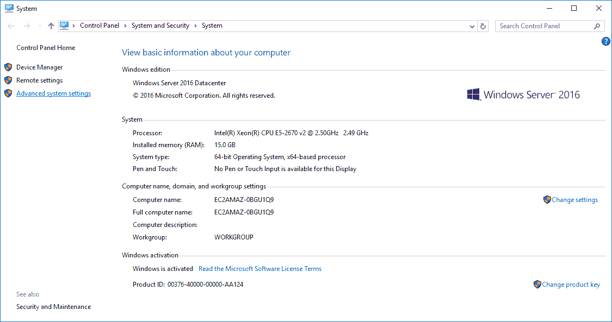](#)

点击`Environment Variables...`按钮。

[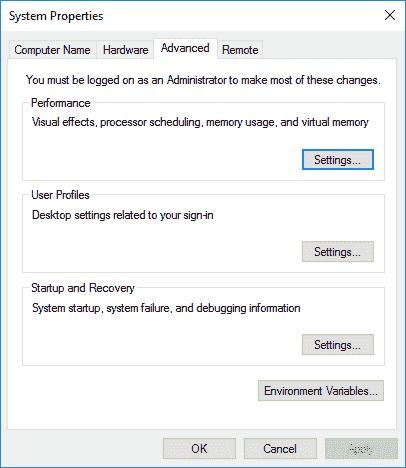](#)

在`System Variables`下，点击`New...`按钮。

[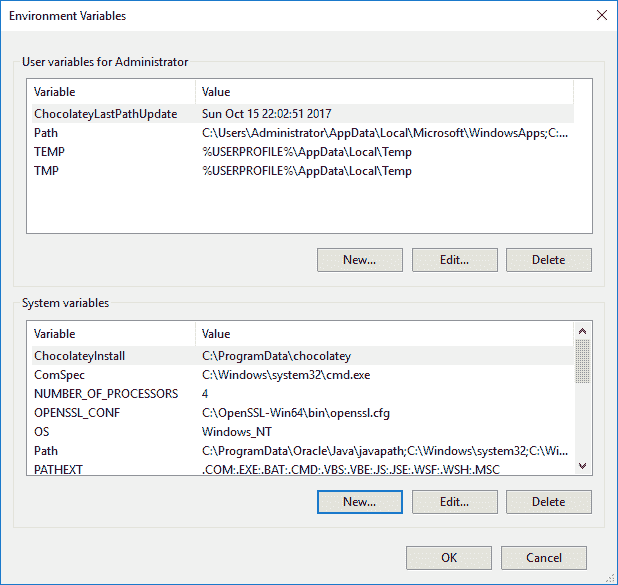](#)

输入`JAVA_HOME`作为`Variable name`，输入 Java 安装目录作为`Variable value`。

[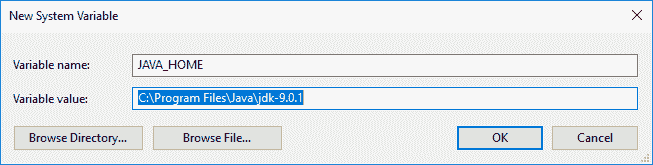](#)

点击`OK`按钮保存您的更改。

[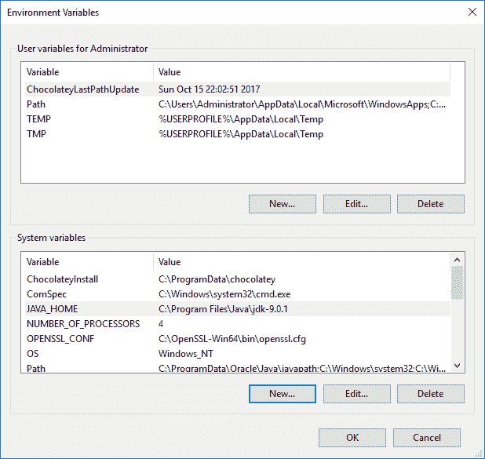](#)

打开 Powershell 并键入`Write-Host $env:JAVA_HOME`来查看环境变量的值。

[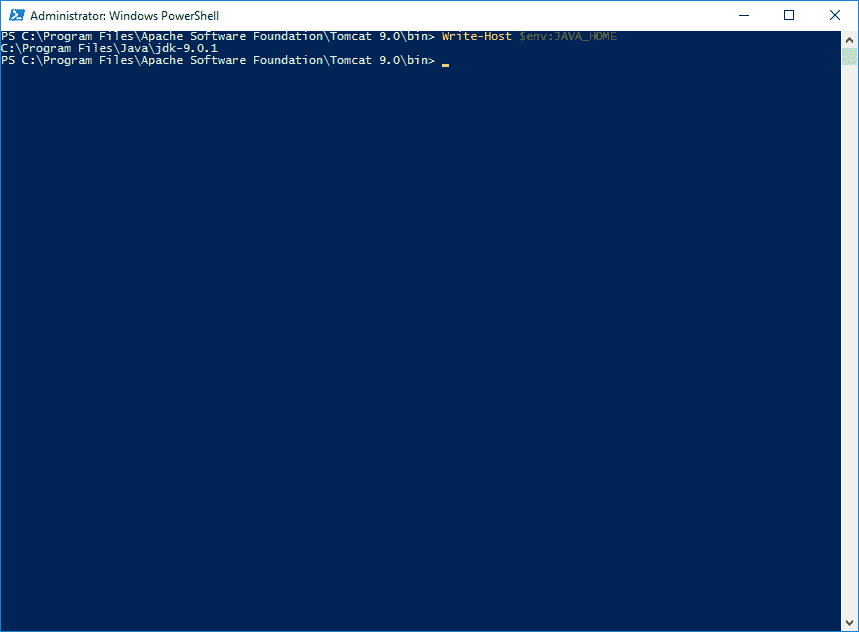](#)

### 在 Linux 中配置 JAVA_HOME 环境变量

在 Linux 中有多种方法来定义环境变量。最常见的是将环境变量添加到`/etc/environment`文件中。

例如，您可以配置`JAVA_HOME`环境变量来引用 Oracle JRE 8 安装，代码如下:

```
JAVA_HOME="/usr/lib/jvm/java-8-oracle/jre" 
```

Java 安装的位置取决于您使用的 Linux 发行版以及 Java 发行版。例如，如果您使用包管理器安装了 Java，那么您很可能安装了 OpenJDK。OpenJDK 将被安装到与 Oracle JDK 不同的目录中。

## 手动运行 Tomcat

要手动启动 Tomcat，您需要为 Windows 运行`bin\startup.bat`批处理文件，或者为 Linux 运行`bin/startup.sh` shell 脚本。

[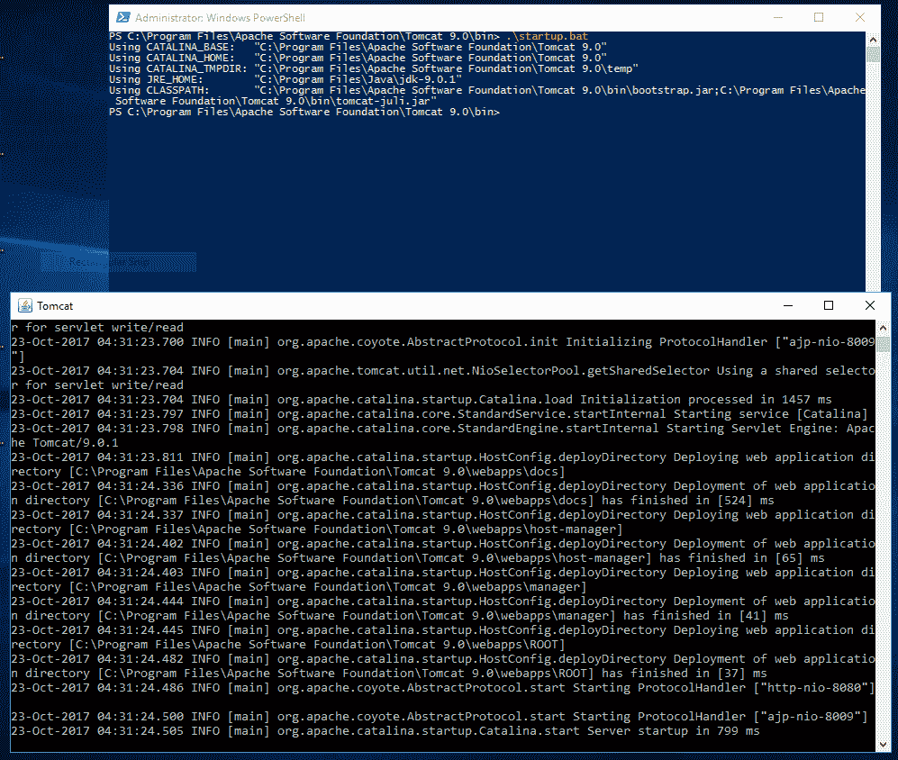](#)

## 将 Tomcat 安装为服务

生产 Tomcat 实例通常作为服务启动。这允许 Tomcat 在操作系统启动时启动，在操作系统关闭时关闭，并使用操作系统内置的服务管理工具进行管理。

### 将 Tomcat 安装为 Windows 服务

将 Tomcat 作为 Windows 服务安装的最简单方法是运行`Windows Service Installer` exe，这是 Tomcat 下载包选项之一。该安装程序提供了一个向导，将 Tomcat 配置为 Windows 服务。

[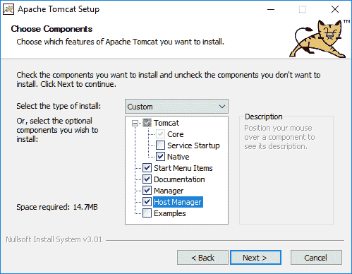](#)

[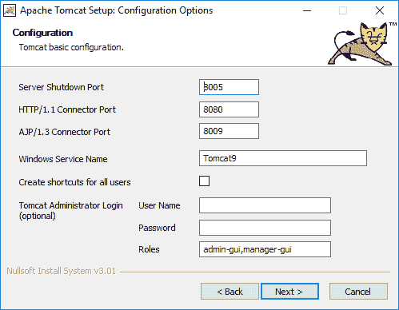](#)

或者，您可以使用`bin\service.bat`脚本将 Tomcat 手动配置为 Windows 服务。例如，运行命令`service.bat install MyService`将在名为`MyService`的 Windows 服务下配置 Tomcat。

有关手动配置 Tomcat Windows 服务的更多信息，请参见[文档](https://tomcat.apache.org/tomcat-9.0-doc/windows-service-howto.html#Installing_services)。

我测试的 Tomcat 版本附带的`service.bat`文件在 Java 9 JDK 上不能很好地工作。我在 Java 9 JDK 上运行`service.bat`时收到了错误`The JAVA_HOME environment variable is not defined correctly`。

这是因为 Java 9 已经取消了`jre`文件夹，但是`service.bat`批处理文件希望这个文件夹存在。

参见[这个 StackOverflow 的回答](https://stackoverflow.com/a/46388190)，了解 Java 9 中新文件夹结构的更多细节。

解决方法是将 Java 8 JDK 与 Java 9 一起安装，并在运行`service.bat`时覆盖`JAVA_HOME`环境变量，或者使用`Windows Service Installer` exe 来创建服务。

### 将 Tomcat 安装为 Linux 服务

不幸的是，Tomcat 没有为 Linux 操作系统提供服务定义文件。这些服务定义文件根据您运行的 Linux 发行版以及您使用的是 init.d 还是 systemd 而有所不同。

然而，定义自己的服务是相当容易的。

首先，我喜欢将 Tomcat 解压到`/opt`目录中。`/opt`目录[是为所有不属于默认安装](http://www.tldp.org/LDP/Linux-Filesystem-Hierarchy/html/opt.html)的软件和附加包保留的，这很好地描述了我们的 Tomcat 安装。

Linux 发行版太多了，无法为所有发行版提供服务脚本。然而，我提供了一个 initd 脚本示例，它是基于我在网上找到的例子。

该脚本假设在 Linux 中已经配置了一个名为`tomcat`的用户，并且 Tomcat 已经提取到了`/opt/apache-tomcat-9`目录中。您需要调整脚本以匹配您的本地环境。

该文件将保存在`/etc/init.d/tomcat`下。您还需要通过运行命令`chmod +x /etc/init.d/tomcat`来确保该文件是可执行的。如果您的 Linux 发行版使用 systemd，那么可以使用命令`systemctl enable tomcat`启用这个遗留的 initd 脚本。

```
#!/bin/bash
### BEGIN INIT INFO
# Provides:          tomcat
# Required-Start:    $local_fs $remote_fs $network
# Required-Stop:     $local_fs $remote_fs $network
# Should-Start:      $named
# Should-Stop:       $named
# Default-Start:     2 3 4 5
# Default-Stop:      0 1 6
# Short-Description: Start Tomcat.
# Description:       Start the Tomcat servlet engine.
### END INIT INFO

## run as a different user
TOMCAT_USER=tomcat

export CATALINA_HOME="/opt/apache-tomcat-9"
export CATALINA_PID="$CATALINA_HOME/bin/tomcat.pid"

start() {
 echo "Starting Tomcat..."
 /bin/su -s /bin/bash ${TOMCAT_USER} -c $CATALINA_HOME/bin/startup.sh
}
stop() {
 echo "Stopping Tomcat..."
 /bin/su -s /bin/bash ${TOMCAT_USER} -c "$CATALINA_HOME/bin/shutdown.sh -force"
}
case $1 in
  start|stop) $1;;
  restart) stop; start;;
  *) echo "Usage : $0 <start|stop|restart>"; exit 1;;
esac

exit 0 
```

Linux 标准库(LSB)定义了 initd 脚本中使用的约定。`### BEGIN INIT INFO`和`### END INIT INFO`之间的注释记录在初始化脚本的[注释约定中。](http://refspecs.linuxbase.org/LSB_2.0.1/LSB-PDA/LSB-PDA/initscrcomconv.html)

## 配置用户

Tomcat 内置了许多管理工具。这些管理工具的链接在默认的 Tomcat 欢迎页面上以名为`Server Status`、`Manager App`和`Host Manager`的链接形式提供。默认情况下，一旦使用`bin\startup.bat`或`bin/startup.sh`脚本或者通过启动服务手动启动了 Tomcat，就可以在 [http://localhost:8080](http://localhost:8080) 查看欢迎页面。

[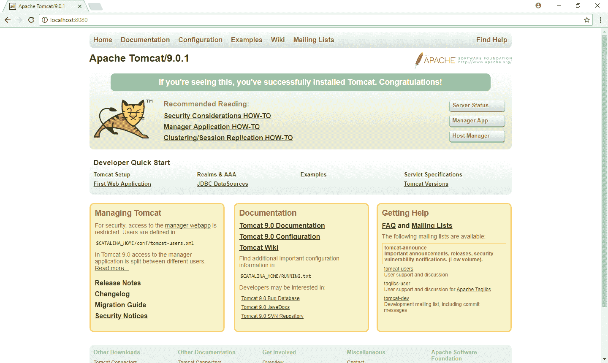](#)

在使用这些管理工具之前，您必须首先在 Tomcat 中配置用户。

用户在`conf/tomcat-users.xml`文件中定义。

用户被分配到组中。Tomcat 定义了一些授予管理工具访问权限的标准组。`manager-gui`组用于允许访问基于浏览器的管理工具，即您将通过点击欢迎页面上的`Server Status`、`Manager App`和`Host Manager`链接来访问的工具。

下面是一个`conf/tomcat-users.xml`文件的例子，它定义了一个名为`tomcat`的用户，其密码为`adminpass`，并被分配给`manager-gui`角色。

```
<tomcat-users xmlns:xsi="http://www.w3.org/2001/XMLSchema-instance"

              xsi:schemaLocation="http://tomcat.apache.org/xml tomcat-users.xsd"
              version="1.0">
    <role rolename="manager-gui"/>
    <user username="tomcat" password="adminpass" roles="manager-gui"/>
</tomcat-users> 
```

当您尝试打开其中一个管理工具时，系统会提示您输入用户名和密码。在这个提示符下，您可以输入`tomcat`用户名和`adminpass`提示符。

要了解 Tomcat 用来管理对管理工具的访问的组的更多信息，请参见标题为“配置管理器应用程序访问”的 [Tomcat 管理器文档](https://tomcat.apache.org/tomcat-9.0-doc/manager-howto.html#Configuring_Manager_Application_Access)。

## 结论

在这篇博客文章中，我们已经看到了许多需要做出的决定，包括运行什么版本的 Java，如何将 Tomcat 配置为一个服务，以及如何将用户添加到 Tomcat 的安装中。

如果您对将 Java 应用程序自动部署到 Tomcat 感兴趣，[下载 Octopus Deploy](https://octopus.com/downloads) 的试用版，并查看我们的文档。