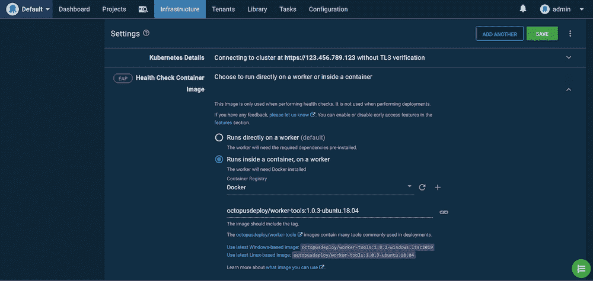

# 介绍 Octopus 服务器 Linux Docker 映像- Octopus Deploy

> 原文：<https://octopus.com/blog/introducing-linux-docker-image>

[](#)

作为我们为 Octopus Cloud 提供可扩展、经济高效的托管解决方案的努力的一部分，我们将所有 V1 托管的实例迁移到我们新的 V2 基础设施，在 Kubernetes 内的 Linux 容器中运行 Octopus，我们对结果非常满意。

今天，我想宣布提前进入章鱼服务器 Linux Docker 镜像。该图像基于支持我们的托管解决方案的相同代码。这些映像允许 Linux 用户在其选择的操作系统上托管 Octopus。

## 入门指南

以下 Docker 撰写模板是最简单的入门方式。该模板用一个命令配置 Microsoft SQL Server 和 Octopus。

下面是`docker-compose.yml`文件:

```
version: '3'
services:
   db:
    image: ${SQL_IMAGE}
    environment:
      SA_PASSWORD: ${SA_PASSWORD}
      ACCEPT_EULA: ${ACCEPT_EULA}
      # Prevent SQL Server from consuming the defult of 80% physical memory.
      MSSQL_MEMORY_LIMIT_MB: 2048
    ports:
      - 1401:1433
    healthcheck:
      test: [ "CMD", "/opt/mssql-tools/bin/sqlcmd", "-U", "sa", "-P", "${SA_PASSWORD}", "-Q", "select 1"]
      interval: 10s
      retries: 10
   octopus-server:
    image: octopusdeploy/octopusdeploy:${OCTOPUS_SERVER_TAG}
    privileged: true
    environment:
      ACCEPT_EULA: ${ACCEPT_OCTOPUS_EULA}
      OCTOPUS_SERVER_NODE_NAME: ${OCTOPUS_SERVER_NODE_NAME}
      DB_CONNECTION_STRING: ${DB_CONNECTION_STRING}
      ADMIN_USERNAME: ${ADMIN_USERNAME}
      ADMIN_PASSWORD: ${ADMIN_PASSWORD}
      ADMIN_EMAIL: ${ADMIN_EMAIL}
      OCTOPUS_SERVER_BASE64_LICENSE: ${OCTOPUS_SERVER_BASE64_LICENSE}
      MASTER_KEY: ${MASTER_KEY}
      ADMIN_API_KEY: ${ADMIN_API_KEY}
    ports:
      - 8080:8080
    depends_on:
      - db 
```

`.env`文件定义了 Docker Compose 使用的环境变量:

务必更改`ACCEPT_EULA`和`ACCEPT_OCTOPUS_EULA`值！

```
# It is highly recommended this value is changed as it's the password used for the database user.
SA_PASSWORD=N0tS3cr3t!

# Tag for the Octopus Server image. See https://hub.docker.com/repository/docker/octopusdeploy/octopusdeploy for the tags.
OCTOPUS_SERVER_TAG=2020.3.1

# Sql Server image. Set this variable to the version you wish to use. Default is to use the latest.
SQL_IMAGE=mcr.microsoft.com/mssql/server

# The default created user username for login to the Octopus Server
ADMIN_USERNAME=admin

# It is highly recommended this value is changed as it's the default user password for login to the Octopus Server
ADMIN_PASSWORD=Passw0rd123

# Email associated with the default created user. If empty will default to octopus@example.local
ADMIN_EMAIL=

# Accept the Microsoft Sql Server Eula found here: https://hub.docker.com/r/microsoft/mssql-server-windows-express/
ACCEPT_EULA=N

# Use of this Image means you must accept the Octopus Deploy Eula found here: https://octopus.com/company/legal
ACCEPT_OCTOPUS_EULA=N

# Unique Server Node Name - If left empty will default to the machine Name
OCTOPUS_SERVER_NODE_NAME=

# Database Connection String. If using database in sql server container, it is highly recommended to change the password.
DB_CONNECTION_STRING=Server=db,1433;Database=OctopusDeploy;User=sa;Password=N0tS3cr3t!

# Your License key for Octopus Deploy. If left empty, it will try and create a free license key for you
OCTOPUS_SERVER_BASE64_LICENSE=

# Octopus Deploy uses a Master Key for encryption of your database. If you're using an external database that's already been setup for Octopus Deploy, you can supply the Master Key to use it. If left blank, a new Master Key will be generated with the database creation.
MASTER_KEY=

# The API Key to set for the administrator. If this is set and no password is provided then a service account user will be created. If this is set and a password is also set then a standard user will be created.
ADMIN_API_KEY= 
```

您可以使用以下命令创建容器:

```
docker-compose up 
```

图像启动后，可以在`http://localhost:8080`访问 Octopus。

## 提示和技巧

如果你有敏锐的眼光，你可能已经注意到我们推出了将`privileged`标志设置为`true`的 Octopus 容器。这是支持 [Docker-in-Docker](https://hub.docker.com/_/docker) 特性所必需的，该特性在容器中默认启用。Docker-in-Docker 允许 Octopus 为工人使用[执行容器。](https://octopus.com/blog/execution-containers)

随着 Octopus 的发展，我们面临的挑战之一是与云服务和 Kubernetes 等平台交互所需的支持工具的数量、组合和版本。为了解决这个问题，可以在 Docker 容器中执行像 Kubernetes 这样的目标的部署和健康检查。Octopus 为 Windows 和 Linux 提供了广泛的通用工具，最终用户也可以创建自己的映像。

为了从托管 Octopus 的容器中运行这些图像，Docker 守护进程在后台运行，这需要使用`privileged`标志。这允许对执行容器的完全访问，意味着 Linux 用户拥有部署到云服务和 Kubernetes 的开箱即用支持(尽管 Service Fabric 仍然需要 Windows 工作人员进行部署)。

要禁用 Docker-in-Docker，请将环境变量`DISABLE_DIND`设置为`Y`。

这意味着最终用户不再需要使用`kubectl`等工具管理单独的工作人员，相反，他们可以利用提供的工作人员工具映像:

[](#)

*Kubernetes 健康检查需要 kubectl，它由 Worker tools 映像提供。*

## 在 Kubernetes 跑章鱼

正如这篇文章的引言所提到的，在 Linux 上运行 Octopus 的驱动力是允许它在 Kubernetes 上运行，并且这个选项现在对于那些想要在他们自己的 Kubernetes 集群中托管 Octopus 的人是可用的。

由于高可用性(HA)和 Kubernetes 是携手并进的，所以这里提供的解决方案支持使用多个 HA 节点扩展 Octopus 服务器实例。

部署 HA Octopus 集群时，需要考虑多个方面，包括:

*   高可用性数据库。
*   工件、日志和内置提要的共享文件系统。
*   web 流量的负载平衡器。
*   直接访问每个 Octopus 节点进行轮询触角。
*   可能导致数据库模式升级的启动和升级过程。

我们不会深入讨论部署 HA SQL 数据库的细节。出于本文的目的，我们将向集群部署一个 MS SQL Express 实例。下面的 YAML 创建了一个持久卷声明来存储数据库文件、一个在内部公开数据库的服务以及数据库本身:

```
kind: PersistentVolumeClaim
apiVersion: v1
metadata:
  name: mssql-data
spec:
  accessModes:
  - ReadWriteOnce
  resources:
    requests:
      storage: 8Gi
---
apiVersion: v1
kind: Service
metadata:
  name: mssql
spec:
  type: ClusterIP
  ports:
    -
      port: 1433
      targetPort: 1433
      protocol: TCP
  selector:
    app: mssql
---
apiVersion: apps/v1
kind: Deployment
metadata:
  name: mssql-deployment
  labels:
    app: mssql
spec:
  selector:
    matchLabels:
      app: mssql
  replicas: 1
  strategy:
    type: Recreate
  template:
    metadata:
      labels:
        app: mssql
    spec:
      terminationGracePeriodSeconds: 10
      volumes:
        - name: mssqldb
          persistentVolumeClaim:
            claimName: mssql-data
      containers:
        - name: mssql
          image: mcr.microsoft.com/mssql/server:2019-latest
          ports:
            - containerPort: 1433
          env:
            - name: MSSQL_PID
              value: Express
            - name: ACCEPT_EULA
              value: 'Y'
            - name: SA_PASSWORD
              value: Password01!
          volumeMounts:
            - name: mssqldb
              mountPath: /var/opt/mssql 
```

为了在 Octopus 节点之间共享公共文件，我们需要访问三个共享卷，多个 pods 可以同时读写这些卷。这些是通过持久卷声明创建的，访问模式为`ReadWriteMany`，表示它们在多个 pod 之间共享。下面的 YAML 创建了共享持久卷声明，它将托管任务日志、内置提要和工件:

注意，存储类名`azurefile`是特定于 Azure AKS 的，其他 Kubernetes 提供者将为他们的共享文件系统公开不同的名称。

```
kind: PersistentVolumeClaim
apiVersion: v1
metadata:
  name: repository-claim
spec:
  accessModes:
    - ReadWriteMany
  storageClassName: azurefile
  resources:
    requests:
      storage: 1Gi
---
kind: PersistentVolumeClaim
apiVersion: v1
metadata:
  name: artifacts-claim
spec:
  accessModes:
    - ReadWriteMany
  storageClassName: azurefile
  resources:
    requests:
      storage: 1Gi
---
kind: PersistentVolumeClaim
apiVersion: v1
metadata:
  name: task-logs-claim
spec:
  accessModes:
    - ReadWriteMany
  storageClassName: azurefile
  resources:
    requests:
      storage: 1Gi 
```

Octopus web 接口是一个 React 单页面应用程序(SPA ),可以将所有后端请求定向到任何 Octopus 节点。这意味着我们可以通过一个用于 web 接口的负载平衡器来公开所有 Octopus 节点。下面是一个负载平衡器服务的 YAML，它将端口 80 上的 web 流量定向到标签为`app:octopus`的 pod:

```
apiVersion: v1
kind: Service
metadata:
  name: octopus-web
spec:
  type: LoadBalancer
  ports:
    - name: web
      port: 80
      targetPort: 8080
      protocol: TCP
  selector:
    app: octopus 
```

与 web 界面不同，轮询触角必须能够单独连接每个 Octopus 节点，以接受新任务。我们的 Octopus HA 集群假设有两个节点，下面的负载平衡器为每个节点创建单独的公共 IP。

注意`statefulset.kubernetes.io/pod-name: octopus-0`和`statefulset.kubernetes.io/pod-name: octopus-1`的选择器。这些标签被添加到作为有状态集合的一部分而创建的 pod 中，其值是有状态集合名称和 pod 索引的组合:

```
apiVersion: v1
kind: Service
metadata:
  name: octopus-0
spec:
  type: LoadBalancer
  ports:
    - name: web
      port: 80
      targetPort: 8080
      protocol: TCP
    - name: tentacle
      port: 10943
      targetPort: 10943
      protocol: TCP
  selector:
    statefulset.kubernetes.io/pod-name: octopus-0 
```

```
apiVersion: v1
kind: Service
metadata:
  name: octopus-1
spec:
  type: LoadBalancer
  ports:
    - name: web
      port: 80
      targetPort: 8080
      protocol: TCP
    - name: tentacle
      port: 10943
      targetPort: 10943
      protocol: TCP
  selector:
    statefulset.kubernetes.io/pod-name: octopus-1 
```

最后，我们将上述所有资源组合成一个有状态集，创建 Octopus 节点。

有状态集提供了一种部署 pod 的机制，这些 pod 具有固定的名称、一致的排序和一次推出一个 pod 的初始部署过程，确保每个 pod 在下一个开始之前都是健康的(尽管重新部署需要特殊的考虑，我将在后面介绍)。在部署 Octopus 时，这个功能非常好用，因为我们需要确保 Octopus 实例按顺序启动，这样只有一个实例尝试对数据库模式应用更新。

下面的 YAML 创建了一个包含两个 pods 的有状态集合。这些 pod 将被称为`octopus-0`和`octopus-1`，这也将是分配给`statefulset.kubernetes.io/pod-name`标签的值，这又是我们如何链接暴露各个 pod 的服务。然后，pod 为工件、日志和内置提要挂载共享卷。

`preStop`钩子用于在节点停止之前排空节点。这使节点有时间完成任何正在运行的任务，并防止它开始新的任务。当服务器启动并运行时,`postStart` start 挂钩执行相反的操作并禁用消耗模式。

`readinessProbe`用于确保节点在 pod 被标记为就绪之前响应网络流量。`startupProbe`用于延迟`livenessProbe`直到节点启动，`livenessProbe`连续运行以确保节点正常运行:

```
apiVersion: apps/v1
kind: StatefulSet
metadata:
  name: octopus
spec:
  selector:
    matchLabels:
      app: octopus
  serviceName: "octopus"
  replicas: 2
  template:
    metadata:
      labels:
        app: octopus
    spec:
      terminationGracePeriodSeconds: 10
      volumes:
      - name: repository-vol
        persistentVolumeClaim:
          claimName: repository-claim
      - name: artifacts-vol
        persistentVolumeClaim:
          claimName: artifacts-claim
      - name: task-logs-vol
        persistentVolumeClaim:
          claimName: task-logs-claim
      containers:
      - name: octopus        
        image: octopusdeploy/octopusdeploy:2020.3.1
        securityContext:
          privileged: true
        env:
          - name: ACCEPT_EULA
            # "Y" means accepting the EULA at https://octopus.com/company/legal
            value: "Y"
          - name: OCTOPUS_SERVER_NODE_NAME
            valueFrom:
              fieldRef:
                fieldPath: metadata.name
          - name: DB_CONNECTION_STRING
            value: Server=mssql,1433;Database=Octopus;User Id=SA;Password=Password01!
          - name: ADMIN_USERNAME
            value: admin
          - name: ADMIN_PASSWORD
            value: Password01!
          - name: ADMIN_EMAIL
            value: admin@example.org
          - name: OCTOPUS_SERVER_BASE64_LICENSE
            # Your license key goes here. When using more than one node, a HA license is required. Without a HA license, the stateful set can have a replica count of 1.
            value: License goes here
          - name: MASTER_KEY
            # Replace this, as this value protects secrets in Octopus
            value: 6EdU6IWsCtMEwk0kPKflQQ==
        ports:
        - containerPort: 8080
          name: web
        - containerPort: 10943
          name: tentacle
        volumeMounts:
        - name: repository-vol
          mountPath: /repository
        - name: artifacts-vol                                                  
          mountPath: /artifacts
        - name: task-logs-vol
          mountPath: /taskLogs
        lifecycle:
          preStop:
            exec:
              command:
              - /bin/bash
              - -c
              - '[[ -f /Octopus/Octopus.Server ]] && EXE="/Octopus/Octopus.Server" || EXE="dotnet /Octopus/Octopus.Server.dll"; $EXE node --instance=OctopusServer --drain=true --wait=600 --cancel-tasks;'
          # postStart must finish in 5 minutes or the container will fail to create
          postStart:
            exec:
              command:
              - /bin/bash
              - -c
              - 'URL=http://localhost:8080; x=0; while [ $x -lt 9 ]; do response=$(/usr/bin/curl -k $URL/api/octopusservernodes/ping --write-out %{http_code} --silent --output /dev/null); if [ "$response" -ge 200 ] && [ "$response" -le 299 ]; then break; fi; if [ "$response" -eq 418 ]; then [[ -f /Octopus/Octopus.Server ]] && EXE="/Octopus/Octopus.Server" || EXE="dotnet /Octopus/Octopus.Server.dll"; $EXE node --instance=OctopusServer --drain=false; now=$(date); echo "${now} Server cancelling drain mode." break; fi; now=$(date); echo "${now} Server is not ready, can not disable drain mode."; sleep 30; done;'
        readinessProbe:
          exec:
            command:
            - /bin/bash
            - -c
            - URL=http://localhost:8080; response=$(/usr/bin/curl -k $URL/api/serverstatus/hosted/internal --write-out %{http_code} --silent --output /dev/null); /usr/bin/test "$response" -ge 200 && /usr/bin/test "$response" -le 299 || /usr/bin/test
          initialDelaySeconds: 30
          periodSeconds: 30
          timeoutSeconds: 5
          failureThreshold: 60
        livenessProbe:
          exec:
            command:
            - /bin/bash
            - -c
            - URL=http://localhost:8080; response=$(/usr/bin/curl -k $URL/api/octopusservernodes/ping --write-out %{http_code} --silent --output /dev/null); /usr/bin/test "$response" -ge 200 && /usr/bin/test "$response" -le 299 || /usr/bin/test "$response" -eq 418
          periodSeconds: 30
          timeoutSeconds: 5
          failureThreshold: 10
        startupProbe:
          exec:
            command:
            - /bin/bash
            - -c
            - URL=http://localhost:8080; response=$(/usr/bin/curl -k $URL/api/octopusservernodes/ping --write-out %{http_code} --silent --output /dev/null); /usr/bin/test "$response" -ge 200 && /usr/bin/test "$response" -le 299 || /usr/bin/test "$response" -eq 418
          failureThreshold: 30
          periodSeconds: 60 
```

有状态集的初始部署完全按照 Octopus 的要求工作；一次一个 pod 在下一个之前成功启动。这使第一个节点有机会用任何需要的更改来更新 SQL 模式，所有其他节点启动并共享已经配置好的数据库。

有状态集的一个限制是它们处理更新的方式。例如，如果更新了 Docker 映像版本，则默认使用滚动更新策略。滚动更新会删除并重新创建每个 pod，这意味着在更新过程中会混合新旧版本的 Octopus。这是行不通的，因为新版本可能会应用旧版本无法使用的模式更新，最多会导致不可预测的结果，并可能导致数据损坏。

此问题的典型解决方案是使用重新创建部署策略。不幸的是，有状态集不支持重建策略。

这意味着有状态集不能就地更新，而是必须删除，然后部署新版本。这个新的、有状态集的新副本将一个接一个地启动新的 pod，从而允许数据库更新按预期完成。

一旦完全部署，该配置将有三个负载平衡器，并依次有三个公共 IP。

`octopus-web`服务用于访问 web 界面。正如我们前面提到的，web 应用程序可以向任何节点发出请求，因此跨所有节点的负载平衡意味着即使一个节点关闭，web 界面也是可访问的。

`octopus-0`服务用于将轮询触角指向第一个节点，而`octopus-1`服务用于将轮询触角指向第二个节点。我们还通过这些服务公开了 web 接口，这为支持团队提供了与给定节点直接交互的能力，但是`octopus-web`服务应该用于日常工作。[文档](https://octopus.com/docs/administration/high-availability/maintain/polling-tentacles-with-ha)提供了将轮询触角连接到 HA 节点的细节。

为了更大程度的可靠性，pod [反相似性规则](https://kubernetes.io/docs/concepts/scheduling-eviction/assign-pod-node/#inter-pod-affinity-and-anti-affinity)可用于确保 Octopus pods 不被放置在同一个节点上。这确保了节点的丢失不会导致 Octopus 集群停机。

## 章鱼舵图

为了方便起见，上面描述的 Kubernetes 资源被捆绑到一个 Helm 图表中。要添加 Helm 存储库，请运行以下命令:

```
helm repo add octopus https://octopus-helm-charts.s3.amazonaws.com
helm repo update 
```

然后使用以下命令安装图表:

```
helm install octopus octopus/octopusdeploy --set octopus.licenseKeyBase64=<your Octopus license key base64 encoded> --set octopus.acceptEula=Y --set mssql-linux.acceptEula.value=Y 
```

图表的默认值配置为创建一个带有`ReadWriteOnce`卷的单节点 Octopus 集群。默认情况下，Kubernetes 集群很好地支持这些值。

要部署 HA 集群，您需要定义一些特定于您要部署到的集群的附加值。例如，当部署到 Azure AKS 时，以下值用于创建在三个 Octopus HA 节点之间共享的`ReadWriteMany`卷:

```
helm install octopus octopus/octopusdeploy --set octopus.replicaCount=3 --set octopus.storageClassName=azurefile --set octopus.licenseKeyBase64=<your Octopus license key base64 encoded> --set octopus.acceptEula=Y --set mssql-linux.acceptEula.value=Y 
```

图表源代码可在 [GitHub](https://github.com/OctopusSamples/OctopusHelmChart) 上获得。

## 添加部署目标

除了云部署之外，自托管部署也通过触手的 Linux 版本得到支持。DEB 和 RPM 包都提供了，或者你可以下载一个独立的文档。

当然，如果你需要管理跨操作系统的部署和操作，你仍然可以将 Windows Tentacles 连接到 Linux 版本的 Octopus。

## 从这里去哪里

Linux Docker 映像和示例 Kubernetes 资源已经作为我们早期访问计划(EAP)的一部分发布，因此我们预计会有一些错误和粗糙的边缘，并且我们不支持这个版本用于生产部署。然而，如果你遇到任何问题，我们很乐意通过我们的[支持渠道](https://octopus.com/support)了解它们，这样我们就可以解决问题。

愉快的部署！