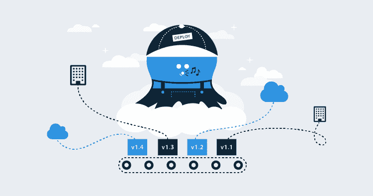

# 介绍 Octopus Cloud - Octopus Deploy

> 原文：<https://octopus.com/blog/introducing-octopus-cloud>

当我 2017 年 9 月刚开始在 Octopus 工作时，“托管”(我们当时这样称呼它)已经流传了一段时间，但真正的工作还没有真正开始。2017 年底，一个团队正式成立，将托管带入生活，汇集了我们团队在云架构、基础设施和安全方面的技能。这是一次疯狂的旅程，但我们终于到达了终点——章鱼云将在未来几周内向公众开放。

随着发布即将到来，我想花一点时间来写一下我们到这一点的旅程:为什么我们决定建立章鱼云，哪些事情真的很好，其他事情真的没有用，以及我们在这个过程中吸取的一些教训。

这篇文章还推出了一个章鱼云博客系列，后续文章更深入地挖掘了我们面临和克服的一些具体挑战，以及我们的团队和公司如何在这个云原生世界中进行变革。喝杯咖啡安顿下来。

## 为什么要把章鱼放在云端？(章鱼简史)

当 Octopus 作为 Paul Stovell 的许多伟大想法之一首次出现时，编程和开发的前景非常不同；可靠且可重复地部署到内部和自托管服务器是一件非常痛苦的事情。当时，应用程序通常运行在托管服务器上，因此在同一个网络(或 WAN)上拥有托管部署服务器是完全有意义的。

5 年后，情况看起来完全不同了。许多团队专门(或主要)为云开发:web 应用程序、微服务、“无服务器”(将代码转储到其他人的服务器上，给他们制造问题)都存在于这个模糊的“其他空间”中。当您的所有部署目标都位于云中时，拥有一个托管的本地部署服务器没有任何意义。无论如何，许多团队都在 Azure 或 AWS 上的云虚拟机上运行他们的 Octopus，我们甚至开始称之为“自托管”(而不是“内部”)，因为无论如何，许多人都没有自己运行服务器。

因此，我们问自己，如果我们是客户，当我们所有的代码都在云中时，我们会想要在某个地方部署和管理服务器来运行 Octopus 吗？当然，答案是否定的！当我们开始听到类似“Octopus 是我唯一的虚拟机”的评论时，我们知道是时候改变现状了。

## 我们是如何做到的(以及为什么真的很难)

听起来很简单，对吧？“就把它放在云中”是我经常听到的话，通常是从那些真的不知道这有多难的人那里听到的。剧透:这并不容易。一点也不。现在仍然不是。在将 Octopus 推向极限和争论 AWS 之间，我们都学到了很多——在随后的帖子中，我们将更深入地讨论这些话题。

### “在服务器上运行”(又名“请摧毁我们的服务器”)

简而言之，Octopus 是从零开始构建的，目的是*使*开发人员能够进行无缝、弹性的开箱即用部署，而且能够根据需要进行修改和调整，以使他们的特定配置正常工作。这意味着 Octopus 有大量的开关，您可以根据自己的需要调整部署。而当你自己控制服务器的时候，那完全没问题。但是允许*任何*任意脚本和可执行文件在我们的服务器上不受限制地运行确实让我们非常紧张。然而，这迫使我们对安全性和我们的执行架构进行了一些非常有趣的讨论，并为一些令人兴奋的新功能铺平了道路([阅读一下 Workers](https://octopus.com/blog/octopus-release-2018.6#octopus-workers-backend-enhancements) ，即将推出)。

### 将章鱼推向极限(又名“我们能有多有创造力？”)

我们在构建 Octopus Cloud 时做出了一个决定，我们应该吃我们自己的狗粮，并使用 Octopus 作为我们管理云实例的主要驱动程序。这意味着我们运行一个特殊的、幸运的 Octopus 实例来处理我们的大部分管理流程，从启动所有 AWS 基础设施和安全配置，到当我们达到特定限制时部署新的数据库服务器和存储网关，以及重复部署来运行监控和维护任务。这是一个有趣的旅程，我们不得不变得非常有创造力，但它也启动了一些真正有趣的内部可用性和性能对话，我们以前没有接触过。

### 抓住脉搏(又名“凌晨 3 点警报灾难”)

我们(主要)是一支澳大利亚团队，这是我们真正引以为豪的事情！但是，当我们的许多客户都不在澳大利亚时，这种支持也有不利的一面。因此，对我们来说，一个很大的考虑是确保我们对章鱼云的问题保持敏感和响应，**无论它们可能在什么时候发生**。当您的部署依赖我们时，如果出现问题，我们不能让您无所适从。因此，章鱼云故事的很大一部分是挂钩有意义的指标和明智的警报的旅程，这样如果有任何不好的事情发生，我们就会收到通知。

作为旁注，我雄心勃勃地自愿成为我们第一周 24/7 随叫随到的试验品，我有一些非常愤怒的凌晨 3 点试图读取我手机上的堆栈跟踪，因为“我的手机比太阳更亮”(直接引用我的另一半的话)而被打在我的身边。

### 打破筒仓(又名“不要成为知识囤积龙”)

每个人都有自己的兴趣和特定的技能，呆在那个舒适区而不去外面冒险真的很诱人。对我来说，我很擅长 MVC 和 web-appy-Azure 之类的东西，但我在 Angular 方面很糟糕，我认为 AWS 讨厌我。我试着坚持做我最了解的事情，认为这是我技能的最佳运用。虽然这在技术上是正确的，但它鼓励了巨大的知识支柱的形成，“哦，这是一个 MVC 的问题？最好和安迪谈谈，”当人们生病时，这就成了一个问题，而当你随叫随到，只知道自己的事情，其他什么都不知道时，这就成了一个更大的问题。我们做了很多配对工作，都钻研了让我们相当不舒服的东西，所以我们都有完整堆栈的工作知识。但私底下我还是很吸 Angular 的(宋承宪不要告诉任何人)。

## 下一步是什么？(我试图解读水晶球)

章鱼云是一个非常棒的地方。我们目前只接受邀请的早期访问，非常乐意向任何渴望尝试云实例的人敞开大门。但是，像许多大型事业一样，真正的旅程还在前面。对于我们用户来说，章鱼云真的是一个“怎么样”，而不是一个“什么”。Octopus 本身也是你们多年来一直在使用的伟大系统，我们只是以一种不同的(更无缝的)方式带给你们。云团队的前进之路将是利用我们已经构建的平台并在其上进行改进:更快的配置、更低的成本、更高的性能等等。你可能甚至没有注意到这些改进，但我们仍然会努力工作。

谢谢你坚持到最后！我真的希望这是一个有趣的见解，让我们了解我们是如何走到这一步的，以及我们接下来可能会去哪里。请关注更多的帖子，不要害怕在下面的评论中提出任何问题。如果您有技术问题，请阅读我们的常见问题。

直到我们再次交谈，愉快(几乎云)部署！