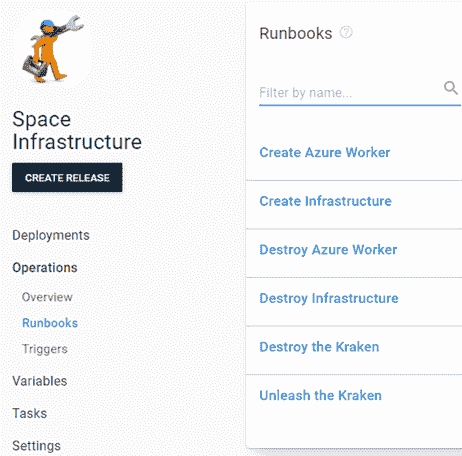

# 介绍 Octopus 示例- Octopus Deploy

> 原文：<https://octopus.com/blog/introducing-octopus-samples>

虽然乍看起来可能不像，但 Octopus Deploy 是一个庞大的产品。产品如此庞大，以至于在 Octopus 工作多年的人仍然不完全了解它。为了解决我们产品的巨大规模，我们开发了大量的文档，并制作了各种演示常见用法的视频。然而，并不是每个人都喜欢钻研文档或搜索视频来解决他们想要完成的事情。有些人只是想得到产品来解决问题。为此，我们创建了 [Octopus Samples](https://samples.octopus.app) 实例。

## 样品

Samples 实例是为有使用 Octopus Deploy 经验的人准备的，他们希望了解如何解决特定的问题。示例中的示例是根据真实场景建模的，通常有些复杂，这意味着新用户可能会觉得难以理解。

## 正在登录

Samples 是一个公开的实例，任何人都可以使用。在浏览器中打开[https://samples . octopus . app](https://samples.octopus.app)并选择 Guest(**我有一个账户**选项是为解决方案团队成员准备的。)

Guest access 使实例中的所有可用空间和项目都可用，允许您查看项目的所有方面，包括部署过程、步骤细节、操作手册和变量。但是，版本创建和执行部署受到限制。

## 航行

Samples 实例中的示例分布在多个空间中，以便更容易找到您想要的内容。命名约定将*模式*或*目标*作为每个空间名称的前缀，例如:

*   模式-租赁
*   模式- Voltron
*   目标码头工人
*   目标杂交

### 模式

以 *Pattern* 为前缀的空格展示了您可以实现的不同类型的模式。例子包括:

多项目部署协调

这些只是可用的一些模式空间。

### 目标

以*为前缀的空格 Target* 演示了如何部署到特定的技术，例如不同的数据库类型:

或 web 服务器:

同样，这并不是一个详尽的可用列表。

## 运行手册

Samples 实例中的所有示例都是功能齐全的，并执行到实际目标的部署。我们使用操作手册来供应和配置部署的目标。全空间基础设施是在太空的**空间基础设施**项目中创建的；

创建项目特定基础设施的操作手册包含在项目本身中。在这些操作手册中，你可以找到不同的方法来实现基础设施，如在云服务上运行的代码，如亚马逊 AWS (CloudFormation)，微软 Azure (ARM 模板)，甚至谷歌云平台。

## 构建服务器

示例实例中的大多数示例都由兼容的生成服务器中的生成提供支持。每个项目都包含一个链接，指向构建它的构建定义。我们实现了以下示例:

*   Azure DevOps
*   团队城市
*   詹金斯
*   竹子
*   切尔莱西
*   GitHub 操作
*   比特桶管道

## 结论

Octopus Deploy 尽最大努力为客户提供成功所需的工具。无论你的学习方式是阅读，视觉，或通过例子，章鱼有你涵盖。