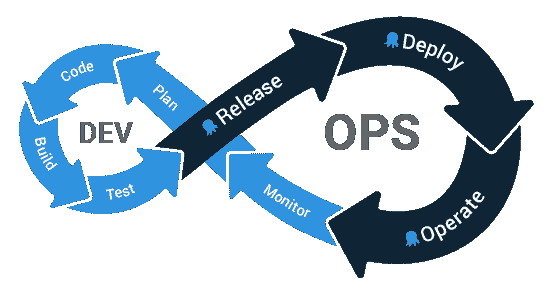
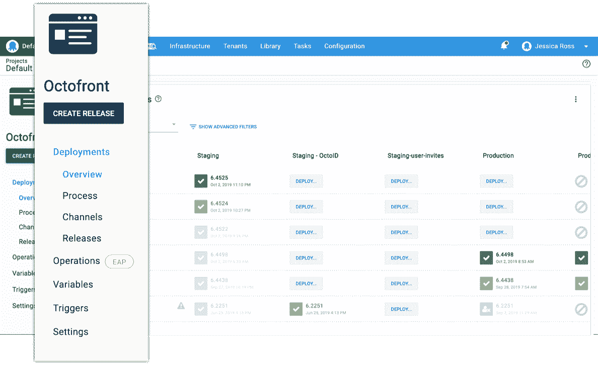
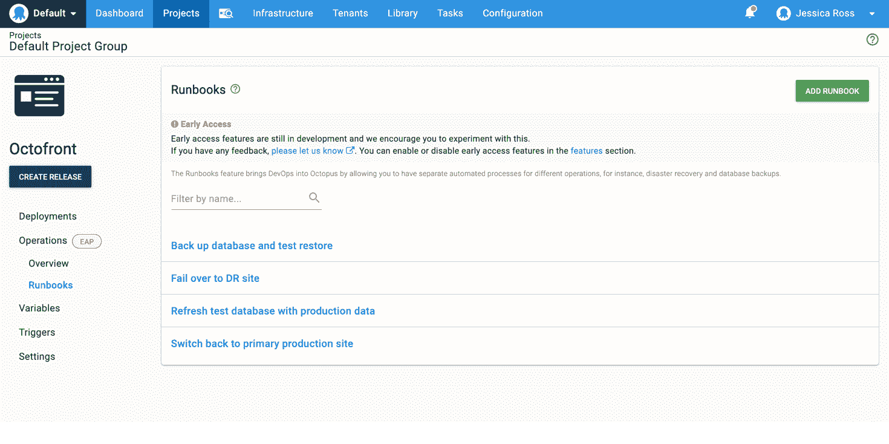
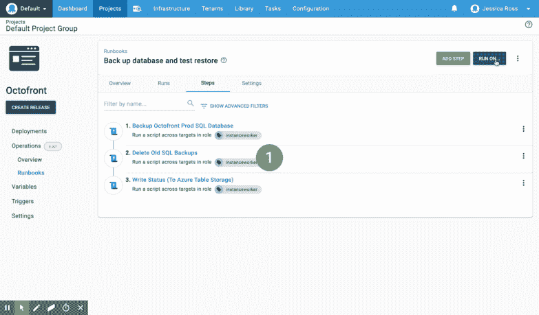

# 为您的运营团队介绍运营操作手册- Octopus Deploy

> 原文：<https://octopus.com/blog/introducing-operations-runbooks>

部署只是应用程序生命周期中的一个阶段。为了保持应用程序平稳运行，还需要执行许多其他常见任务。DevOps 的很大一部分是开发和运营团队一起工作，Octopus 似乎是使用的完美工具，因为它已经了解了您的基础设施、帐户和项目配置。

如果我们以 Octopus.com 的 Octopus Deploy 网站为例，我们使用 Octopus 来部署我们的网站并管理我们的基础设施、变量、证书和帐户。但是我们也有一些日常和紧急任务，作为运营网站的一部分。例如，备份数据库、恢复数据库、测试恢复、从数据库中删除 PII、将净化的数据库恢复到测试环境以及故障转移到灾难恢复站点。

目前，这些任务在一个项目的部署过程中，或者作为单独的脚本执行。为部署执行所有这些步骤没有意义，仅仅为了备份数据库而进行部署也没有意义。

Operations Runbooks 使我们能够简化部署流程，并在部署的不同时间间隔运行操作任务。我们的操作手册列表是:

1.  故障转移到灾难恢复站点。
2.  切换回主生产站点。
3.  备份数据库(并测试恢复是否有效)。
4.  用(清理的)生产数据刷新测试数据库。

使用 runbooks，概览和任务列表向我们显示了确切的操作以及它们分别执行的运行，让我们了解了网站的真实状态。

## Octopus 部署中的操作手册

可以从项目中访问操作手册。这意味着您可以将与运行应用程序相关的所有内容放在一起。如果您的操作任务只适用于您的基础架构，而不一定与应用程序相关，例如清理机器上的文件，我们建议您为这些类型的操作创建一个单独的项目。

在项目菜单中，与部署相关的所有内容都在一个新的**部署**菜单项下。操作手册在**操作**菜单下，随着我们将来增加新的操作，你可以期待看到这个部分的增长。可以在部署和操作之间共享的资源不在这些范围之内。

## 创建和运行操作手册

添加操作手册可以从操作➜操作手册部分完成，向操作手册添加步骤与向部署流程添加步骤的工作方式相同。

如果您在部署流程中有操作步骤，可以将它们克隆到操作手册中。

runbooks 运行时，会在运行时创建一个快照，这样可以更快地执行操作。我们没有设计依赖生命周期的操作手册，所以只要你有许可，你可以在任何环境下运行操作手册。

## 克隆步骤

如果您的部署流程中有更适合于 Runbook 的步骤，您可以将该步骤复制到 Runbook 中。

## 新权限

您可以使用新的权限`RunbookView`和`RunbookEdit`(用于创建、编辑和删除)来启用或限制用户运行 runbooks。Runbooks 为运行和快照重新使用现有的`ProcessEdit`、`Deployment`和`Release`权限。

## 运营操作手册早期访问

我们已经在 [Octopus 2019.10](/blog/octopus-release-2019.10) 中发布了 run book 作为早期访问功能，我们鼓励您尝试任何非特定应用程序流程的 run book。

我们早期访问计划的目标是获得反馈并验证其设计。EAP 中的变量、触发器和其他方面有一些限制，但是 [runbooks 文档](https://octopus.com/docs/deployment-process/operations-runbooks#current-limitations)提供了您需要开始的所有细节以及当前的限制。

我们喜欢反馈，所以请在`#runbooks`频道加入我们的[社区松弛期](https://octopus.com/slack)的讨论。您也可以在我们的[公共路线图](https://octopus.com/company/roadmap)页面上注册更新。

## 结论

我们很高兴分享这第一版操作手册，并看到团队如何在他们的项目中使用它。