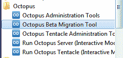
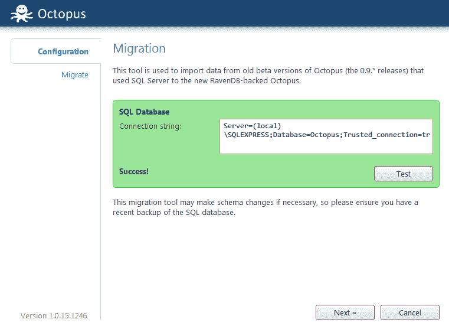
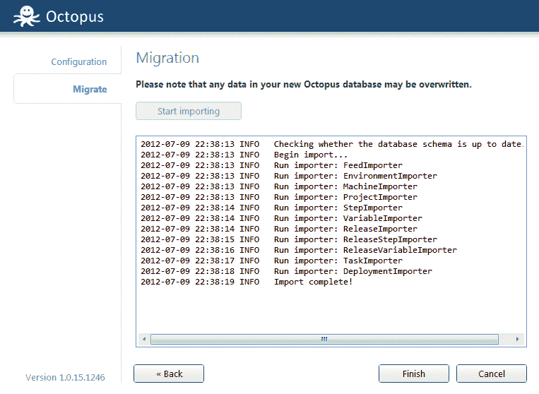

# 介绍测试版迁移工具- Octopus Deploy

> 原文：<https://octopus.com/blog/introducing-the-migration-tool>

最近我写了 Octopus Deploy 最初是如何使用微软 SQL Server 数据库来存储部署信息的，以及[我如何在 1.0 版本中切换到 RavenDB】。](http://octopusdeploy.com/blog/how-we-use-ravendb "How we use RavenDB")

许多客户的数据都在 0.9 以上。* Octopus 的版本，无法升级到 1.0，因为没有办法迁移数据。我一直在开发一个工具，将这些数据从 SQL Server 导入 RavenDB，现在它已经包含在最新的 Octopus Deploy 版本中。

在这篇文章中，我将带你完成迁移过程。显然这篇文章只对 0.9 的客户有兴趣。*数据库。

## 移民

开始从 0.9 迁移到 1.0 之前:

1.  制作 SQL Server 数据库的备份
2.  下载安装[最新的 Octopus Deploy 服务器](http://octopusdeploy.com/downloads "Download")。按照常规完成安装向导([详见安装指南](http://octopusdeploy.com/documentation/install "Installation guide"))。
3.  确保 Octopus Windows 服务正在运行

至此，您应该已经安装了 1.0 Octopus，但是没有任何旧数据。现在，从“开始”菜单中，查找 Octopus Beta 迁移工具快捷方式:

该向导将要求您输入 SQL Server 数据库的连接字符串(它应该会从您以前的安装中自动检测到该字符串):

一旦测试了连接字符串的工作情况，就可以开始导入了:

## 迁移后

一旦导入完成，你可以像往常一样浏览你的 Octopus 门户网站。您应该会发现之前的所有数据都已导入。

然而，你还需要做一个额外的步骤。Octopus 和触手的安全模型已经改变([我们现在交换拇指纹](http://octopusdeploy.com/documentation/security/octopus-tentacle "Octopus/tentacle security"))，所以你必须在你所有的机器上运行新的触手安装程序，并在 Octopus 门户网站中编辑每台导入的机器，以注册机器拇指纹。

解决了这个问题，您现在将拥有一个愉快的 1.0 安装了！

如果您在迁移过程中有任何问题，请在我们的支持论坛上[告诉我们。](http://help.octopusdeploy.com "Octopus help")