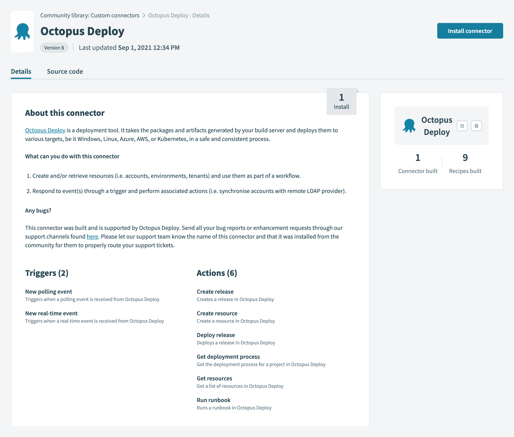
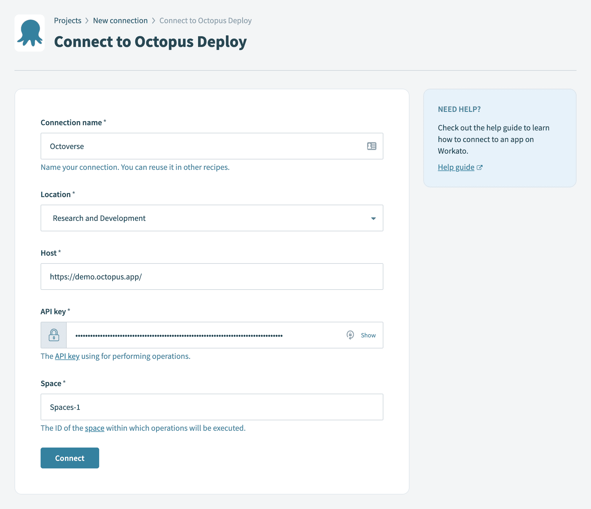
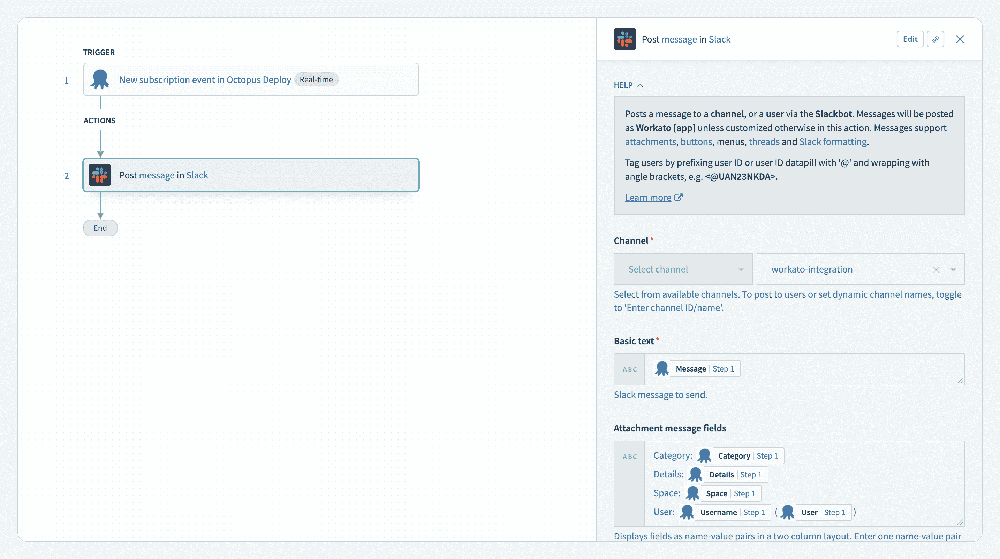
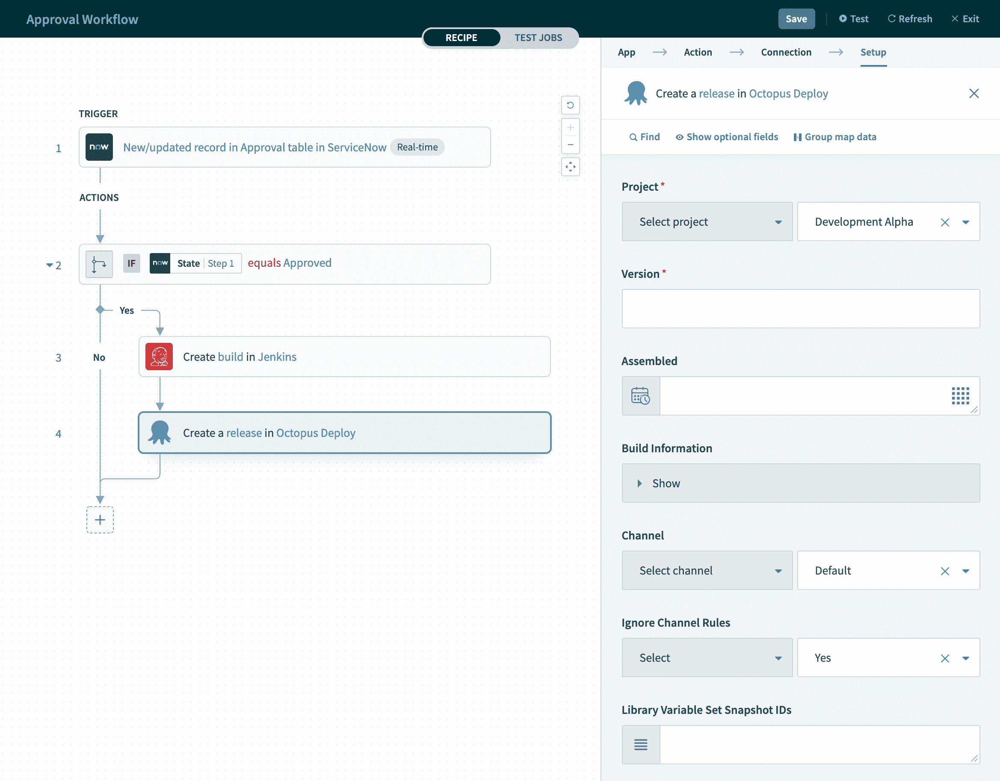

# 介绍 Octopus Deploy - Octopus Deploy 的 Workato 连接器

> 原文：<https://octopus.com/blog/introducing-workato-connector>

用于 Octopus Deploy 的 [Workato 连接器现已上市。我们对 Workato 的支持将使 Octopus Deploy 客户的各种工作流场景成为可能。](https://www.workato.com/integrations/community/octopus-deploy)

Workato 是一个企业集成平台即服务(iPaaS ),可以帮助您构建工作流程自动化。您通过低代码/无代码可视化设计器构建工作流，支持数百种不同的平台和系统。在 Ruby 中，Workato 连接器被定义为一个 JSON 配置，并通过 Workato 开发环境注册。

我们知道 IT 团队仍然在[工作流自动化](https://www.workato.com/the-connector/work-automation-index/)中发挥着重要作用，但是产品团队和业务运营团队也越来越多地参与进来。这需要快速实现，可以用 Workato 的低代码接口进行优化。

Octopus 的 Workato 连接器让您可以快速地将 Octopus 集成到您的工作流程中。它支持使用 Octopus Deploy 执行许多操作，包括:

*   创建版本
*   创建客户、渠道、部署、环境和项目等资源
*   部署版本
*   获取部署流程
*   从 Octopus Deploy 获取各种资源(包括部署目标、提要、运行手册、团队和租户)
*   运行操作手册
*   创建通过触发器响应 Octopus 中事件的食谱

如果需要，还可以向连接器添加其他操作。

在我们的[发布公告](https://octopus.com/blog/octopus-release-2021-q3)中了解更多关于 Octopus 2021.2 (Q3)发布的信息。

## 入门指南

使用 Octopus Deploy 连接器在 Workato 中创建工作流非常简单:

*   在 work to**社区图书馆**的**自定义连接器**部分搜索`Octopus`。导航到连接器将提供其描述及其源代码。
*   要使用连接器，点击**安装连接器**按钮。

在配置连接器之前，您需要在 Octopus Deploy 中创建一个 API 键。连接器使用这个 API 键代表您对 Octopus Deploy 执行操作。关于如何做到这一点的信息在我们的[如何创建 API 密钥文档](https://octopus.com/docs/octopus-rest-api/how-to-create-an-api-key)中提供。

创建 API 键之后，您需要在 Workato 中的 Octopus Deploy 连接器和您希望集成到工作流中的 Octopus 实例之间建立连接:

【T2 

主机地址是指向 Octopus Deploy 的 URL。请确保在配置中包含了要定位的空间。

点击**连接**后，您可以开始在 Workato 中创建工作流。

## Octopus 部署工作示例

Workato 是一个灵活而强大的集成平台，您可以构建无限的工作流来满足您团队的需求。下面是两个可能的例子，我们很想看到它们在现实环境中的应用。

### 示例:在 Octopus 部署中发生事件时通知松弛通道

客户经常使用的工作流是在 Octopus Deploy 中发生特定事件时通知空闲通道:

这是通过新的订阅事件触发器实现的，该触发器响应 Octopus Deploy 引发的实时事件。当发生这种情况时，会向松弛通道通知事件的详细信息(例如，创建了新的部署)。

### 示例:在 ServiceNow 中批准；与詹金斯一起建造；章鱼展开时释放

此场景提供了一个更详细的示例，说明了您可以使用 Workato 创建的工作流类型:

在此工作流中，来自 ServiceNow 实例的实时批准事件会触发一系列操作。具体来说，在 Jenkins 中开始构建，然后在 Octopus Deploy 中创建一个版本。作为工作流程的一部分，可以检查条件并将其用于推动决策。这些类似于编程语言中的控制流语句，如`if` - `then` - `else`语句。

## 结论

Workato 的自动化配方允许您通过可视化设计器构建工作流，为系统集成提供了一个低代码工具。

除了在 Slack、微软团队、吉拉或其他系统中触发 runbook 自动化之外，Workato 还使 Octopus 和 Workato 用户可以在开发、测试或生产部署后轻松发布其他系统的更新。这些可能是简单的通知，或第三方系统中的更新票证。

Workato 的强大之处在于它能够轻松地将其他系统与 Octopus Deploy 集成在一起。

愉快的部署！