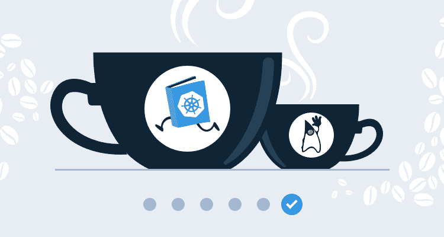
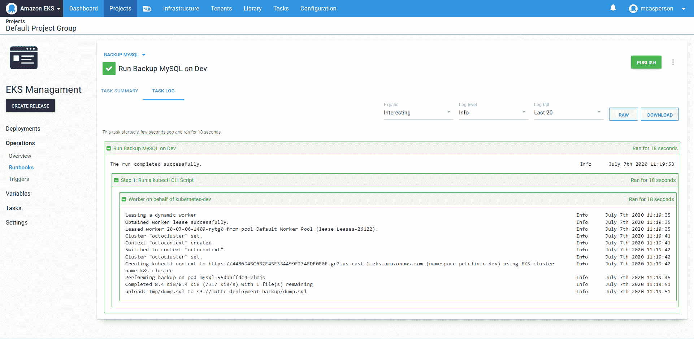
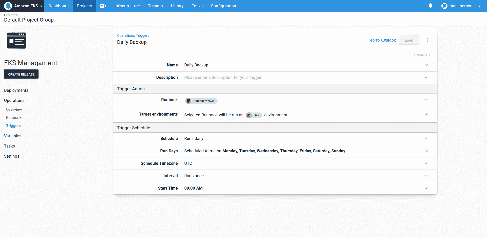
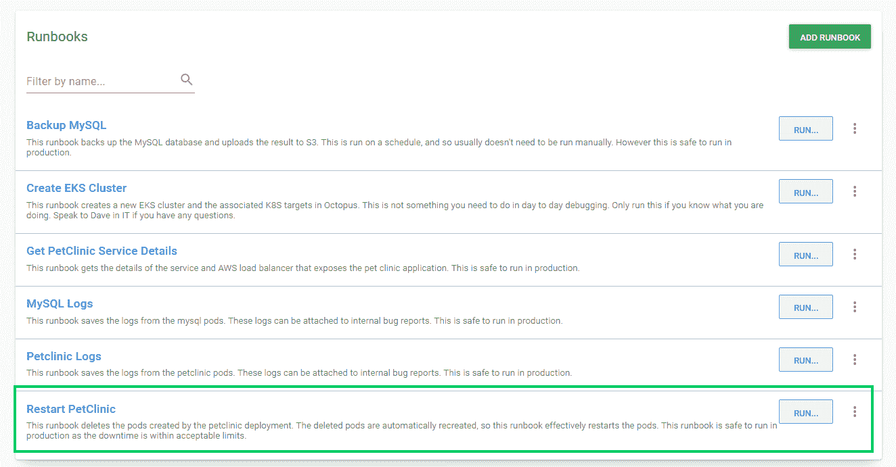

# Java CI/CD:从发布管理到运营——Octopus 部署

> 原文：<https://octopus.com/blog/java-ci-cd-co/from-cd-to-co>

[](#)

本文是展示 Jenkins、Docker 和 Octopus 示例部署管道系列的一部分:

[](#)

[在之前的博文](/blog/java-ci-cd-co/from-ci-to-cd)中，我们集成了 Jenkins 和 Octopus，在 Docker 映像被推送到 Docker Hub 后触发了对 Kubernetes 的部署。我们还在 Octopus 中添加了额外的环境来表示规范的开发➜测试➜生产进程。这给我们留下了一个在环境之间自动(如果不一定是自动的)发布管理的部署管道。

虽然传统的部署渠道以生产部署结束，但 Octopus 通过 runbooks 为 DevOps 生命周期的运营阶段提供了解决方案。通过使用 runbooks 自动执行数据库备份、日志收集和服务重启等常见任务，Jenkins 和 Octopus 的结合提供了一个完整的部署和运营管道，涵盖了应用程序的整个生命周期。

## 添加数据库

在为数据库备份创建操作手册之前，我们需要一个数据库。

您通常会在生产环境中使用 RDS 之类的托管服务。RDS 提供了现成的高可用性、备份、维护窗口、安全性等，所有这些都需要花费大量精力来使用本地数据库进行复制。然而，出于本博客的演示目的，我们将把 MySQL 部署到 EKS，并将我们的 PetClinic 应用程序指向它。然后，我们可以针对数据库编写常见管理任务的脚本，以演示保持生产部署运行的连续操作。

我们将使用官方的 [MySQL](https://hub.docker.com/_/mysql) Docker 映像，但是我们还需要一些额外的工具来将备份转移到第二个位置。因为我们使用 AWS 来托管我们的 Kubernetes 集群，所以我们将把数据库备份到 S3。这意味着我们需要 MySQL Docker 映像中包含的 AWS CLI 来传输数据库备份。

向图像添加新工具很容易。我们获取基本的 **mysql** 映像，并运行安装 AWS CLI 所需的命令。我们的 [Dockerfile](https://github.com/mcasperson/mysqlwithawscli/blob/master/Dockerfile) 看起来像这样:

```
FROM mysql
RUN apt-get update; apt-get install python python-pip -y
RUN pip install awscli 
```

然后，我们构建这个映像，将其推送到 Docker Hub，并使用下面的 [Jenkinsfile](https://github.com/mcasperson/mysqlwithawscli/blob/master/Jenkinsfile) 在 Octopus 中创建和部署一个版本。您会注意到，这个`Jenkinsfile`几乎是前一个的一个精确副本，对 Docker 映像和部署的 Octopus 项目的名称进行了更改:

```
pipeline {
    agent {
        label 'docker'
    }
    //  parameters here provide the shared values used with each of the Octopus pipeline steps.
    parameters {
        // The space ID that we will be working with. The default space is typically Spaces-1.
        string(defaultValue: 'Spaces-1', description: '', name: 'SpaceId', trim: true)
        // The Octopus project we will be deploying.
        string(defaultValue: 'MySQL', description: '', name: 'ProjectName', trim: true)
        // The environment we will be deploying to.
        string(defaultValue: 'Dev', description: '', name: 'EnvironmentName', trim: true)
        // The name of the Octopus instance in Jenkins that we will be working with. This is set in:
        // Manage Jenkins -> Configure System -> Octopus Deploy Plugin
        string(defaultValue: 'Octopus', description: '', name: 'ServerId', trim: true)
    }
    stages {
        stage ('Add tools') {
            steps {
                tool('OctoCLI')
            }
        }
        stage('Building our image') {
            steps {
                script {
                    dockerImage = docker.build "mcasperson/mysqlwithawscli:$BUILD_NUMBER"
                }
            }
        }
        stage('Deploy our image') {
            steps {
                script {
                    // Assume the Docker Hub registry by passing an empty string as the first parameter
                    docker.withRegistry('' , 'dockerhub') {
                        dockerImage.push()
                    }
                }
            }
        }
        stage('deploy') {
            steps {                                
                octopusCreateRelease deployThisRelease: true, environment: "${EnvironmentName}", project: "${ProjectName}", releaseVersion: "1.0.${BUILD_NUMBER}", serverId: "${ServerId}", spaceId: "${SpaceId}", toolId: 'Default', waitForDeployment: true                
            }
        }
    }
} 
```

MySQL Kubernetes 部署 YAML 也与我们的[之前的示例](/blog/java-ci-cd-co/from-ci-to-cloud)非常相似，使用了新的映像名称，并添加了两个环境变量来配置数据库凭证和创建初始数据库:

```
apiVersion: apps/v1
kind: Deployment
metadata:
  name: mysql
spec:
  replicas: 1
  strategy:
    type: Recreate
  template:
    spec:
      containers:
        - name: mysql
          image: mcasperson/mysqlwithawscli
          ports:
            - name: sql
              containerPort: 3306
          env:
            - name: MYSQL_ROOT_PASSWORD
              value: Password01!
            - name: MYSQL_DATABASE
              value: petclinic 
```

因为我们不需要公开访问数据库，所以我们使用集群 IP 服务公开 MySQL 实例，这允许其他 pods 访问数据库，但不会创建公共负载平衡器:

```
apiVersion: v1
kind: Service
metadata:
  name: mysql
spec:
  type: ClusterIP
  ports:
    - name: sql
      port: 3306
      protocol: TCP 
```

部署由上面的 YAML 创建的资源会导致可以使用主机名`mysql`从集群中的其他 pods 访问 MySQL 实例。

为了配置 PetClinic 使用 MySQL 数据库，我们需要定义四个环境变量。这些变量用于配置[应用程序-mysql.properties](https://github.com/mcasperson/spring-petclinic/blob/main/src/main/resources/application-mysql.properties) 配置文件中的设置:

*   `MYSQL_URL`，这是 MySQL 数据库的 JDBC URL。
*   `MYSQL_USER`，作为 MySQL 用户连接，设置为`root`。
*   `MYSQL_PASS`，这是 MySQL 密码，设置为我们在 MySQL pod 上的`MYSQL_ROOT_PASSWORD`环境变量中定义的密码。
*   `SPRING_PROFILES_ACTIVE`，它定义了 Spring 将用来配置应用程序的概要文件，设置为 mysql 来加载[应用程序-mysql.properties](https://github.com/mcasperson/spring-petclinic/blob/main/src/main/resources/application-mysql.properties) 配置文件。

我们新 PetClinic 部署的 YAML 如下所示:

```
apiVersion: apps/v1
kind: Deployment
metadata:
  name: petclinic
spec:
  replicas: 1
  template:
    spec:
      containers:
        - name: petclinic
          image: mcasperson/petclinic
          ports:
            - name: web
              containerPort: 8080
          env:
            - name: MYSQL_URL
              value: 'jdbc:mysql://mysql/petclinic'
            - name: SPRING_PROFILES_ACTIVE
              value: mysql
            - name: MYSQL_USER
              value: root
            - name: MYSQL_PASS
              value: Password01! 
```

我们现在有了一个 MySQL 数据库，并配置了 PetClinic 将其用作数据存储。

## 备份数据库

在开发运维生命周期的持续运营阶段，最明显的任务之一可能就是备份数据库。

[MySQL Docker image](https://hub.docker.com/_/mysql) 文档提供了一个使用`mysqldump`在活动容器内运行`docker exe`来备份数据库的示例命令。我们将以那个例子为例，将其重写为对`kubectl exe`的调用，以在一个正在运行的 pod 上执行备份。

下面的 PowerShell 脚本找到了 MySQL pod 的名称(由于该 pod 是作为部署的一部分创建的，所以它的名称是随机的)，调用`mysqldump`创建数据库的备份，然后调用`aws s3 cp`将备份上传到 S3:

```
# Get the list of pods in JSON format
kubectl get pods -o json |
# Convert the output to an object
ConvertFrom-Json |
# Get the items property
Select -ExpandProperty items |
# Limit the items to those with the name starting with "mysql"
? {$_.metadata.name -like "mysql*"} |
# We only expect to find 1 such pod
Select -First 1 |
# Execute mysqldump on the pod to perform a backup
% {
    Write-Host "Performing backup on pod $($_.metadata.name)"
    kubectl exec $_.metadata.name -- /bin/sh -c 'mysqldump -u root -p#{MySQL Password} petclinic > /tmp/dump.sql 2> /dev/null'
    kubectl exec $_.metadata.name -- /bin/sh -c 'AWS_DEFAULT_REGION=us-east-1 AWS_ACCESS_KEY_ID=#{AWS.AccessKey} AWS_SECRET_ACCESS_KEY=#{AWS.SecretKey} aws s3 cp /tmp/dump.sql s3://mattc-deployment-backup/dump.sql'    
} 
```

该脚本在添加到 runbook 的**运行 kubectl CLI 脚本**步骤中执行:

[ ](#) *执行数据库备份的 kubectl 脚本。*

[ ](#) *执行数据库备份的结果。*

我们不想手动备份数据库，所以 Octopus 允许安排 runbooks。这里我们有一个执行每日备份的触发器:

[ ](#) *定时备份。*

虽然找到执行备份的 pod 的名称需要一些处理，但是这个脚本并不特别复杂，经验丰富的系统管理员无疑见过比这复杂得多的管理脚本。按计划运行脚本的能力也不是什么突破性的东西。

当您考虑到在应用程序的生命周期中需要与这个基础设施进行交互的不同团队时，这种方法的真正优势就变得很明显了。

因为 Octopus 已经部署到我们的基础设施中，所以我们不需要复制凭证或其他设置(如 URL)来管理基础设施。都已经在章鱼里了。

操作手册消除了对额外工具和配置设置的需要，否则这些工具和配置设置可能需要在专门的支持笔记本电脑上维护，这意味着电话支持人员只需点击一个按钮，就可以从网络浏览器(如有必要，在他们的电话上)执行这些操作手册。因为这些操作手册的执行是在审计日志中捕获的，并且这些步骤的输出是在操作手册运行的历史中捕获的，所以在发现问题的根本原因时，您不会遇到同样的困难，如果运营团队必须从他们自己的工作站运行临时脚本，您就会遇到同样的困难。

一个额外的好处是，run book 知道我们的多种环境，所以正如我们的应用程序代码必须通过多种环境才能被认为已准备好用于生产发布，我们的 run book 也可以在非生产环境中进行测试和验证，以确保它们在生产中可以被信任。

所有这一切意味着支持生产系统所需的业务知识现在可以在可测试和可重复的操作手册中获取，使得支持移交更加容易，因为所有团队都共享相同的工具箱。

当保存在操作手册中时，这十几行 PowerShell 代表了一个共享的、可验证的、可审计的、易于访问的集中式业务知识单元，旨在保持您的系统以最佳状态运行。

## 重启 pod

让我们看另一个例子，这次是重新启动 PetClinic 应用程序。

下面的脚本找到名称以 **petclinic** 开头的 pod 并删除它们。因为这些 pod 是由 Kubernetes 部署创建的，所以它们将被自动重新创建，实质上是执行 pod 重启:

```
# Get the list of pods in JSON format
kubectl get pods -o json |
# Convert the output to an object
ConvertFrom-Json |
# Get the items property
Select -ExpandProperty items |
# Limit the items to those with the name starting with "mysql"
? {$_.metadata.name -like "petclinic*"} |
# Delete the pod to have the deployment recreate it
% { kubectl delete pod $_.metadata.name} 
```

如果你不熟悉 Kubernetes，像`kubectl delete`这样的命令可能会让人望而生畏。碰巧的是，由于我们的应用程序的部署方式，该操作将重启 pod，而不是永久删除它们。但是 DevOps 团队的新成员如何知道这个命令是安全的呢？

通过向运行手册添加描述，我们可以提供运行手册何时何地可以运行的指导。在下面的截图中，您可以看到对 **Restart PetClinic** runbook 的描述，它清楚地表明这是可以在生产中运行的东西:

[ ](#) *带有描述的运行手册，帮助运营团队了解何时何地运行它们。*

更进一步，我们可以使用 Octopus 中的权限来限制对运行手册的访问，这可能需要更深入地了解基础架构才能安全运行，或者在采取任何行动之前使用手动干预来获得批准。

同样，这是一个将业务知识封装在操作手册中以减轻基础设施支持负担的例子。

## 结论

传统的部署管道以部署结束，但实际上，部署之后发生的事情与部署本身一样重要。这就是连续作战思想的由来。Runbooks 为您的团队提供了从第一次代码提交到产品部署后数周、数月或数年支持应用程序所需的工具。因为 Octopus 已经了解了您的基础架构以及如何部署到基础架构，所以 runbooks 可以轻松利用现有的凭证、目标和环境来实现 DevOps 生命周期的运营阶段。

基本上，操作手册将保持部署运行的脚本和工作流本身视为一种有价值的产品。从持续交付中获取[最佳实践，并将其扩展到运营任务中，可确保整个应用生命周期由您的开发运维团队以连贯的方式进行管理。](https://octopus.com/devops/continuous-delivery/)

通过这篇博文，我们结束了从本地构建的遗留 Java 应用程序到集成了 Jenkins、Octopus、Docker 和 AWS EKS 的完整[部署管道](https://octopus.com/devops/continuous-delivery/what-is-a-deployment-pipeline/)的旅程。我希望示例管道为在您的组织中实现持续集成(CI)、发布管理和持续操作提供了一个基础。

浏览 [DevOps 工程师手册](https://octopus.com/devops/)了解更多关于 DevOps 和持续交付的信息。

愉快的部署！