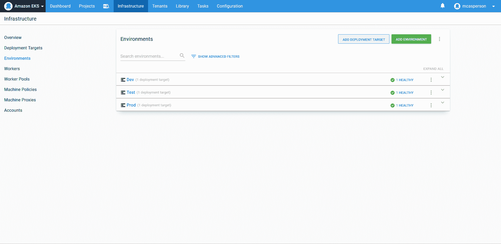
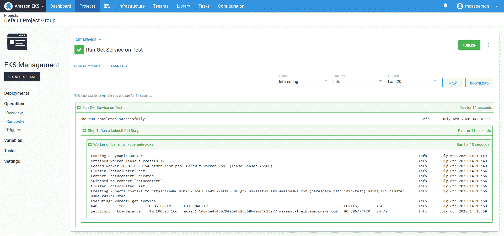

# Java CI/CD:从持续集成到发布管理- Octopus Deploy

> 原文：<https://octopus.com/blog/java-ci-cd-co/from-ci-to-cd>

[](#)

本文是展示 Jenkins、Docker 和 Octopus 示例部署管道系列的一部分:

[](#)

[在之前的博文](/blog/java-ci-cd-co/from-ci-to-cloud)中，我们使用 EKS 在 AWS 中使用 Octopus 构建了一个 Kubernetes 集群，然后将 Jenkins 创建的 Docker 映像部署为 Kubernetes 部署和服务。

然而，我们仍然没有一个完整的[部署管道](https://octopus.com/devops/continuous-delivery/what-is-a-deployment-pipeline/)解决方案，因为 Jenkins 没有与 Octopus 集成，让我们手动协调构建和部署。

在这篇博文中，我们将扩展我们的 Jenkins 构建来调用 Octopus，并在 Docker 映像被推送到 Docker Hub 时启动部署。我们还将创建额外的环境，并管理从本地开发环境到最终生产环境的发布。

## 安装 Jenkins 插件

Octopus 为 Jenkins 提供了一个插件，该插件公开了自由式项目和管道脚本中的集成步骤。通过导航到 **管理詹金斯➜管理插件** 安装此插件。从这里，你可以搜索“章鱼”并安装插件。

Octopus 插件使用 [Octopus CLI](https://octopus.com/docs/octopus-rest-api/octopus-cli) 与 Octopus 服务器集成。我们可以在代理上手动安装 CLI，但在本例中，我们将使用**定制工具**插件下载 Octopus CLI 并将其推送到代理:

[ ](#) *安装自定义工具插件。*

我们添加 Octopus 服务器，我们的管道将连接到，通过导航到 **管理詹金斯➜配置系统** :

[ ](#) *定义八达通服务器。*

然后我们需要在 **管理詹金斯➜全球工具配置** 下定义一个定制工具。自定义工具的名称为**Octopus CLI**，因为在我的例子中代理运行在 Windows 上，Octopus CLI 将从[https://download . Octopus deploy . com/Octopus-tools/7 . 4 . 1/Octopus tools . 7 . 4 . 1 . win-x64 . zip](https://download.octopusdeploy.com/octopus-tools/7.4.1/OctopusTools.7.4.1.win-x64.zip)下载。对于最新版本的 CLI，以及支持其他操作系统的二进制文件，请参见 [Octopus 下载页面](https://octopus.com/downloads/octopuscli):

[ ](#) *定义 Octopus CLI 自定义工具。*

在**全局工具配置**页面上，我们定义了 Octopus CLI 的路径。自定义工具插件将 Octopus CLI 安装到目录`<jenkins home>/tools/com.cloudbees.jenkins.plugins.customtools.CustomTool/OctoCLI`，其中`<jenkins home>`是 Jenkins 服务器或执行构建的代理的主目录。在我的例子中，代理主目录是`C:\JenkinsAgent`，所以从`C:\JenkinsAgent\tools\com.cloudbees.jenkins.plugins.customtools.CustomTool\OctoCLI\octo`开始就可以使用 Octopus CLI。刀具名称保留为**默认**:

[ ](#) *定义 Octopus CLI 路径。*

通过配置这些工具，我们可以在 Docker 映像被推送到 Docker Hub 之后，更新管道脚本来启动 Octopus 中的部署。

## 更新詹金斯管道

我们现有的管道被配置为构建 Docker 映像并将其推送到 Docker Hub。我们将保留这些步骤，并添加额外的步骤来安装作为定制工具的 Octopus CLI，然后在 Docker 映像被推送后在 Octopus 中创建和部署一个版本。让我们看看完整的管道:

```
pipeline {
    agent {
        label 'docker'
    }
    parameters {
        string(defaultValue: 'Spaces-1', description: '', name: 'SpaceId', trim: true)
        string(defaultValue: 'Petclinic', description: '', name: 'ProjectName', trim: true)
        string(defaultValue: 'Dev', description: '', name: 'EnvironmentName', trim: true)
        string(defaultValue: 'Octopus', description: '', name: 'ServerId', trim: true)
    }
    stages {
        stage ('Add tools') {
            steps {
                tool('OctoCLI')
            }
        }
        stage('Building our image') {
            steps {
                script {
                    dockerImage = docker.build "mcasperson/petclinic:$BUILD_NUMBER"
                }
            }
        }
        stage('Deploy our image') {
            steps {
                script {
                    // Assume the Docker Hub registry by passing an empty string as the first parameter
                    docker.withRegistry('' , 'dockerhub') {
                        dockerImage.push()
                    }
                }
            }
        }
        stage('deploy') {
            steps {                                
                octopusCreateRelease deployThisRelease: true, environment: "${EnvironmentName}", project: "${ProjectName}", releaseVersion: "1.0.${BUILD_NUMBER}", serverId: "${ServerId}", spaceId: "${SpaceId}", toolId: 'Default', waitForDeployment: true                
            }
        }
    }
} 
```

这个管道有一些新的设置来支持与 Octopus 的集成。

我们从定义公共参数开始。当我们在 Octopus 中创建和部署一个版本时，将会引用这些参数，它们提供了一种很好的方法来将 Octopus 细节从任何特定的实例中分离出来，同时还提供了合理的默认值:

```
 parameters {
        string(defaultValue: 'Spaces-1', description: '', name: 'SpaceId', trim: true)
        string(defaultValue: 'Petclinic', description: '', name: 'ProjectName', trim: true)
        string(defaultValue: 'Dev', description: '', name: 'EnvironmentName', trim: true)
        string(defaultValue: 'Octopus', description: '', name: 'ServerId', trim: true)
    } 
```

为了让自定义工具插件提取代理主目录中的 Octopus CLI，我们需要调用`tool('OctoCLI')`:

```
 stage ('Add tools') {
            steps {
                tool('OctoCLI')
            }
        } 
```

最后一个阶段调用`octopusCreateRelease`来创建一个发布并将其部署到 Octopus 中的第一个环境。默认情况下，Octopus 将使用部署步骤中引用的最新版本的包来创建部署，这意味着我们将部署 Jenkins 在前一阶段上传到 Docker Hub 的 Docker 映像:

```
 stage('deploy') {
            steps {                                
                octopusCreateRelease deployThisRelease: true, environment: "${EnvironmentName}", project: "${ProjectName}", releaseVersion: "1.0.${BUILD_NUMBER}", serverId: "${ServerId}", spaceId: "${SpaceId}", toolId: 'Default', waitForDeployment: true                
            }
        } 
```

通过对管道的这些更改，我们在 Jenkins 中重新运行了该项目，从控制台日志中，我们可以看到 Jenkins 已经成功地触发了 Octopus 中的部署:

[ ](#) * Jenkins 项目构建日志显示了 Octopus 部署输出。*

以下是 Octopus 中相应的部署:

[ ](#) *章鱼部署。*

## 持续部署与持续交付

多年来，首字母缩略词 CI/CD 的 [CD 半已经确定了两个定义:](https://octopus.com/devops/continuous-delivery/what-is-continuous-deployment/)

*   连续部署，这意味着一个完全自动的部署管道，假设所有测试和其他自动化需求都得到满足，那么每次提交都会进入生产环境。
*   连续交付，这意味着每个提交*可以*通过自动化的，但不一定是自动的，部署管道进入生产。通过环境提升(或不通过环境提升)的决定仍然是由人做出的。

虽然连续部署，就其定义而言，消除了部署过程中的所有摩擦，但是有许多有效的理由来实现连续交付。例如，您可能需要与其他团队协调部署，产品负责人可能需要签署新功能，法规要求可能要求开发人员在没有一些审查过程的情况下不得修改生产基础结构，或者您可能只想保留在发布进入生产之前手动测试和验证发布的能力。

如果您阅读了关于 CI/CD 最佳实践的博客文章，您可能会留下这样的印象，即持续部署是您必须努力实现的事情。虽然允许真正的连续部署管道的实践将会有价值，但是我们交谈过的大多数开发团队都报告说连续交付对他们有效。

对于这个博客，我们将创建一个连续的交付管道，通过 Octopus 仪表板管理向多个环境的发布。

## 添加环境

我们在 Octopus 中只有一个环境叫做 **Dev** 。但是，典型的工作流会在生产过程中通过多个环境促进部署。为了实现这一点，我们需要在 Octopus 中创建更多的环境，我们称之为**测试**和**生产**:

[ ](#) *添加测试和生产环境。*

我们需要确保我们的 Kubernetes 目标也在这些新环境中:

[ ](#) *将 Kubernetes 目标添加到新环境中。*

我们现在能够通过 Octopus 仪表板将版本从**开发**环境升级到**测试**环境:

[ ](#) *显示下一个部署环境的 Octopus 仪表盘。*

将发布升级到**测试**环境，我们可以看到我们的 Kubernetes 资源正在 **petclinic-test** 名称空间中创建。如果您还记得上一篇博文，我们配置了 Kubernetes 步骤来部署到一个名为**pet clinic-# { Octopus }的名称空间。Environment.Name | ToLower}** ，这就是为什么新环境的部署被放置在新的名称空间中:

[ ](#) *一个部署到测试环境中。*

为了证明这一点，我们可以在**测试**环境中重新运行 runbook **Get 服务**。我们可以看到，已经为新的服务资源创建了一个新的负载平衡器主机名:

[ ](#) *在测试环境中创建的负载平衡器服务的详细信息。*

这样，我们就有了完整的部署渠道。

## 结论

在这篇文章中，在 Jenkins 完成 Docker 映像的构建和推送之后，我们在 Octopus 中触发了一个部署。这意味着我们已经实现了与 Jenkins 的持续集成，测试、构建和发布 Docker 映像，以及与 Octopus 的持续交付，提供了到开发环境的自动部署，以及准备在其他环境中手动触发的自动化流程。

现在，我们只需点击几个简单的按钮，就可以将应用程序源代码转化为产品。那些负责发布管理的人除了 web 浏览器之外不需要任何特殊的工具。每个构建和部署都在 Jenkins 和 Octopus 仪表板中被跟踪、审计和总结。

但是那些看到他们的代码放在客户手中的人知道，虽然没有什么比生产部署的前 10 分钟更能激发信心，但接下来的几个小时和几天是艰难的。需要管理数据库备份，需要安排操作系统更新，需要收集日志来诊断支持问题，并且需要执行一些好的、老式的开关操作。

在下一篇博文中，我们将展示在运行手册中实现的这些维护过程的例子，以完成我们管道的最后阶段:运营。

浏览 [DevOps 工程师手册](https://octopus.com/devops/)了解有关 DevOps 和 CI/CD 的更多信息。